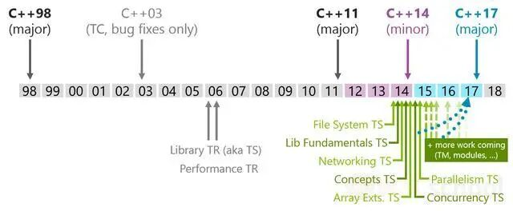
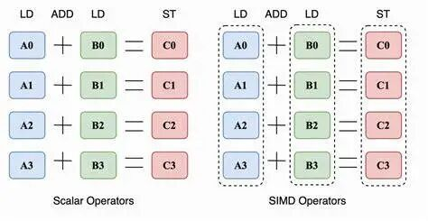
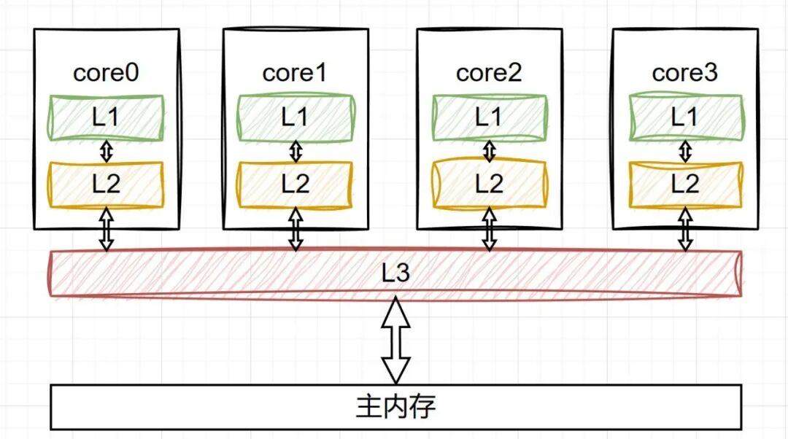
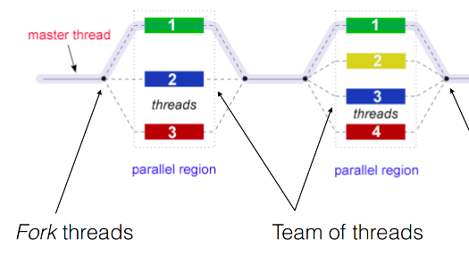
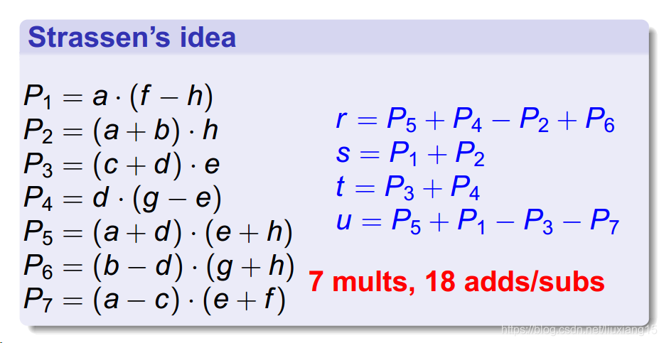
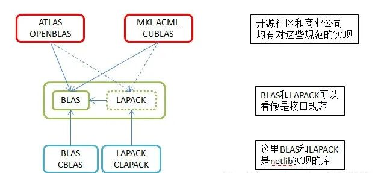
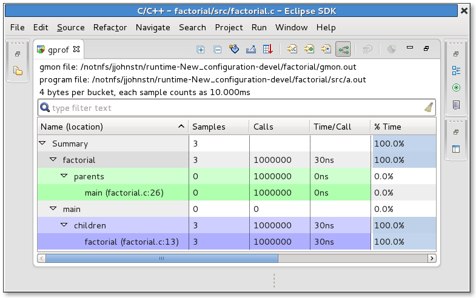

# C++在高性能计算中的应用心得

> 原文地址: [https://mp.weixin.qq.com/s/M9UJnZI-jt7p-S3\_5FnbCA](https://mp.weixin.qq.com/s/M9UJnZI-jt7p-S3_5FnbCA)

### 

点击上方「蓝字」关注我们

随着计算机科学的快速发展，高性能计算（High Performance Computing, HPC）成为了许多科学研究和工程实践不可或缺的一部分。C++作为一种高效且灵活的编程语言，在HPC领域有着广泛的应用。本文将从矩阵运算的角度出发，探讨如何利用C++编写高性能的计算程序，并分享一些实用的经验和技巧。

# 1\. 利用现代C++特性

现代C++提供了许多有助于提高性能的新特性。例如，`constexpr`允许编译器在编译时执行函数调用，从而避免运行时的开销；`noexcept`关键字可以告诉编译器一个函数不会抛出异常，进而优化代码路径。此外，智能指针如`std::shared_ptr`和`std::unique_ptr`能够自动管理内存，减少内存泄漏的风险，同时提升程序的健壮性。

# 2\. 向量化与SIMD指令

现代处理器支持单指令多数据（Single Instruction Multiple Data, SIMD）操作，这使得我们可以在一条指令中对多个数据进行处理。例如，Intel的AVX-512指令集可以在一次操作中处理16个浮点数。通过向量化，我们可以显著提升矩阵运算的速度。为了有效地利用SIMD，需要考虑数据的对齐方式以及循环的展开等技术。

# 3\. 数据布局与缓存优化

缓存命中率对于高性能计算至关重要。良好的数据布局可以减少缓存未命中导致的性能损失。通常情况下，按行存储二维数组（即矩阵）比按列存储更符合CPU缓存的行为模式，因为大多数算法都是沿着行进行迭代。另外，使用循环展开和块迭代等技术可以进一步优化数据访问模式，提高缓存利用率。

# 4\. 多线程与并行化

多核处理器已经成为标配，因此充分利用多线程是提高计算性能的关键之一。C++标准库中的`<thread>`和`<atomic>`头文件提供了创建线程和保证原子性的工具。此外，OpenMP是一个广泛使用的API，它提供了一种简单的方法来指定并行区域，非常适合那些不需要深度定制并行策略的场景。对于更复杂的并行任务，可以考虑使用MPI（Message Passing Interface）来进行进程间的通信和并行计算。

# 5\. 算法优化

选择合适的算法是提高性能的基础。例如，对于密集矩阵乘法，传统的算法复杂度为O(n^3)，但Strassen算法可以将其降低到大约O(n^2.8)。另外，利用稀疏矩阵表示而非全零矩阵可以极大地节省空间和计算时间。在实际应用中，还需要根据具体问题的特点选择最合适的算法。

# 6\. 使用高性能库

虽然自己实现矩阵运算是一种很好的学习方法，但在实际项目中，往往更推荐使用经过高度优化的第三方库。例如，BLAS（Basic Linear Algebra Subprograms）和LAPACK（Linear Algebra Package）提供了高效的线性代数运算；而Eigen库则是一个C++模板库，它具有丰富的线性代数功能，并且易于使用。这些库不仅经过了广泛的测试，而且通常已经针对各种处理器进行了优化。

# 7\. 性能分析与调试

最后，持续的性能分析和调试是必不可少的。工具如gprof、Valgrind和Intel VTune可以帮助识别性能瓶颈所在。理解程序的运行时行为对于找出优化的空间至关重要。

# 结语

总之，使用C++编写高性能的矩阵运算程序需要综合运用多种技术和策略。从选择合适的数据结构和算法开始，到利用现代C++特性、向量化和并行化，再到使用高性能库，每一步都对最终的性能有重要影响。通过不断地测试和优化，我们能够构建出既高效又可靠的高性能计算解决方案。

  

  

