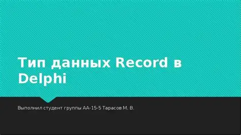

# delphi XE+中的record新特性


> 原文地址: [https://mp.weixin.qq.com/s/3P5Ge8YO1aZ9YI7rP5\_0Eg](https://mp.weixin.qq.com/s/3P5Ge8YO1aZ9YI7rP5_0Eg)

**Delphi XE 及以上版本**（从 **Delphi 2009** 开始就支持了）——  
`record` 类型**可以拥有构造函数（constructor）和析构函数（destructor）**，  
并且这些构造函数与类的构造函数语法几乎一致。

编辑

* * *

## ✅ 基本语法示例

```
type  TPoint3D = recordprivate    FX, FY, FZ: Double;publicconstructorCreate(AX, AY, AZ: Double);procedureOffset(DX, DY, DZ: Double);functionLength: Double;end;constructorTPoint3D.Create(AX, AY, AZ: Double);begin  FX := AX;  FY := AY;  FZ := AZ;end;procedureTPoint3D.Offset(DX, DY, DZ: Double);begin  FX := FX + DX;  FY := FY + DY;  FZ := FZ + DZ;end;functionTPoint3D.Length: Double;begin  Result := Sqrt(FX * FX + FY * FY + FZ * FZ);end;
```

使用示例：

```
var  P: TPoint3D;begin  P := TPoint3D.Create(3, 4, 5);  Writeln(P.Length:0:2);end;
```

  

## 🔹 注意事项

1.  record 的构造函数不是默认自动调用的  
      record 在声明时不会自动执行 `constructor`，必须显式调用 `TRecord.Create(...)`。
    
2.  record 不支持继承，但可以：
    

-   定义多个构造函数（重载）。
    
-   拥有 `class operator`（如 `Implicit`, `Add`, `Equal` 等）。
    
-   定义 `Initialize` / `Finalize` 或实现 `IDisposable` 风格的清理逻辑。
    
      
    

4.  析构函数（destructor）支持有限：  
      可以声明 `procedure Finalize;` 或 `destructor Destroy;`，  
      但不会自动调用，仍需手动调用。
    

* * *

## ✅ 进阶：管理资源的 record（RAII 模式）

在 XE3+，Delphi 引入了 **record helper 和管理 record（Managed Record）** 概念，  
允许通过操作符重载自动调用构造与析构（近似 RAII）。

示例：

```
type  TAutoHandle = recordprivate    FHandle: THandle;publicconstructorCreate(AHandle: THandle);destructorDestroy;end;constructorTAutoHandle.Create(AHandle: THandle);begin  FHandle := AHandle;end;destructorTAutoHandle.Destroy;beginif FHandle <> 0then    CloseHandle(FHandle);end;
```

  

> 在局部变量作用域结束时，如果配合 `Finalize` 或 `class operator Finalize`，  
> 就可以自动释放资源（Delphi 10.4 以上的管理 record 才可）。

## 操作符重载

下面是 Delphi 支持的**所有可重载运算符**的清单，以表格形式列出，方便直观查看：

运算符

说明

示例

`+`

 (Add)

加法运算符

`A + B`

`-`

 (Subtract)

减法运算符

`A - B`

`*`

 (Multiply)

乘法运算符

`A * B`

`/`

 (Divide)

除法运算符

`A / B`

`mod`

 (Modulo)

求余运算符

`A mod B`

`=`

 (Equal)

相等比较运算符

`A = B`

`<>`

 (NotEqual)

不等比较运算符

`A <> B`

`<`

 (LessThan)

小于比较运算符

`A < B`

`<=`

 (LessThanOrEqual)

小于等于比较运算符

`A <= B`

`>`

 (GreaterThan)

大于比较运算符

`A > B`

`>=`

 (GreaterThanOrEqual)

大于等于比较运算符

`A >= B`

`Implicit`

隐式类型转换运算符

`A := B`

 (隐式转换)

`Explicit`

显式类型转换运算符

`A := TMyRecord(B)`

`+`

 (UnaryPlus)

一元加法运算符

`+A`

`-`

 (UnaryMinus)

一元减法运算符

`-A`

`not`

 (Not)

逻辑非运算符

`not A`

`and`

 (And)

逻辑与运算符

`A and B`

`or`

 (Or)

逻辑或运算符

`A or B`

`xor`

 (Xor)

逻辑异或运算符

`A xor B`

`shl`

 (Shl)

位左移运算符

`A shl B`

`shr`

 (Shr)

位右移运算符

`A shr B`

* * *

### 解释

-   +**、`-`、`*`、`/`** 等算术运算符：允许自定义 `record` 或 `class` 类型的加法、减法、乘法和除法操作。
    
-   \=**、`<>`、`<`、`<=`、`>`、`>=`** 等比较运算符：允许自定义对象之间的比较行为。
    
-   Implicit **和 `Explicit`**：允许在不同类型之间进行隐式或显式的类型转换。
    
-   一元运算符：如 `+` 和 `-` 允许对单个对象执行加法或减法。
    
-   not**、`and`、`or`、`xor`**：逻辑运算符，可用于实现逻辑运算。
    
-   shl**、`shr`**：位移运算符，用于对二进制数据执行位移操作。
    

下面是一个包含**构造函数、析构函数、操作符重载**的 `record` 示例。

该 `record` 类型将模拟一个 **二维向量（`TVector2D`）**，并重载 `+` 和 `-` 操作符来支持向量的加法与减法。

* * *

### 示例代码

```
unit Vector2DUnit;interfacetype  TVector2D = recordprivate    FX, FY: Double;publicconstructorCreate(AX, AY: Double);// 构造函数destructorDestroy;// 析构函数（虽然此示例中没有需要清理的资源，但展示用法）functionLength: Double;  // 计算向量的长度procedureOffset(DX, DY: Double);// 位移操作// 操作符重载classoperator Add(const A, B: TVector2D): TVector2D;  // 加法classoperator Subtract(const A, B: TVector2D): TVector2D;  // 减法classoperator Equal(const A, B: TVector2D): Boolean;  // 等于比较property X: Double read FX write FX;property Y: Double read FY write FY;end;implementationuses  Math;{ TVector2D }constructorTVector2D.Create(AX, AY: Double);begin  FX := AX;  FY := AY;end;destructorTVector2D.Destroy;begin// 在此处执行需要释放资源的代码// 目前此示例没有特别的资源需要释放end;functionTVector2D.Length: Double;begin  Result := Sqrt(FX * FX + FY * FY);  // 使用勾股定理计算向量长度end;procedureTVector2D.Offset(DX, DY: Double);begin  FX := FX + DX;  FY := FY + DY;end;// 加法操作符重载classoperator TVector2D.Add(const A, B: TVector2D): TVector2D;begin  Result := TVector2D.Create(A.FX + B.FX, A.FY + B.FY);  // 分别对 X 和 Y 坐标相加end;// 减法操作符重载classoperator TVector2D.Subtract(const A, B: TVector2D): TVector2D;begin  Result := TVector2D.Create(A.FX - B.FX, A.FY - B.FY);  // 分别对 X 和 Y 坐标相减end;// 等于比较操作符重载classoperator TVector2D.Equal(const A, B: TVector2D): Boolean;begin  Result := (A.FX = B.FX) and (A.FY = B.FY);  // 比较 X 和 Y 坐标是否相等end;end.
```

  

### 使用示例

```
program VectorTest;{$APPTYPE CONSOLE}uses  SysUtils, Vector2DUnit;var  Vec1, Vec2, Vec3: TVector2D;begin// 创建两个向量  Vec1 := TVector2D.Create(3, 4);  Vec2 := TVector2D.Create(1, 2);// 向量加法  Vec3 := Vec1 + Vec2;  Writeln('Vec1 + Vec2: (', Vec3.X:0:2, ', ', Vec3.Y:0:2, ')');// 向量减法  Vec3 := Vec1 - Vec2;  Writeln('Vec1 - Vec2: (', Vec3.X:0:2, ', ', Vec3.Y:0:2, ')');// 向量长度  Writeln('Length of Vec1: ', Vec1.Length:0:2);// 向量偏移  Vec1.Offset(2, 3);  Writeln('Vec1 after offset: (', Vec1.X:0:2, ', ', Vec1.Y:0:2, ')');// 向量相等比较if Vec1 = Vec2 then    Writeln('Vec1 is equal to Vec2')else    Writeln('Vec1 is not equal to Vec2');  Readln;end.
```

  

* * *

### 解释

1.  构造函数`Create`：  
      创建一个二维向量实例并初始化 `X` 和 `Y` 值。
    
2.  析构函数`Destroy`：  
      目前不需要释放资源，但为了演示，析构函数仍然存在。可以根据需要释放资源。
    
3.  操作符重载：
    

-   Add 操作符：允许我们直接使用 `+` 来相加两个 `TVector2D` 对象。
    
-   Subtract 操作符：允许我们直接使用 `-` 来相减两个 `TVector2D` 对象。
    
-   Equal 操作符：允许我们直接使用 `=` 来比较两个 `TVector2D` 是否相等。
    
      
    

5.  功能函数：
    

-   Length：计算向量的长度（欧几里得范数）。
    
-   Offset：允许向量偏移指定的 `DX` 和 `DY`。
    
      
    

* * *

### 输出示例

```
Vec1 + Vec2: (4.00, 6.00)Vec1 - Vec2: (2.00, 2.00)Length of Vec1: 5.00Vec1 after offset: (5.00, 7.00)Vec1 isnot equal to Vec2
```

这个例子演示了 **record** 的构造函数、析构函数、操作符重载以及基本向量运算。在 Delphi XE 及以上版本，你可以灵活使用这些功能来构建符合你需求的 `record` 类型，并且享受 `record` 在性能和内存管理方面的优势。

## 🔸小结

特性

类（class）

record

是否有构造函数

✅ 有

✅ 有（显式调用）

是否自动构造

✅ 有

❌ 无（需显式调用）

是否有析构函数

✅ 有

✅ 可定义但需显式调用

是否支持继承

✅

❌

是否支持 operator 重载

✅

✅

是否可实现接口

✅

✅（限接口方法）

* * *

如果你是在 **Delphi XE ~ XE7** 区间开发，  
构造函数、重载、操作符都是完全支持的。  
如果需要 **自动清理（RAII）**，建议使用 **Delphi 10.4+ 管理 record** 功能。