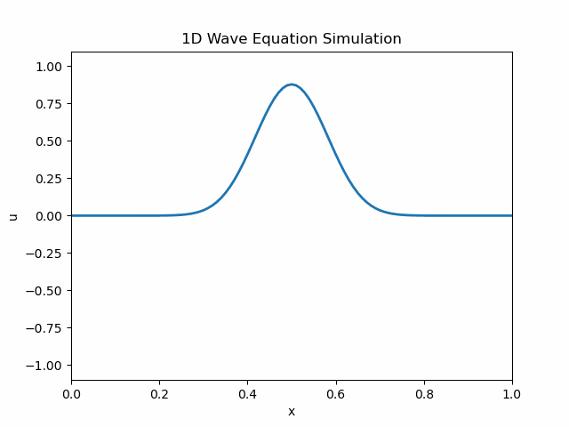

# FDM—波动方程数值模拟！附程序源码


> 原文地址: [https://mp.weixin.qq.com/s/uOLRytpptjewpvmWXr9WiQ](https://mp.weixin.qq.com/s/uOLRytpptjewpvmWXr9WiQ)

有朋友留言说想了解有限差分法进行波动方程的数值模拟，简单的介绍一下该问题。下面从数值模拟原理和编程实现（Python）两个方面对该问题进行阐述：

# 一、理论原理

## 1.1 背景介绍

简单介绍一下有限差分法（FDM）对一维波动方程实现数值模拟的过程，一维波动方程描述了波在介质中的传播，基本形式如下：

其中：

-    表示在位置  处，时间  时刻的波动量（如速度、位移、压力等）；
    
-    表示波速，取决于介质的性质。
    

> 物理意义：方程描述的是二阶时间导数与二阶空间导数成比例的关系。直观上，若某一点的曲率较大（即空间二阶导数较大），则该点的加速度也较大，符合波的传播特性。

为了便于阐述FDM对波动方程数值模拟的具体步骤和细节，假设该问题定义的有限区间  和时间区间  上，并且给定初始条件为：

另外给定适当的边界条件（如_Dirichlet条件：_  或者其他）。

## 1.2 时空离散

### 1.2.1 空间离散

使用有限差分法理解相对简单，将空间区域  划分为  个子块，则空间步长可以表示为：

空间中的离散点标记为：

### 1.2.2 时间离散

假设总仿真时间为 ，选取时间步长 （需要满足稳定性条件，后文讨论）；那么时间离散点则可以表示：

同时需要注意，将  的数值近似为 。

## 1.3 构造差分格式

### 1.3.1 时间二阶导数

使用**中心差分格式**对时间进行离散处理，二阶时间导数在  处可以近似为：

从上式中可以看到，在时间离散方面需要用到三个时间层的值：。**通常分别描述为：下一时刻，当前时刻，前一时刻**。

### 1.3.2 空间二阶导数

同理，在空间离散方面也使用**中心差分格式**，可以得到：

与时间离散不同的是，空间离散主要是针对空间中的某一个点  ，此时要考虑在同一时间层。

### 1.3.3 离散波动方程

将时空离散表达式代入到波动方程中可以得到离散格式：

整理后可以得到显式推进的表达式：

通常情况下，会定义_库朗数_ 。

## 1.4 初始条件

**初始位移**：直接由初始条件给出 ；

**初始速度**：初始速度  在有限差分法中一般被要求来计算  时刻的值，因为需要用到前两个时刻的初值。首先在  处利用Taylor展开近似 ：

将如下关系式代入：

-   波动方程关系式 
    
-   空间离散格式 
    

根据上述推导，可以得到前两个时刻  和  的初值。

## 1.5 边界条件

根据具体问题，边界条件需要在每个时间步都得到满足。常见的边界条件包括：

-   **Dirichlet 条件**：如果  和  已知，则可以直接令  ，，这对于所有的时刻  都适用。
    
-   **Neumann 条件**：若给定边界处的导数 ，可利用差分公式处理。例如，在  处可以用一阶或二阶的差分近似（例如使用虚拟点法或一边差分）来离散化该条件。
    

每种边界条件对应具体的处理方式，选择时需保证数值格式的整体一致性。

## 1.6 时间推进

整体的时间推进算法流程如下：

1.  **构造网格**：根据空间  和时间  设定空间步长  和时间步长 ；
    
2.  **初始化**：对流场进行初始化赋值
    

-   对于所有的 ，设定初始值 ；
    
-   根据初始速度  和  计算 ；
    

1.  **迭代更新**：对于  和内部点  ，更新内部点每一个时间层的值：
    

```
每一步都需要对边界点应用相应的边界条件。
```

1.  **结束条件**：当  达到预定的终止时间  时停止迭代。
    

## 1.7 CFL条件

显式中心差分格式的稳定性通常受 CFL 条件（Courant-Friedrichs-Lewy 条件）限制。在该问题中，稳定性要求：

因此在选择时间步长  时，必须满足：

如果不满足这一条件，数值解可能会产生振荡或发散。

## 1.8 编程实现提示

1.  **数据存储**：可以使用二维数组或利用两三个一维数组交替更新（因为更新公式中只依赖于前两层  和 ）；更新后可循环地进行赋值交换，节省内存开销。
    
2.  **循环结构**：外层循环遍历时间步 ，内层循环遍历空间点 （注意跳过边界点，边界条件单独处理）。
    
3.  **边界条件的实现**：根据具体问题，确保在每个时间步中对  和  处赋予正确的值。
    
4.  **输出与可视化**：可定期输出中间结果或记录数据，以便后续对波传播过程进行可视化。
    

# 二、程序实现

## 2.1 问题设定

-   空间离散域：，这里 ；
    
-   时间离散区间：模拟总时间  秒；
    
-   波速：；
    
-   初始条件
    

-   初始速度取零，即 ；
    

-   初始位移设置为一个中间处由峰值的高斯脉冲：
    

-   边界条件：采用第一类边界条件，即两端边界点固定 。
    

## 2.2 程序代码

利用python对该问题进行代码实现，具体代码如下：

`import numpy as np   import matplotlib.pyplot as plt   import matplotlib.animation as animation      # ----------------------------------------------------------------------------   # 1. 参数设置与网格离散化   # ----------------------------------------------------------------------------      # 空间区间 [0, L] 与总模拟时间 T   L = 1.0        # 空间长度   T = 1.0        # 模拟总时间   c = 1.0        # 波速      # 空间离散化参数   N = 101                    # 空间网格点数（包括边界）   dx = L / (N - 1)           # 空间步长   x = np.linspace(0, L, N)   # 空间网格      # 时间离散化参数   # 为了满足 CFL 稳定性条件 r = c*dt/dx <= 1, 取 r = 0.9   r = 0.9   dt = r * dx / c            # 时间步长   Nt = int(T / dt)           # 时间步数      # -----------------------------------------------------------------------------   # 2. 初始条件的设置   # -----------------------------------------------------------------------------      # 初始位移：高斯脉冲   def f(x):       return np.exp(-100 * (x - 0.5) ** 2)      # 初始速度：这里取为 0   def g(x):       return0.0      # u_prev: 表示时间 t=0 时的解，即 u(x, 0)   u_prev = f(x).copy()      # u_curr: 表示时间 t = dt 时的解，通过 Taylor 展开近似计算   u_curr = np.zeros(N)   u_next = np.zeros(N)      # 边界条件：u(0,t) = u(L,t) = 0   u_curr[0] = 0.0   u_curr[-1] = 0.0      # 对内部点利用 Taylor 展开：   # u(x, dt) ≈ f(x) + dt * g(x) + (c^2*dt^2/2)*f''(x)   # 其中 f''(x) 用中心差分公式近似： (f(x+dx) - 2f(x) + f(x-dx)) / dx^2   for i in range(1, N - 1):       u_curr[i] = (u_prev[i] + dt * g(x[i]) +                    0.5 * (c * dt) ** 2 * (u_prev[i + 1] - 2 * u_prev[i] + u_prev[i - 1]) / dx ** 2)      # ---------------------------------------------------------------------------------   # 3. 数值更新与动画实现   # ---------------------------------------------------------------------------------   # 利用更新公式：   # u_i^(n+1) = 2u_i^n - u_i^(n-1) + r^2*(u_{i+1}^n - 2u_i^n + u_{i-1}^n)   # 注意：r = c*dt/dx      # 创建图形用于动画显示   fig, ax = plt.subplots()   line, = ax.plot(x, u_prev, lw=2)   ax.set_xlim(0, L)   ax.set_ylim(-1.1, 1.1)   ax.set_xlabel('x')   ax.set_ylabel('u')   ax.set_title('1D Wave Equation Simulation')      # 封装时间层数据避免全局变量问题   data = {       'u_prev': u_prev.copy(),       'u_curr': u_curr.copy(),       'u_next': u_next.copy()   }      def update(frame):       # 提取当前时间层数据       u_prev = data['u_prev']       u_curr = data['u_curr']       u_next = data['u_next']       # 对内部节点进行更新（i=1,...,N-2）       for i in range(1, N - 1):           u_next[i] = (2 * u_curr[i] - u_prev[i] +                        r ** 2 * (u_curr[i + 1] - 2 * u_curr[i] + u_curr[i - 1]))       # 边界条件：固定边界（Dirichlet 条件）       u_next[0] = 0.0       u_next[-1] = 0.0          # 更新时间层       data['u_prev'] = u_curr.copy()       data['u_curr'] = u_next.copy()              # 更新绘图数据       line.set_ydata(u_curr)       return line,      # 利用 FuncAnimation 实现动画，设置帧率50毫秒   ani = animation.FuncAnimation(fig, update, frames=Nt, interval=50, blit=True)   # 保存为GIF文件   gif_filename = "wave_equation_simulation.gif"   ani.save(gif_filename, writer="pillow", fps=20)  # 使用Pillow库保存GIF，帧率为20      print(f"动画已保存为 {gif_filename}")   plt.show()   `

## 2.3 结果展示

将数值模拟结果保存为动图展示如下：



一维波动方程数值结果

推荐阅读

[Python也能搞科学计算！我的CFD入门代码（祝朋友们春节快乐!!)](https://mp.weixin.qq.com/s?__biz=MzUxNzE2NjM0MA==&mid=2247488511&idx=1&sn=5c4778ed194fdb4987ea9863a7db8d7b&scene=21#wechat_redirect)

[非常详细！一步一步拆开偏微分方程的离散求解！看完别说还不会！](https://mp.weixin.qq.com/s?__biz=MzUxNzE2NjM0MA==&mid=2247488506&idx=1&sn=c75095812ba87f87a5a3d00961707913&scene=21#wechat_redirect)

[控制方程：守恒与非守恒型](https://mp.weixin.qq.com/s?__biz=MzUxNzE2NjM0MA==&mid=2247488367&idx=1&sn=8884fdc47726f3362e3cdadd26fcfd44&scene=21#wechat_redirect)

[AI告诉我，什么是CI（代码持续集成）](https://mp.weixin.qq.com/s?__biz=MzUxNzE2NjM0MA==&mid=2247488367&idx=2&sn=edd620cea5723d2051c4364927d37e79&scene=21#wechat_redirect)

[CFL（库朗数）与时间步长](https://mp.weixin.qq.com/s?__biz=MzUxNzE2NjM0MA==&mid=2247488225&idx=1&sn=046bfb1d07b19e296a5f278b42982555&scene=21#wechat_redirect)