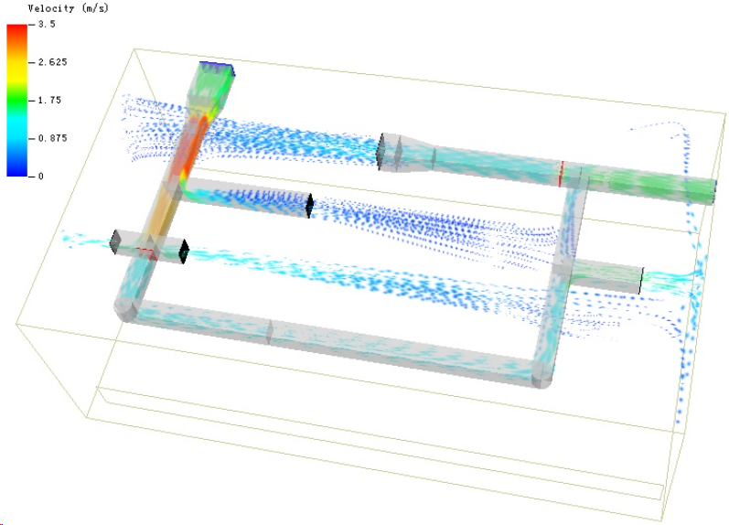
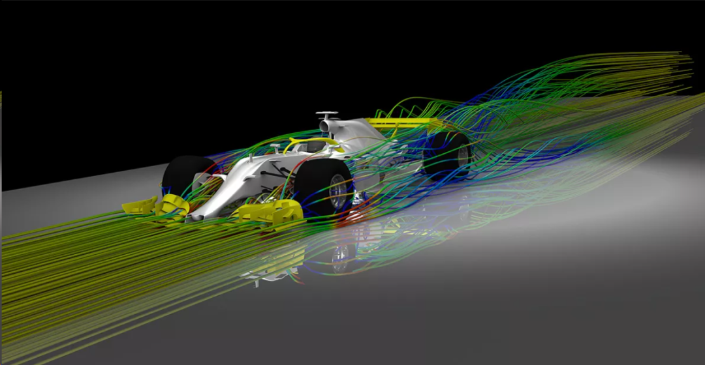
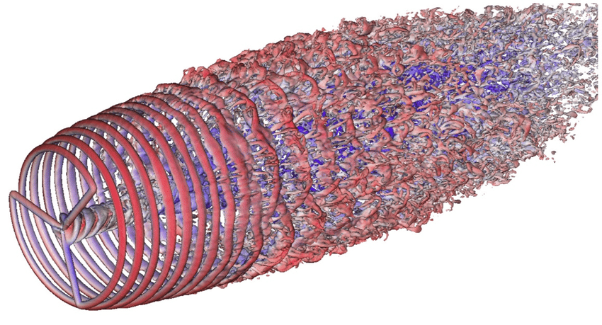

# FVM求解器的求解方法有哪些

> 原文地址: [https://mp.weixin.qq.com/s/WfpQJTwbIcK92WCDWc-iWw](https://mp.weixin.qq.com/s/WfpQJTwbIcK92WCDWc-iWw)

**_点击上方__蓝色字体__，邀您关注CFD饭圈！_**

有限体积法（Finite Volume Method，简称FVM）是一种用于数值求解偏微分方程（Partial Differential Equations，简称PDEs）的方法，特别是在计算流体动力学（CFD）中广泛应用。FVM通过将控制体积划分为有限数量的单元（通常是网格单元），并在这个体积上对守恒定律进行积分，从而得到一组代数方程。这些方程随后可以通过各种数值方法求解。以下是一些常用的求解方法：

一、直接求解方法

1.高斯消元法（Gaussian Elimination）：

▪这是最基本和最传统的直接求解方法。它通过一系列的行变换将系数矩阵转换为行梯度形式（上三角形式），然后通过回代（back substitution）求解未知数。

▪高斯消元法对于小型到中型的方程组非常有效，但对于大型稀疏方程组，其计算成本和内存需求可能会非常高。

2.LU分解（LU Decomposition）：

▪LU分解是将系数矩阵分解为一个下三角矩阵（L）和一个上三角矩阵（U）的乘积。

▪这种方法通过前向替换和后向替换两个步骤来求解方程组，适用于中等规模的方程组。

▪对于正定矩阵，LU分解是一种非常有效的直接求解方法。

3.Cholesky分解（Cholesky Decomposition）：

▪仅适用于正定矩阵。该方法将正定矩阵分解为一个下三角矩阵的平方，即A = L \* L^T，其中L是下三角矩阵。

▪通过前向替换和后向替换求解方程组。

▪由于其高效性和数值稳定性，Cholesky分解在求解正定线性系统时非常受欢迎。

4.PLU分解（Partial Pivoting LU Decomposition）：

▪这是一种改进的LU分解方法，通过行交换（部分主元消去法）来避免因数值问题导致的求解失败。    

▪该方法在每一步消元过程中选择最大的主元，以减少因数值误差导致的不稳定性。

5.Doolittle算法和Crout算法：

▪这两种算法都是LU分解的特例。Doolittle算法生成的是行主元的上三角形式，而Crout算法生成的是列主元的下三角形式。

▪这两种方法在实际应用中较少使用，因为它们不如高斯消元法或Cholesky分解高效。

6.奇异值分解（Singular Value Decomposition, SVD）：

▪虽然SVD通常用于矩阵近似和数据压缩，但在某些情况下，它也可以用于求解线性方程组，尤其是当矩阵接近奇异或病态时。

直接求解方法在处理小型或中型方程组时非常有效，但随着问题规模的增大，它们的计算复杂度和内存需求会急剧增加。因此，在处理大型问题时，通常会考虑使用迭代求解方法或预处理技术来提高求解效率。在实际应用中，选择合适的求解方法需要考虑问题的特性、求解精度要求以及可用的计算资源。

二、迭代求解方法    

FVM的迭代求解方法主要用于求解大型或复杂的线性方程组，特别是在计算流体动力学（CFD）和其他工程领域中。这些方法通过逐步逼近的方式来寻找方程组的解，通常需要较少的内存，并且在多核或分布式计算环境中表现良好。

1.雅克比方法（Jacobi Method）：

▪一种简单的迭代方法，每次迭代中，每个未知数的值都是基于当前其他所有未知数的值来更新的。

▪适用于易于并行化的系统，但可能需要较多的迭代次数才能收敛。

2.高斯-赛德尔方法（Gauss-Seidel Method）：

▪类似于雅克比方法，但在每次迭代中，更新未知数的值时会使用已更新的邻近未知数的值。

▪通常比雅克比方法收敛得更快，因为它利用了最新计算的信息。

3.逐次超松弛方法（Successive Over-Relaxation, SOR）：

▪SOR方法结合了雅克比和高斯-赛德尔方法的特点，通过引入一个松弛因子（omega）来平衡解的更新。

▪适当的松弛因子可以显著加快收敛速度，并且该方法可以应用于非线性问题。

4.共轭梯度法（Conjugate Gradient Method, CG）：

▪适用于大型稀疏矩阵，特别是当矩阵是对称正定时。

▪通过构造一系列共轭方向来最小化残量，从而加速求解过程。

▪共轭梯度法不需要存储整个系数矩阵，因此适合处理大规模问题。

5.广义最小残差法（Generalized Minimum Residual, GMRES）：

▪一种Krylov子空间方法，不需要矩阵对称或正定。

▪通过构建一个最小化残差范数的子空间来求解方程组。    

▪GMRES对于解决非线性或复杂系统非常有用，但计算成本相对较高。

6.双共轭梯度法（Bi-Conjugate Gradient Stabilized, Bi-CGSTAB）：

▪是共轭梯度法的改进版本，用于处理非对称或不定矩阵。

▪通过引入一个稳定化步骤来提高收敛性和鲁棒性。

7.多重网格方法（Multigrid Methods）：

▪虽然多重网格方法可以是迭代的，但它们通常与直接求解方法结合使用，以加速收敛。

▪通过在不同分辨率的网格上求解问题来提高迭代求解的效率。

8.预处理技术（Preconditioning Techniques）：

▪预处理技术通过变换原始方程组来改善其条件数，使得迭代求解方法更容易收敛。

▪常见的预处理方法包括雅克比预处理、块雅克比预处理、不完全LU分解（ILU）等。

三、混合求解方法

FVM混合求解方法结合了直接求解和迭代求解技术的优点，旨在提高求解效率和稳定性，特别是在处理大规模或复杂系统时。

1.混合迭代-直接求解器（Hybrid Iterative-Direct Solvers）：

▪这类方法通常开始于直接求解器，如高斯消元法或Cholesky分解，然后转换为迭代求解器来完成求解过程。    

▪这种方法试图利用直接求解器的高精度和迭代求解器的内存效率。

2.预处理共轭梯度法（Preconditioned Conjugate Gradient, PCG）：

▪在共轭梯度法中使用预处理步骤来改善原始方程组的条件数，从而加速收敛。

▪预处理器通常是较简单的求解器，如雅克比或不完全LU分解（ILU）。

3.预处理GMRES（Preconditioned GMRES）：

▪类似于PCG，但在GMRES方法中使用预处理技术。

▪预处理器有助于处理非线性或复杂系统，使得迭代求解过程更加稳定和高效。

4.多重网格-共轭梯度法（Multigrid CG）：

▪将多重网格方法与共轭梯度法结合，使用多重网格技术作为预处理器或求解器的一部分。

▪这种方法特别适合于求解具有多种尺度特性的偏微分方程。

5.多重网格-GMRES（Multigrid GMRES）：

▪与多重网格-共轭梯度法类似，但在GMRES框架内使用多重网格技术。

▪这种方法可以提高求解非线性或大规模问题的能力。

6.阿尔法策略（Alpha Strategy）：

▪一种混合求解器，它结合了直接求解器的稳定性和迭代求解器的内存效率。

▪通过调整参数（阿尔法值），可以在直接和迭代求解之间进行权衡，以优化求解过程。

7.块求解器（Block Solvers）：

▪将问题分解成较小的子块，并分别对每个块应用求解器。

▪块求解器可以是直接的或迭代的，也可以结合预处理技术来提高效率。

8.稀疏直接求解器与迭代求解器的组合：

▪对于稀疏矩阵，可以使用稀疏直接求解器（如超级LU或PARDISO）作为主要求解器，同时使用迭代求解器处理无法直接求解的部分。    

  

‍‍

**_‍‍  
_**

（欢迎各位在公众号发信息关于CFD想了解的，将整理资料成微信文章）

\-- END --

**\--- 邀您关注本公众号 \---**