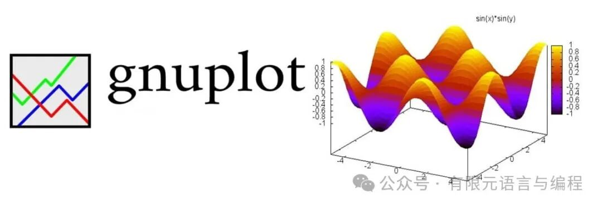
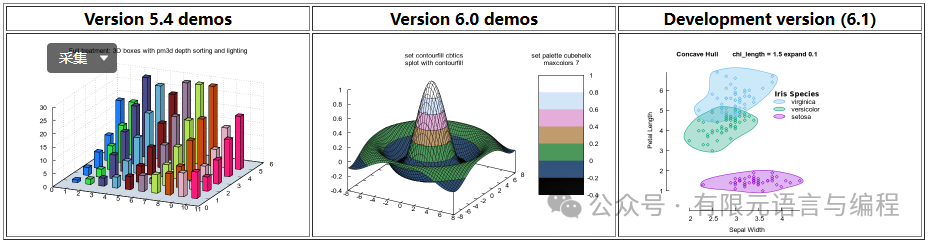
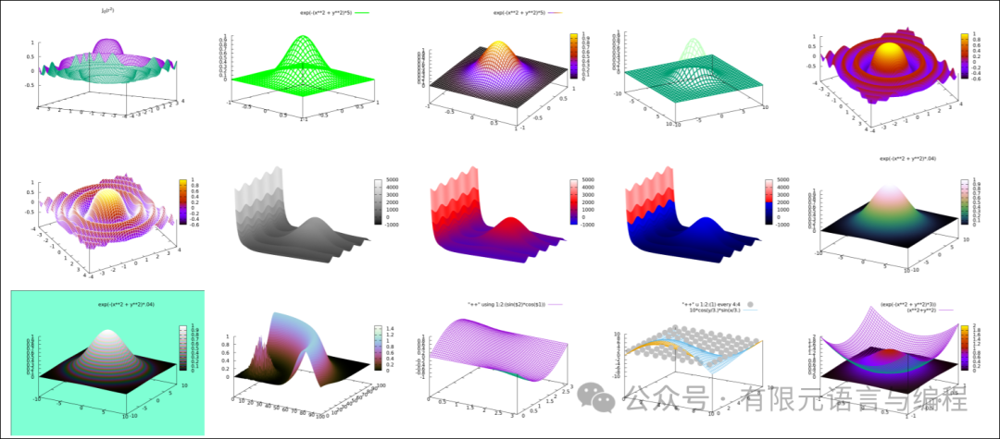
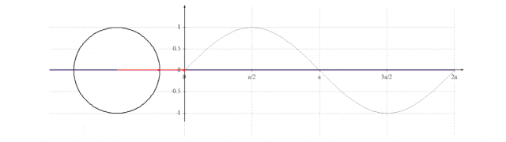
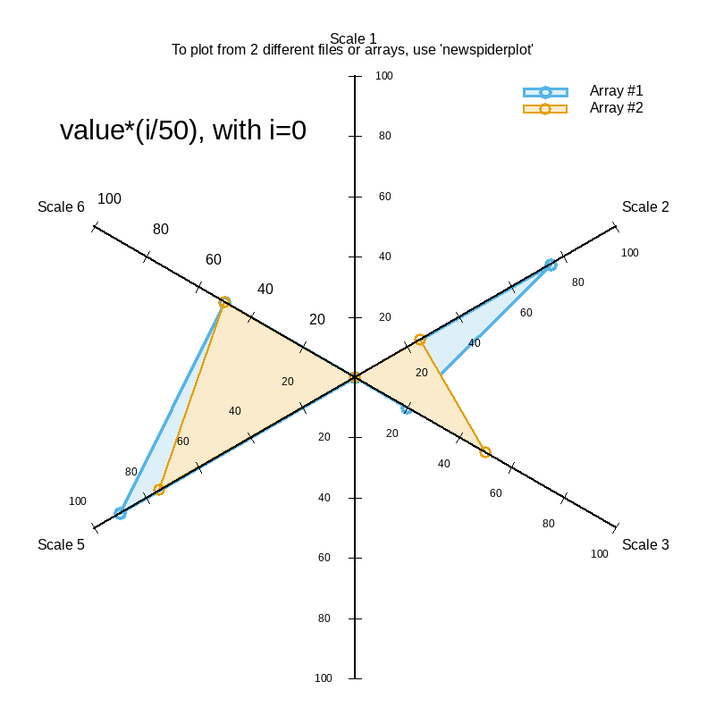
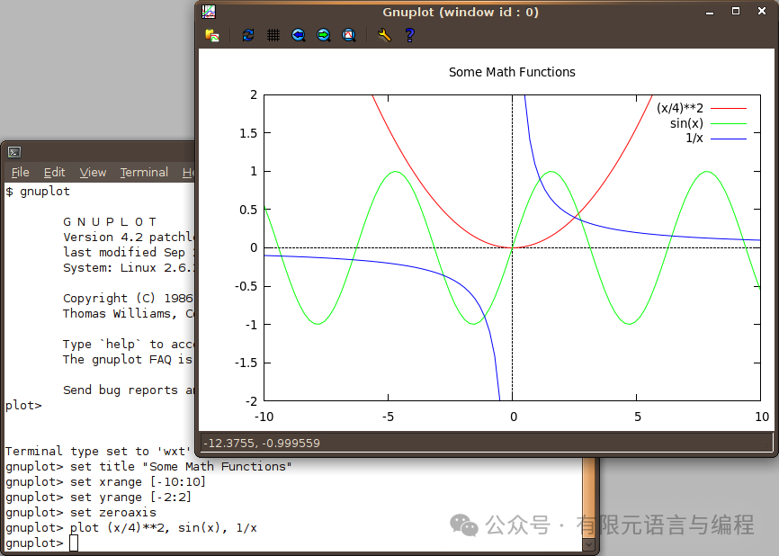
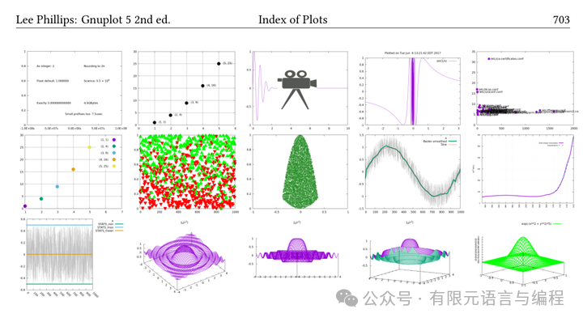
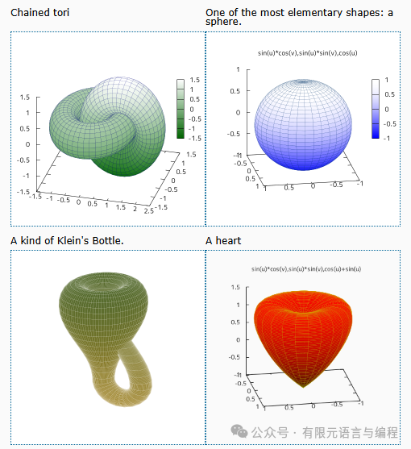

# Gnuplot：数据可视化的理想工具

> 原文地址: [https://mp.weixin.qq.com/s/AaMcxIKviBjjH8jNSWOzNw](https://mp.weixin.qq.com/s/AaMcxIKviBjjH8jNSWOzNw)

点击上方「蓝字」关注我们

在信息爆炸的时代，数据的重要性不言而喻，它如同矿藏般蕴含着无尽的价值。然而，未经加工的数据如同散落的金砂，难以直接洞察其内在规律。数据可视化，便是那把挖掘宝藏的钥匙，让我们能直观地理解数据，高效地沟通研究发现。在众多绘图工具中，Gnuplot以其独特的魅力，在科研和工程领域独树一帜，成为数据可视化的重要工具之一。

## Gnuplot简介

Gnuplot，一款诞生于1986年的跨平台**命令行绘图工具**，以其强大的绘图功能和灵活的适应性，赢得了广泛的认可与赞誉。它不仅支持Linux、OS/2、MS Windows、OSX、VMS等主流操作系统，而且源代码虽然受版权保护，却允许自由分发，使得每位用户都能免费享用这一技术瑰宝。历经数十年的发展，Gnuplot在社区的持续支持下，不断迭代更新，保持着鲜活的生命力，成为了跨时代的数据可视化工具。

## 功能特性

Gnuplot的设计理念是“强大而不繁复”，它支持2D和3D的丰富绘图类型，涵盖线图、点图、箱线图、等高线图、向量场图、曲面图等，几乎满足了科研与工程领域的所有绘图需求。无论你是要展现数据趋势，分析数据分布，还是探索复杂函数的特性，Gnuplot都能轻松应对。此外，它还支持文本标注，使你的图表不仅美观，而且信息丰富，为报告和论文增色不少。

  

更令人称赞的是，Gnuplot的输出方式极为多样。它不仅能在屏幕上实时展示结果，支持鼠标和热键输入，还能直接输出到绘图仪或打印机，确保了高质量的物理打印效果。对于需要在学术出版物中使用的图表，Gnuplot支持导出至eps、pdf、LaTeX等格式，完美兼容科学论文的标准。与时俱进的Gnuplot还加入了对svg和HTML5 canvas的支持，这意味着你可以将图表嵌入网页，实现动态交互，为在线展示和教学提供了无限可能。Gnuplot甚至被集成到Octave等第三方应用程序中，作为绘图引擎，进一步证明了其在专业领域的价值。

## 安装与使用

安装Gnuplot十分便捷，无论是Linux、OSX用户，还是Windows用户，都能找到对应的安装包或安装程序，轻松几步即可完成配置。

gnuplot官网下载地址：http://gnuplot.info

Gnuplot的使用方式同样友好，尽管它基于命令行，但命令结构清晰、逻辑明确，即使是新手也能快速上手。例如，只需寥寥几行命令，就能设定图表标题、调整坐标轴、添加图例，甚至批量生成图表。对于复杂的绘图需求，Gnuplot也支持脚本文件，用户只需编写一次脚本，即可重复执行，大大提高了工作效率。

## 示例与实践

为了帮助用户更好地掌握Gnuplot，其官方网站提供了丰富的示例和教程。从基本的2D图表到复杂的3D图形，再到色彩与样式的个性化调整，每个示例都有详细的说明和实际绘制的图像，是学习Gnuplot的绝佳资源。通过模仿这些示例，用户可以快速掌握Gnuplot的核心功能，并在此基础上创新，创作出符合自己特定需求的图表。

  

## 结语

总而言之，Gnuplot是一款功能强大、灵活多变且易于上手的跨平台绘图工具。它不仅适用于科学研究和数据分析，也是工程设计、教学演示的好帮手。虽然命令行操作对于初学者可能存在一定的学习门槛，但一旦掌握了其精髓，Gnuplot将化身为数据表达的利器，助你在数据的海洋中乘风破浪，创造出既美观又富有信息量的高质量图表。如果你正寻找一个可靠的绘图工具，不妨尝试一下Gnuplot，相信它定能成为你科研与工作中不可或缺的伙伴。