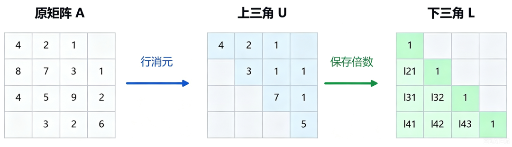
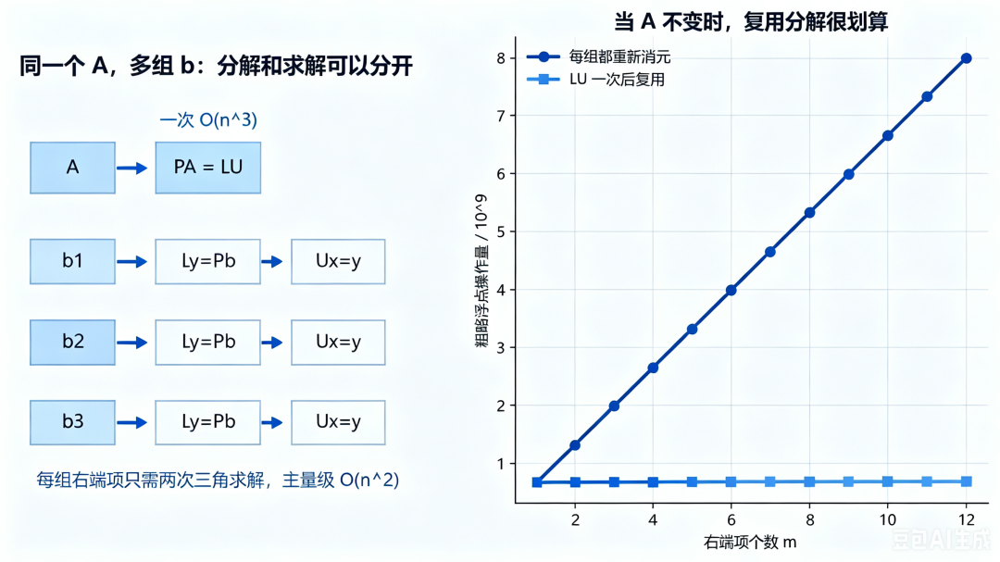
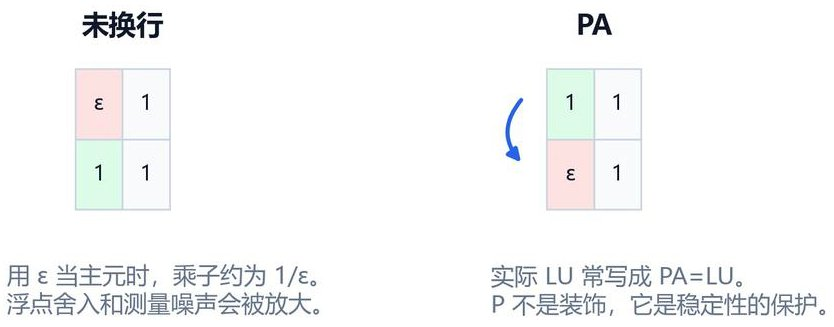
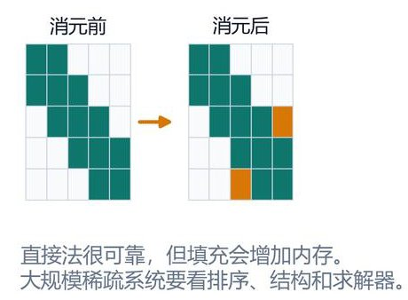

# LU分解到底有什么用？不止是把矩阵拆开这么简单

> 原文地址: [https://mp.weixin.qq.com/s/G679coZ9CbUOYA9r10kNLw](https://mp.weixin.qq.com/s/G679coZ9CbUOYA9r10kNLw)

学过线性代数的人，求解n阶线性方程组

时，第一反应往往是写出逆矩阵形式的解 ——先求逆矩阵，再和右端项相乘。但在真正的数值计算与工程程序里，几乎没人会这么做。大家更常用的，是一套叫做“LU分解”的方法。它看起来只是把矩阵拆成了两个三角矩阵，背后却藏着线性方程组求解的核心高效逻辑。

## LU分解到底是什么？

简单来说，LU分解的核心目标，是将一个可逆方阵  分解为一个**单位下三角矩阵** 与一个**上三角矩阵** 的乘积，即：

其中，下三角矩阵  的主对角线元素全为1，且对角线以上的元素均为0：

上三角矩阵  的对角线以下元素均为0：

在工业界更常用的数值稳定版本中，还会引入行交换矩阵（置换矩阵），构成带部分主元的LU分解：

置换矩阵  是单位矩阵经过若干次行交换得到的，用于记录消元过程中所有的行调换操作。

这个拆分并非凭空构造，它本质上是把高斯消元的过程“完整存档”了。 我们做高斯消元时，会通过逐次的行变换，将矩阵  的下三角元素逐步消为0，最终得到上三角矩阵 。第  步消元时，我们用第  行消去第  行（）的第  列元素，对应的消元倍数为：

其中  表示第  步消元后矩阵第  行第  列的元素。

从矩阵变换的角度看，每一步消元都对应一个初等下三角矩阵 ，经过  步消元后有：

由于初等下三角矩阵的逆仍然是下三角矩阵，且所有  的乘积恰好是一个单位下三角矩阵，因此可得：

换句话说， 记录了“消元结束后的最终矩阵”， 记录了“消元是按怎样的系数一步步完成的”。把这个过程保存下来，后续再求解方程时，就不用从头到尾重做一遍消元了。

## LU分解的核心价值：一次分解，多次复用

LU分解真正的优势，体现在“同一个系数矩阵，对应多组右端项”的场景里。 这种情况在工程中极其常见：结构力学里同一个刚度矩阵，要计算多种荷载下的位移；导热问题里同一个传导矩阵，要分析多组边界条件下的温度分布；电路仿真里同一个网络矩阵，要求解多组输入对应的响应。即我们需要求解一系列同系数矩阵的方程组：

有了  分解后，原方程  可等价转化为两步三角方程组求解：

1.  先求解下三角方程组 ，得到中间向量 ；
    
2.  再求解上三角方程组 ，得到最终解 。
    

下三角方程组的求解称为**前代法**，从第一行开始依次计算每个分量：

上三角方程组的求解称为**回代法**，从最后一行开始反向计算每个分量：

前代与回代的计算量均为  量级，远低于完整高斯消元的  量级。我们可以通过浮点运算次数直观对比两种方案的效率差异：

-   若每换一个右端项就重新做一次完整高斯消元，总浮点运算量约为：
    
-   若先做一次LU分解，再对每个右端项做前代+回代，总浮点运算量约为：
    

两者的差距非常直观：当矩阵阶数 、右端项数量  时，反复消元的浮点操作量接近  次；而复用LU分解后，总操作量仅约  次，效率提升一个数量级。这就是典型的“一次投入，多次受益”。

除此之外，LU分解还让“显式求逆”变成了多余步骤。如果我们的目标只是算出解 ，直接通过三角方程回代求解，通常比先构造完整的逆矩阵再相乘更快、更省内存，还能减少额外的舍入误差。很多编程语言中名为`solve`的线性求解函数，内部执行的都是各类矩阵分解，而非直接计算逆矩阵。

## 用好LU分解，要注意这三个细节

LU分解不是给高斯消元换个名字就足够稳定，实际工程应用里有三个关键问题必须考量。

首先是主元选择。如果消元到第  步时，主对角线上的元素  极小，消元倍数  就会变得很大，舍入误差会被严重放大。因此实用的LU分解普遍采用**部分主元法**：在第  步消元前，在第  列的第  到第  行中，选取绝对值最大的元素作为主元：

随后将第  行与第  行交换，再继续消元。这也就是  中行交换矩阵  的由来。

其次是量纲与尺度。工程矩阵的各行往往对应不同物理量，有的单位是牛顿，有的是伏特，有的是摄氏度，数值量级可能相差数倍甚至数十倍。计算机选主元只看浮点数的绝对值，并不等同于物理上的重要性。

从量纲分析的角度看， 是将解向量  映射到右端项  的线性算子。以结构力学为例，若  是位移（单位 ）， 是外力（单位 ），则刚度矩阵  的量纲为 。求解后的残差向量定义为：

残差的单位与右端项  一致。因此工程软件通常更关注**相对残差**：

而非没有物理上下文的绝对残差数值。在求解前，通常会先做无量纲化、行列缩放或变量尺度化，让矩阵的数值分布更均衡，提升计算稳定性。

第三是稀疏性。有限元、有限差分、电路网络这类问题的矩阵，原本大部分元素都是0，属于稀疏矩阵。但直接做LU分解的过程中，很多原本为0的位置会变成非零，也就是所谓的“填充”。填充会急剧增加内存占用和计算量，因此大规模稀疏LU分解会高度重视矩阵重排序、块结构优化、超节点与并行分解等工程技巧，以此控制填充带来的开销。

## LU分解不是万能解法

当然，LU分解也有清晰的适用边界，不同的矩阵结构对应更优的分解与求解方案：

-   若  是对称正定矩阵，Cholesky 分解  通常比LU分解节省近一半的运算量；
    
-   若面对长方形矩阵的最小二乘问题，QR分解或奇异值分解（SVD）会具备更好的数值稳定性；
    
-   面对超大规模的稀疏系统，预条件共轭梯度、GMRES、多重网格等迭代法往往具备更高的性价比；
    
-   若矩阵接近奇异，还需要仔细检查矩阵条件数同时结合主元增长情况和误差估计综合判断求解可靠性。
    

## 小结

LU分解之所以在现代数值计算中依然占据核心位置，从来不是因为它的数学形式有多精巧，而是因为它把线性方程组的求解，拆成了可复用、可分析、可优化的清晰步骤。 对小规模问题，它是高斯消元的高效组织方式；对中等规模密集矩阵，它是可靠的直接解法；到了大规模稀疏问题里，它又成了需要和排序、主元、内存、并行共同设计的工程组件。

下次再写程序解线性方程组时，不妨先问自己几个问题：矩阵  是否固定？要解多少组右端项？矩阵是密集还是稀疏？尺度有没有处理好？如果答案是“同一个中等规模方阵，要解很多组 ”，LU分解通常就是最自然的选择。

  

  

往期推荐

  

  

[

数值计算边学边练：高斯消去法

](https://mp.weixin.qq.com/s?__biz=Mzk0MzI0NDU2NQ==&mid=2247490964&idx=1&sn=e7e86f2c93c15142277059ae8bc07b88&scene=21#wechat_redirect)

[

数值线性代数：科学与工程计算的核心

](https://mp.weixin.qq.com/s?__biz=Mzk0MzI0NDU2NQ==&mid=2247490796&idx=1&sn=85b715aed259b51c4d35ef2d1a5f3b06&scene=21#wechat_redirect)

[

稀疏矩阵求解过程的要点总结

](https://mp.weixin.qq.com/s?__biz=Mzk0MzI0NDU2NQ==&mid=2247484084&idx=1&sn=502e3294fbc243895143fc4041c4d8ce&scene=21#wechat_redirect)

**闲鱼小店已上新，欢迎新老粉丝关注和咨询**

**喜欢****作者******，请点********赞********和在看********

****