# Matplotlib 数据可视化完整指南


> 原文地址: [https://mp.weixin.qq.com/s/ykEdDNuA4dvvHNPtGBho6Q](https://mp.weixin.qq.com/s/ykEdDNuA4dvvHNPtGBho6Q)


## 1\. 引言

Matplotlib 是 Python 中功能强大的数据可视化库，广泛用于科学研究、数据分析和商业报告。它支持多种图表类型、样式、交互控制，是 Python 数据科学领域的标准绘图工具之一。

## 2\. 安装与基础环境

```
# 安装 Matplotlib
```

## 3\. 基础绘图类型与示例

```

```

```
3.1 折线图（Line Plot）
```

适用于展示随时间变化或连续趋势的数据。

```
import matplotlib.pyplot as plt
```

效果图，如下：

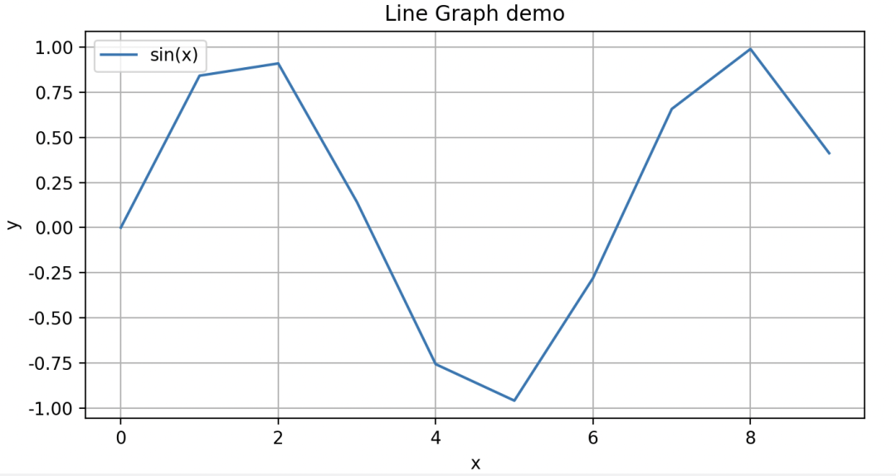

    ✅ 优点：趋势清晰、适合连续数据  
    ⚠️ 缺点：类别过多时曲线复杂、难读

### 3.2 柱状图（Bar Plot）

用于比较不同类别之间的数值差异。

```
categories = ['A', 'B', 'C', 'D']
```

效果图，如下：

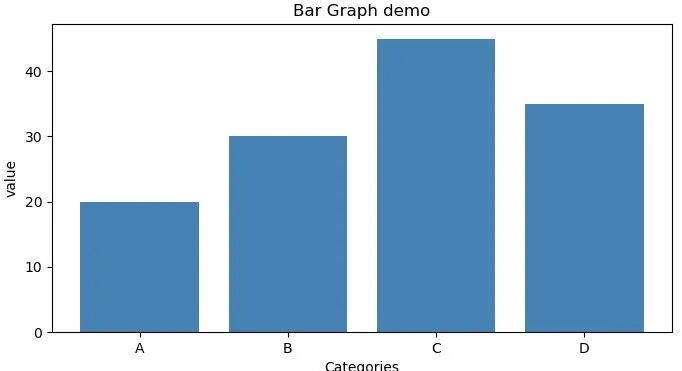

    ✅ 优点：直观、类别对比清晰  
    ⚠️ 缺点：类别多时，柱子密集、不美观

3.3 散点图（Scatter Plot）

适合观察变量之间的关系或聚类。

```
x = np.random.rand(100)
```

效果图，如下：

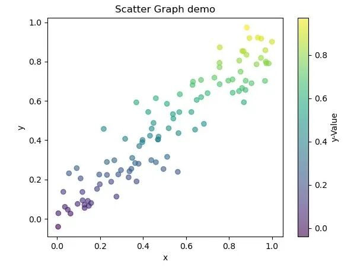

    ✅ 优点：展示变量间关系、密度分析  
    ⚠️ 缺点：点过密时难以分辨

3.4 饼图（Pie Chart）

适合展示整体与部分占比。

```
labels = ['A', 'B', 'C']
```

效果图，如下：

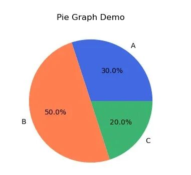

    ✅ 优点：适合少数分类占比  
    ⚠️ 缺点：类别多时不清晰、不适合比较数值大小

3.5 箱线图（Box Plot）

用于显示分布情况、中位数、四分位数等统计信息。

```
data = [np.random.normal(0, std, 100) for std in range(1, 4)]
```

效果图，如下：

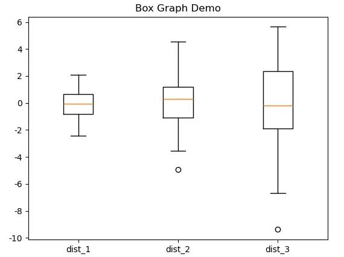

    ✅ 优点：展示分布异常、离散程度  
    ⚠️ 缺点：不直观表达原始数据量

## 4\. 各种绘图风格分析

### 4.1 基础风格（Default Style）

### `   `

```
plt.style.use('default')
```

官网提供的效果图，如下：

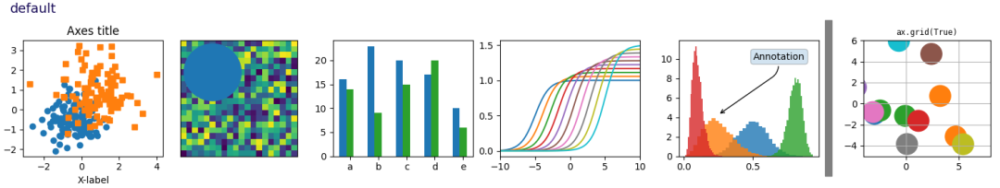

    ✅ 简洁、轻量，适合快速展示  
    ⚠️ 样式有限，视觉吸引力低

### 4.2 学术风格（Academic Style）

```
plt.style.use('seaborn-v0_8')
```

官网提供的效果图，如下：

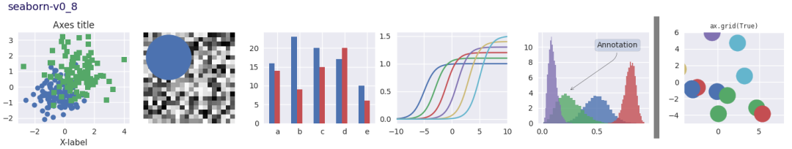

    ✅ 学术报告、论文中使用较多  
    ⚠️ 不够现代、交互性弱

4.3 现代风格（Modern Style）

```
plt.style.use('ggplot')  # 更柔和、适合报告
```

官网提供的效果图，如下：

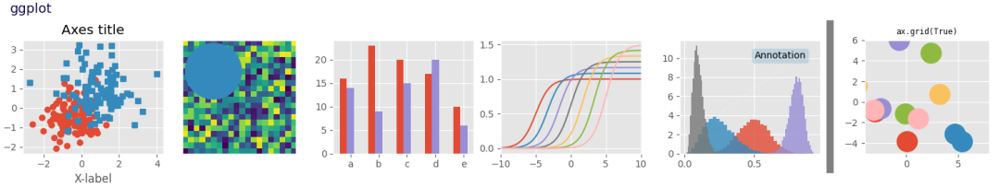

    ✅ 风格现代、适合展示与展示型应用  
    ⚠️ 文件体积较大、加载慢

4.4 暗色风格（Dark Theme）

```
plt.style.use('dark_background')
```

官网提供的效果图，如下：

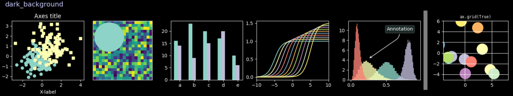

    ✅ 适合大屏展示、暗色背景环境  
    ⚠️ 不适合打印或浅色背景

## 5\. 综合案例：销售数据分析

```
months = ['Jan.','Feb.','Mar.','Apr.','May.','Jun.']
```

效果图，如下：

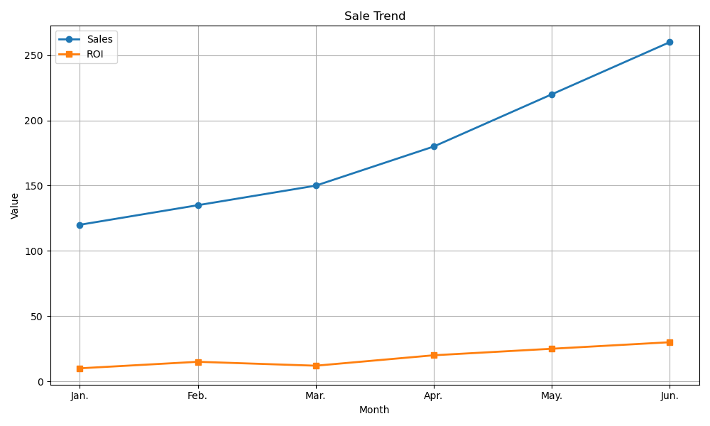

    ✅ 多指标叠加、可读性强  
    ⚠️ 颜色过多时影响清晰度

## 6\. 进阶技巧：多子图与自定义样式

### 6.1 多子图布局

```
fig, axs = plt.subplots(2, 2, figsize=(12, 10))
```

效果图，如下：

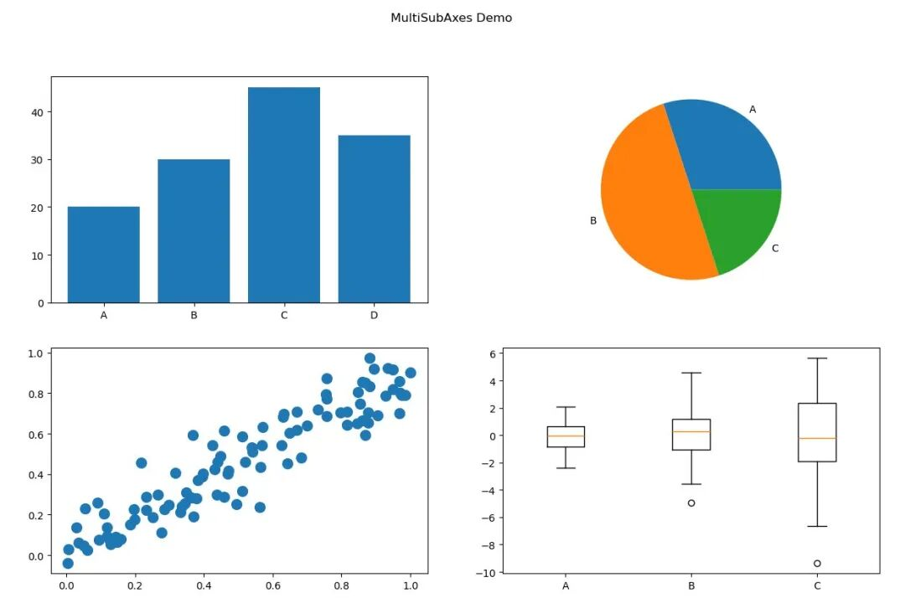

    ✅ 多图表整合展示  
    ⚠️ 需手动控制布局

### 7\. 总结与建议

图表类型

优点

缺点

使用场景

折线图

趋势展示好

数据点过多时乱

时间序列

柱状图

对比清晰

类别过多时不美观

类别比较

散点图

展示变量关系

数据点密集时难读

相关性分析

饼图

显示占比清晰

多类别不清晰

占比展示（少类别）

箱线图

展示分布与异常

数据量小或复杂时不直观

分布与异常检测

柱状图+折线

展示趋势与对比

需避免信息过载

多指标联合展示

### 最佳实践建议

-   ✅ 保持配色一致性与可读性
    
-   ✅ 添加图例、标签、单位
    
-   ✅ 控制图表复杂度（建议不超过3个变量）
    
-   ✅ 使用合适的图表类型匹配数据
    
-   ✅ 输出高分辨率图表（300 DPI 以上）
    

* * *

Matplotlib 是 Python 中功能强大且灵活的绘图库，掌握其多种图表类型与风格，将极大提升数据展示质量与沟通效率。

☆☆☆ End ☆☆☆  
  
转角  ·  遇见  ·  程序猿

\-------------------------

那是一抹淡淡的微光

  

它是数字世界里的一把杀猪刀

却总能巧夺天工

它的世界是纯粹0、1组合

却总能创造无尽幻想

......

本公众号关注数据价值分析、编程学习，将不定期更新社会热点数据分析结果、编程技巧，分享数据分析工具、方法、学习等内容，欢迎有兴趣的小伙伴加入。