# MikTex使用简介

> 原文地址: [https://mp.weixin.qq.com/s/c58esN7yeN97YZyu6ajZ8A](https://mp.weixin.qq.com/s/c58esN7yeN97YZyu6ajZ8A)

MiKTeX是一个用于生成包含大量数学和科学表达式的文档的排版系统。它提供了一组工具和包，简化了与LaTeX文档准备系统一起工作的过程。（就是一个latex排版的软件）

以下是关于MiKTeX的一些关键点：

1.  LaTeX： MiKTeX与LaTeX紧密关联，LaTeX是一种常用于制作科学和数学文档的排版系统。LaTeX允许用户专注于文档的内容而不是格式。
    
2.  包管理器： MiKTeX包括一个包管理器，允许用户轻松安装和更新LaTeX包。LaTeX包是添加特定功能或功能的文件集合。
    
3.  跨平台： MiKTeX适用于Windows、Linux和macOS，使其成为LaTeX文档准备的跨平台解决方案。
    
4.  自动包安装： MiKTeX的优势之一是它能够根据需要自动下载和安装缺失的包。在处理需要特定LaTeX包的文档时，这可能特别有用。
    
5.  TeXworks编辑器： MiKTeX附带TeXworks，这是一个用于编写LaTeX文档的简单且集成的环境。但是，用户可以选择使用其他LaTeX编辑器。
    
6.  命令行支持： 对于喜欢使用命令行界面的用户，MiKTeX提供了用于编译LaTeX文档的命令行工具。
    
      
    

下载网址：https://miktex.org/download

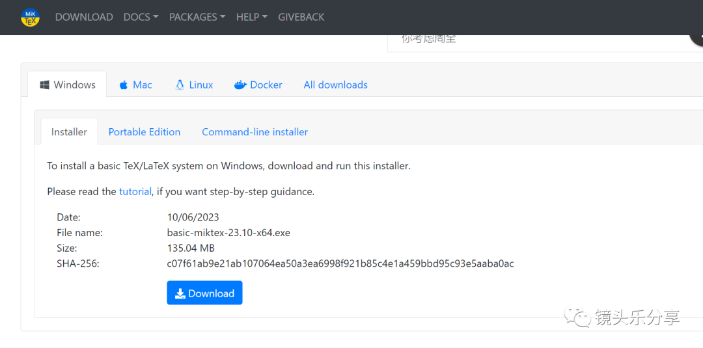

下载完以后，就一路安装，箭头处记得选择  

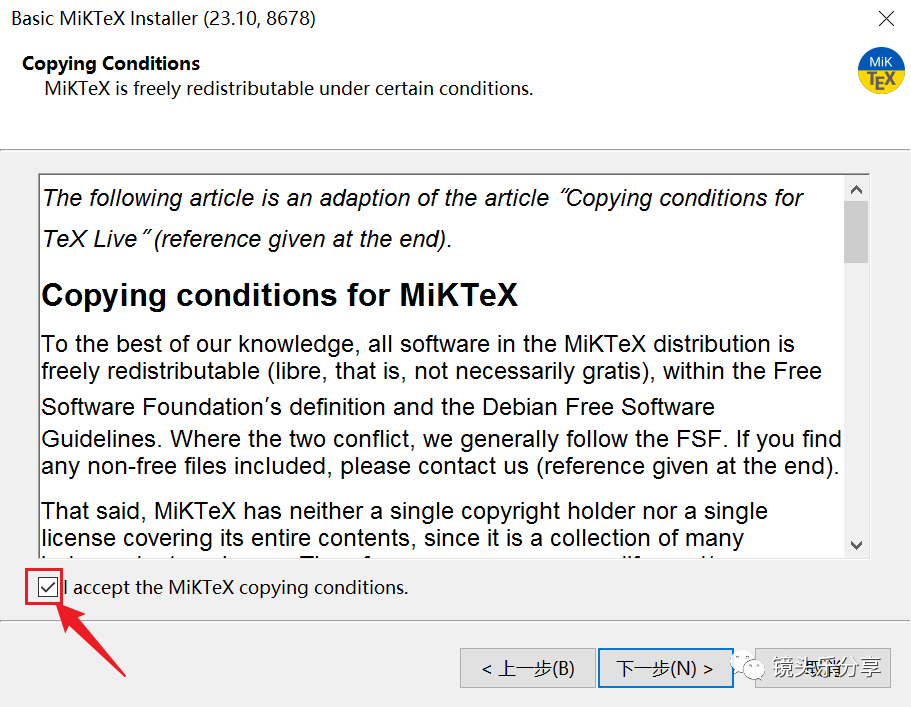

点击下一步，这里建议选择第二个，为使用电脑的全部用户安装，继续点击下一步  

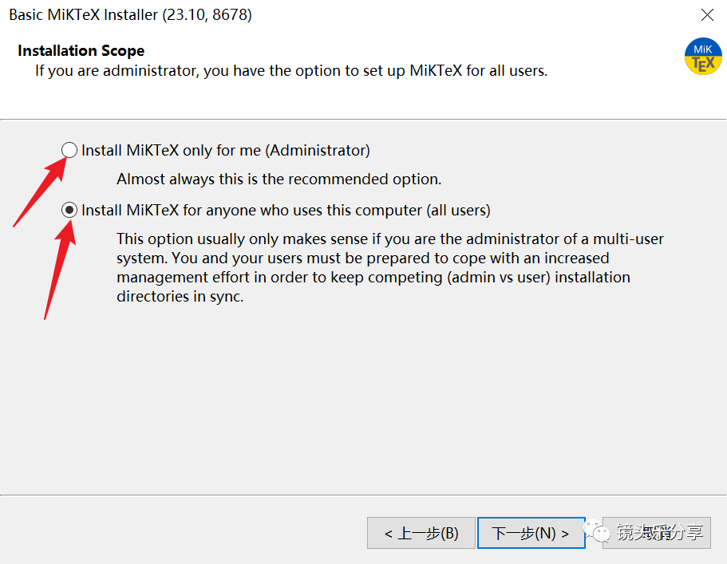

安装路径的选择，可以选择自己喜欢的路径。

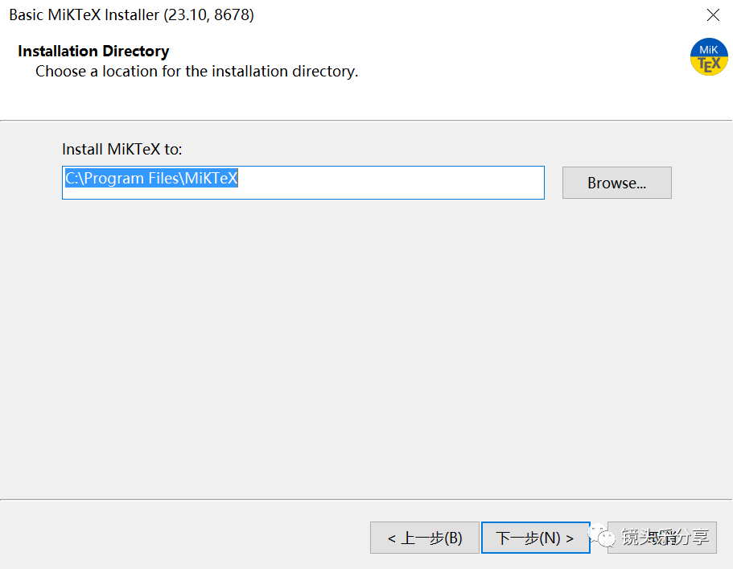

安装完成以后，在cmd界面输入Tex --version可以检测是否安装成功

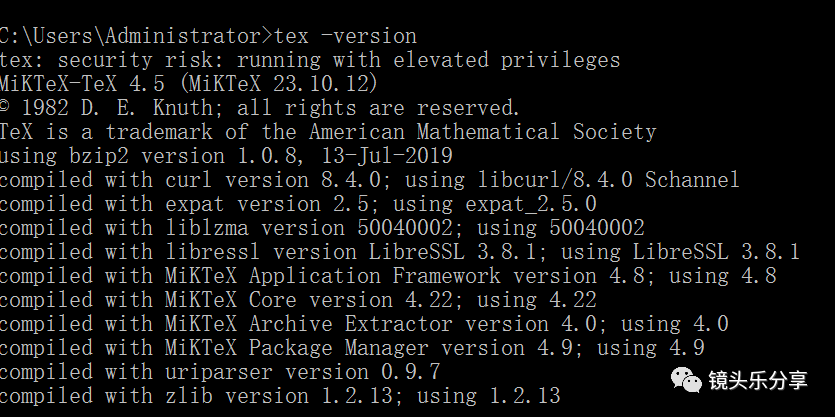

然后在下面这个位置查看两个软件（MikTex Console 和 TeXworks）是否安装成功。

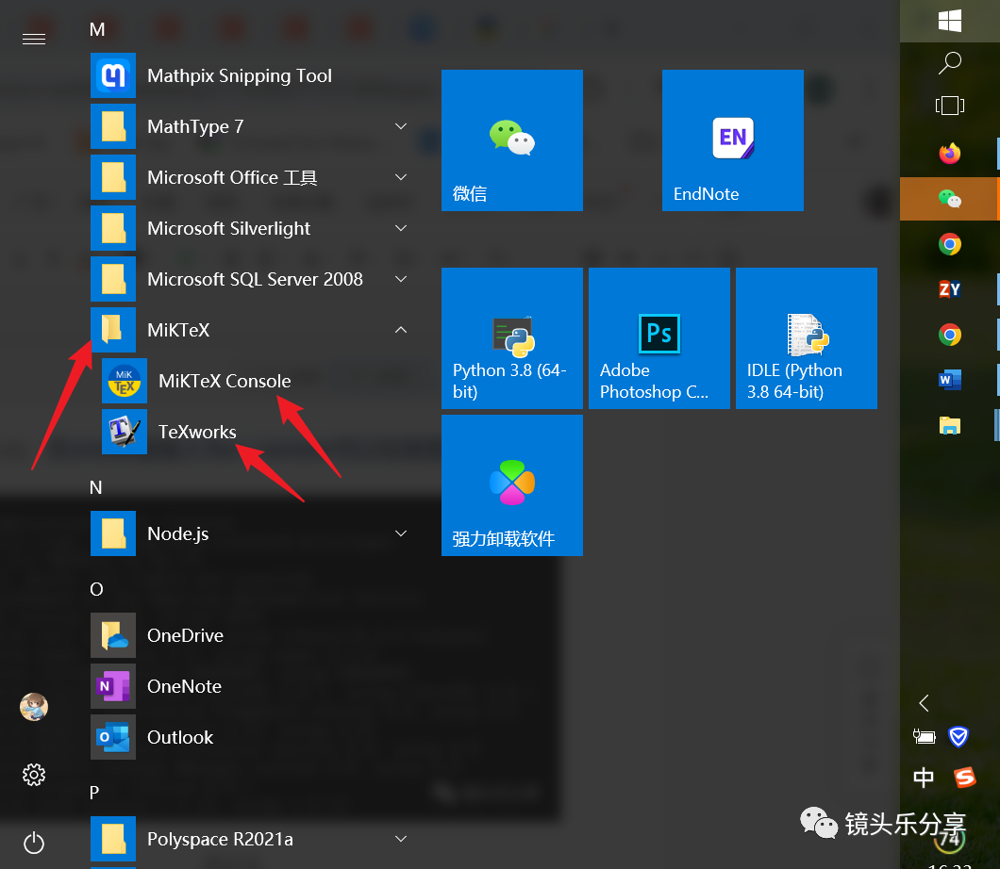

然后是更新宏包。（这一步至关重要呀，可能由于宏包未更新导致不能运行latex源码）  

首先，打开MikTex Console 这个软件  

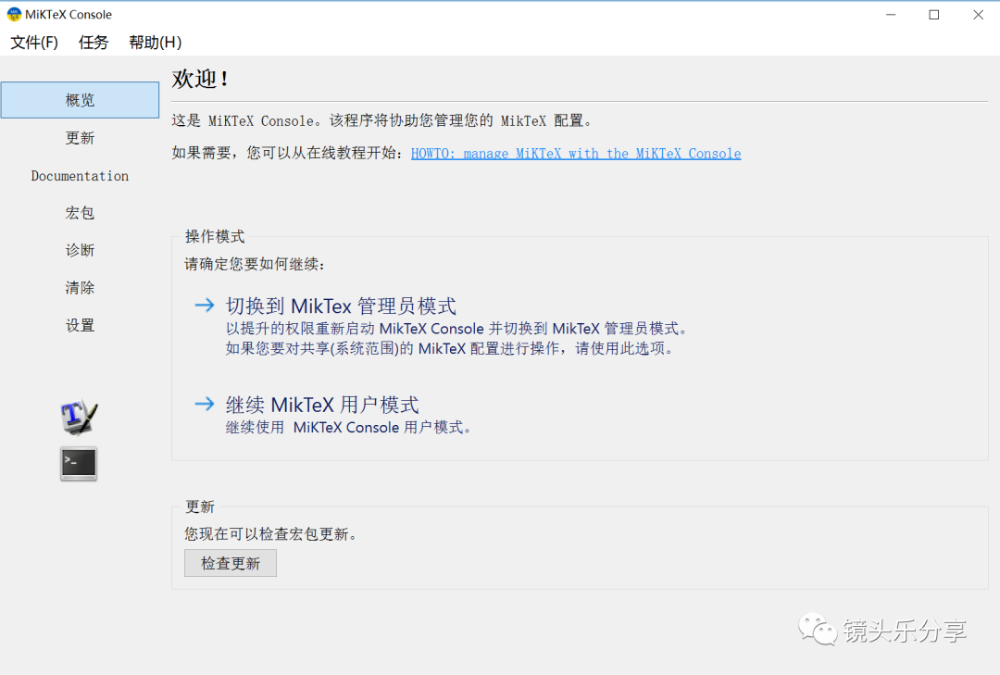

然后点击 文件  。切换到管理员模式

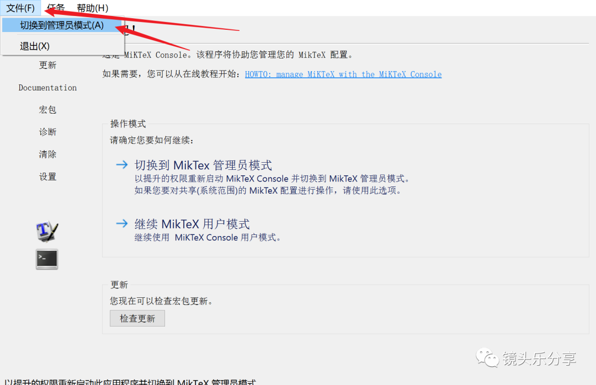

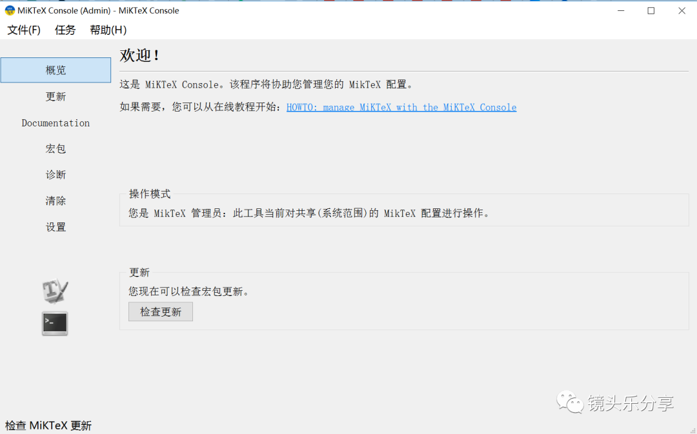

依次点击更新-检查更新-立即更新。更新完毕以后，关闭MikTex Console

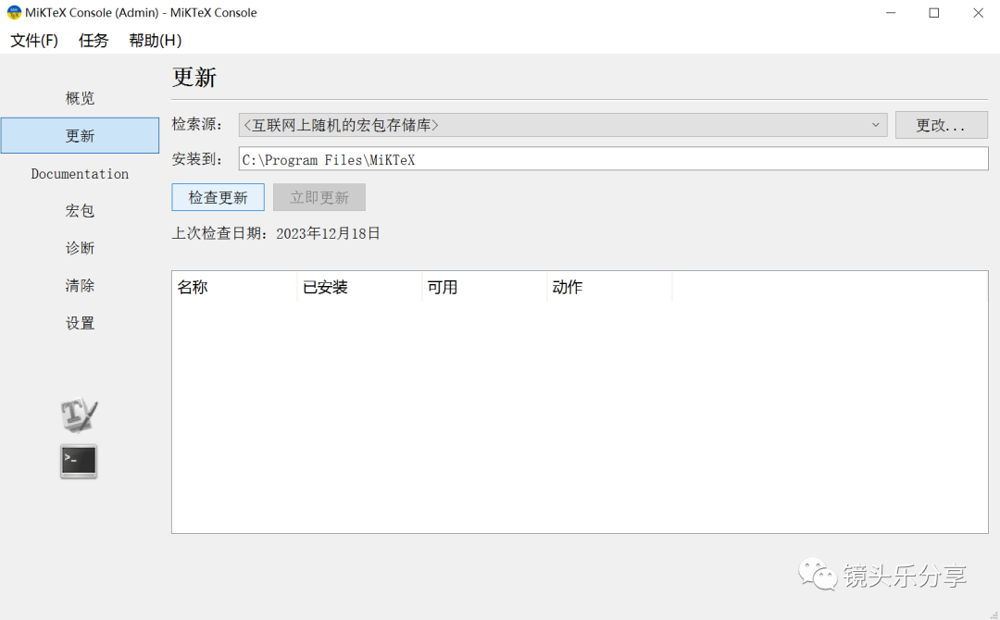

这张图为更新过程图  

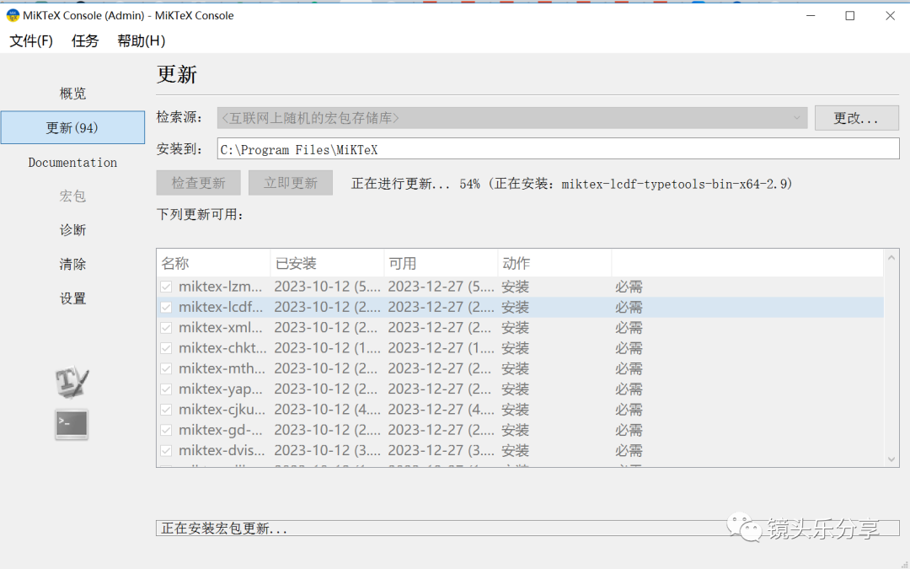

更新完成以后，就可以随便找一个模板运行啦！！打开一个包含latex模板的文件，然后，双击后缀为tex的文件。

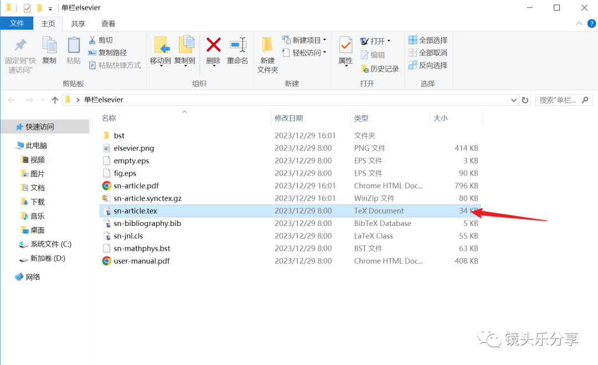

左侧为latex源码文件，右侧为运行结果的pdf文件

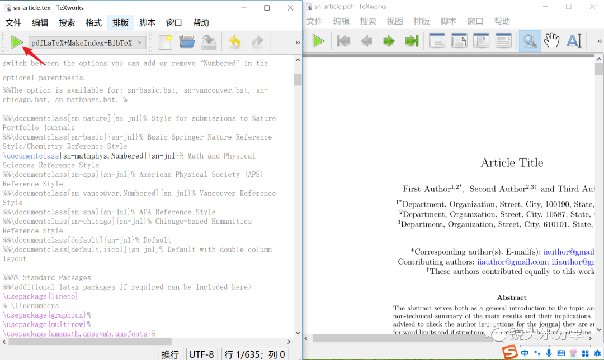