# Poisson方程基于叠层基函数的高阶有限元通式（三合一）

> 原文地址: [https://mp.weixin.qq.com/s/MLXzmvjSD0Hl2OUYWk8DfA](https://mp.weixin.qq.com/s/MLXzmvjSD0Hl2OUYWk8DfA)

**简述**

在之前的文章中，依次介绍了结构化网格的插值型基函数的一维、二维、三维的高阶通式，在使用高斯积分后，任意高阶有限元成为可能。并且发现结构网格网格中，三维、二维网格均是一维网格的拓展，一通则全通。

这篇文章继续介绍**结构化网格的叠层基函数的一、二、三维的任意高阶通式。**

相比于较为复杂的插值型基函数，叠层基函数的任意阶基函数相对简单，容易实现。并且在前面插值基函数的实现基础上，只需要把计算基函数的部分替换掉即可。

对于边值问题，还是以最简单泊松方程出发，具体的有限元推导部分不再重复，参考：

[初探高斯积分在一维有限元中运用：泊松方程](http://mp.weixin.qq.com/s?__biz=MzkwNzUxOTM2NA==&amp;mid=2247485234&amp;idx=1&amp;sn=a8484e8315eb423273733ac8e4bc1a66&amp;chksm=c0d6b3d9f7a13acf0c22cf6e364a99e91bcd13769377863a5f02073b17d0b02910f652f2f4c3&scene=21#wechat_redirect)

**1.叠层基函数通式**

**a.一维基函数**  

同样，先从一维出发，同样首先给出最基本上的线单元的线性插值基函数：

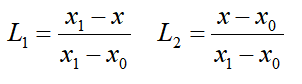

将该线性插值基函数投射到\[-1,1\]的区域内，用以下方式表示：

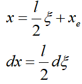

得到映射后的线性插值基函数，同样的处理是为了方便高斯积分。

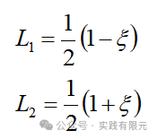

已知，1阶基函数为：

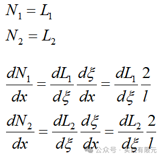

2阶叠层基函数的第三个基函数：

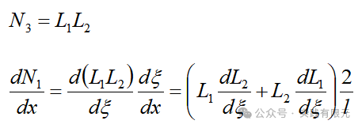

          3阶基函数，在1、2阶基础上，添加第四个基函数：

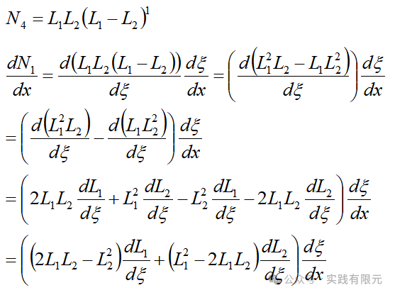

          可知，N阶基函数，可以表示为：

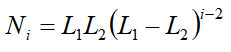

因此，通式：

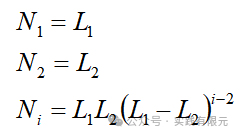

对应的梯度为：

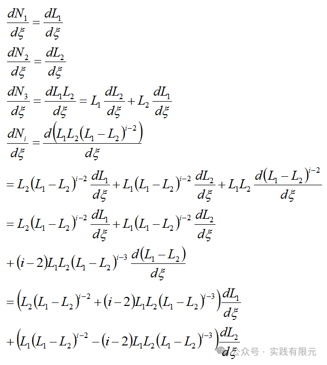

可见，一维度的叠层基函数的通式，还是保持着低阶包含高阶的特征，这对于混合阶有限元的实现是非常关键的。

**b.二维基函数**

二维叠层基函数就是由一维度基函数通式组合而成，因此，考虑二维两个方向X，Y，则X,Y连个方向分别的通式表示为：

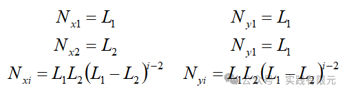

因此不难获得：

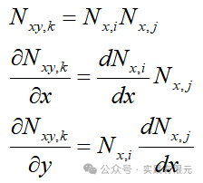

**c.三维基函数**

三维叠层基函数的通式，则是X,Y,Z三个方向：    

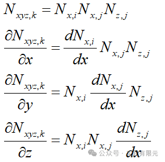

因此，一维的通式确定，二维矩形单元，三维六面体单元通式也就都获得，并且实现一维度的推导，高维度通过乘积即可使用。即使更高维度，四维、五维...都可以很容易获得。

**2系数矩阵组装**

针对泊松方程而言，三维的有限元离散方程为：

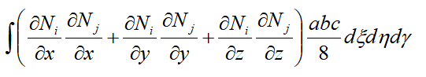

一维度而言，对上述式子只取一项：

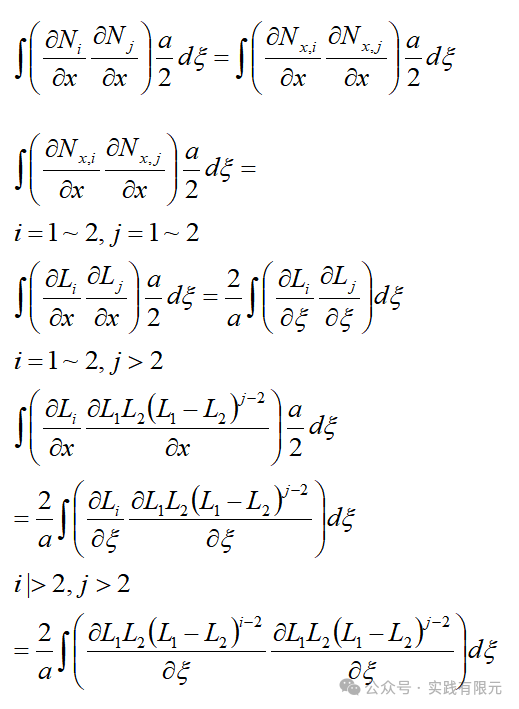    

将上述等式全部写出高斯积分形式：

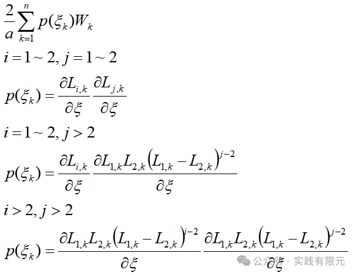

推导如此，就不必要继续推导，对两部分直接单部分求解，然后乘积即可获得被积函数。然后再通过高斯积分获得即可。

对于二维，三维系数矩阵公式，则可以直接写成高斯积分公式，首先定义：

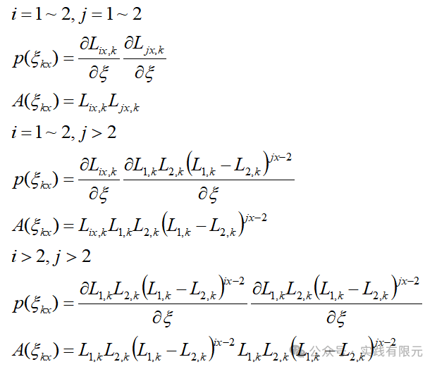

所以，二维系数矩阵通式表示为：

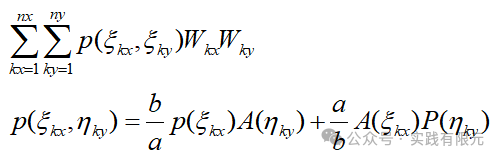    

三维系数矩阵通式为：

          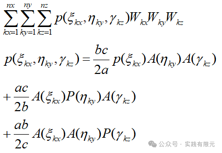

至此，推导完成，如果想要写成更高维度的通式，也可直接按规律获得。

**3系数矩阵组装与边界条件**

这里的系数矩阵与插值型基函数的网格完全一致，直接套用插值基函数的各维度网格节点编号与单元映射关系即可。

不同点在于边界条件的加载，叠层基函数的高阶部分全部置为零，具体可参考文章：

[一维高阶叠层有限元实现](http://mp.weixin.qq.com/s?__biz=MzkwNzUxOTM2NA==&amp;mid=2247483750&amp;idx=1&amp;sn=3da0cb99d39eb4586ab282794683f930&amp;chksm=c0d6b58df7a13c9b872b692a35e4b39106de14406cd9924b2e6cab71830b32d61b4104cafee6&token=1966003437&lang=zh_CN&scene=21#wechat_redirect)

还需要注意的地方是，叠层有限元的高阶部分不代表具体的点的泊松值，需要通过插值获得对于单元位置处的具体数值。

**4结果展示**

**_Eg1 一维度8阶有限元泊松结果_**

网格：5个网格；未知数为41个；求解区域\[0,10\]

稀疏矩阵的非零元素分布如下：    

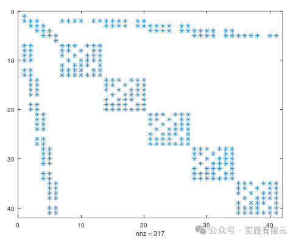

求解结果如下：

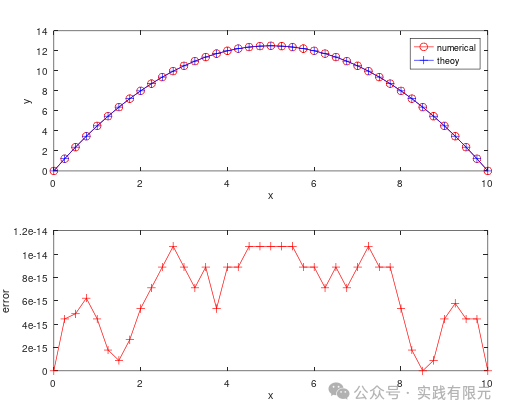

**_Eg2 二维6阶有限元泊松方程结果_**    

网格：2\*3=6个网格；未知数为247个；求解区域\[0,10;0,10\]

稀疏矩阵的非零元素分布如下：

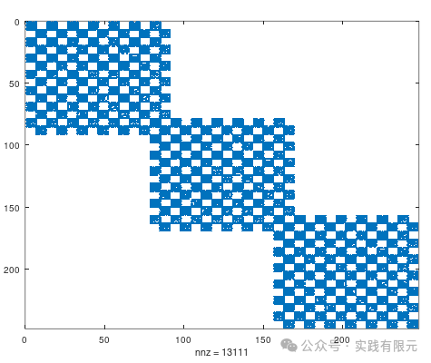

结果可视化如下：

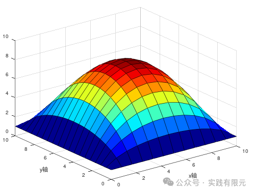    

**_Eg3 三维5阶有限元泊松方程结果_**

网格：2\*2\*2=8个网格；未知数为1331个；求解区域\[0,10;0,10;0,10\]

稀疏矩阵非零元素分布：

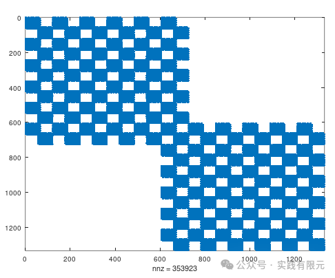

求解结果显示：

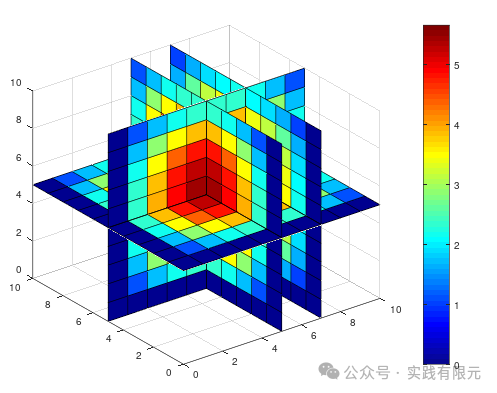

参考插值基函数的结果可以了解，二者的结果是一致的。

**总结**

1.任意高阶有限元的流程均是一样，只是针对基函数的形式不一样，因此实现了插值型任意高阶后，叠层任意高阶也容易实现。关键还是在于任意叠层高阶基函数的确定。

2.叠层基函数的优势在于能实现混合阶有限元的实现，因此如果找到任意阶叠层基函数通式，那么对于p型自适应有限元也是没有技术难点了。

3.我所了解的4种不同类型的自适应有限元：

A.p型自适应有限元：自适应过程中，网格不变，根据后验误差控制网格阶数以达到高精度解的过程；

B.h型自适应有限元：自适应过程中，网格基函数阶数不变，加密或放粗网格大小，以达到高精度解析解；本公众号在之前提供过一个案例：

[自适应有限元技术:一维电场衰减数值模拟](http://mp.weixin.qq.com/s?__biz=MzkwNzUxOTM2NA==&amp;mid=2247483839&amp;idx=1&amp;sn=e2f7a7363e057ae988054c5d83e180cb&amp;chksm=c0d6b554f7a13c420b5667c418d2d0fe4e40b4192beffb78b7c46052cf66476163a0a24ded5f&scene=21#wechat_redirect)

C.hp型自适应有限元，利用p型和h型的优势，网格与阶数均变化，平衡二者关系，使用最小的资源获得最好的精度；个人感觉该方法得有很强的物理背景才能实现合理的分布。   

D.r型自适应有限元，或者叫做动网格技术，根据后验误差，不增加网格量，而是通过调整网格大小分布以获得最好的精度。这种方法似乎在流体力学中使用较多。