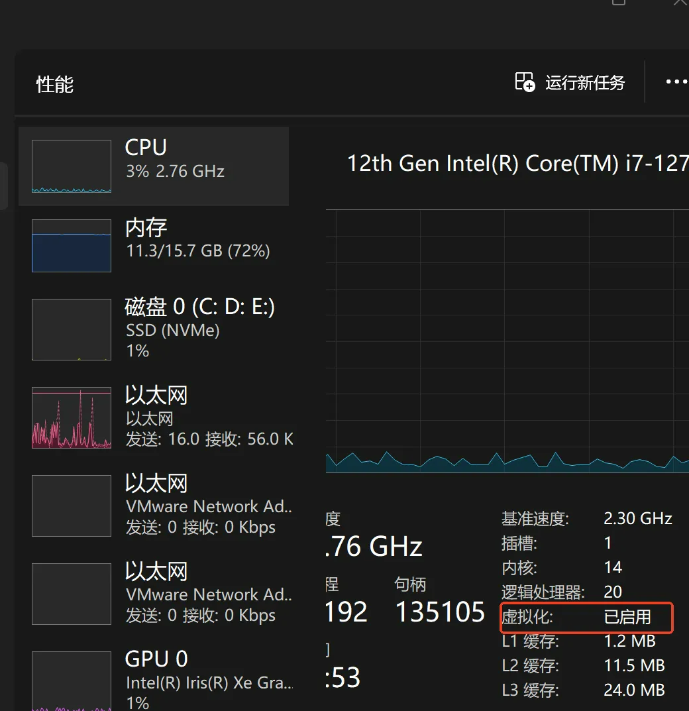
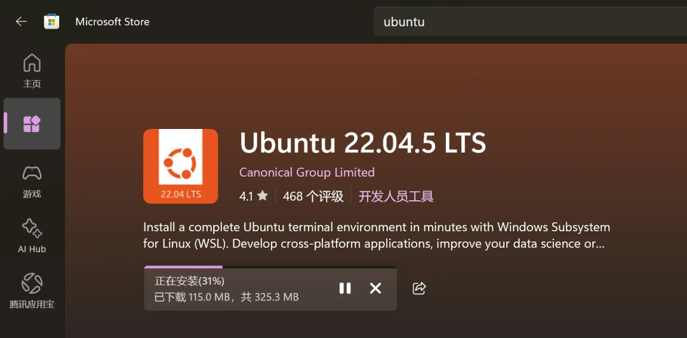
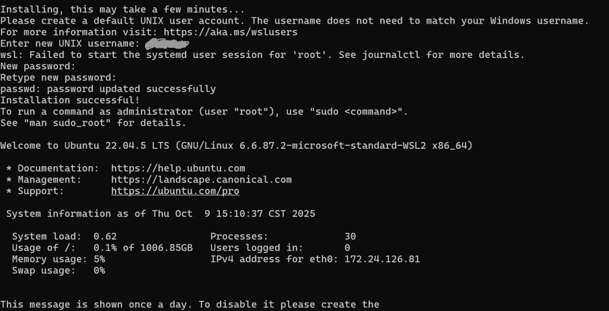
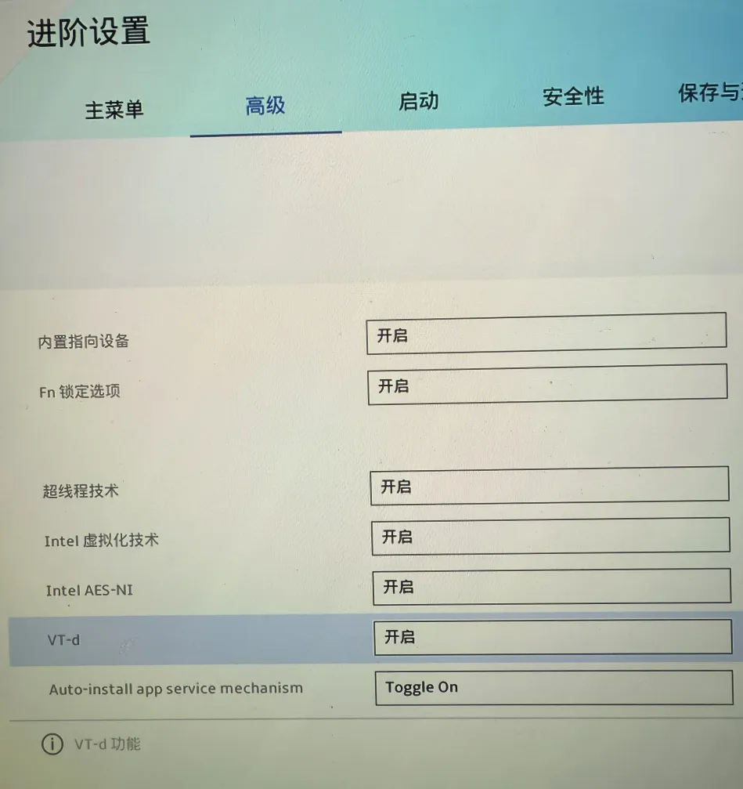
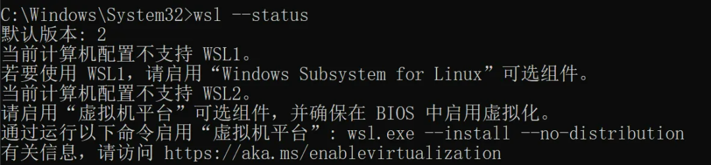
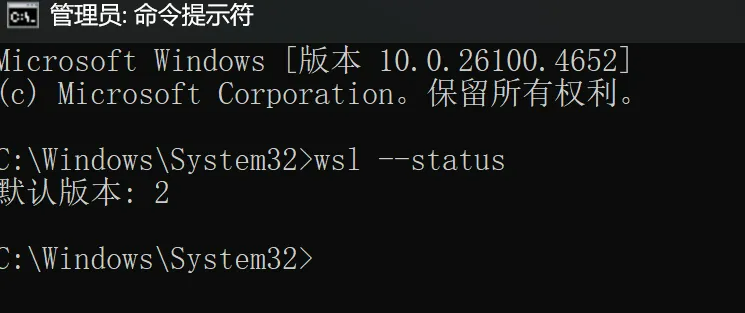

# WSL安装ubuntu实践


> 原文地址: [https://mp.weixin.qq.com/s/FMVGeyNMCBGUyUNZDfYMhQ](https://mp.weixin.qq.com/s/FMVGeyNMCBGUyUNZDfYMhQ)

    WSL的全称是Windows Subsystem for Linux，中文意思是“适用于 Linux 的 Windows 子系统”。可以把它理解为一个桥梁，它让你可以在不安装传统虚拟机或双系统的情况下，直接在 Windows 上运行原生的 Linux 程序和环境。它相比使用虚拟机的优点是：

1.  **原生集成**：它不是模拟器，也不是远程连接。Linux 程序感觉就像在本地运行一样。

2.  **无需双系统启动**：你不需要在开机时选择进入 Windows 还是 Linux，避免了重启的麻烦，可以同时在两个环境中工作。

3.  **无缝文件系统互访**：你可以在 WSL 中直接访问和操作 Windows 下的 C盘、D盘等文件（路径是 /mnt/c/ , /mnt/d/ ）

4.  **高性能**：相比传统虚拟机，WSL（尤其是 WSL2）的性能损耗极低，特别是在文件读写和编译代码时，速度非常快

5.  **节省空间：**WSL磁盘空间随实际使用量增长，虚拟机占用独立的磁盘空间开销  
    

WSL 有2个版本：WSL1和WSL2，是两个不同的架构版本，WSL2比WSL1高级，目前主流和推荐的是**WSL2**。

下面开始我们的安装步骤，期间遇到问题可参考最后一节《可能遇到的问题》：

1.基本要求

操作系统版本：Windows 10 version 2004 (Build 19041) 或更高版本

硬件要求：BIOS/UEFI 必须启用**硬件虚拟化。**使用任务管理器检查：



2\. 启用WSL功能

```
# 以管理员身份打开CMD，运行：
```

如果上面命令不行，可以分别启用功能：

```
dism.exe /online /enable-feature /featurename:Microsoft-Windows-Subsystem-Linux /all /norestart
```

3\. 设置WSL2为默认版本

```
wsl --set-default-version 2
```

检查WSL状态：

```
# 查看WSL状态
```

### 4\. 安装Ubuntu

-   打开Microsoft Store

-   搜索"Ubuntu"

-   选择需要的版本（如Ubuntu 22.04 LTS）并安装



### 5.首次启动和设置

在Windows开始菜单中找到并点击"Ubuntu"；显示安装中，可能花费一点时间耐心等待结束。非常好，已经成功了。提示我们输入系统的用户名和密码，完成后就进入一个全新的linux系统了。可以卸载你的虚拟机，开始你的Linux开发之旅了。



更新系统包

```
sudo apt update && sudo apt upgrade -y
```

### 6.基本使用指南

-   **在****Windows中访问Linux文件**：在文件管理器地址栏输入： \\  \\wsl$\\Ubuntu-22.04\\ 或  \\  \\wsl.localhost\\Ubuntu-22.04\\ 

-   **在****Linux中访问Windows文件**：

```
cd /mnt/c/   # 进入C盘
```

### 7.可能遇到的问题

**（1）****如果未开启虚拟化**

\- 重启电脑，按特定键（如Del、F2、F10等）进入BIOS/UEFI设置。- 在CPU相关设置中，开启**Intel VT****\-x**（Intel平台）或**AMD-V**（AMD平台）；默认是启用的。



（2）提示当前计算机配置不支持WSL2



通过运行提示的命令后重启


重启后依然不生效，重启后运行wsl --status 还是一样。

解决方案：

\-以**管理员身份**打开CMD。- 执行命令

```
bcdedit /set hypervisorlaunchtype auto
```

此命令确保Windows的Hyper-V hypervisor在启动时自动加载，对WSL2至关重要。

好了我们再次重启电脑，使用查看状态，看到设置成功。




**the end**