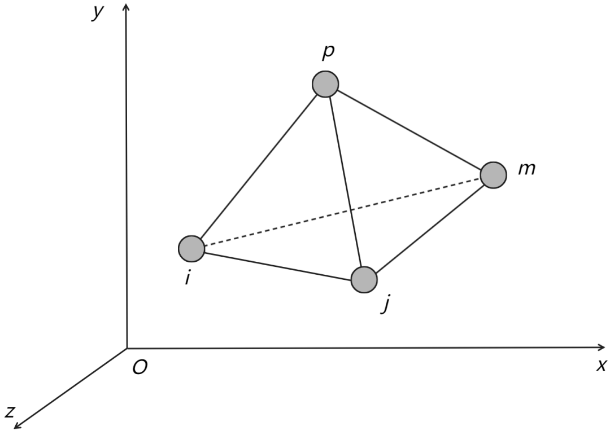
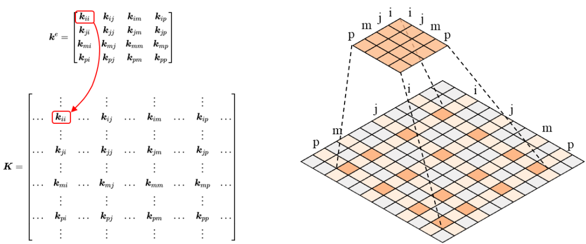

# \[CAE系列\] 有限单元法FEM入门：理论和代码


> 原文地址: [https://mp.weixin.qq.com/s/tUSEp\_V3FfWqbtDAItqLQA](https://mp.weixin.qq.com/s/tUSEp_V3FfWqbtDAItqLQA)

## 简介

有限单元法（有限元方法，finite element method）是计算复杂偏微分方程近似解的一种数值方法，其基本思想为“离散逼近”，即用分片函数的组合来逼近复杂函数，进而将微分方程求解转化为线性方程组的求解。有限单元法凭借其灵活性与通用性，已经成为工程领域中使用最为广泛的偏微分方程数值解法。

**国外有限元发展史：**1943年Courant第一次使用定义在三角区域上的分片连续函数求解扭转问题；1956年Turner、Clough等人研究了杆、梁、三角形和矩形的单元刚度矩阵表达式，并提出可由单元刚度矩阵组装得到整体刚度矩阵来描述结构整体力学性能，该方法被命名为直接刚度法（direct stiffness method）并应用于飞机机翼强度计算，一般认为这是工程学界有限元法的开端；1960年Clough将三角形单元和矩形单元用于平面应力分析时首次提出“有限单元方法”（finite element method）的概念；1967年Zienkiewicz和Cheung出版了第一本关于有限元分析的专著。更多有关国外有限元法的发展历史可参考Logan的《A First Course in the Finite Element Method》。

**国内有限元发展史：**20世纪50年代钱令希研究了力学分析的余能原理；1954年胡海昌提出广义变分原理；1964年钱伟长用拉格朗日乘子法建立了广义变分原理；1965年冯康在《应用数学与计算数学学报》上发表论文“基于变分原理的差分格式”，标志着有限元法在我国的诞生，这篇论文也是国际学术界承认我国独立发展有限元方法的主要依据。

## 计算理论

参考《弹性力学中的有限单元法》，以线性静力分析为例，一次计算的基本流程可以概括为：

### 1\. 结构离散

结构离散就是将结构划分为特定形状、大小的单元（element），单元在结点处相连，由离散单元组成的整体一般称为网格（mesh），结构离散又可称为网格划分。对桁架结构来说，可以直接取杆件作为基本单元，对平面连续体来说，可取三角形、矩形为基本单元，对空间连续体来说，可取四面体、六面体为基本单元，在某些情况下可将几种单元混合使用。

常见的网格划分算法、网格质量评估标准可参考邓子平老师的深入理解数值计算网格(全篇)，常见的开源/商用网格划分软件可参考 Mesh Generation and Grid Generation: Software。

### 2\. 计算单元刚度矩阵



以工程中常用的四结点四面体单元为例，其单元刚度矩阵计算过程如下：

四面体单元有 4 个结点（编号依次为，，，），结点坐标分别为，，和，每个结点有3个位移分量，第个结点的位移可用下式表示：

单元位移列阵可写为：

引入形函数（即单元上的插值函数）：

其中 为四面体体积，计算方式如下：

此外，式中

在形函数的基础上，单元内任意一点的位移可由四个结点位移插值得到：

上式也可写为矩阵形式：

由几何方程可得到单元应变的表示：

式中微分算子为：

将单元内位移的矩阵计算式代入几何方程可以得到基于结点位移表示的单元应变：

其中为应变矩阵（或称几何矩阵），计算式为：

将几何方程代入物理方程可以得到基于结点位移表示的单元应力：

其中为弹性矩阵，为应力矩阵，弹性矩阵定义如下：

令单元结点力列阵为

根据虚功原理（如果在虚位移发生之前，物体处于平衡状态，那么在虚位移发生时，外力所做的虚功等于物体的需应变能）可得：

令单元刚度矩阵

，可以得到单元刚度方程：

  

上式也可由最小势能原理推导得到，实际上虚功原理与最小势能原理是等价的。

### 3\. 组装单元刚度矩阵

由于四结点四面体单元有 4 个结点，每个结点有 3 个位移分量，因此单元刚度矩阵的大小为。

将单元刚度矩阵元素填入整体刚度矩阵对应位置，得到：

整体刚度矩阵组装示意图如下：



由整体刚度矩阵表示的弹性体平衡方程为：

其中为整体结点载荷列阵，为整体结点位移列阵。

### 4\. 处理边界条件

组装得到的整体刚度矩阵是奇异的，存在线性相关的行或列，有无数个解（因为此时存在刚体位移），需要引入边界条件对刚度矩阵进行修改，从而消除奇异性。

弹性力学中的边界条件包括位移边界条件、应力边界条件以及混合边界条件（位移 + 应力）。以位移边界条件为例，可分为零位移边界条件（）和给定具体数值的位移边界条件（）。处理边界条件可使用“化零置一”法、乘大数法等，以“化零置一”法为例进行说明。

假设位移列阵第个位移 已知，则将整体刚度矩阵做如下修改：

（1）载荷列阵修改：将第个载荷 改为，其余元素改为；

（2）刚度矩阵修改：将刚度矩阵第行第列主对角线元素 改为 1，其余元素改为 0。

修改后，刚度方程变为：

经边界条件处理后，刚度矩阵变为非奇异矩阵，方程组存在唯一解。

### 5\. 求解线性方程组

线性方程组的求解可使用的算法和工具较多，此处不再赘述，可参考邓子平老师的一篇文章入门大规模线性方程组求解，文章对算法和计算工具进行了比较全面的总结，矩阵计算相关理论可参考《矩阵计算》。

### 6\. 求支反力以及单元其他变量

求解线性方程组后可以得到所有结点的位移分量，然后代入原刚度方程中对应项可解出位移约束点对应的力，即支反力。

在所有结点位移已知的基础上，可利用上面推出的和分别求出单元的应变和应力，再利用绕结点法可得到结点的应力。

## 代码

在以上理论基础上，参考裴尧尧老师的《Python 与有限元》，以四结点四面体单元为例将求解器部分的 Python 计算代码进行整理（将书中代码进行适当调整、简化）。

### 1\. Conda 环境配置

使用 Python 3.10 进行编程，并且配置 numpy。

```
conda create -n pyfem python=3.10conda activate pyfempip install numpy
```

### 2\. 结点类定义

初始属性包括结点坐标（`x`,`y`,`z`）、自由度（`ndof`）、编号（`id`）、位移（`disp`）和力（`force`），未知位移用 None 表示。`__repr__()` 用来查看实例的信息，`set_disp()` 用于指定位移数值，`fix_disp()` 用于设置固定位移，`set_force()` 用于指定结点力载荷。

```
class Node3D(object):    def __init__(self, coord, id = 0):        self.x = coord[0]        self.y = coord[1]        self.z = coord[2]        self.ndof = 3 # DOF of node        self.id = id # Start with zero        self.disp = {"Ux": None,"Uy": None,"Uz": None,"Phx": None,"Phy": None,"Phz": None}        self.force = {"Fx": 0.,"Fy": 0.,"Fz": 0.,"Mx": 0.,"My": 0.,"Mz": 0.}    def __repr__(self):        return "Node %d: (%.3f %.3f %.3f)" % (self.id, self.x, self.y, self.z)    def set_disp(self,**disp):        for key in disp.keys():            self.disp[key] = disp[key]        def fix_disp(self,dof):        for i in dof:            self.disp[i] = 0.    def set_force(self,**force):        for key in force.keys():            self.force[key] = force[key]
```

### 3\. 单元类定义

四结点四面体单元类名字参考 ABAQUS 命名为 C3D4，初始属性包括单元结点（`nodes`）、单元编号（`id`）、单元类型（`etype`）、阶次（`order`）、结点自由度（`ndof`）、体积（`volume`）、单元刚度矩阵（`Ke`）、弹性模量（`E`）、泊松比（`mu`）、单元应力（`stress`）。`__repr__()` 用来查看实例的信息，`calc_volume()` 用来计算单元体积，`calc_B()` 用来计算应变矩阵，`calc_D()` 用来计算弹性矩阵，`calc_Ke()` 用来计算单元刚度矩阵。

```
class C3D4(object):    def __init__(self, nodes, E, mu, id = 0):        self.nodes = nodes        self.id = id        self.etype = self.__class__.__name__        self.order = 1        self.ndof = self.nodes[0].ndof        self.volume = None        self.Ke = None        self.E = E        self.mu = mu        self.stress = {"x": 0.,"y": 0.,"z": 0.,"xy": 0.,"yz": 0.,"zx": 0.}        self.calc_volume()    def __repr__(self):        return "Element(%s) %d: %s" % (self.etype, self.id, self.nodes)    # Calculate the volume of tetrahedron element    def calc_volume(self):        V = np.array([[1,               1,               1,               1              ],                      [self.nodes[0].x, self.nodes[1].x, self.nodes[2].x, self.nodes[3].x],                      [self.nodes[0].y, self.nodes[1].y, self.nodes[2].y, self.nodes[3].y],                      [self.nodes[0].z, self.nodes[1].z, self.nodes[2].z, self.nodes[3].z]])        self.volume = abs(np.linalg.det(V) / 6.)    # Calculate the strain matrix B of the element.    def calc_B(self):        A = np.array([[1, self.nodes[0].x, self.nodes[0].y, self.nodes[0].z],                      [1, self.nodes[1].x, self.nodes[1].y, self.nodes[1].z],                      [1, self.nodes[2].x, self.nodes[2].y, self.nodes[2].z],                      [1, self.nodes[3].x, self.nodes[3].y, self.nodes[3].z]])        beta = [(-1)**(i + 1) * np.linalg.det(np.delete(np.delete(A, i, 0), 1, 1)) for i in range(4)]        gama = [(-1)**(i + 2) * np.linalg.det(np.delete(np.delete(A, i, 0), 2, 1)) for i in range(4)]        delta = [(-1)**(i + 1) * np.linalg.det(np.delete(np.delete(A, i, 0), 3, 1)) for i in range(4)]        self.B = 1. / (6. * self.volume) * np.array(            [[beta[0],  0.,       0.,       beta[1],  0.,       0.,       beta[2],  0.,       0.,       beta[3],  0.,       0.      ],             [0.,       gama[0],  0.,       0.,       gama[1],  0.,       0.,       gama[2],  0.,       0.,       gama[3],  0.      ],             [0.,       0.,       delta[0], 0.,       0.,       delta[1], 0.,       0.,       delta[2], 0.,       0.,       delta[3]],             [gama[0],  beta[0],  0.,       gama[1],  beta[1],  0.,       gama[2],  beta[2],  0.,       gama[3],  beta[3],  0.      ],             [0.,       delta[0], gama[0],  0.,       delta[1], gama[1],  0.,       delta[2], gama[2],  0.,       delta[3], gama[3] ],             [delta[0], 0.,       beta[0],  delta[1], 0.,       beta[1],  delta[2], 0.,       beta[2],  delta[3], 0.,       beta[3] ]])    # Calculate the elastic matrix D of the element.    def calc_D(self):        a = self.E / (1 + self.mu) / (1 - 2 * self.mu)        b = 1. - self.mu        c = (1. - 2 * self.mu) / 2.        self.D = a * np.array([[b,       self.mu, self.mu, 0., 0., 0.],                               [self.mu, b,       self.mu, 0., 0., 0.],                               [self.mu, self.mu, b,       0., 0., 0.],                               [0.,      0.,      0.,      c,  0., 0.],                               [0.,      0.,      0.,      0., c,  0.],                               [0.,      0.,      0.,      0., 0., c]])    # Calculate the stiffness matrix Ke of the element.    def calc_Ke(self):        self.calc_B()        self.calc_D()        self.Ke = self.volume * np.dot(np.dot(self.B.T, self.D), self.B)
```

### 4\. 系统类定义

系统类主要定义系统包含的结点和约束载荷信息，并包含刚度矩阵组装和方程组求解方法。初始属性包括系统结点（`nodes`）、系统单元（`elements`）和最大自由度（`max_ndof`），`add_nodes()` 用于给系统添加结点，`add_elements()` 用于给系统添加单元，`set_node_force()` 用于设置结点力，`set_node_disp()` 用于设置结点位移，`set_fixed_sup()` 用于设置固定位移约束，`calc_KG()` 用于刚度矩阵组装，`calc_deleted_KG_matrix()` 用于处理边界条件，即修改整体刚度矩阵，`solve()` 用于求解线性方程组，这里直接调用 numpy 的线性代数模块 linalg 进行求解，也可调用其他库进行计算。

```
class System(object):    def __init__(self):        self.nodes = {}        self.elements = {}        self.max_ndof = 3    # Add nodes to the system    def add_nodes(self, nodes):        n_org = len(self.nodes)  # The number of existing nodes        n_add = len(nodes)  # The number of new nodes        nodes_id = n_org + np.arange(n_add)  # The id list of new nodes        self.nodes.update(zip(nodes_id, nodes))    # Add elements to the system    def add_elements(self, elements):        n_org = len(self.elements)  # The number of existing elements        n_add = len(elements)  # The number of new elements        elements_id = n_org + np.arange(n_add)  # The id list of new elements        self.elements.update(zip(elements_id, elements))    # =================================================================    # Set node force (e.g.  s.add_node_force(2,Fy = 3.125, Fy = 10))    def set_node_force(self, id, **forces):        self.nodes[id].set_force(**forces)    # Set node displacement (e.g.  s.add_node_disp(2,Ux = 3.125))    def set_node_disp(self, id, **disp):        self.nodes[id].set_disp(**disp)    # Set fixed support (e.g.  s.add_fixed_sup([0,1,2,3,6],['Ux','Uy','Phz'])    def set_fixed_sup(self, ids, dof):        for id in ids:            self.nodes[id].fix_disp(dof)    # =================================================================    # Calculate the global stiffness matrix    def calc_KG(self):        n = self.max_ndof        shape = len(self.nodes) * n # shape of global stiffness matrix        self.KG = np.zeros((shape, shape))        for element in self.elements.values():            id_list = [nd.id for nd in element.nodes] # the global ID of nodes in current element            element.calc_Ke()            for i, idx in enumerate(id_list):                for j, idy in enumerate(id_list):                    self.KG[n*idx:n*(idx+1), n*idy:n*(idy+1)] += element.Ke[n*i:n*(i+1), n*j:n*(j+1)]    # Modify the global stiffness matrix according to boundary conditions    def calc_deleted_KG_matrix(self):        self.Disp = [node.disp for node in self.nodes.values()] # list of nodal displacement (dict)        self.Force = [node.force for node in self.nodes.values()] # list of nodal force (dict)        self.DispValue = [val[key] for val in self.Disp for key in ['Ux', 'Uy', 'Uz']] # list of nodal displacement (value)        self.ForceValue = [val[key] for val in self.Force for key in ['Fx', 'Fy', 'Fz']] # list of nodal force (value)        # Row corresponding to known displacement (deleted)        self.deleted = [row for row,val in enumerate(self.DispValue) if val is not None]        # Row corresponding to unknown displacement (kept)        self.keeped = [row for row,val in enumerate(self.DispValue) if val is None]                # Modify the global stiffness matrix and force list if non-zero displacements are specified        self.nonzeros = [(row,val) for row,val in enumerate(self.DispValue) if val]        if len(self.nonzeros):            for i,val in self.nonzeros:                for j in self.keeped:                    self.ForceValue[j] -= self.KG[j,i]*val        # Only the nodal force corresponding to unknown displacement are kept        self.Force_keeped = np.delete(self.ForceValue,self.deleted,0)        # Only the row and column corresponding to unknown displacement are kept        self.KG_keeped = np.delete(np.delete(self.KG,self.deleted,0),self.deleted,1)    # =================================================================    # Solve the linear equations    def solve(self):        self.calc_KG()        self.calc_deleted_KG_matrix()        # solve with numpy.linalg.solve()        self.Disp_keeped = np.linalg.solve(self.KG_keeped, self.Force_keeped)        # Assign the system displacement list to the node        for i,val in enumerate(self.keeped):            I = val % self.max_ndof            J = int(val / self.max_ndof)            self.nodes[J].disp[['Ux', 'Uy', 'Uz'][I]] = self.Disp_keeped[i]
```

### 5\. 完整代码

```
# system.pyimport numpy as npclass Node3D(object):    def __init__(self, coord, id = 0):        self.x = coord[0]        self.y = coord[1]        self.z = coord[2]        self.ndof = 3 # DOF of node        self.id = id # Start with zero        self.disp = {"Ux": None,"Uy": None,"Uz": None,"Phx": None,"Phy": None,"Phz": None}        self.force = {"Fx": 0.,"Fy": 0.,"Fz": 0.,"Mx": 0.,"My": 0.,"Mz": 0.}    def __repr__(self):        return "Node %d: (%.3f %.3f %.3f)" % (self.id, self.x, self.y, self.z)    def set_disp(self,**disp):        for key in disp.keys():            self.disp[key] = disp[key]        def fix_disp(self,dof):        for i in dof:            self.disp[i] = 0.    def set_force(self,**force):        for key in force.keys():            self.force[key] = force[key]class C3D4(object):    def __init__(self, nodes, E, mu, id = 0):        self.nodes = nodes        self.id = id        self.etype = self.__class__.__name__        self.order = 1        self.ndof = self.nodes[0].ndof        self.volume = None        self.Ke = None        self.E = E        self.mu = mu        self.stress = {"x": 0.,"y": 0.,"z": 0.,"xy": 0.,"yz": 0.,"zx": 0.}        self.calc_volume()    def __repr__(self):        return "Element(%s) %d: %s" % (self.etype, self.id, self.nodes)    # Calculate the volume of tetrahedron element    def calc_volume(self):        V = np.array([[1,               1,               1,               1              ],                      [self.nodes[0].x, self.nodes[1].x, self.nodes[2].x, self.nodes[3].x],                      [self.nodes[0].y, self.nodes[1].y, self.nodes[2].y, self.nodes[3].y],                      [self.nodes[0].z, self.nodes[1].z, self.nodes[2].z, self.nodes[3].z]])        self.volume = abs(np.linalg.det(V) / 6.)    # Calculate the strain matrix B of the element.    def calc_B(self):        A = np.array([[1, self.nodes[0].x, self.nodes[0].y, self.nodes[0].z],                      [1, self.nodes[1].x, self.nodes[1].y, self.nodes[1].z],                      [1, self.nodes[2].x, self.nodes[2].y, self.nodes[2].z],                      [1, self.nodes[3].x, self.nodes[3].y, self.nodes[3].z]])        beta = [(-1)**(i + 1) * np.linalg.det(np.delete(np.delete(A, i, 0), 1, 1)) for i in range(4)]        gama = [(-1)**(i + 2) * np.linalg.det(np.delete(np.delete(A, i, 0), 2, 1)) for i in range(4)]        delta = [(-1)**(i + 1) * np.linalg.det(np.delete(np.delete(A, i, 0), 3, 1)) for i in range(4)]        self.B = 1. / (6. * self.volume) * np.array(            [[beta[0],  0.,       0.,       beta[1],  0.,       0.,       beta[2],  0.,       0.,       beta[3],  0.,       0.      ],             [0.,       gama[0],  0.,       0.,       gama[1],  0.,       0.,       gama[2],  0.,       0.,       gama[3],  0.      ],             [0.,       0.,       delta[0], 0.,       0.,       delta[1], 0.,       0.,       delta[2], 0.,       0.,       delta[3]],             [gama[0],  beta[0],  0.,       gama[1],  beta[1],  0.,       gama[2],  beta[2],  0.,       gama[3],  beta[3],  0.      ],             [0.,       delta[0], gama[0],  0.,       delta[1], gama[1],  0.,       delta[2], gama[2],  0.,       delta[3], gama[3] ],             [delta[0], 0.,       beta[0],  delta[1], 0.,       beta[1],  delta[2], 0.,       beta[2],  delta[3], 0.,       beta[3] ]])    # Calculate the elastic matrix D of the element.    def calc_D(self):        a = self.E / (1 + self.mu) / (1 - 2 * self.mu)        b = 1. - self.mu        c = (1. - 2 * self.mu) / 2.        self.D = a * np.array([[b,       self.mu, self.mu, 0., 0., 0.],                               [self.mu, b,       self.mu, 0., 0., 0.],                               [self.mu, self.mu, b,       0., 0., 0.],                               [0.,      0.,      0.,      c,  0., 0.],                               [0.,      0.,      0.,      0., c,  0.],                               [0.,      0.,      0.,      0., 0., c]])    # Calculate the stiffness matrix Ke of the element.    def calc_Ke(self):        self.calc_B()        self.calc_D()        self.Ke = self.volume * np.dot(np.dot(self.B.T, self.D), self.B)class System(object):    def __init__(self):        self.nodes = {}        self.elements = {}        self.max_ndof = 3    # Add nodes to the system    def add_nodes(self, nodes):        n_org = len(self.nodes)  # The number of existing nodes        n_add = len(nodes)  # The number of new nodes        nodes_id = n_org + np.arange(n_add)  # The id list of new nodes        self.nodes.update(zip(nodes_id, nodes))    # Add elements to the system    def add_elements(self, elements):        n_org = len(self.elements)  # The number of existing elements        n_add = len(elements)  # The number of new elements        elements_id = n_org + np.arange(n_add)  # The id list of new elements        self.elements.update(zip(elements_id, elements))    # =================================================================    # Set node force (e.g.  s.add_node_force(2,Fy = 3.125, Fy = 10))    def set_node_force(self, id, **forces):        self.nodes[id].set_force(**forces)    # Set node displacement (e.g.  s.add_node_disp(2,Ux = 3.125))    def set_node_disp(self, id, **disp):        self.nodes[id].set_disp(**disp)    # Set fixed support (e.g.  s.add_fixed_sup([0,1,2,3,6],['Ux','Uy','Phz'])    def set_fixed_sup(self, ids, dof):        for id in ids:            self.nodes[id].fix_disp(dof)    # =================================================================    # Calculate the global stiffness matrix    def calc_KG(self):        n = self.max_ndof        shape = len(self.nodes) * n # shape of global stiffness matrix        self.KG = np.zeros((shape, shape))        for element in self.elements.values():            id_list = [nd.id for nd in element.nodes] # the global ID of nodes in current element            element.calc_Ke()            for i, idx in enumerate(id_list):                for j, idy in enumerate(id_list):                    self.KG[n*idx:n*(idx+1), n*idy:n*(idy+1)] += element.Ke[n*i:n*(i+1), n*j:n*(j+1)]    # Modify the global stiffness matrix according to boundary conditions    def calc_deleted_KG_matrix(self):        self.Disp = [node.disp for node in self.nodes.values()] # list of nodal displacement (dict)        self.Force = [node.force for node in self.nodes.values()] # list of nodal force (dict)        self.DispValue = [val[key] for val in self.Disp for key in ['Ux', 'Uy', 'Uz']] # list of nodal displacement (value)        self.ForceValue = [val[key] for val in self.Force for key in ['Fx', 'Fy', 'Fz']] # list of nodal force (value)        # Row corresponding to known displacement (deleted)        self.deleted = [row for row,val in enumerate(self.DispValue) if val is not None]        # Row corresponding to unknown displacement (kept)        self.keeped = [row for row,val in enumerate(self.DispValue) if val is None]                # Modify the global stiffness matrix and force list if non-zero displacements are specified        self.nonzeros = [(row,val) for row,val in enumerate(self.DispValue) if val]        if len(self.nonzeros):            for i,val in self.nonzeros:                for j in self.keeped:                    self.ForceValue[j] -= self.KG[j,i]*val        # Only the nodal force corresponding to unknown displacement are kept        self.Force_keeped = np.delete(self.ForceValue,self.deleted,0)        # Only the row and column corresponding to unknown displacement are kept        self.KG_keeped = np.delete(np.delete(self.KG,self.deleted,0),self.deleted,1)    # =================================================================    # Solve the linear equations    def solve(self):        self.calc_KG()        self.calc_deleted_KG_matrix()        # solve with numpy.linalg.solve()        self.Disp_keeped = np.linalg.solve(self.KG_keeped, self.Force_keeped)        # Assign the system displacement list to the node        for i,val in enumerate(self.keeped):            I = val % self.max_ndof            J = int(val / self.max_ndof)            self.nodes[J].disp[['Ux', 'Uy', 'Uz'][I]] = self.Disp_keeped[i]
```

### 6\. 算法验证

这里直接使用书中提供的案例（p.165，例 3.14）进行测试。

```
# test.pyimport numpy as npfrom system import Node3D,C3D4,SystemE = 210e6mu = 0.3# array of nodesnlist = np.array([[0, 0, 0], [0.025, 0, 0], [0, 0.5, 0], [0.025, 0.5, 0],                  [0, 0, 0.25], [0.025, 0, 0.25], [0, 0.5, 0.25],                  [0.025, 0.5, 0.25]])# array of elementselist = np.array([[0, 1, 3, 5], [0, 3, 2, 6], [5, 4, 6, 0], [5, 6, 7, 3],                  [0, 5, 3, 6]])# list of nodesnodes = [Node3D(nlist[i],i) for i in range(len(nlist))]# list of elementselements = [C3D4([nodes[elist[i,0]], nodes[elist[i,1]],                  nodes[elist[i,2]], nodes[elist[i,3]]],E,mu,id=i) for i in range(len(elist))]# create systems = System()s.add_nodes(nodes)s.add_elements(elements)# set force and displacements.set_node_force(2,Fy = 3.125)s.set_node_force(7,Fy = 3.125)s.set_node_force(3,Fy = 6.25)s.set_node_force(6,Fy = 6.25)s.set_fixed_sup([0,1,4,5],["Ux","Uy","Uz","Phx","Phy","Phz"])# solves.solve()# resultsprint(s.Disp_keeped)# [-3.50323185e-09  6.08198552e-06  9.03390072e-08 -1.27015496e-07#  6.07817857e-06  5.55106327e-08  1.27015496e-07  6.07817857e-06# -5.55106327e-08  3.50323185e-09  6.08198552e-06 -9.03390072e-08]
```

说明：本文仅讨论求解器部分代码，前后处理部分未作讨论，如果感兴趣可以自行查阅相关资料尝试编写代码，或直接调库实现。

## 参考文献

1.  Courant R L. Variational Methods for the Solution of Problems of Equilibrium and Vibration\[J\]. Bulletin of the American Mathematical Society, 1943, 49: 1-23.
    
2.  Turner M J, Clough R W, Martin H C, and Topp L J, Stiffness and Deflection Analysis of Complex Structures\[J\]. Journal of Aeronautical Sciences, 1956, 23: 805–824.
    
3.  Clough R W. The Finite Element Method in Plane Stress Analysis\[C\]. 2nd Conference on Electronic Computation, 1960: 345–378.
    
4.  Zienkiewicz O C and Cheung Y K. The Finite Element Method in Structural and Continuum Mechanics\[M\]. London: McGraw-Hill, 1967.
    
5.  Logan D L. A First Course in the Finite Element Method\[J\]. Cengage Learning, 2015.
    
6.  钱令希. 余能原理\[J\]. 中国科学, 1950, 1(2): 449-456.
    
7.  胡海昌. 论弹性体力学与受范性体力学中的一般变分原理\[J\]. 物理学报, 1954, 10(3): 259-290.
    
8.  冯康. 基于变分原理的差分格式\[J\]. 应用数学与计算数学学报, 1965, 2(4): 238-262
    
9.  肖洪天, 谢云跃, 田茂霖. 弹性力学中的有限单元法\[M\]. 武汉: 武汉理工大学出版社, 2021.
    
10.  曾攀. 有限元基础教程\[M\]. 北京: 高等教育出版社, 2009.
     
11.  曾攀. 有限元分析及应用\[M\]. 北京: 清华大学出版社, 2004.
     
12.  Gene H.Golub, Charles F.Van Loan. 矩阵计算\[M\]. 北京: 人民邮电出版社, 2014.
     
13.    
     
     裴尧尧, 肖衡林, 马强, 等. Python 与有限元\[M\]. 北京: 中国水利水电出版社, 2017.
     
       
     
       
     
       
     

  

#### ⭐ 往期精选 ⭐

-   [阅读写作工具合辑 | 01-文献检索](http://mp.weixin.qq.com/s?__biz=MzkwODM4NzAyOA==&mid=2247483717&idx=1&sn=6a752d201f375f6d4de95542a135421c&chksm=c0cbf6fef7bc7fe8d660270dedd11ea8f5f6105cd6c37ab8d4856bf9c0d1aa4c68db5b01e906&scene=21#wechat_redirect)
    
-   [阅读写作工具合辑 | 02-文献管理](http://mp.weixin.qq.com/s?__biz=MzkwODM4NzAyOA==&mid=2247483809&idx=1&sn=717d31acf3d2e9332ad32fdf1826b6fa&chksm=c0cbf61af7bc7f0c7b85654408846a05a584d92e4b80a05b0a1ed94197f255e5018f3f72dbe1&scene=21#wechat_redirect)
    
-   [CAD系列 | Python三维模型处理基础](http://mp.weixin.qq.com/s?__biz=MzkwODM4NzAyOA==&mid=2247483872&idx=1&sn=3df4f141c6e050090df5d220f1c9c9aa&chksm=c0cbf65bf7bc7f4d88af0c8e1c3490e423ee0e58b62fadd87b3d02c41f2f7b9fa125c3c58186&scene=21#wechat_redirect)
    
-   **[工具软件合辑 | 检索文件、视频动图录制、视频编辑、视频压缩、远程控制](http://mp.weixin.qq.com/s?__biz=MzkwODM4NzAyOA==&mid=2247483969&idx=2&sn=eafd47041c8f74e8be1520dfdf93c6d5&chksm=c0cbf5faf7bc7cecf1171bfc7eb2e498ea7ab0da1b2ae27e6fdaf912b5989506b40718215e5f&scene=21#wechat_redirect)**
    
-   ****[工具软件合辑 | 截图，PPT插件，Office软件管理，下载器，播放器](http://mp.weixin.qq.com/s?__biz=MzkwODM4NzAyOA==&mid=2247483969&idx=1&sn=cd96c504aedbbbe8833285d9e2b88eea&chksm=c0cbf5faf7bc7cec72aaba8f515b728d10c4c054fb7caee227fe44559b291c5e1da9022ba5f8&scene=21#wechat_redirect)****
    
-   ****[误你青春，悔不当初](http://mp.weixin.qq.com/s?__biz=MzkwODM4NzAyOA==&mid=2247484281&idx=1&sn=67b8927429a380fe9369132786ecdd89&chksm=c0cbf4c2f7bc7dd4ab54bcdfaac2b66dd9128a191aceb6c48c80fe7265c5e4a2a2b3a0b84082&scene=21#wechat_redirect)****
    

  

