# 【好书推荐】结构弹塑性非线性分析Matlab有限元编程 | 2024年最新版精品书籍

> 原文地址: [https://mp.weixin.qq.com/s/eaTX7ES-ymmY7CTs7mrNVg](https://mp.weixin.qq.com/s/eaTX7ES-ymmY7CTs7mrNVg)

**题外话**：因为微信的推荐机制变动，有可能大家不会第一时间看到我的文章，请大家给我的公众号标上⭐，以免错过好资源。

今天给大家推荐一本2024年出版的有限元数值编程新书，封面如下图所示。

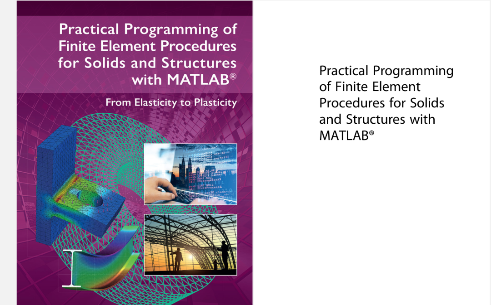

在他大标题下面的副标题成功引起了我的注意：**From Elasticity to Plasticity**。

众所众知，对于有限元非线性数值编程的精品教材少之又少，可参考性其实并没有线弹性的多。

对于弹塑性分析这一块，最早是借助于Abaqus的UMAT子程序接口实现了代码编制，算是初步了解了一些弹塑性分析过程中的数值要点，但是自己的有限元程序中还没有加入弹塑性分析模块，因为还掌握的不熟练，不能直接移植到整套的有限元程序中。

今天看到这本书时，初次被标题吸引，然后饶有兴致的点击download按钮~

不看不知道，一看吓一跳，我们且看一下他的目录：

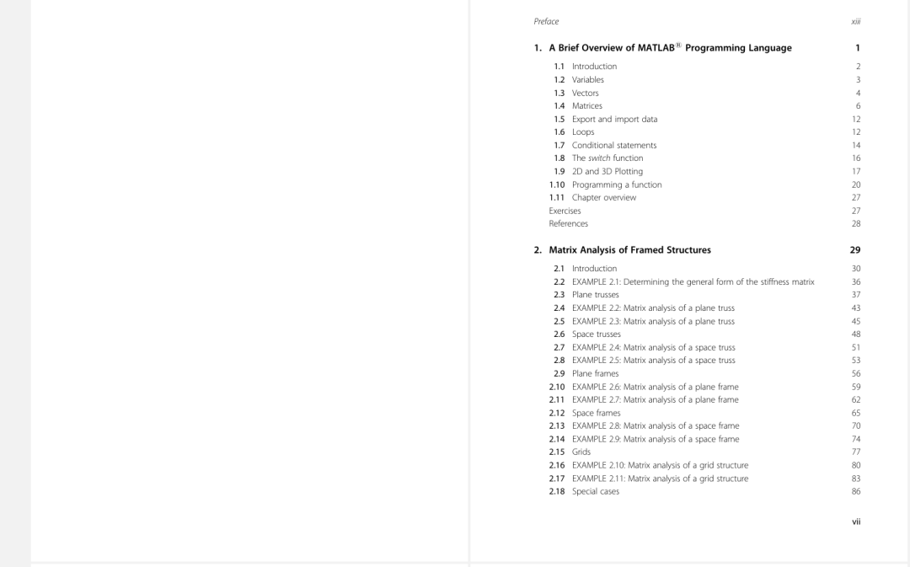

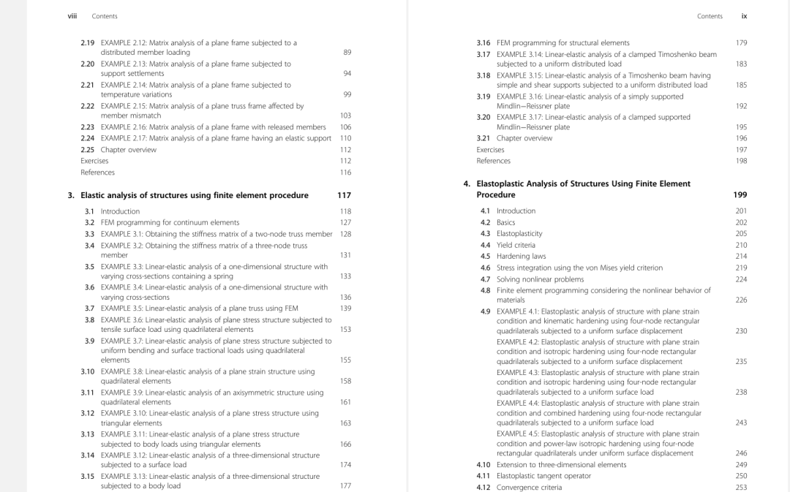

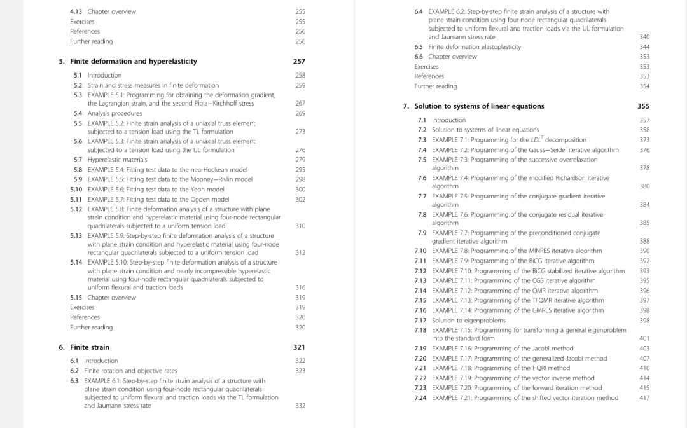

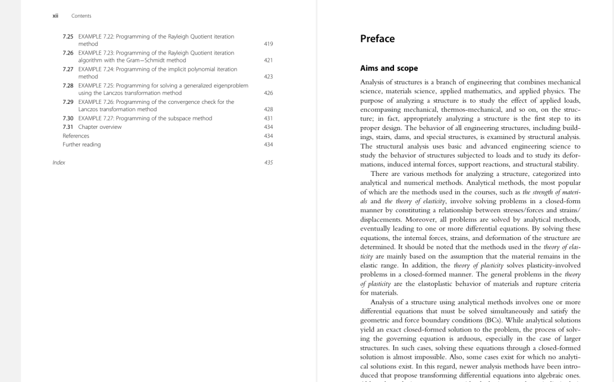

这几乎是例题的堆砌啊！对于我们在学习数值编程过程中，很重要的一个环节就是：找案例练！这本书提供了太多的案例供我们去run code，并且也是彩图的形式呈现，以各项同性硬化弹塑性模型为例：

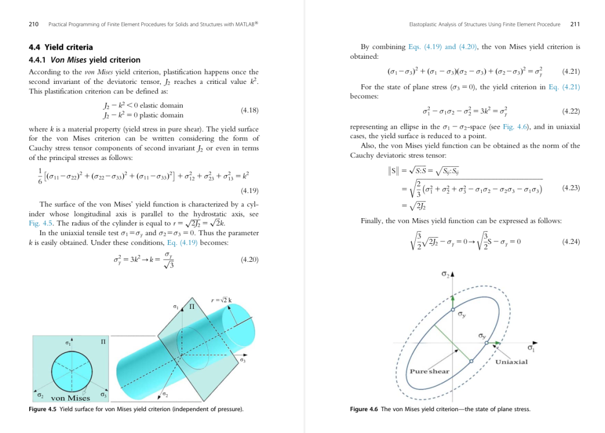

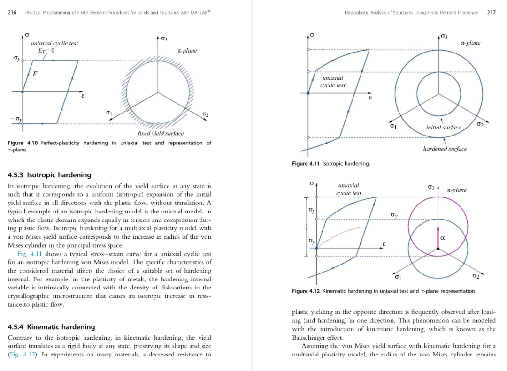

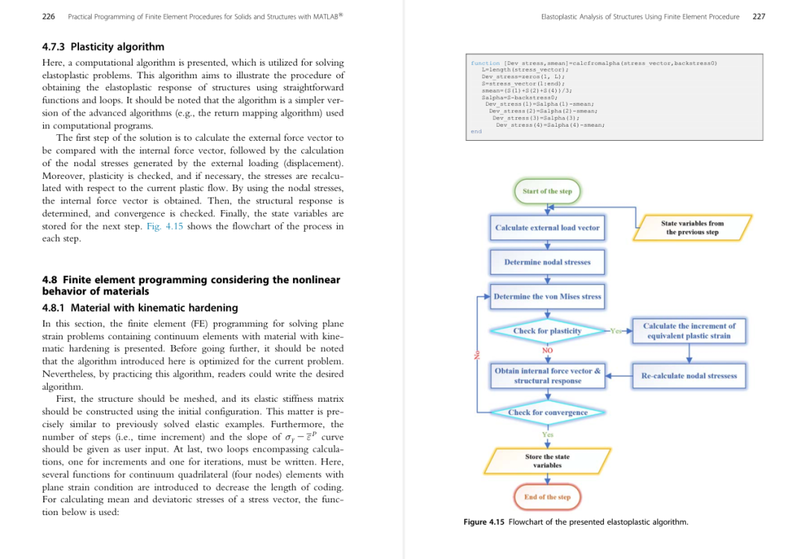

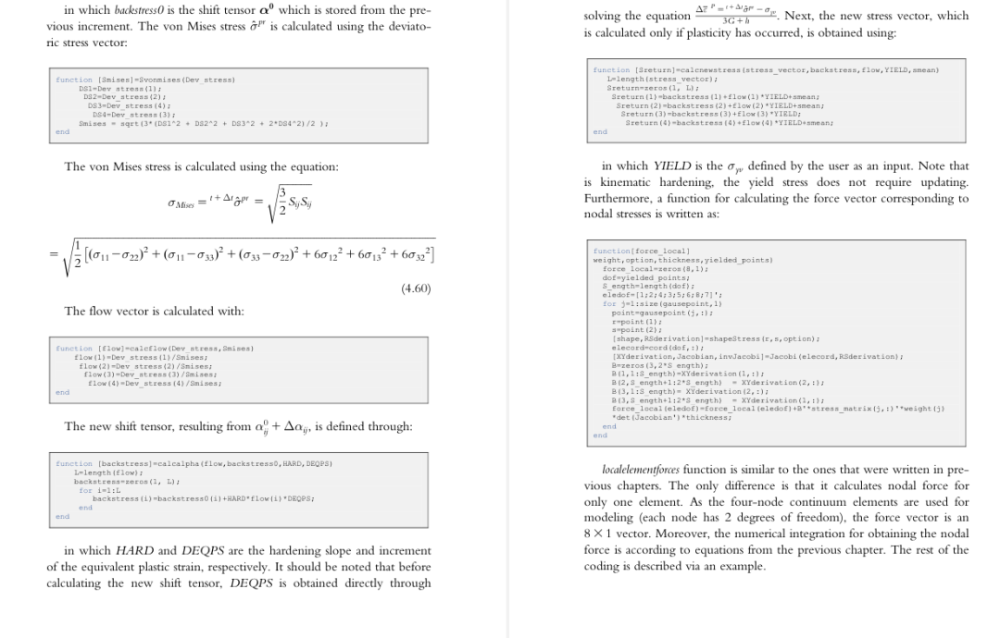

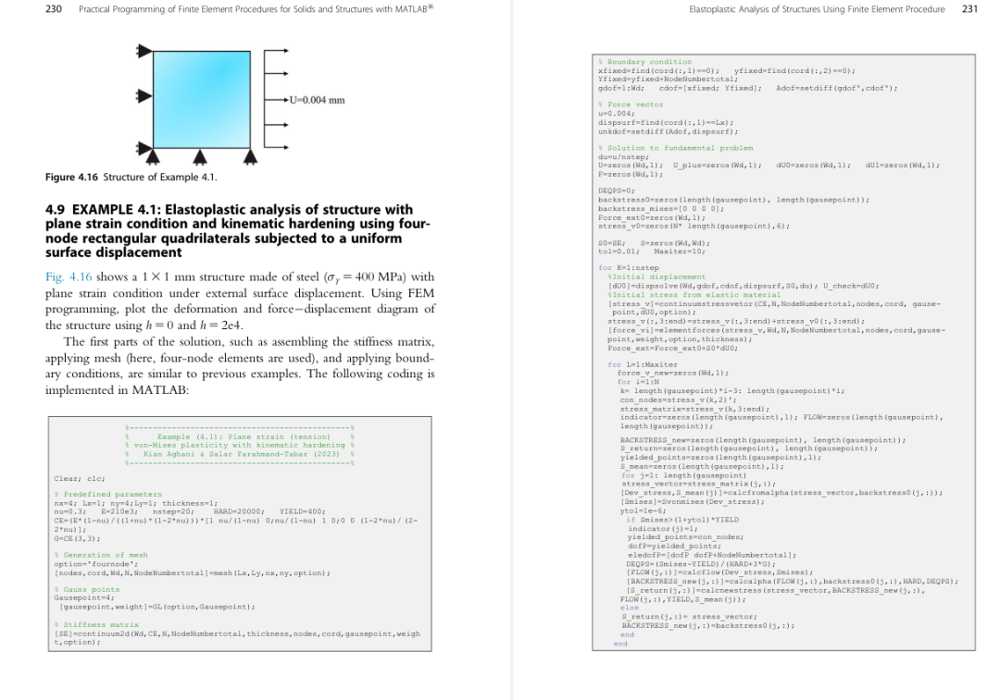

这样的排版怎能让人不爱！而且放一些代码涉及的理论，然后直接上代码段，不做过多阐述，反观国内某些教材，冗长的理论推导占据过多篇幅，最后把读者也绕进去了！然后数值也实现不了，空有理论在身。

木木在空余时间会时不时阅读学习这本精品书籍，当然也会撰写相关的读书心得，分享有限元数值编程实现过程。

最后，想要获取该书的电子版的小伙伴，可以在后台发送：`Matlab有限元SALAR`即可自动获取。

**注意**：在发送关键词的时候，建议直接复制关键词，然后发送至后台，不要漏掉关键词信息，与关键词不对应的话，系统是不会发送相应链接的哦~

* * *

觉得本篇推文对你有帮助的话，可以动动的小手一键三连（点赞➕在看➕分享）哦~

木木自研的有限元APP，分别基于**MAtlab-Appdesigner**和**Pyqt**，整套源代码欢迎下载学习：

[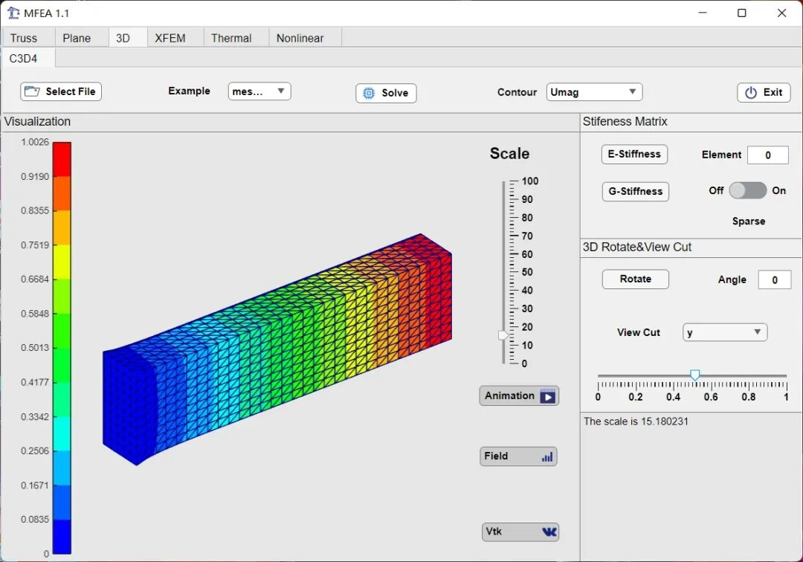](http://mp.weixin.qq.com/s?__biz=Mzk0ODQzOTg2NQ==&mid=2247493289&idx=1&sn=15a7f072d549c9df13a5622e2ddbe6bd&chksm=c36538fff412b1e9e0c429a8155a4029f2d228753521eb3d0e7d6ffff99058f54406434e082d&scene=21#wechat_redirect)  

**[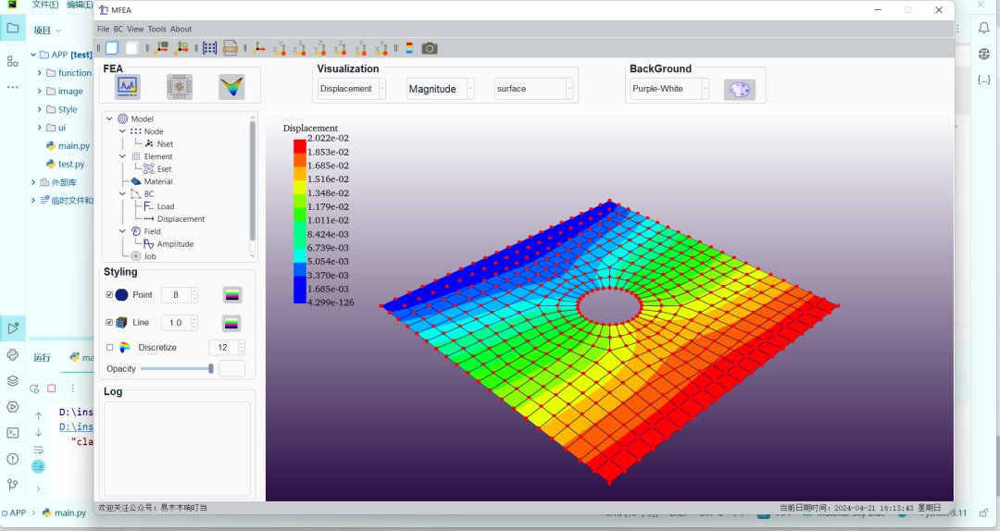](http://mp.weixin.qq.com/s?__biz=Mzk0ODQzOTg2NQ==&mid=2247493950&idx=1&sn=83b37d1bb13feca757fb7975d42959ae&chksm=c3653768f412be7e82e9bdd97fca54dff3dcabe15a387843a0c84f71b226be5d780c5534241d&scene=21#wechat_redirect)  
**

**[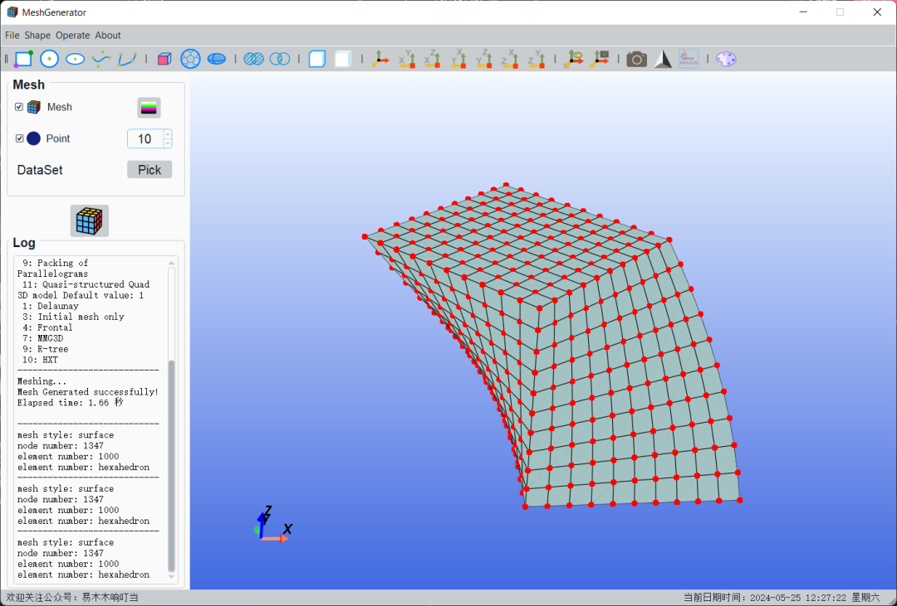](http://mp.weixin.qq.com/s?__biz=Mzk0ODQzOTg2NQ==&mid=2247494334&idx=1&sn=ea1cce9626272d1837e9fd7748947a90&chksm=c36534e8f412bdfe7492d1ec5d2b33ad69c67f17b6dbd3ce3662cd28b255f8aa9a2a25310155&scene=21#wechat_redirect)  
**

**粉丝交流群**：后台回复**stress**。

* * *

**参与更多互动交流，快快在下方留言区留下你的小脚印吧~**

_**\-End-**_

♡若喜欢这篇文章，欢迎带它去朋友圈逛♡

_易木木响叮当_

_想陪你一起度过短暂且漫长的科研生活_

微信公众号

知识星球