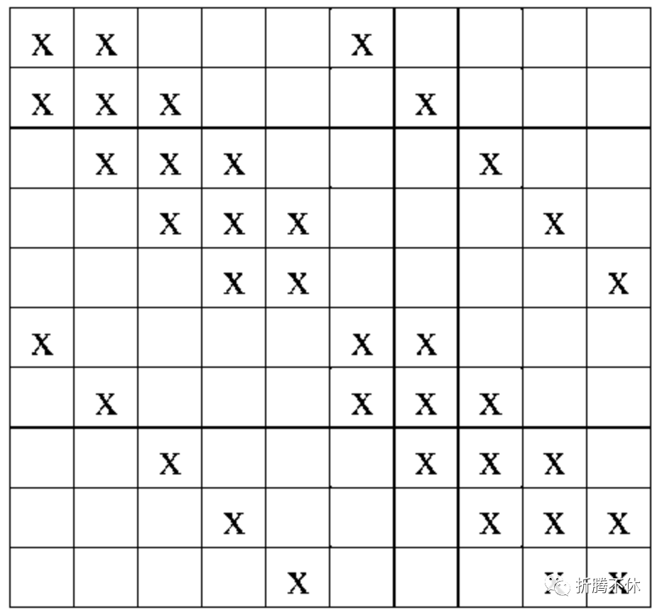
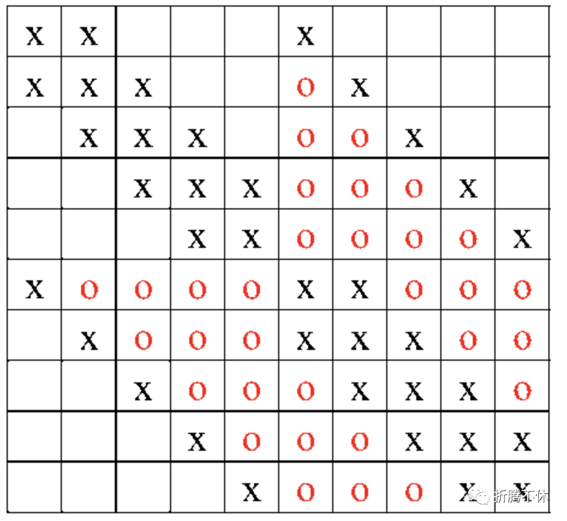
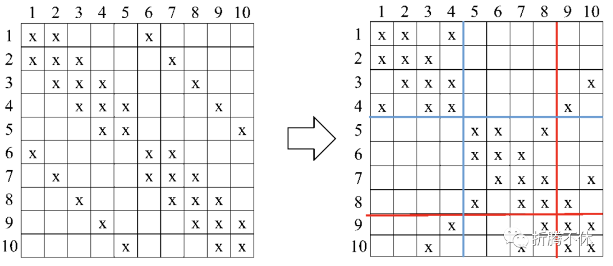
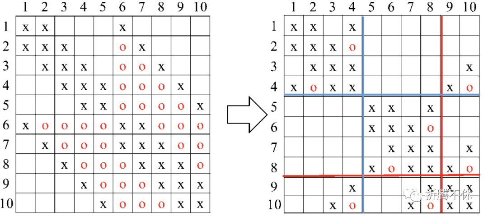
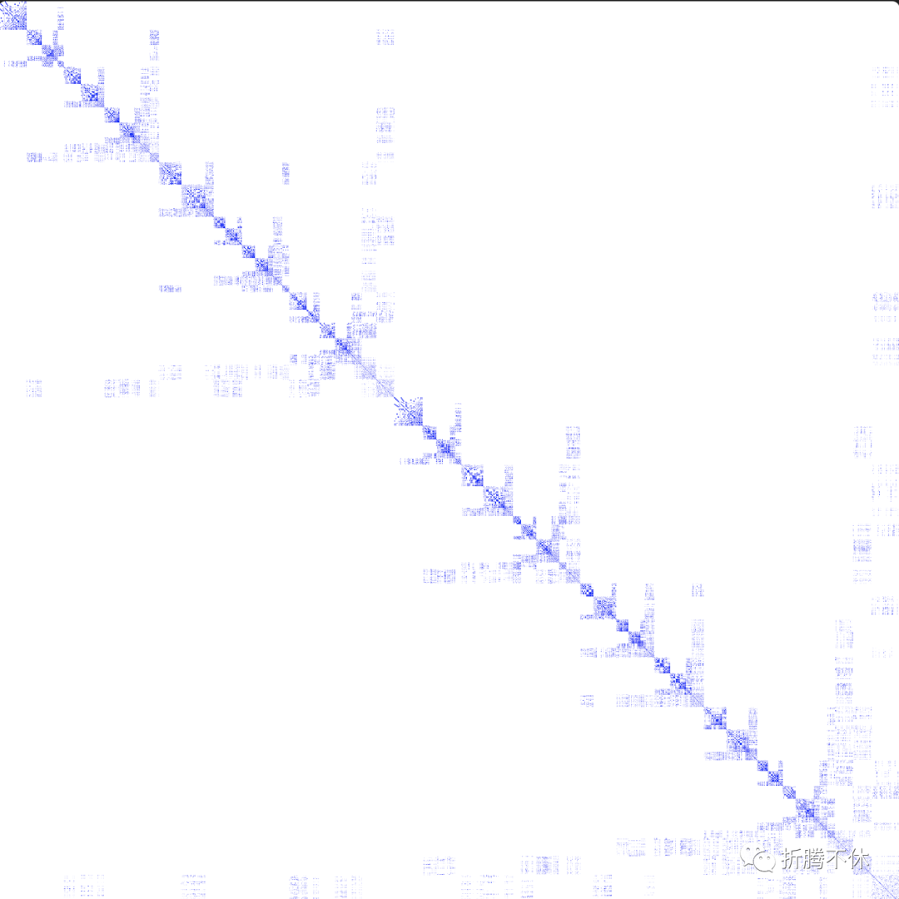

# metis图分解在稀疏矩阵中的使用


> 原文地址: [https://mp.weixin.qq.com/s/ehMIswXn7PqKG2l\_GwWJ8w](https://mp.weixin.qq.com/s/ehMIswXn7PqKG2l_GwWJ8w)

# metis 简单的使用

> `metis`\[1\] 是根据非结构图找到最优的分区算法，被广泛的应用在各个科学领域。其中包括稀疏矩阵线性方程求解、计算流体力学等应用。

本文主要描述在稀疏矩阵线性方程求解，同时介绍一下对应的API接口的使用。

## 稀疏矩阵线性方程求解

> 科学计算中大部分问题都会转换成稀疏矩阵的线性方程组求解 `Ax=b`，其中线性方程组求解包括直接法和迭代法。由于直接法精度高，算法鲁棒性强，被工业级广泛的采用。目前迭代法也在高速的发展。`metis` 在直接法和迭代法都有相应的应用，直接法主要是在符号分解中使用，减少填充元。迭代法主要是为了对矩阵重排序并行过程中负载均衡使用。下面简单介绍一下直接法，迭代法之后有机会详细说。

### 直接法

> 目前主流的直接法求解器包括：

•MUMPS\[2\]•superLU\[3\]•suitesparse\[4\]•PARDISO\[5\]•intel ONEMKL PARDISO\[6\]

其中`MUMPS`,`superLU`,`suitesparse`都能在对应的网站上找到源代码。并且他们的代码中都调用了`metis`进行矩阵重排序。

直接法是将`A`矩阵分解为 `A=LU` 其中`L`是对角元素都为1的下三角矩阵，`U`为上三角矩阵。 下面简单描述一下metis是如何作用在稀疏矩阵中的。具体可参考链接\[7\]

假设原始矩阵是`10*10`的稀疏矩阵，如下图所示,如何将其进行分解(当稀疏矩阵是对称正定时，LU分解可以变成L^TL分解)之后会变成为第二张图的样子，其中红色区域为填充元。



稀疏矩阵



分解之后的稀疏矩阵

可以明显发现LU分解之后填充到稀疏矩阵位置的非零元变多了。这样会增多内存的使用。 但是当我们把最开始的稀疏矩阵的某些行列进行交换位置，此时填充元会明显变少。这个过程叫做重排序，可以通过`metis`进行实现。



重排序后的矩阵对比图



重排序后的矩阵分解对比图

  

> 下面给出程序调用metis的代码示例。传入metis的矩阵格式为CSR格式的矩阵即可。

```
#include <metis.h>
```

给一个工程实际矩阵的分区效果。


重排序前



重拍序后

  

可以明显看到重拍序后非零元要集中一些。

# 参考链接

1.metis 官方的帮助文档\[8\]2.稀疏矩阵的分解和图(1)\[9\]

### References

`[1]` `metis`: _https://github.com/KarypisLab/METIS_  
`[2]` MUMPS: _http://mumps-solver.org/index.php?page=home_  
`[3]` superLU: _https://portal.nersc.gov/project/sparse/superlu/_  
`[4]` suitesparse: _https://github.com/DrTimothyAldenDavis/SuiteSparse_  
`[5]` PARDISO: _http://www.pardiso-project.org_  
`[6]` intel ONEMKL PARDISO: _https://www.intel.com/content/www/us/en/docs/onemkl/developer-reference-c/2023-0/onemkl-pardiso-parallel-direct-sparse-solver-iface.html_  
`[7]` 参考链接: _https://zhuanlan.zhihu.com/p/36033612_  
`[8]` metis 官方的帮助文档: _https://github.com/KarypisLab/METIS/blob/master/manual/manual.pdf_  
`[9]` 稀疏矩阵的分解和图(1): _https://zhuanlan.zhihu.com/p/36033612_