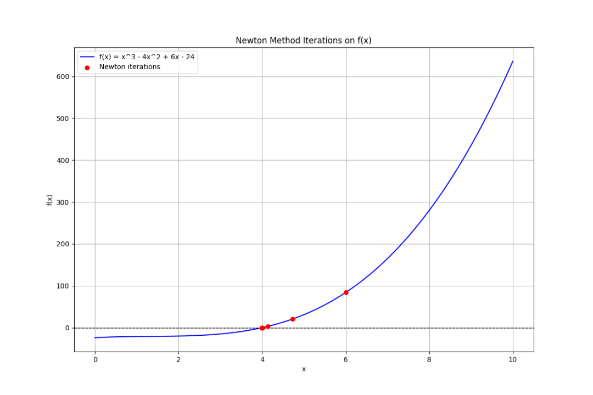
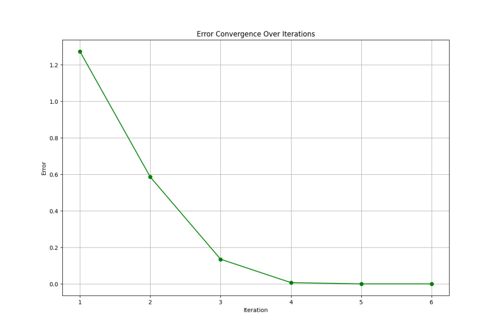
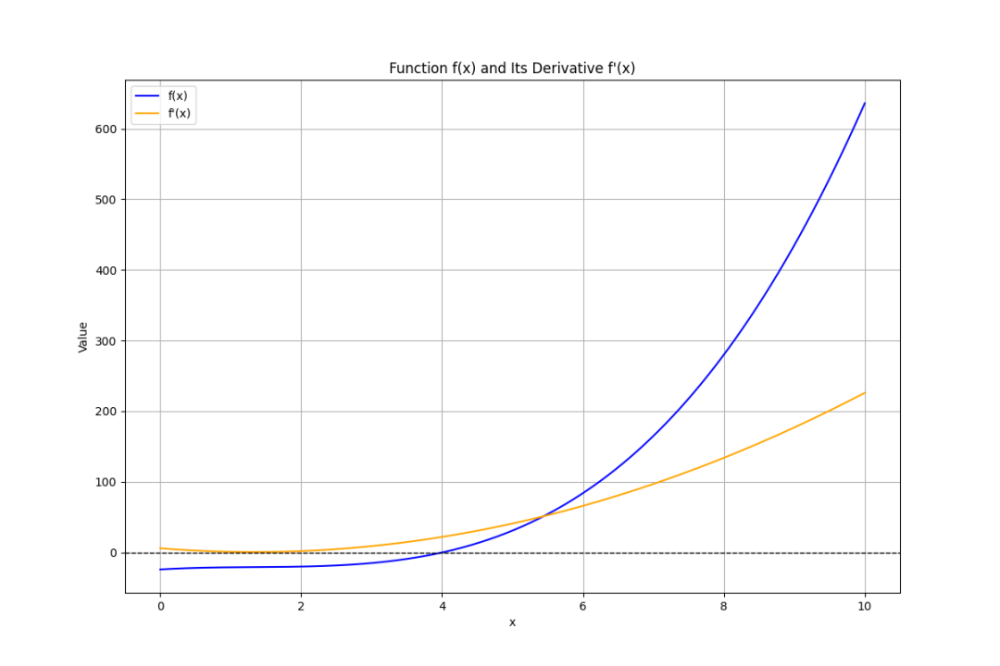
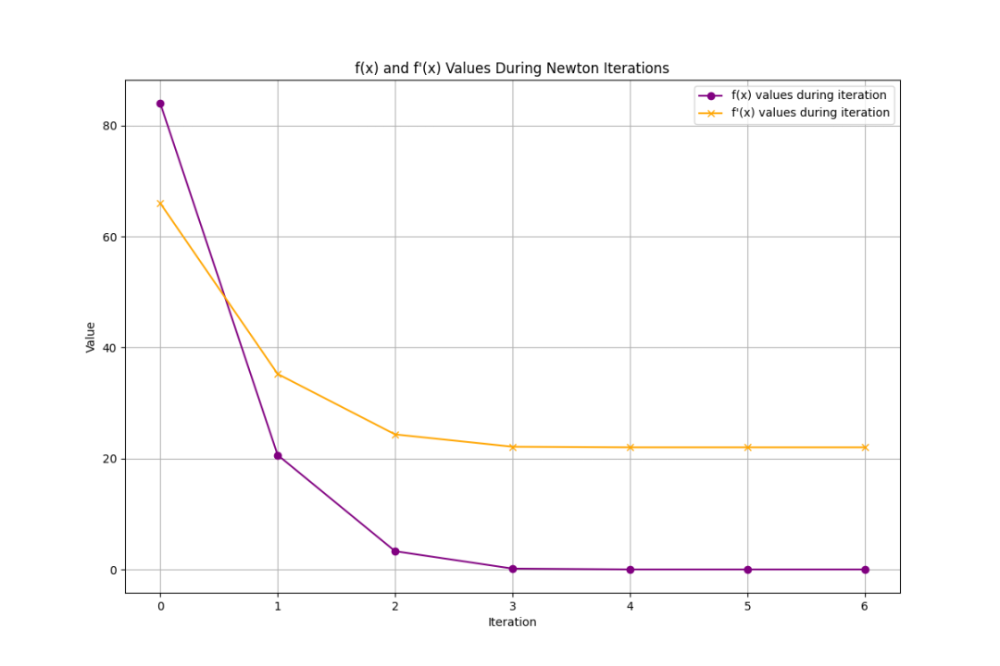

# 一个强大优化算法模型，牛顿法！！

> 原文地址: [https://mp.weixin.qq.com/s/j0tq9wrlh5TK9j3\_bgkJXQ](https://mp.weixin.qq.com/s/j0tq9wrlh5TK9j3_bgkJXQ)

大家好，今儿来聊聊**牛顿法**~  

牛顿法是一种用来**快速找到函数零点（也就是函数值为 0 的点）**的迭代算法。

简单来说，它帮助我们通过不断逼近，找到方程的解。

### 什么是牛顿法？

首先，牛顿法是用来解方程的，比如你想找到一个函数  的解（即 x 值）。牛顿法使用函数的**导数**来找到这个解。

**导数是什么呢？**你可以把它想象成函数在某一点的“斜率”或“倾斜度”。假设我们在某个点  知道函数的值  和导数 （这就是斜率），牛顿法的核心思想是：**在当前点，用一条线代替原函数，看看这条线在什么位置和 x 轴相交**。

牛顿法的公式可以表示为：

这个公式告诉我们：从  这个点开始，沿着导数的方向往下走，计算新的 ，并且逐步逼近方程的解。

### 举个例子

假设我们有一个简单的函数 ，我们想找到它的零点，也就是找到  的解。我们知道解应该是 ，但我们用牛顿法来一步步算出这个解。

1.  设初始点 。
    
2.  计算函数的值：。
    
3.  计算导数：。
    
4.  根据牛顿法公式，更新下一个点：
    

这时，新的  更接近 。

5.  我们继续使用同样的方法：
    

-   计算新的函数值 
    
-   计算新的导数 
    
-   更新下一次的近似值 
    

经过几次迭代，你会发现  的值越来越接近 ，这就是  的近似值。

### 牛顿法的优缺点

-   **优点**：收敛速度快！也就是说，它找到解的速度通常比其他方法更快。
    
-   **缺点**：需要计算导数。如果导数不好算，或者起始点选得不好，牛顿法可能不工作。
    

牛顿法通过使用函数当前点的导数信息，快速找到函数的零点。它就像是在不断调整瞄准目标的角度，逐渐逼近目标。

## 详细原理

### 牛顿法的公式推导

牛顿法的推导基于泰勒级数的近似。设函数  在某个点  可导且连续，利用泰勒展开公式，我们可以近似表示  在  附近的值：

为了找到  的零点，我们令：

解方程得到：

这就是牛顿法迭代公式：

### 虚拟数据集与案例设计

假设我们有一个复杂的非线性函数，例如：

我们希望使用牛顿法找到该函数的零点，同时生成数据分析的图形。

## 完整案例

#### 1\. 牛顿法实现

我们将编写代码使用牛顿法找到函数的零点，同时绘制四种图形，解释牛顿法的过程。

`import numpy as np   import matplotlib.pyplot as plt      # 定义函数和导数   def f(x):       return x**3 - 4*x**2 + 6*x - 24      def f_prime(x):       return 3*x**2 - 8*x + 6      # 牛顿法实现   def newton_method(x0, tol=1e-6, max_iter=100):       x_values = [x0]  # 存储每次迭代的 x 值       iter_count = 0       while iter_count < max_iter:           f_x = f(x0)           f_prime_x = f_prime(x0)           x1 = x0 - f_x / f_prime_x           x_values.append(x1)           if abs(x1 - x0) < tol:  # 当差值小于设定的精度时停止               break           x0 = x1           iter_count += 1       return x_values, iter_count      # 生成迭代数据   x0 = 6  # 初始猜测点   x_values, iterations = newton_method(x0)      # 虚拟数据集   x = np.linspace(0, 10, 400)   y = f(x)      # 图像 1：函数 f(x) 的曲线与迭代过程   plt.figure(figsize=(12, 8))   plt.plot(x, y, label='f(x) = x^3 - 4x^2 + 6x - 24', color='blue')   plt.axhline(0, color='black', linestyle='--', lw=1)   plt.scatter(x_values, [f(xi) for xi in x_values], color='red', label='Newton iterations', zorder=5)   plt.title('Newton Method Iterations on f(x)')   plt.xlabel('x')   plt.ylabel('f(x)')   plt.legend()   plt.grid(True)   plt.show()      # 图像 2：每次迭代的误差收敛情况   errors = [abs(x_values[i+1] - x_values[i]) for i in range(len(x_values)-1)]   plt.figure(figsize=(12, 8))   plt.plot(range(1, len(errors)+1), errors, marker='o', color='green')   plt.title('Error Convergence Over Iterations')   plt.xlabel('Iteration')   plt.ylabel('Error')   plt.grid(True)   plt.show()      # 图像 3：函数 f(x) 和导数 f'(x) 的曲线   f_prime_y = f_prime(x)   plt.figure(figsize=(12, 8))   plt.plot(x, y, label='f(x)', color='blue')   plt.plot(x, f_prime_y, label="f'(x)", color='orange')   plt.axhline(0, color='black', linestyle='--', lw=1)   plt.title("Function f(x) and Its Derivative f'(x)")   plt.xlabel('x')   plt.ylabel('Value')   plt.legend()   plt.grid(True)   plt.show()      # 图像 4：函数值和导数值随迭代变化的关系   f_values = [f(xi) for xi in x_values]   f_prime_values = [f_prime(xi) for xi in x_values]      plt.figure(figsize=(12, 8))   plt.plot(range(len(f_values)), f_values, marker='o', label='f(x) values during iteration', color='purple')   plt.plot(range(len(f_prime_values)), f_prime_values, marker='x', label="f'(x) values during iteration", color='orange')   plt.title('f(x) and f\'(x) Values During Newton Iterations')   plt.xlabel('Iteration')   plt.ylabel('Value')   plt.legend()   plt.grid(True)   plt.show()   `

#### 1\. 图像 1：函数曲线与牛顿法迭代过程

-   **目的**：显示函数  的曲线，同时标注牛顿法每次迭代的点。
    
-   **解释**：红色点表示每次迭代的  值，观察这些点逐渐向零点靠近。
    

#### 2\. 图像 2：迭代过程中的误差收敛情况

-   **目的**：展示每次迭代的误差如何逐渐缩小。
    
-   **解释**：随着迭代次数增加，误差不断减小，最终收敛到一个很小的值。
    

#### 3\. 图像 3：函数和导数曲线

-   **目的**：对比函数  和它的导数 。
    
-   **解释**：导数曲线的变化帮助我们理解牛顿法是如何根据导数调整迭代点的。
    

#### 4\. 图像 4：函数值与导数值随迭代变化

-   **目的**：跟踪每次迭代过程中函数值和导数值的变化。
    
-   **解释**：通过比较函数值和导数值，我们可以直观地理解牛顿法是如何不断优化解的。
    

案例中，通过虚拟数据集和牛顿法的应用，我们不仅演示了求解非线性方程的过程，还通过多种数据分析图形解释了迭代过程的收敛特性和方法背后的数学逻辑。