# 一文带你认识仿真计算中的各种网格

> 原文地址: [https://mp.weixin.qq.com/s/AU6qUyUMbFbEZK3kzDJj3A](https://mp.weixin.qq.com/s/AU6qUyUMbFbEZK3kzDJj3A)

在现代科学与工程领域，仿真技术已成为研究和解决复杂问题的重要工具。无论是在流体、结构、热分析还是电磁场分析中，仿真都可以对模型进行有效地预测和优化。然而，仿真结果的精度和可靠性在很大程度上取决于模型的离散化过程，也就是网格，网格是所有仿真软件的基础。网格作为计算域的离散化表示，不仅直接影响着仿真计算的精度和效率，还决定了求解过程中的稳定性和收敛性。在进行一个仿真计算时，网格划分或网格生成通常占据了前处理大约 50% 的时间，这也是仿真必不可少的步骤。因此我们需要对网格有一定的了解。

从维度上来说，有二维网格(2D)和三维网格(3D)。其中二维网格一般有三角形网格、四边形网格和多边形网格，三维网格一般有四面体网格、六面体网格、棱柱网格和金字塔网格。其中四面体网格(3D)每一个面是一个三角形网格(2D)，六面体网格(3D)的每一个面是四边形网格(2D)。

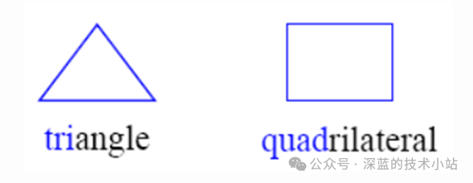

二维网格(2D)

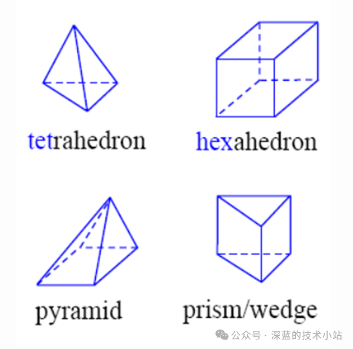

三维网格(3D)

常见的网格可以被分为下面几个类型：

笛卡尔网格；

结构化网格；

非结构化网格；

混合网格；

下面我们来一一介绍这些网格类型。

笛卡尔网格

  

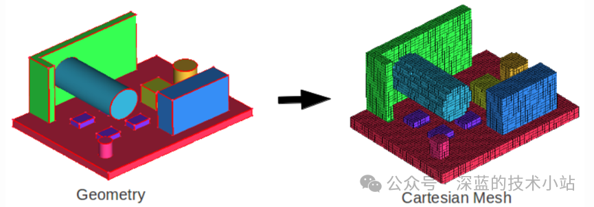

使用笛卡尔网格意味着我们将用来填充模型区域的离散单元都沿着正交轴对齐，即沿着x，y和z轴对齐。这种类型的网格使用了矩形/立方体，是最简单的网格形式。这种网格难以精确描述模型的几何形状，得到的仿真结果精度低，因此使用不多，通常用于非常简单的几何模型。

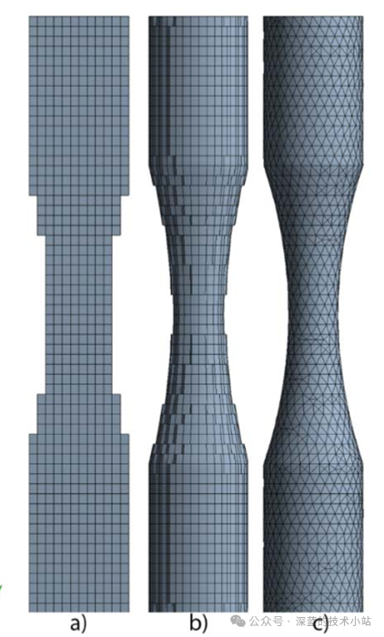

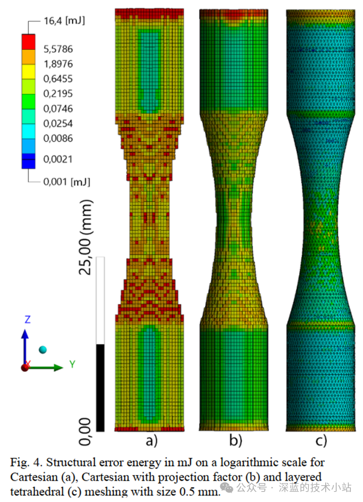

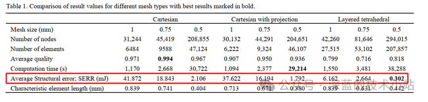

从上表中可以看出，笛卡尔网格精度较低

笛卡尔网格划分的方法一般是首先读入模型，在模型区域划分背景网格，然后再去除模型以外的背景网格，最终得到模型的网格。

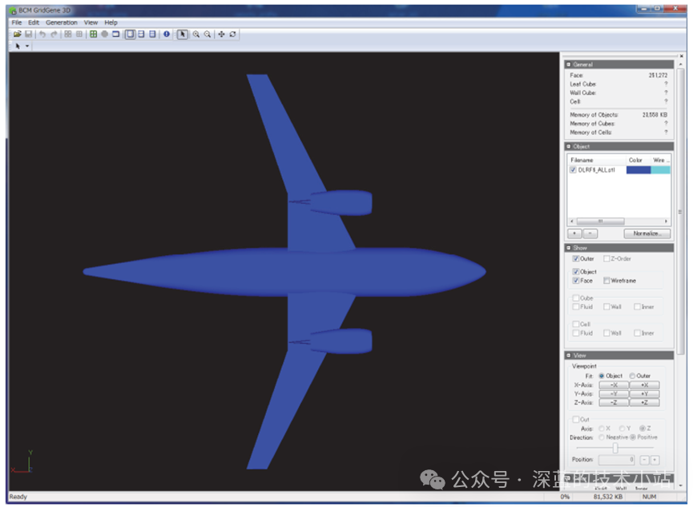

读入模型

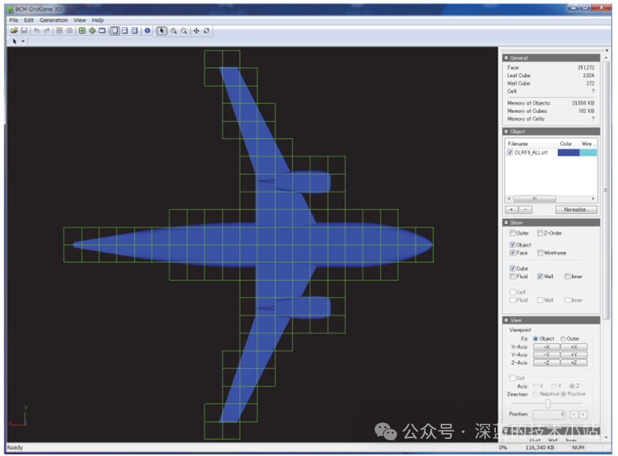

识别区域，生成背景网格

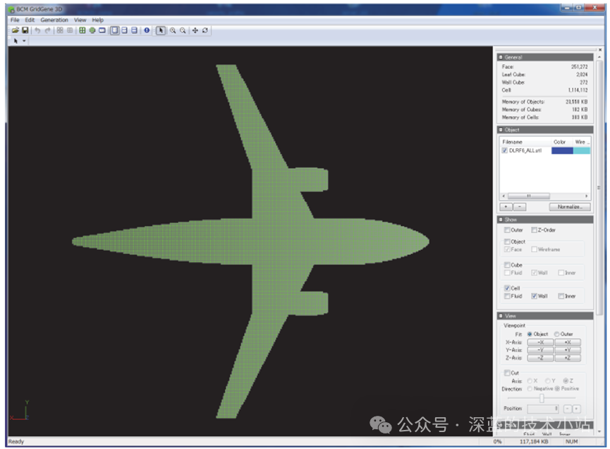

去除模型区域之外的背景网格

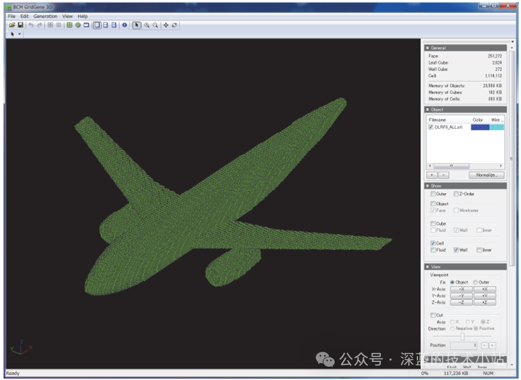

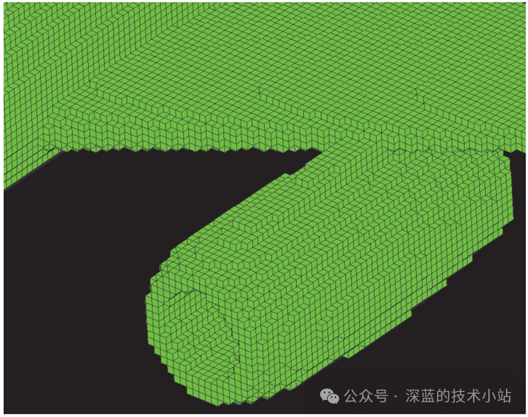

最终生成的笛卡尔网格

结构化网格

在结构化网格中，网格以特定方式对齐排列。其网格元素(节点、单元)之间的连接关系遵循一定的规则。在二维问题中，结构化网格通常是矩形或方形单元，而在三维问题中，结构化网格通常是立方体或长方体单元。

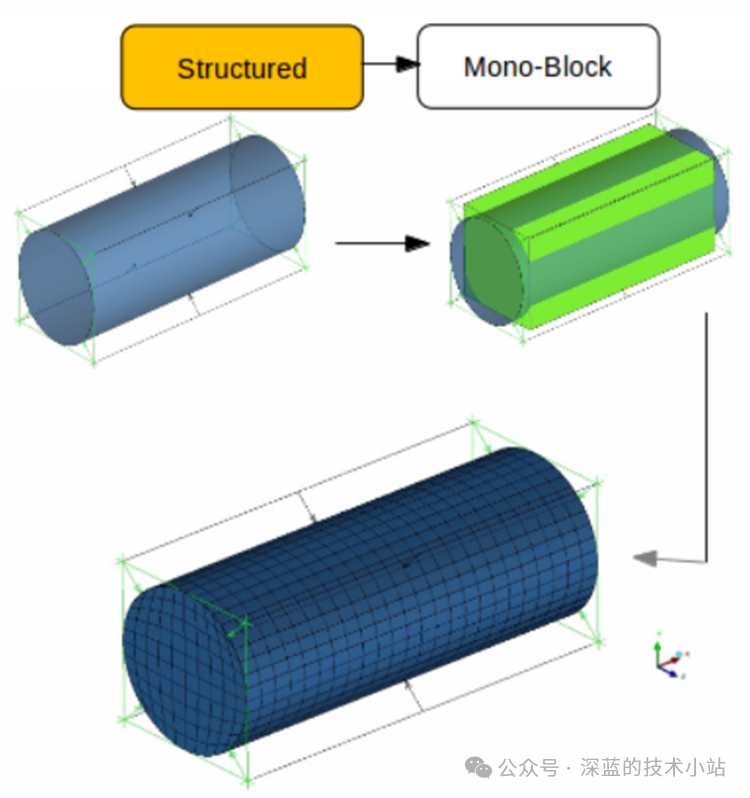

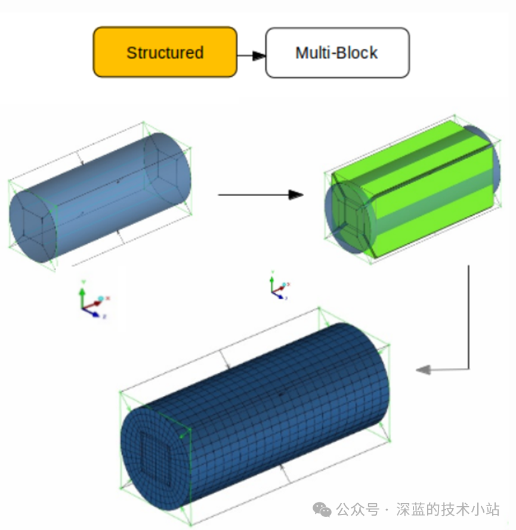

结构化网格的生成方法依赖于几何模型的形状和特性，常见的生成方法包括规则划分法、投影法、分块法、映射法和边界层法等。对于简单几何形状，网格生成较为直接，而对于复杂形状，则需要通过映射或分块等方法来转换和划分网格。

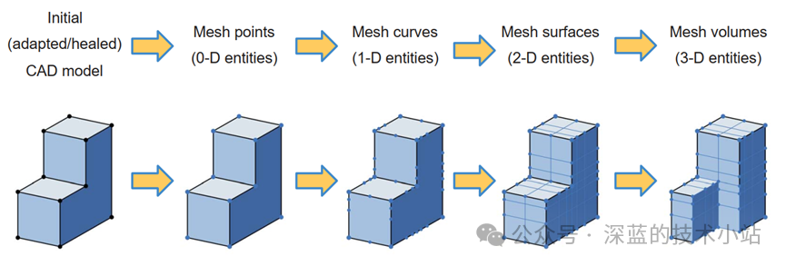

结构化网格划分过程

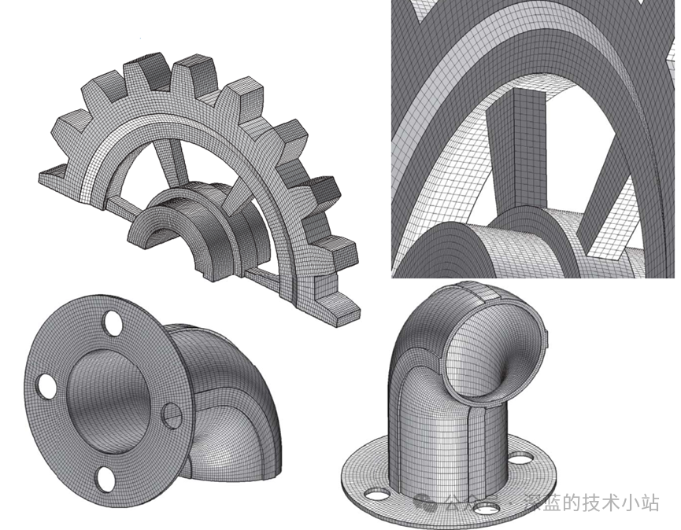

结构化网格计算效率高、拓扑关系简单、易于优化和控制，适用于规则几何形状和大规模计算。然而，它的缺点是对复杂几何形状适应性差，难以处理复杂边界、局部细节，且在处理复杂问题时网格划分可能非常困难。总的来说，结构化网格适用于简单、规则的工程问题，但面对复杂几何和高精度要求时，可能需要考虑其他网格类型。

非结构化网格

**非结构化网格**的网格单元之间没有固定的规则排列，网格元素的连接关系非常灵活，适用于复杂和不规则的几何形状。非结构化网格可以使用不同形状的网格单元（如三角形、四面体、棱柱体等）来适应复杂的计算域，具有很高的适应性和灵活性。

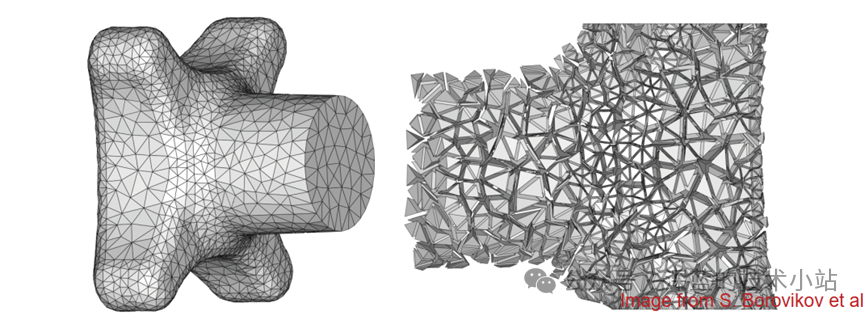

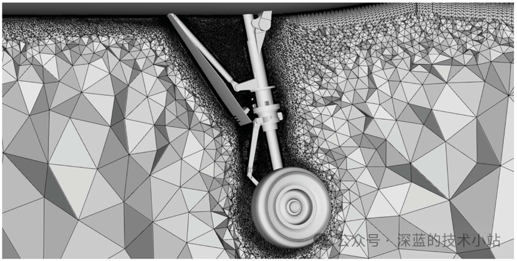

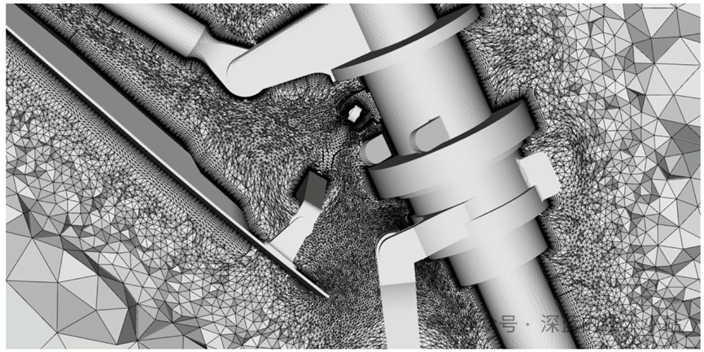

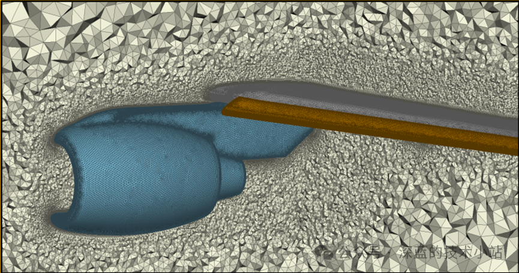

总的来说，非结构化网格具有很高的灵活性，能够适应复杂的几何形状和局部细化需求，广泛应用于流体力学、结构分析等领域。然而，非结构网格算法复杂，计算效率不如结构化网格，存储开销较高。常见的划分方法包括Delaunay三角剖分、Voronoi剖分等方法。

混合网格

**混合网格**结合了结构化网格和非结构化网格的优点。在混合网格中，计算域的不同区域可以使用不同类型的网格单元，通常在规则区域使用结构化网格，而在复杂或不规则区域使用非结构化网格。这种方法旨在优化计算效率和网格适应性。

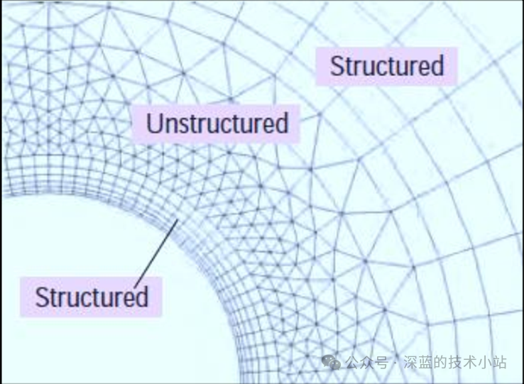

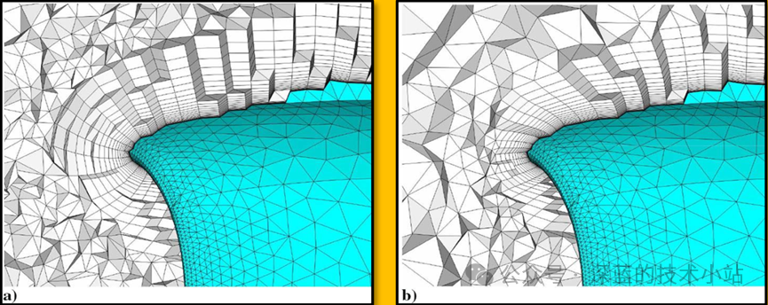

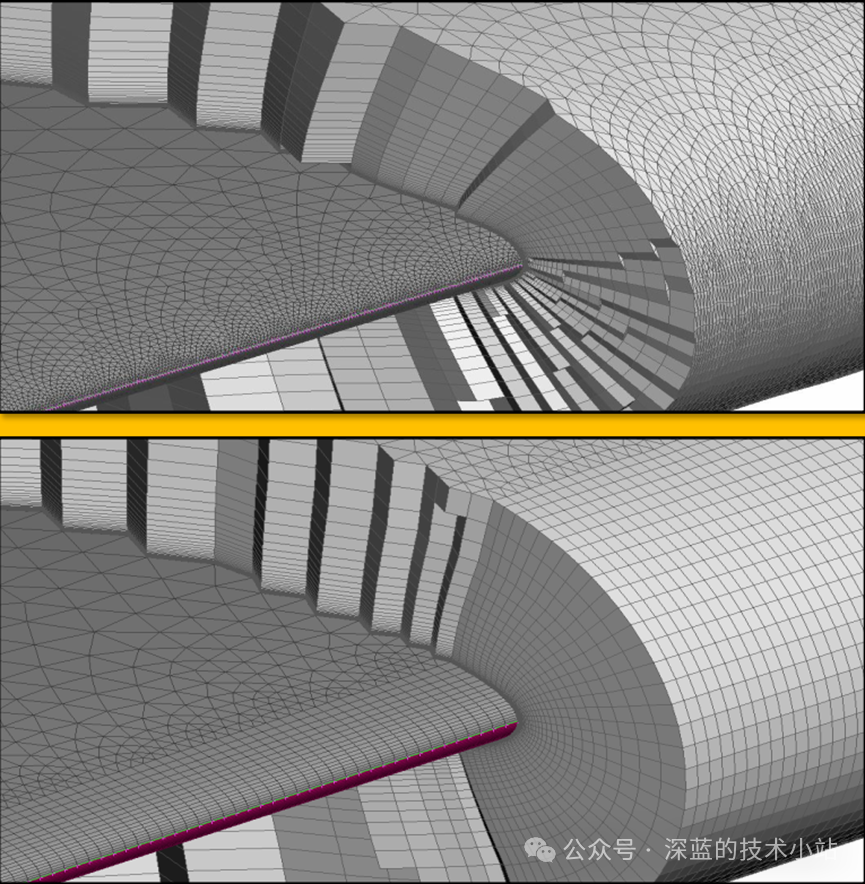

混合网格通过结合结构化网格和非结构化网格的优势，在处理复杂几何形状时灵活性较高，但网格生成过程较为复杂，且在计算效率和求解器兼容性方面可能存在一定的挑战。

网格类型的分类标准很多，难以一一列举。比如对于六面体网格完全属于结构化网格还是部分属于结构化网格的争论。本文是笔者对于网格的一些理解和经验，不一定正确。在实际应用中，我想过于纠结于网格具体属于哪种类型并不重要，关键是能够理解不同网格形态的优缺点，并根据具体问题的需求选择最合适的网格类型。