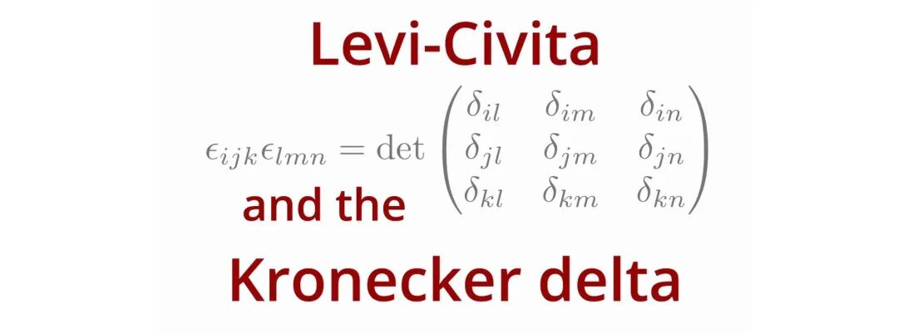
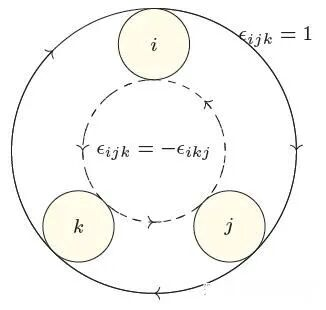

# 一文读懂：Kronecker Delta 与 Levi-Civita 符号的定义、性质与应用

> 原文地址: [https://mp.weixin.qq.com/s/5MGty4NQEDH25J\_Hpg0pig](https://mp.weixin.qq.com/s/5MGty4NQEDH25J_Hpg0pig)

在数学和物理学的许多领域中，**Kronecker Delta**（克罗内克符号）和**Levi-Civita符号**（置换符号）是两个基础而重要的工具。它们不仅用于描述向量、张量和矩阵的运算，还在微分几何、量子力学、流体力学等领域中发挥着核心作用。本文将详细探讨这两个符号的定义、性质及其在实际问题中的应用，并通过具体示例说明它们的数学意义和物理意义。

## 一、Kronecker Delta符号

### 1.1 定义

Kronecker Delta符号（记作 ）是一个二元函数，其定义如下：

当当

其中， 和  是整数指标（通常取值为 ，对应三维空间中的坐标方向）。Kronecker Delta符号的本质是一个**单位矩阵**，其矩阵形式为：

从几何角度来看， 可以表示正交基向量  与  的点积：

当  时，基向量正交且单位长度，点积为1；当  时，基向量正交，点积为0。这种性质使得  在向量运算中成为筛选器，能够提取特定分量。

### 1.2 性质

Kronecker Delta符号具有以下关键性质：

1.  **对称性**：，即符号对指标交换对称。
    
2.  **筛选性**： 对于任意向量 ，有：
    
    这一性质表明， 可以从向量  中提取第  个分量。
    
3.  **与矩阵乘法的关系**： 若  是一个矩阵，则：
    
    即通过  可以实现矩阵的行变换。
    
4.  **收缩性**： 当两个 Kronecker Delta 符号相乘时，若存在相同指标，会引发求和：
    
    这一性质在张量运算中非常有用。
    

### 1.3 应用示例

#### 1.3.1 向量点积的推导

设两个向量  和 ，其点积为：

这里利用了  的筛选性，将所有非对角项（）的贡献筛除，仅保留对角项（）。

#### 1.3.2 矩阵迹的计算

矩阵  的迹（trace）定义为其对角线元素之和：

通过 Kronecker Delta 符号，可以将迹的求和过程简化为张量收缩。

## 二、Levi-Civita符号

### 2.1 定义

Levi-Civita符号（记作 ）是一个三阶反对称张量，其定义如下：

当是的循环排列当是的反循环排列当存在重复指标

具体来说，循环排列包括 、、，而反循环排列包括 、、。例如：

-   （标准循环）
    
-   （反循环）
    
-   （重复指标）
    

Levi-Civita符号的几何意义与三维空间中的**定向**相关。它能够描述向量叉积的符号和方向，因此在处理旋转、角动量等问题时至关重要。

### 2.2 性质

Levi-Civita符号具有以下关键性质：

1.  **反对称性**： 任意交换两个指标，符号变号：
    
2.  **全反对称性**： 若任意两个指标相同，符号为0：
    
    等等
    
3.  **与Kronecker Delta的关系**： 在三维空间中，Levi-Civita符号与 Kronecker Delta 符号的乘积可以通过行列式展开：
    
    进一步简化为：
    
4.  **收缩公式**： 当两个 Levi-Civita 符号的部分指标重合时，其乘积可以简化为 Kronecker Delta 的组合。例如：
    
    这一公式在计算双重向量叉积时非常有用。
    

### 2.3 应用示例

#### 2.3.1 向量叉积的展开

设两个向量  和 ，其叉积定义为：

以  为例，计算其分量：

这与叉积的行列式形式一致：

#### 2.3.2 行列式的计算

三维矩阵  的行列式可以表示为：

这一表达式利用了 Levi-Civita 符号的全反对称性，能够自动筛选出所有排列组合的贡献。

#### 2.3.3 叉积模长的平方

叉积的模长平方可以通过以下公式计算：

利用 Levi-Civita 与 Kronecker Delta 的关系，可以进一步简化为：

这表明叉积的模长平方等于向量模长的乘积减去点积的平方。

## 三、综合应用

### 3.1 标量三重积的证明

标量三重积的恒等式为：

利用 Levi-Civita 符号和 Kronecker Delta 符号，可以轻松证明这一等式：

这一推导的关键在于 Levi-Civita 符号的循环排列性质：。

### 3.1 向量三重积的证明

向量三重积  的展开为：

为了证明上式，将向量三重积的每个分量表示为 Levi-Civita 符号的形式：

利用 Levi-Civita 符号的乘积性质：

将其代入上式：

继续化简可得：

原式得证。

### 3.3 张量分析中的应用

在张量分析中，Kronecker Delta 和 Levi-Civita 符号常用于描述张量的变换规则和不变量。例如：

1.  **张量的迹**： 一个二阶张量  的迹可以通过 Kronecker Delta 计算：
    
2.  **张量的反对称化**： 一个二阶张量  的反对称部分可以通过 Levi-Civita 符号提取：
    
3.  **体积元的计算**： 在微分几何中，Levi-Civita 符号用于定义体积元：
    

### 3.4 物理中的典型应用

#### 电磁学中的旋度

在电磁学中，磁场  的旋度（curl）定义为：

这一表达式利用了 Levi-Civita 符号的反对称性，能够简洁地描述磁场的涡旋特性。

#### 量子力学中的角动量

在量子力学中，角动量算符  的分量定义为：

其中， 和  分别是位置和动量算符。Levi-Civita 符号的反对称性确保了角动量算符满足对易关系：

#### 流体力学中的涡度

在流体力学中，涡度  定义为速度场  的旋度：

涡度描述了流体微团的旋转运动，其数学表达依赖于 Levi-Civita 符号的反对称性。

## 小结

Kronecker Delta 和 Levi-Civita 符号是数学和物理学中不可或缺的工具。它们的定义简单却富有深意，能够将复杂的几何和代数问题转化为符号运算，使得向量、张量和矩阵的运算更加简洁和系统化。

在实际应用中，Kronecker Delta 符号主要用于筛选和提取特定分量，而 Levi-Civita 符号则擅长处理反对称操作（如叉积、旋度）。两者的结合不仅能够简化公式推导，还能揭示物理规律的对称性和守恒性。无论是基础数学中的行列式计算，还是高能物理中的张量分析，这些符号都扮演着桥梁的角色，连接抽象理论与实际应用。

  

往期推荐

[

精简你的公式：一文入门张量分析中的指标记号（Index Notation）

](http://mp.weixin.qq.com/s?__biz=Mzk0MzI0NDU2NQ==&mid=2247491452&idx=1&sn=ac15fa51924830f4a5f37a62bbea1790&chksm=c3378b06f440021000401f81fe1a8404941355bf1f3957716a863e53955979966f8c0d28416b&scene=21#wechat_redirect)

[

一文读懂：哈密顿算子的定义、运算和应用

](http://mp.weixin.qq.com/s?__biz=Mzk0MzI0NDU2NQ==&mid=2247491252&idx=1&sn=7fc157a779eb9d25625010b704b1924e&chksm=c3378acef44003d82fdd6fe90523ffc598a6035bd682c437750d55fd2f818789cffea8314132&scene=21#wechat_redirect)

[

向量范数和矩阵范数：定义、性质与应用

](http://mp.weixin.qq.com/s?__biz=Mzk0MzI0NDU2NQ==&mid=2247491184&idx=1&sn=11d98bf168aea111a7dcdfd1ca197fd0&chksm=c3378a0af440031c639a9e8b305b8c2604f1ce1ee4c28edc1407978ecf32a292c9b175272120&scene=21#wechat_redirect)

## 推荐阅读

  

  

  

  

‍

  

  

  

**给我一组控制方程，还你一套专业软件。**我们长期从事多场耦合有限元算法和软件的研发工作，掌握全流程的 CAE 软件开发技能。如果您需要相关的技术服务，非常欢迎私信交流和扫码咨询。

**喜欢****作者******，请点********赞********和在看********

****