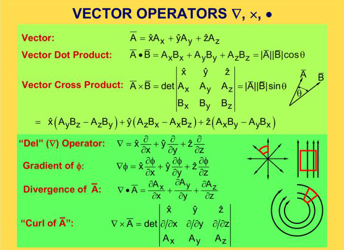
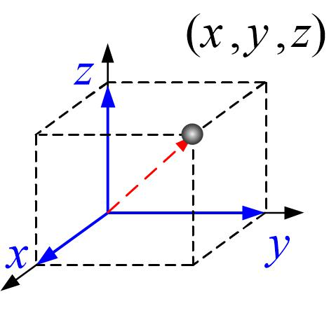
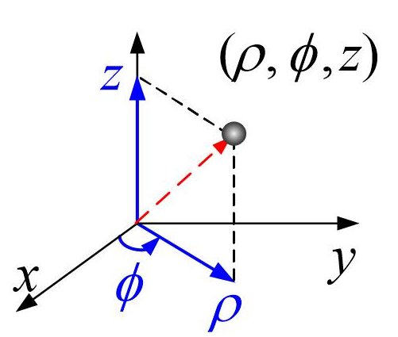
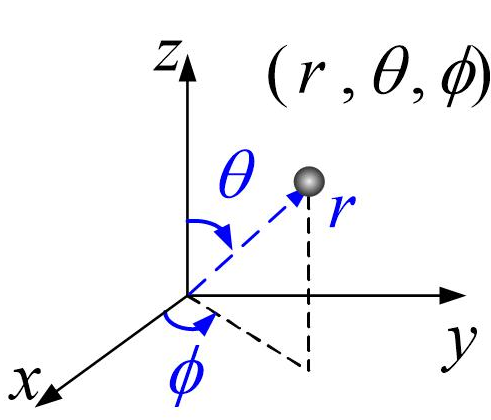

# 一文读懂：哈密顿算子的定义、运算和应用

> 原文地址: [https://mp.weixin.qq.com/s/RSl77yfOeN\_gpwV37rFtFg](https://mp.weixin.qq.com/s/RSl77yfOeN_gpwV37rFtFg)

哈密顿算子（Hamilton Functor），也被称为德尔（Del）算子或纳布拉（Nabla）算子，是向量微积分中的一个重要符号。它通常表示为倒三角形符号（），并且在不同的数学和物理领域中扮演着关键角色。哈密顿算子最初由爱尔兰数学家威廉·罗文·汉密尔顿（William Rowan Hamilton）引入，其目的是简化复杂的微分运算，并提供一个统一的方式来描述标量场和向量场的变化。这个算子的出现极大地促进了流体力学、电磁理论以及量子力学等学科的发展。

哈密顿算子的重要性体现在它的多功能性上。作为一个向量微分算子，它可以应用于标量场生成梯度，应用于向量场则可以生成散度和旋度。通过这些操作，科学家们能够更加深入地理解和分析自然界中各种现象的动态变化过程。例如，在流体动力学中，利用哈密顿算子可以帮助研究者理解流体流动的速度分布；在电磁学里，则可以用于推导麦克斯韦方程组，从而揭示电场和磁场的行为规律。

此外，哈密顿算子不仅限于三维欧几里得空间的应用，在更广泛的坐标系下，如球坐标系和柱坐标系中同样适用。这种适应性使得它成为处理复杂几何形状问题时不可或缺的工具。

本文将详细介绍不同坐标系下的哈密顿算子的具体形式及其基本运算——梯度、散度、旋度，并探讨它们在实际问题中的应用。

## 直角坐标系下的哈密顿算子

在笛卡尔直角坐标系中，哈密顿算子以最直观的形式展现出来，定义为：

其中， 分别代表沿  轴方向的单位向量。这一表达式意味着哈密顿算子是一个包含三个偏导数项的向量，每个项对应一个空间维度。

当哈密顿算子作用于一个标量函数 ，我们得到的是该标量场的梯度 (Gradient)，记作 。具体来说，梯度是一个指向标量函数值增长最快方向的向量，其大小等于该方向上的最大变化率。公式如下：

例如，考虑一个简单的标量函数 ，其梯度为：

这表明在任何点 ，梯度向量都指向远离原点的方向，并且其模长与点的位置成正比。

除了梯度外，哈密顿算子还可以用来计算散度 (Divergence) 和旋度 (Curl)。

对于一个向量场 ，散度定义为：

这实际上是对向量场各分量沿着各自坐标轴方向的偏导数之和，反映了向量场在某一点处“流出”或“流入”的程度。如果散度为正，则表示该点附近有净流量向外扩散；反之，若为负，则表示存在净流量向内汇聚。

例如，考虑一个向量场 ，其散度为：

这意味着在这个向量场中，每一点都是源点，即有净向外的流量。

旋度则是衡量向量场旋转特性的量，它的计算公式较为复杂，定义为：

上述公式可以通过行列式来记忆：

旋度的结果也是一个向量，其方向指示了旋转轴的方向，而大小则表示了旋转强度。

以向量场  为例，其旋度为：

这表明在该向量场中，每一点都有一个垂直于  平面的逆时针旋转分量。

通过上述介绍，我们了解了哈密顿算子在直角坐标系中的定义及其与梯度、散度和旋度的关系。接下来我们将探讨其他常见坐标系中的哈密顿算子表达形式及其应用。

## 柱坐标系下的哈密顿算子

柱坐标系是一种常见的坐标系统，尤其适用于具有圆柱对称性的问题。在这个坐标系中，位置由三个坐标参数确定：径向距离 （从原点到点在  平面上投影的距离）、方位角 （从正  轴逆时针测量到点在  平面上投影的角度）以及高度 。哈密顿算子在柱坐标系中的表达形式为：

这里， 分别是沿  方向的单位向量。与笛卡尔直角坐标系相比，柱坐标系中的哈密顿算子包含了针对径向坐标的尺度因子 ，这是因为随着  的增大，角度  对应的实际位移也会增加。

当我们应用哈密顿算子于一个标量场 ，得到的是该标量场在柱坐标系中的梯度：

例如，考虑函数 ，其梯度为：

接下来考虑一个向量场  的情况。在这种情形下，散度的定义变为：

此表达式表明，在计算柱坐标系下的散度时，需要考虑到径向坐标的尺度因子  以及相应的乘积项 ，这是为了修正因径向坐标引起的不均匀性。

例如，考虑一个具体的向量场 ，其散度为：

对于向量场的旋度，在柱坐标系中的表达形式为：

这个公式详细描述了如何在柱坐标系中计算向量场的旋度，并再次强调了尺度因子  的重要性，特别是在涉及径向和方位角成分之间的转换时。

例如，考虑向量场 ，其旋度为：

综上所述，尽管柱坐标系下的哈密顿算子比笛卡尔直角坐标系稍显复杂，但它们提供了处理圆柱对称性问题的有效手段。无论是梯度、散度还是旋度，柱坐标系下的哈密顿算子都能帮助我们更准确地描述物理现象，特别是在流体力学、电磁学等领域中有着广泛的应用。

## 球坐标系下的哈密顿算子

在球坐标系中，位置由三个坐标参数确定：径向距离 、极角 （从正  轴向下测量的角度）以及方位角 （从正 x 轴逆时针测量到  平面上投影的角度）。为了将哈密顿算子应用到球坐标系，需要根据该坐标系的特点重新定义算子。球坐标系下的哈密顿算子表达式如下：

这里， 分别是沿  方向的单位向量。

与笛卡尔直角坐标系不同，球坐标系中的哈密顿算子包含了额外的尺度因子，这是由于球坐标系中各个坐标方向上的长度元素不是均匀分布的。

当我们将哈密顿算子作用于一个标量场 ，我们获得的是该标量场在球坐标系中的梯度：

例如，对于函数 ，其梯度为：

接下来，考虑向量场  的情况。在这种情况下，散度的定义变为：

此表达式展示了如何在球坐标系中计算向量场的散度，注意到其中包含了  和  的调整因子，这些因子是为了补偿球坐标系中的非均匀网格造成的差异。

例如，考虑向量场 ，其散度为：

最后，向量场的旋度在球坐标系中的表达形式为：

例如，对于向量场 ，其旋度为：

这个复杂的公式揭示了球坐标系下向量场旋度的具体计算方法，同样包含了必要的尺度因子以确保正确性。

通过以上介绍，我们可以看到，尽管球坐标系下的哈密顿算子形式较为复杂，但它为我们提供了处理具有球对称性的问题的强大工具，尤其是在物理学和工程学领域中有着广泛应用。

## 哈密顿算子的基本运算准则

哈密顿算子作为向量微分算子，具有一系列基本的运算规则，这些规则在进行复杂的数学推导和物理问题求解过程中起着至关重要的作用。

首先，哈密顿算子遵循线性性原则，这意味着对于任意两个标量场  和  以及常数  和 ，有：

其次，哈密顿算子与其他向量场的乘积也需遵循特定的运算法则。例如，对于向量场  和标量场 ，有：

这些公式展示了标量场与向量场相乘后哈密顿算子作用的结果，既包含标量场的梯度与其他向量场的内积或外积，又包括原向量场的散度或旋度乘以标量场。

另外，哈密顿算子之间也有特定的运算关系。例如，对于两个向量场  和 ，它们之间的叉积再作用哈密顿算子时，有：

这些公式表明了哈密顿算子在处理向量场间相互作用时的复杂性，但同时也提供了有效的工具来简化计算过程。

最后，哈密顿算子的一个重要性质是其与自身的关系，特别是拉普拉斯算子 ，它在许多物理方程中扮演核心角色。例如，对于标量场 ，在直角坐标系下，其拉普拉斯算子可表示为：

以上运算准则不仅揭示了哈密顿算子在数学上的内在结构，也为解决实际物理问题提供了强大的工具。理解和掌握这些规则，可以帮助我们在处理涉及向量场和标量场的各种复杂问题时更加得心应手。

## 综合应用实例

哈密顿算子在物理学和工程学中有广泛的应用，以下是一些典型的应用实例。

### 麦克斯韦方程组

麦克斯韦方程组描述了电磁场的基本规律，其中哈密顿算子被用于表示电场和磁场的空间变化。

-   **高斯定律**：
    
    这里， 表示电场的散度，描述了电荷密度  如何产生电场。
    
-   **法拉第电磁感应定律**：
    
    这里， 表示电场的旋度，描述了随时间变化的磁场如何产生电场。
    
-   **安培-麦克斯韦方程**：
    
    这里， 表示磁场的旋度，描述了电流密度  和变化的电场如何产生磁场。
    
-   **无源磁场定律**：
    
    这表明磁场没有“磁单极子”，即磁场的散度为零。
    

### Navier-Stokes 方程

Navier-Stokes 方程描述了流体的运动，其中哈密顿算子用于表示速度场的空间变化。

-   不可压缩流体的 Navier-Stokes 方程：
    

-   ：对流项，描述流体的速度场如何随空间变化。
    
-   ：压力梯度，描述压力如何影响流体运动。
    
-   ：粘性项，描述流体的粘性效应。
    

此外，不可压缩流体的连续性方程为：

这表示流体的速度场是无散的。

### 热传导方程

热传导方程描述了温度分布随时间和空间的变化，其中哈密顿算子用于表示温度梯度。

-   热传导方程：
    

-   ：温度的拉普拉斯算子，描述温度在空间中的扩散。
    

### 波动方程

波动方程描述了波的传播，例如声波、电磁波等，其中哈密顿算子用于表示波的空间变化。

-   波动方程：
    

-   ：波函数的拉普拉斯算子，描述波在空间中的传播。
    

### 量子力学中的薛定谔方程

在量子力学中，哈密顿算子用于描述粒子的波函数随时间和空间的变化。

-   时间依赖的薛定谔方程：
    

-   ：波函数的拉普拉斯算子，描述粒子在空间中的运动。
    

### 弹性力学中的应力平衡方程

在弹性力学中，哈密顿算子用于描述应力张量的平衡条件。

-   应力平衡方程：
    

-   ：应力张量的散度，描述物体内部的力分布。
    

## 小结

综上所述，哈密顿算子作为矢量分析的核心工具，在不同坐标系下的应用展现出其强大的灵活性和广泛的适用性。无论是直角坐标系中的基础物理场分析，还是柱坐标系和球坐标系中处理具有对称性的复杂问题，哈密顿算子都能够提供精确而有效的解决方案。通过对梯度、散度和旋度的深入理解，我们不仅可以更好地描述物理现象的本质，还能开发出更加高效的数学方法和技术手段。希望本文能帮助读者建立起对哈密顿算子及其相关概念的初步认识，激发大家深入探索的兴趣。

  

往期推荐

[

_梯度_、散度与旋度：数学与物理的交响曲

](http://mp.weixin.qq.com/s?__biz=Mzk0MzI0NDU2NQ==&mid=2247488112&idx=1&sn=9292fd1a7a276b01499ae47a2377a378&chksm=c337860af4400f1c33cc67315cebe2a8f85627367ea41c41282278277cbabb767d3477999f5e&scene=21#wechat_redirect)

[

科学巨匠的智慧结晶：偏_微分方程_的起源与发展

](http://mp.weixin.qq.com/s?__biz=Mzk0MzI0NDU2NQ==&mid=2247488203&idx=1&sn=1630fe7a85873aef2cd54eb8cdf78326&chksm=c33786b1f4400fa740f554e6a5092e9fc10b98bcba91591bbb2da0f25596ffb97810cc38ac3c&scene=21#wechat_redirect)

[

物理或化学_方程_为什么往往是偏_微分方程_？

](http://mp.weixin.qq.com/s?__biz=Mzk0MzI0NDU2NQ==&mid=2247485050&idx=1&sn=43d1d55ffad163b1881669fb8c028e95&chksm=c3379200f4401b16fb01e66f6f11867b59b42b59d9db14e94c257d77753350a415dd3f91dd6a&scene=21#wechat_redirect)

  

## 推荐阅读

  

  

  

‍

  

  

  

**给我一组控制方程，还你一套专业软件。**我们长期从事多场耦合有限元算法和软件的研发工作，掌握全流程的 CAE 软件开发技能。如果您需要相关的技术服务，非常欢迎私信交流和扫码咨询。

**喜欢****作者******，请点********赞********和在看********

****