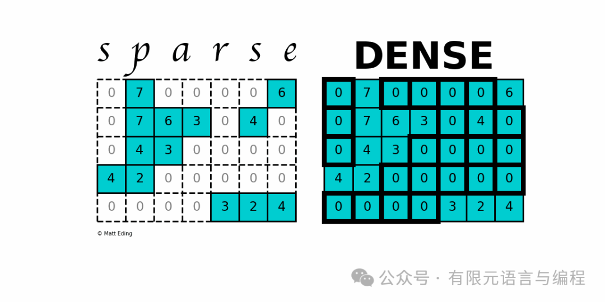
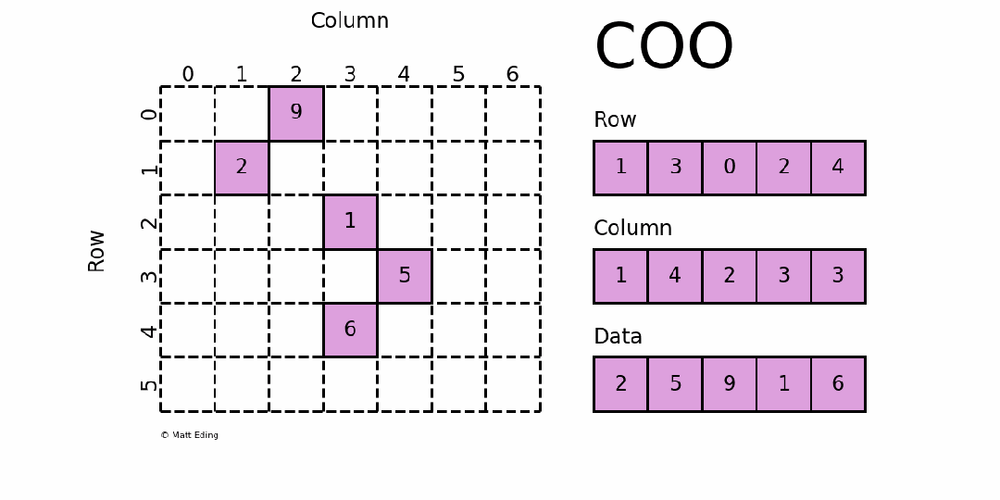
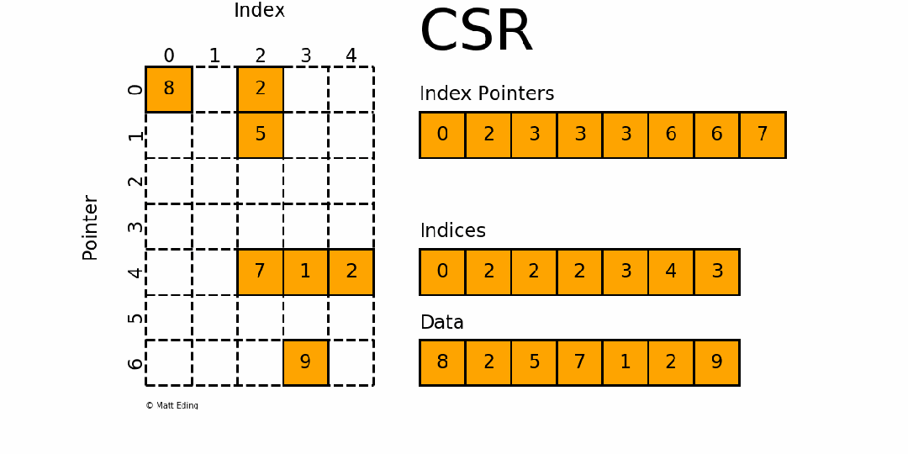
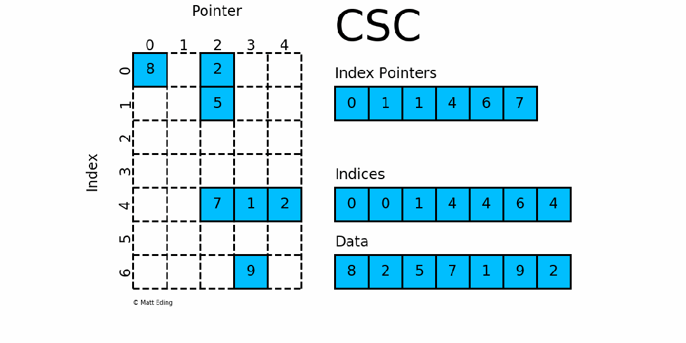
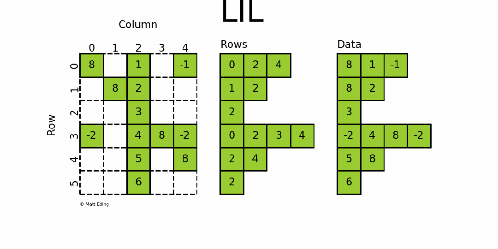
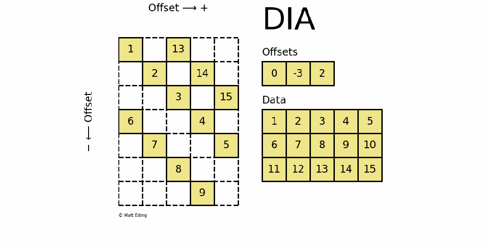

# 一目了然！动态演示5大稀疏矩阵存储格式，解锁科学计算必备技能

> 原文地址: [https://mp.weixin.qq.com/s/OTDsOyX3\_8rrvl9Y7tUr3Q](https://mp.weixin.qq.com/s/OTDsOyX3_8rrvl9Y7tUr3Q)

## 

在科学计算领域常常会采用矩阵来存储数据，但当矩阵较为庞大且非零元素较少时，运算效率和存储有效率并不高。所以，一般情况下，我们会采用稀疏矩阵的方式来存储矩阵，以提高存储和运算效率。

下面将结合动态演示，对 5 种常见的稀疏矩阵存储方式（COO / CSR / CSC / LIL / DIA）进行简要介绍。

## \# COO

### Coordinate Matrix

-   枚举稀疏矩阵元素，最自然的方式
    
-   采用三元组`(row, col, data)`的形式来存储矩阵中非零元素的信息
    
-   三个数组 `row` 、`col` 和 `data` 分别保存非零元素的行下标、列下标与值（一般长度相同）
    
-   故 `coo[row[k]][col[k]] = data[k]` ，即矩阵的第 `row[k]` 行、第 `col[k]` 列的值为 `data[k]`
    

## \# CSR

### Compressed Sparse Row Matrix

-   按行对矩阵进行压缩
    
-   通过 `indices`, `indptr`，`data` 来确定矩阵。
    
-   `data` 表示矩阵中的非零数据
    
-   对于第 `i` 行而言，该行中非零元素的列索引为 `indices[indptr[i]:indptr[i+1]]`
    
-   可以将 `indptr` 理解成利用其自身索引 `i` 来指向第 `i` 行元素的列索引
    

## \# CSC

### Compressed Sparse Column Matrix

-   按列对矩阵进行压缩
    
-   通过 `indices`, `indptr`，`data` 来确定矩阵，可以对比 CSR
    
-   `data` 表示矩阵中的非零数据
    
-   对于第 `i` 列而言，该行中非零元素的行索引为`indices[indptr[i]:indptr[i+1]]`
    
-   可以将 `indptr` 理解成利用其自身索引 `i` 来指向第 `i` 列元素的列索引
    

## \# LIL

### Linked List Matrix

-   最简单的稀疏矩阵存储格式之一
    
-   使用两个列表 `rows` 和 `data` 存储非零元素
    
-   `rows` 保存非零元素所在的列
    
-   `data` 保存非零元素值
    

## \# DIA

### Diagonal Matrix

-   沿稀疏矩阵的对角线存储其内容，是最适合对角矩阵的存储方式
    
-   通过两个数组确定：`data` 和 `offsets`
    
-   `data` ：对角线元素的值
    
-   `offsets` ：第 `i` 个 `offsets` 是当前第 `i` 个对角线和主对角线的距离
    
-   例如，`data[k:]` 存储了 `offsets[k]` 对应的对角线的全部元素
    

以上动图利用 Python 制作，全部来自于：

https://matteding.github.io/2019/04/25/sparse-matrices/

版权归原作者所有，转载和使用请注明出处。

  

  
好书推荐