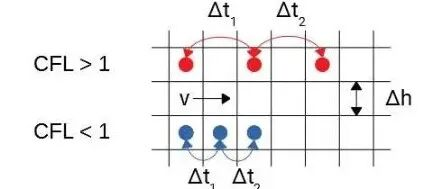
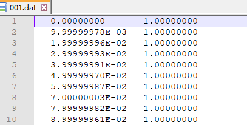
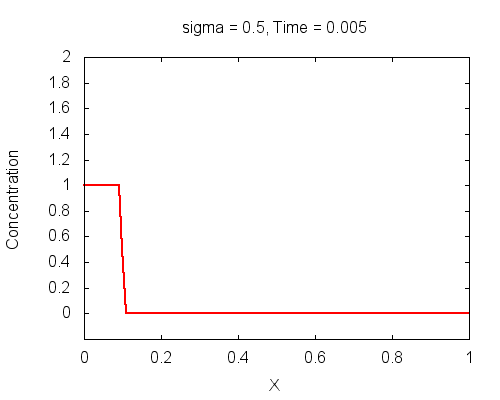
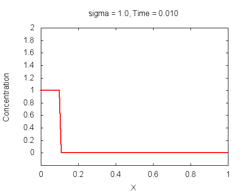
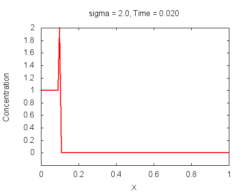

# 一维对流方程的显式差分格式与迭代求解


> 原文地址: [https://mp.weixin.qq.com/s/yvJidZsqwVPU-KHCM030gA](https://mp.weixin.qq.com/s/yvJidZsqwVPU-KHCM030gA)


点击上方「蓝字」关注我们


在科学计算的壮阔图景中，对流方程作为刻画流体动力学基本现象的核心模型，其数值求解技术无疑是一块熠熠生辉的宝石。今日，我们将携手踏上探索之旅，揭开一维对流方程显式差分格式及其迭代求解的神秘面纱，领略其在模拟自然界中流体运动轨迹时的非凡魅力。

## 一维对流方程

一维对流方程通常被表述为：

这里， 描述了流体的速度或浓度等物理量沿轴随时间和空间的变化，则是对流速度，反映了流体沿方向传输的强度。这一方程在气象学、水文学、航空航天工程等多个领域内扮演着至关重要的角色。

## 显式差分格式

显式差分法，作为连接连续偏微分方程与离散代数系统的桥梁，为一维对流方程提供了强大的解析工具。采用显式欧拉格式，我们对原方程进行离散化处理，设空间网格间距为，时间步长为，则在处的差分形式可表达为：

此方程通过“向前”差分时间项，单侧“左偏心”差分空间项，直观地展示了下一时间步节点值如何基于当前时刻及其相邻空间节点的值而变化，因此得名“显式差分”。

## 迭代求解流程

1.  **初始化**: 根据初始条件设置各空间节点的初始值。
    
2.  **迭代演进**: 对于每一轮时间步，基于前一时步的空间分布，利用显式差分格式计算所有空间节点在当前时间步的值。
    
3.  **边界条件处理**: 针对特定问题，恰当地处理边界节点（如流入边界、流出边界），以确保迭代过程的稳定性与计算的准确性。
    
4.  **时间推进**: 不断递增时间步数直至达到预定的仿真终止时间。
    

## 稳定性考量

与其他方程类似，对流方程的显式差分格式同样面临稳定性问题，这主要取决于与的比例关系，即Courant-Friedrichs-Lewy (CFL) 条件。

定义库朗数（ Courant Number）

对于一维对流方程，稳定性条件要求：

这意味着时间步长不能太大，否则数值解将变得不稳定。从量纲上来分析，库朗数是一个无量纲数，是一个倍数或者比率，可以简单的认为库朗数是波在一个时间步长内穿越的网格数量。稳定性条件要求，在一个时间步长内波形最多不穿越1个网格。



## 实例解析

假定一个简化的场景：有一段长度的管道，对流速度，初始时刻流体中的物质浓度分布为：

其他区域

在对流过程中，管道左端的浓度保持为 1，向右端匀速传输。

### **\# Fortran实现**

通过Fortran语言，我们可以高效编码实现这一对流问题的数值解。具体代码实现细节包括初始化、迭代更新、边界条件处理及结果输出等环节，每一步骤都紧密围绕着上述理论框架展开，确保了对流现象的精准模拟。

```
program convection  implicit none  ! 区域大小  real, parameter :: length = 1.0  ! 对流速度  real, parameter :: c = 1  ! Courant数,决定稳定性  ! real, parameter :: sigma = 2  real, parameter :: sigma = 1  ! real, parameter :: sigma = 0.5  ! 节点数和网格大小  integer, parameter :: nx = 101  real, parameter :: dx = length / (nx - 1)  ! 时间步长和步数  real :: dt  integer :: nt   real, dimension(nx) :: x, u, un  integer :: i, n  ! 计算网格点坐标  x = [(i*dx, i=0,nx-1)]  ! 定义初始条件  u = 0.0  ! 0 <= x <= 0.1时,u = 1.0  u(1:nint(0.1/dx)) = 1.0  dt = sigma * dx / c  nt = nint(length/c/dt)  print*,"dt=", dt, " nt=", nt   ! 循环计算    do n = 1, nt    ! 复制当前解到un    un = u    ! 空间循环,计算u[i]    do i = 2, nx      u(i) = un(i) - c * dt/dx * &          (un(i) - un(i-1))    end do    ! 保存数据    call SaveData(x, u, n)  end docontains  ! 结果保存子程序  subroutine SaveData(x, y, n)    implicit none    real, dimension(:), intent(in) :: x, y    integer, intent(in) :: n    integer :: k    character(len=3) :: xx, doc    ! 创建子目录,Windows系统    doc="res"    call system('if not exist '//doc//' md '//doc)    ! 存储结果到res/***.dat文件    write (xx(1:3),fmt = '(i3.3)') n    open(10,file = doc//'/'//xx//'.dat')    do k = 1, size(x)      write(10,*) x(k), y(k)    enddo    close(10)  end subroutine SaveDataend program convection
```

编译和运行，在子目录`res`下得到了多个数据文件，分别命名为`001.dat`, `002.dat`, ..., `100.dat`


每个文件内部有两列数据，分别为节点坐标和节点值。例如：



### **\# Gnuplot绘图**

利用Gnuplot图形软件，将迭代过程中的数据绘制成动态图像，可以直观展现流体中物质浓度随时间的演化过程，加深对对流现象的理解。

```
set terminal gif animate delay 5 size 500,400set output 'motion.gif'set xlabel "X"set ylabel "Concentration"set yrange [-0.2:2]set ytics 0,0.2,2dt = 1e-2do for [i=1:100] {    filename = sprintf("res//%03d.dat", i)    set title sprintf("Time = %5.3f",i*dt)    plot filename using 1:2 with lines linewidth 2 notitle}set output
```

### **\# 结果讨论**

程序中利用库朗数`sigma`(即 )进行时间步长控制，`sigma`不同取值时的计算结果分别如下图所示。



当`sigma = 0.5`时，计算结果是稳定的，但波形存在较大的扩散，随时间推移，波形与初始形状偏离严重。



当`sigma = 1`时，计算表现良好，波形保真度很高。



当`sigma = 2`时，由于不满足稳定性条件，计算发散。

可见，对流方程的显式差分法的稳定性和精度是由无量纲的库朗数决定的。时间和空间差分间隔不能随便取，因为它们不是完全独立的。库朗数是一个很重要的概念，在具体数值计算中，我们需要调节好这个参数，从而在数值精度和计算速度上取一个平衡。

## 结语

通过本篇的深度剖析，我们不仅掌握了对流方程显式差分格式的精髓，更深入了解了迭代求解的实践智慧。在数字建模的广阔天地里，每行代码都如同流体力学家手中的画笔，细腻描绘着流体流动的壮丽画卷。让我们在科学计算的征途上，以数值为墨，继续探索更多流动之美，解锁自然界的未解之谜。

# 往期精选

[](http://mp.weixin.qq.com/s?__biz=Mzk0MzI0NDU2NQ==&mid=2247486048&idx=1&sn=90d8b67d1e0cc5ac942cb1dea04c668c&chksm=c3379e1af440170c7e4cc8e5ddf2521cf483c5c51eec9687fa3e52256b750a9736f553077080&scene=21#wechat_redirect)

\* [差分中的库朗数和计算稳定性](http://mp.weixin.qq.com/s?__biz=Mzk0MzI0NDU2NQ==&mid=2247486310&idx=1&sn=29529196eb624f1796d4b0e1a206f3cb&chksm=c3379f1cf440160af19ee8a917509a79ea13d8d6460a543948658e1a53b828b77bca21d610eb&scene=21#wechat_redirect)

[\* 一维扩散方程的显式差分格式与迭代求解](http://mp.weixin.qq.com/s?__biz=Mzk0MzI0NDU2NQ==&mid=2247486297&idx=1&sn=d73dec93b4dacf0c885c5bf1a47b76d9&chksm=c3379f23f44016357bab6aa9f54b7f922288e0be178a420087bda231d67935d9761421423737&scene=21#wechat_redirect)

[\* 拉普拉斯方程的差分格式与迭代求解](http://mp.weixin.qq.com/s?__biz=Mzk0MzI0NDU2NQ==&mid=2247485625&idx=1&sn=dc119a48607981f3231b9af66a15ae85&chksm=c3379cc3f44015d5aff80b428181b70c8ad304c6c0cb70b0b2be61318ffd64e1f7d84f282edf&scene=21#wechat_redirect)

  

## 推荐阅读

  

‍


‍

**FEtch 系统**是笔者团队开发的新一代有限元软件开发平台。只需按照有限元语言格式填写脚本文件，即可在线自动生成基于**现代 Fortran** 的有限元计算程序，从而大幅提高 CAE 软件的开发效率。欢迎私信交流。

有任何疑问或建议，欢迎加Q群 "**FEtch有限元开发系统(519166061)**" 留言讨论。我们长期开展 FEtch 系统的试用活动，感兴趣的朋友入群后可直接联系管理员，免费获取**许可证文件**。