# 一维混合高阶有限元详细实现过程

> 原文地址: [https://mp.weixin.qq.com/s/O2oLpFETQqbDHxQdXkftXA](https://mp.weixin.qq.com/s/O2oLpFETQqbDHxQdXkftXA)

**简述**  

    一维混合阶有限元，顾名思义，就是把不同阶数的基函数混合在一起。要实现混合阶有限元，这里不得不再次提到叠层基函数和插值基函数的区别，将两者加以对比，更加能理解如何实现混合阶。

    插值基函数的不同阶数的形函数是相对独立的，高低阶不存在包含的关系，因此在阶数不同的分界面上，无法保证基函数阶数一致，所以插值基函数无法实现混合阶有限元。具体插值基函数公式可以参看：[一维高阶插值基函数有限元实现](http://mp.weixin.qq.com/s?__biz=MzkwNzUxOTM2NA==&amp;mid=2247483719&amp;idx=1&amp;sn=c2e8474e625f4d8f8e5218c4d238294d&amp;chksm=c0d6b5acf7a13cbacc3f02d721852d8870c8ba1742166a7b103a4d879718035c4bf599a7beec&scene=21#wechat_redirect)

    而叠层基函数的特点就是高阶基函数包含低阶，因此天然的适合做混合阶的实现，在阶数不同的分界面上，通过处理成相对低阶一致，就能够保证基函数阶数一致。

    下面将根据高阶叠层基函数的原理，详细介绍具体边值问题的混合阶实现过程。

**1.边值问题**  

‍‍‍‍    为了更好的体现混合阶有限元在某些问题上的必要性，这里引入一个新的边值问题：一维电磁波在导体介质上的衰减规律。

    假设电场只沿着X轴振动，磁场只沿着Y轴振动，则根据Maxwell方程的推导并处理，最终可以得到如下的一维电磁场传播规律方程：

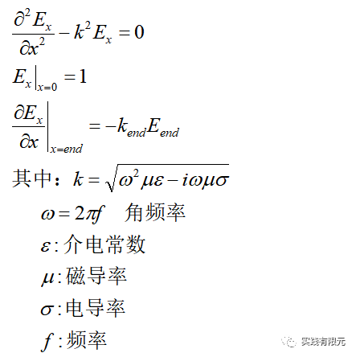

    该边值问题在均匀介质中的解析解为：

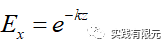

**2.有限元离散方程**

    边值问题的微分方程的推导过程类似：[最简单的一维有限元问题：求解cos函数分布](http://mp.weixin.qq.com/s?__biz=MzkwNzUxOTM2NA==&amp;mid=2247483689&amp;idx=1&amp;sn=238051a214893aec197bde3511363463&amp;chksm=c0d6b5c2f7a13cd49795a90d7a3509ff6e6a5fbd744fe1f1721af17a4cb8e93827383ddc9d60&scene=21#wechat_redirect)，不同点在于第二项多了表征研究介质区域属性的系数k,这部分的简略推导如下：

    使用伽辽金推导方法，首先对微分方程乘以试探函数，并且再求解区域积分，得到：

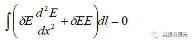

    对上述式子第一项进行分部积分处理后：

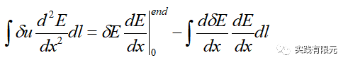

    其中，上述等式的右边对一项表示边界位置，这部分对于边界条件，详细推导如下：

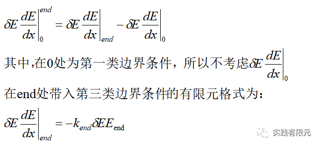

    最终得出有限元方程为：

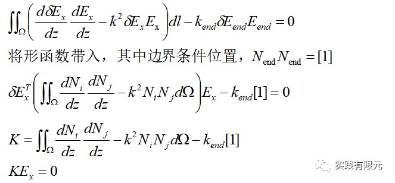

解释为什么第三类边界条件部分的系数矩阵为\[1\]：

    因为一维度的边界为一个点，也就是零维度，基函数的目的是为了插值得到对应单元类的任意一点值，而一个点零维则表示该单元（点单元）只可能存在一个值（可以理解为不管如何插值，都只有几个结果），所以插值基函数就是\[1\]，对应的系数矩阵就是\[1\]\*\[1\]=\[1\].

    可以类比二维的边界是一维，所以二维的边界条件的基函数用的是一维的基函数；三维的边界条件用的基函数是二维的基函数。  

**3.高阶叠层基函数**  

    直接给出1、2、3阶基函数的表达式与关系如下：

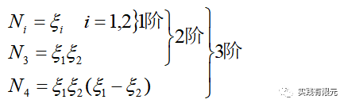

    其中1阶基函数的详细推导细节参考：[最简单的一维有限元问题：求解cos函数分布](http://mp.weixin.qq.com/s?__biz=MzkwNzUxOTM2NA==&amp;mid=2247483689&amp;idx=1&amp;sn=238051a214893aec197bde3511363463&amp;chksm=c0d6b5c2f7a13cd49795a90d7a3509ff6e6a5fbd744fe1f1721af17a4cb8e93827383ddc9d60&scene=21#wechat_redirect)，高阶基函数通过低阶可以获得。

    从阶数的组成方式可以观察到，1阶基函数是直接与一个点关联，并且具有具体物理意义；2、3阶是与单元的所有点关联，不具备物理意义（无法表示在单元内任何一点的数值解）。所以，1阶基函数的位置表示在点上，2、3阶基函数用单元表示，但是不具备物理意义。这个特点在后面也会多次强调。  

**4.叠层基函数对应的系数矩阵**  

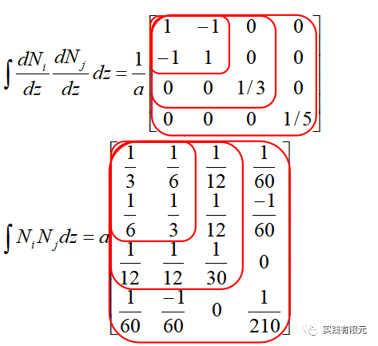

    红色方块从小到大表示1、2、3阶，可以直观感受到单元系数矩阵高阶包含低阶的现象。  

**5.组装系数矩阵**

   以三个均匀剖分的单元为例：

     **a.给出1阶的全局与局部坐标系映射关系，后期将用于对比混合阶的精度：**

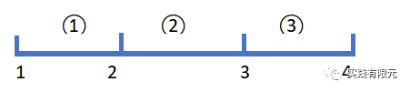

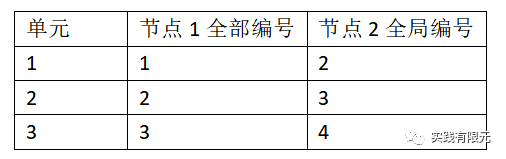

    **b.1、2、3混合阶全局坐标系与局部坐标系映射关系：**

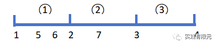

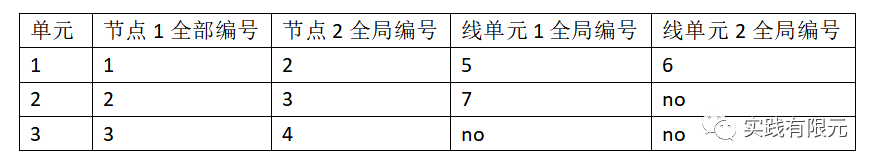  

    将三个单元系数矩阵组装成全局系数矩阵的位置关系如下：

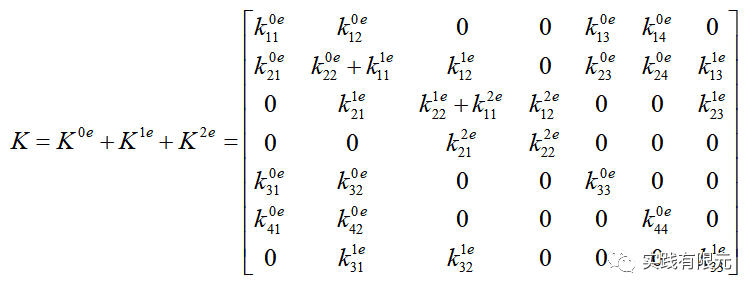

    将第一类边界条件和第三类边界条件加入上述矩阵中，得到：  

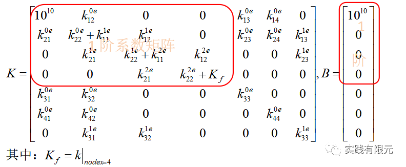

    从组装结果与网格都明确显示：单元1与单元2分别为3阶和2阶，并且两者相关联的2号节点均表示1阶部分的基函数，也就是说单元1，2在分界点2上自然的满足阶数一致。2号单元与3号单元也是同理，所以这不需要对边界再做阶数一致化处理。注意在二维、三维情况又有所不同。

**6.具体系数矩阵与结果对比**  

    **a.首先考虑3个网格单元，给定需要的物理参数与网格剖分信息：**  

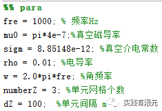

    然后可以得到具体的系数矩阵：

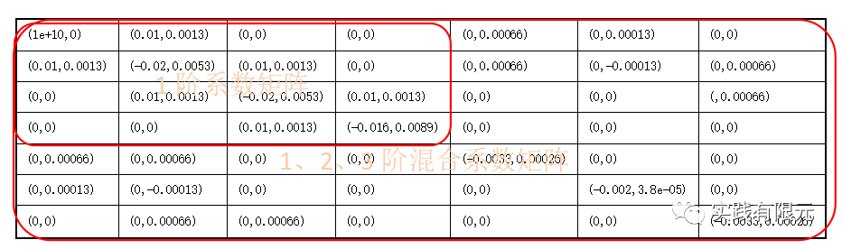

    求解线性方程组后，通过对应阶数插值（高阶叠层基函数必须通过插值获得对应点的数值解，因为仅用1阶部分的结果可能无法体现高阶部分的精度），获得每个单元中心点的数值解，具体的插值方式：

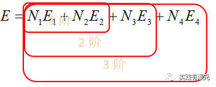

    下面给出具体插值得到的数值解与理论解析解的误差分析结果：

Ex

theoy

1阶数值解

混合阶数值解

1阶误差%

混合阶误差%

实部

0.6947

0.7177

0.6938

2.31%

0.09%

0.2290

0.2588

0.2259

2.97%

0.31%

0.0000

0.0130

0.0165

1.30%

1.65%

虚部

0.2257

0.1648

0.2260

6.09%

0.03%

0.3152

0.3086

0.3167

0.66%

0.15%

0.2079

0.2200

0.2101

1.22%

0.23%

    1阶数值解对比理论解析解：

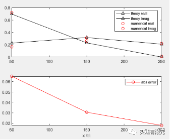

    1、2、3阶混合阶数值解对比理论解：

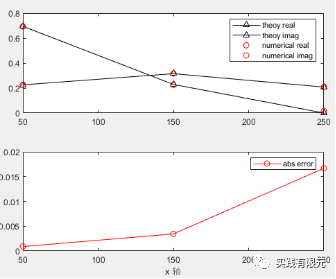

    计算结果显示：纯粹1阶对比混合阶的精度要低；而混合阶中，阶数越高，与解析解的误差越小，3阶、2阶、1阶的单元数值解实部误差分布为：0.09%、0.31%、1.65%。可见，混合阶有限元的实现是成功的。

    **b.考虑20个网格单元，具体参数如下：**

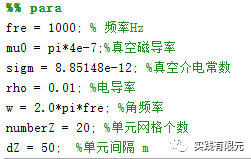

    1阶计算结果对比解析解：

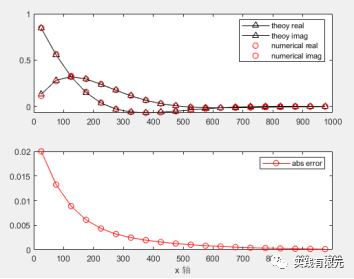

    混合阶阶数信息与计算结果对比解析解：

单元编号

1

2

3

4

5

6

7

8

9

10

单元阶数

3

3

3

3

3

3

2

2

2

2

单元编号

11

12

13

14

15

16

17

18

19

20

单元阶数

2

2

1

1

1

1

1

1

1

1

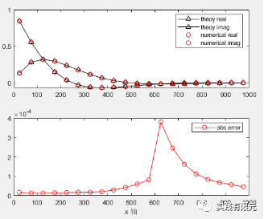

    从20个单元网格的计算结果显示：纯粹1阶的数值结果中，误差较大的位置分布x=0~400位置。因此在混合阶的组合中，将网格的前部分设置为3阶，中部设置为2阶，误差较小的后部分设置为1阶，如此组合的阶数，求解的数值结果误差能控制在了0.04%以下。

**7.总结**

（1）混合阶的计算精度整体上是明显高于低阶数值结果的;

（2）混合阶的实现过程需要注意的是对高阶部分的编号处理，以及对高低阶分界面的处理，尤其是二维、三维的数值模拟，这一点上要重要注意。

（3）混合阶的必要性：根据20个单元网格的计算结果，纯粹的1阶计算精度，只有左侧网格单元的误差较大，这部分的确需要高阶来提高精度；而在右侧网格的误差很小，这部分不需要高阶。所以混合阶有限元就在精度与内存性能上达到了最优效果，即保证了全局的精度要求，又避免了不必要的内存空间浪费。这对于大规模数据模拟或者仅需要局部最优解的问题来说，是一个非常好的选择。

（4）综述混合高阶有限元实现过程的主要步骤：

       a.网格划分；

       b.边值问题推导出有限元离散化方程；

       c.网格单元阶数的确定；

       d.排列全局计算点（自由度）编号与局部自由度编号的映射关系；

       e.推导叠层基函数表达式与单元系数矩阵；

       f.根据全局编号组装全局系数矩阵；

       g.添加边界条件，对于第一类边界的加入将高阶的点处理成1阶；

       h.求解线性方程组得出数值结果；

       i.使用叠层基函数插值获得研究区域任意一点结果;