# 一维高阶叠层有限元实现

> 原文地址: [https://mp.weixin.qq.com/s/RLjwJwGgLG4kDVQi72kw8g](https://mp.weixin.qq.com/s/RLjwJwGgLG4kDVQi72kw8g)

1.  **将一维cos函数分布的边值问题进行到底**
    
    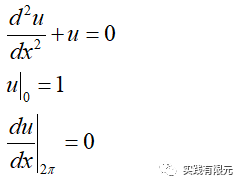
    
    该问题的解析解为：
    
    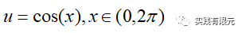
    
2.  **有限元离散方程**
    
      
    

    详细推导参考：[最简单的一维有限元问题：求解cos函数分布](http://mp.weixin.qq.com/s?__biz=MzkwNzUxOTM2NA==&amp;mid=2247483687&amp;idx=1&amp;sn=0cb50379a843e2a65a497df7274ae475&amp;chksm=c0d6b5ccf7a13cdabcdd902a8eb000ba58a27cd632f2114d77aee0133210cf36b1a789e7c2e3&token=1929156283&lang=zh_CN&scene=21#wechat_redirect)

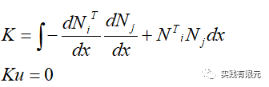

**3.高阶叠层基函数**  

     原理：高阶叠层基函数的本质是通过引入单元线性一阶基函数的高阶项来提高计算精度，它的高阶项表示的就是高阶精度项，高阶项在网格单元内不具备对应点的物理含义。

    这本质与高阶插值基函数不同，高阶插值在网格单元有对应点表示物理函数，例如[一维高阶插值基函数有限元实现](http://mp.weixin.qq.com/s?__biz=MzkwNzUxOTM2NA==&amp;mid=2247483716&amp;idx=1&amp;sn=07e198fed49960eacc368a5684bc5483&amp;chksm=c0d6b5aff7a13cb94ecc34661610ceb2f72e79f82aad0271c5eee71544b03fe653413d9b389f&token=1929156283&lang=zh_CN&scene=21#wechat_redirect)中高阶项对应的物理含义表示在单元中心点的数值结果。

    这里给出一维的1~3阶的基函数表达式：  

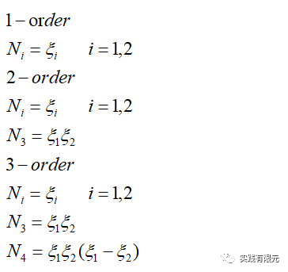

其中，基函数的推导过程可以参考：[最简单的一维有限元问题：求解cos函数分布](http://mp.weixin.qq.com/s?__biz=MzkwNzUxOTM2NA==&amp;mid=2247483687&amp;idx=1&amp;sn=0cb50379a843e2a65a497df7274ae475&amp;chksm=c0d6b5ccf7a13cdabcdd902a8eb000ba58a27cd632f2114d77aee0133210cf36b1a789e7c2e3&token=1929156283&lang=zh_CN&scene=21#wechat_redirect)

    叠层基函数的特性：  

    a.高阶基函数中包含低阶基函数；

    b.高阶部分不表示单元上某一点的具体解，表示的是对1阶精度的修正，意义可以理解为泰勒级数展开后的高阶项，高阶项越多，精度也越高。

    c.高阶部分N3,N4是单元的所有1阶基函数组合而成，因此用单元表示N3,N4所在的位置，即有几个单元就存在多少个N3,N4。需要注意N3,N4不表示单元上的数值结果，仅表示高阶项。

**4.单元系数矩阵的推导**

    详细的推导过程参考[最简单的一维有限元问题：求解cos函数分布](http://mp.weixin.qq.com/s?__biz=MzkwNzUxOTM2NA==&amp;mid=2247483689&amp;idx=1&amp;sn=238051a214893aec197bde3511363463&amp;chksm=c0d6b5c2f7a13cd49795a90d7a3509ff6e6a5fbd744fe1f1721af17a4cb8e93827383ddc9d60&scene=21#wechat_redirect)与 [一维高阶插值基函数有限元实现](http://mp.weixin.qq.com/s?__biz=MzkwNzUxOTM2NA==&amp;mid=2247483719&amp;idx=1&amp;sn=c2e8474e625f4d8f8e5218c4d238294d&amp;chksm=c0d6b5acf7a13cbacc3f02d721852d8870c8ba1742166a7b103a4d879718035c4bf599a7beec&scene=21#wechat_redirect)，这里直接给出对应项的单元系数矩阵：  

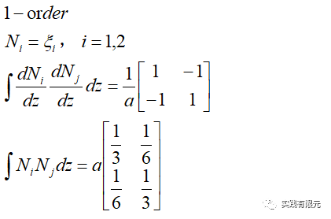

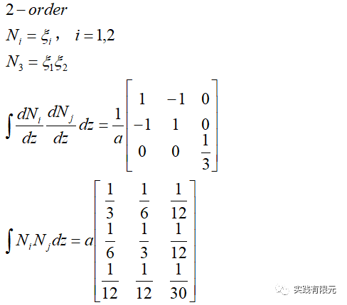

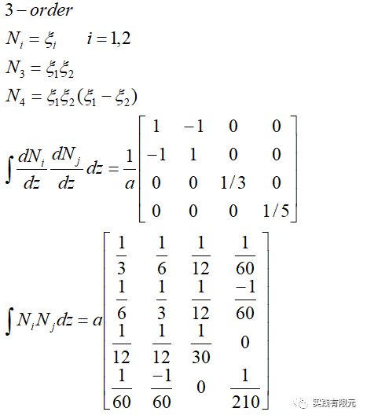

    可以从1~3阶的单元系数矩阵直观地看出，3阶系数矩阵包含2阶系数矩阵，2阶系数矩阵又包含1阶系数矩阵。系数矩阵从低阶到高阶层层叠加，因此称之为叠层基函数。

**5.组装全局系数矩阵**

    为了简便，同样将研究区域（0~2pi）划分成三个基本单元，以此得出局部坐标系到全局坐标系的映射关系：

    **a.1阶基函数的网格映射关系与全局系数矩阵表达式：**  

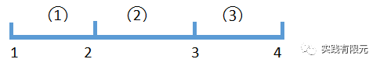

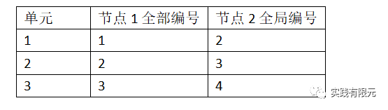

    系数矩阵组装过程与结果参考：[最简单的一维有限元问题：求解cos函数分布](http://mp.weixin.qq.com/s?__biz=MzkwNzUxOTM2NA==&amp;mid=2247483689&amp;idx=1&amp;sn=238051a214893aec197bde3511363463&amp;chksm=c0d6b5c2f7a13cd49795a90d7a3509ff6e6a5fbd744fe1f1721af17a4cb8e93827383ddc9d60&scene=21#wechat_redirect)

    **b.2阶基函数的网格映射关系与全局系数矩阵表达式：**

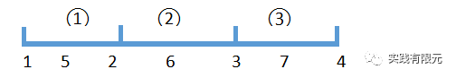

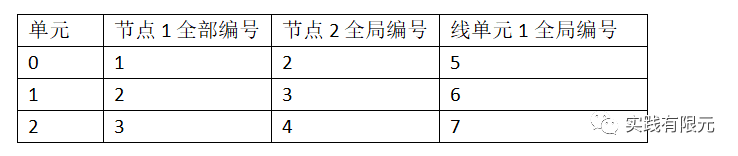

      系数矩阵的组装过程类似1阶有限元，这里直接给出组装结果：  

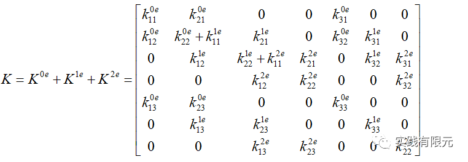

    在网格起始点1号位置添加第一类边界条件（u=0），在网格终点4号位置添加第二类边界条件Kf=0，得到最终系数矩阵表达式：  

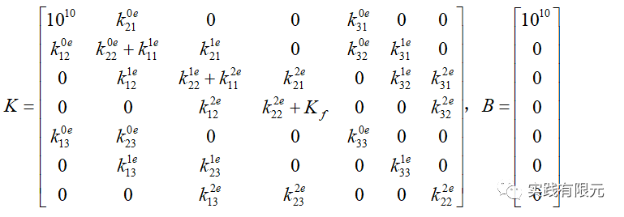

    在带入具体数值后，得到的具体系数K矩阵如下：  

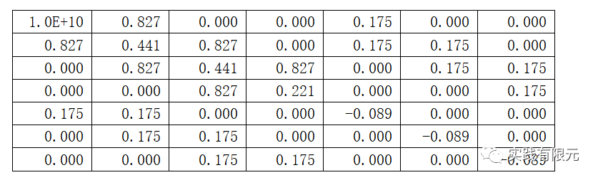

    **c.3阶基函数的网格映射关系与全局系数矩阵表达式：**

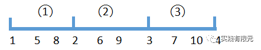

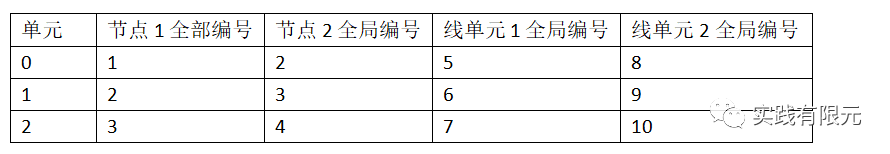

    类似1阶系数矩阵的组装过程，在组装系数后，同样添加边界条件后，得到最终的系数矩阵表达式：

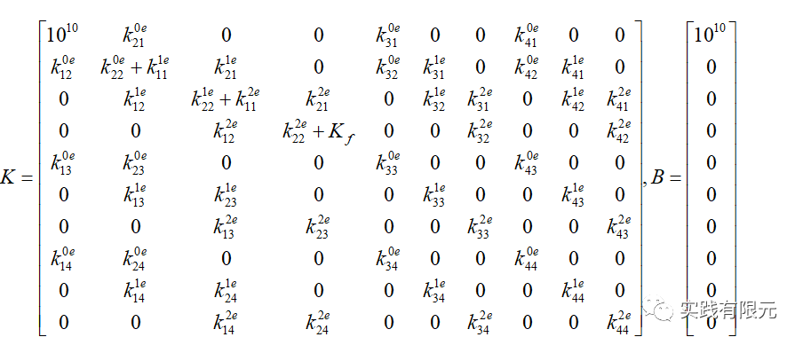

    在带入具体数值后，得到的具体系数K矩阵为：  

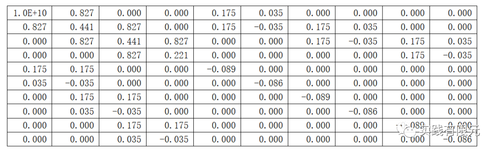

**6.计算结果与对比**  

    在获得系数矩阵与右端项后，在matlab中通过简单的X=K\\B就可以获得方程的解，再通过对应基函数的插值方法，可以得到研究区域内任意一点的数值解。

    这里为了更加具体的对比不同阶数的精度，通过插值获得所有单元的中心点数值解，具体插值公式为：  

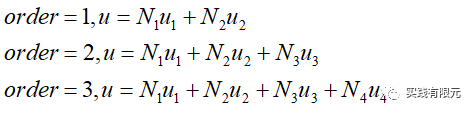

    最终的计算结果与理论解析解对比，得出计算误差为：  

    **a.研究区域划分为3个均匀长度单元：**  

        I.1阶计算结果：  

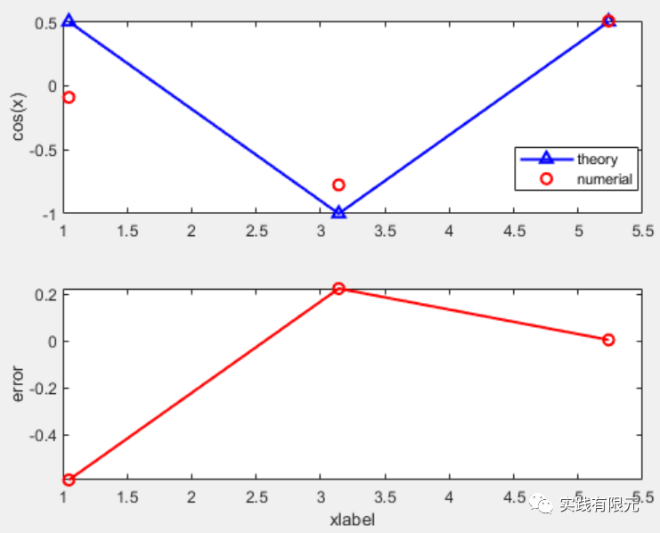

       II.2阶计算结果：  

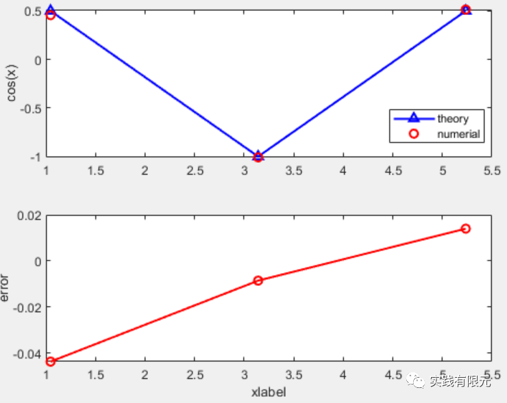

        III.3阶计算结果：  

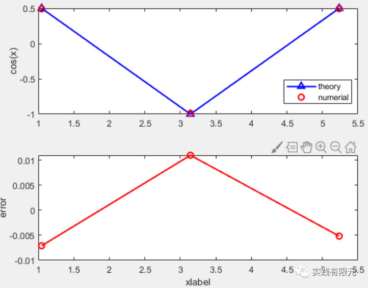

    **b.再给出研究区域划分为10个单元的计算结果：**  

        I.1阶计算结果：

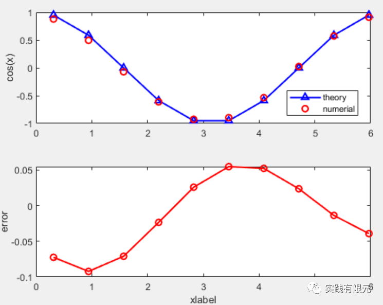

        II.2阶计算结果：

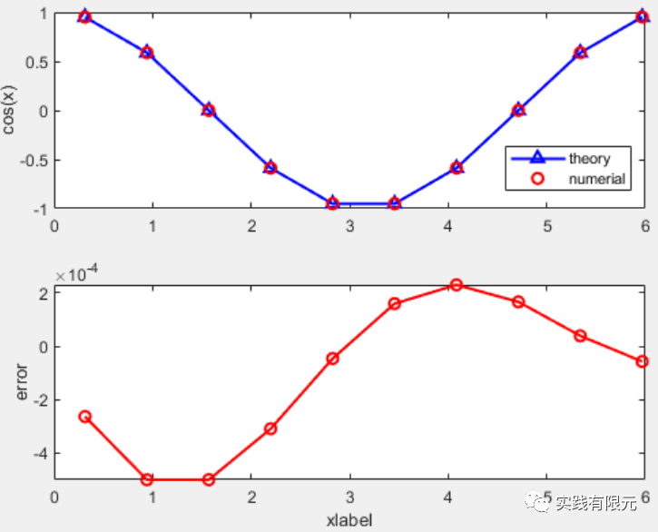

        III.3阶计算结果：

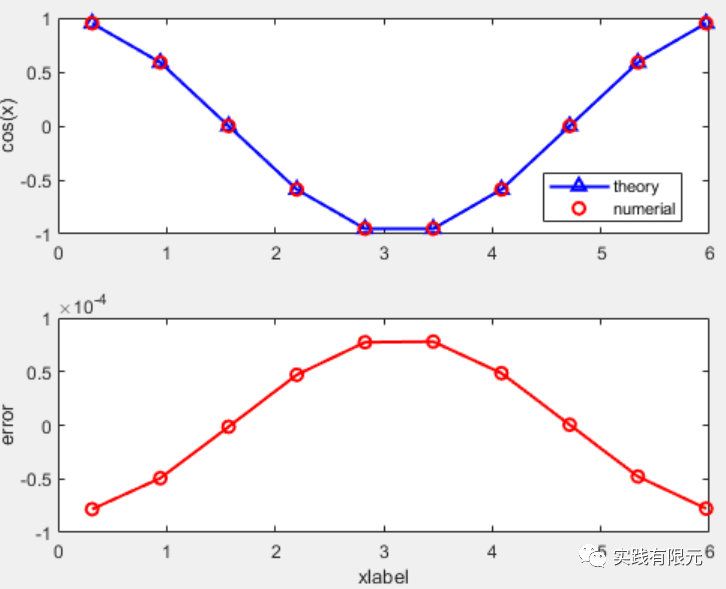

    从结果直接看出，当划分为3个网格单元时，1~3阶的最大误差依次为：0.5，0.05，0.005；当划分为10个网格单元时，1~3阶的最大误差依次为：0.1，5e-4,5e-4。

**7.结论**

    高阶叠层有限元的数值模拟结果的精度随着阶数的提高而逐渐提高，2阶相对于1阶的精度提高非常的明显，而随着网格增多，3阶相对于2阶的精度提高效果不是那么好。

    因此在一般的计算中，2阶精度也就足够，3阶虽然在精度上还有提升，但是占据的内存与计算的时间均明显增多，可能会导致得不偿失。