# 一维高阶插值基函数有限元实现

> 原文地址: [https://mp.weixin.qq.com/s/BMyVOyEOVuJ4jy0Aerlyfw](https://mp.weixin.qq.com/s/BMyVOyEOVuJ4jy0Aerlyfw)

1.  **边值问题依旧讨论：求解cos函数分布**
    
    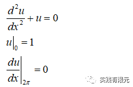
    
    边值问题的解析解：
    
    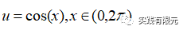
    

**2.有限元离散方程**

推导过程参考：最简单的一维有限元问题

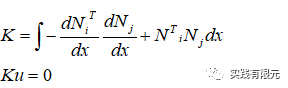

**3.高阶（二阶）插值形函数**  

高阶插值形函数，顾名思义是在低阶的基础上插入点，对于二阶插值形函数，则是在一阶的基础上组建而成，具体形式如下：

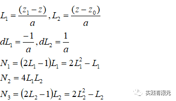

L1,L2表示一阶线性基函数，N1,N2,N3表示二阶插值形函数，可以直观看出二阶的基函数完全由一阶基函数组合而成，但是与一阶的基函数完全不同。同时，在每个单元内，二阶插值形函数满足：

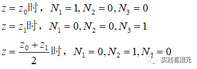

这就说明每个插值形函数对应网格所在位置的数值解，具有物理意义，这一点与高阶叠层基函数具有本质区别。在网格上的体现为在原有单元的中心点处插入一个点，同样以三个单元为例：

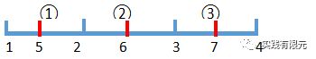

局部单元编号为从左到右，编号为1，2，3，对应二阶形函数的三个形函数N1,N2,N3。因此全局编号的表：    

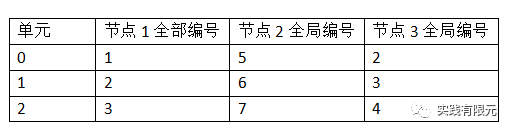

**4.单元系数矩阵推导**  

在确定了二阶插值基函数后，将基函数带入了有限元离散方程中推导即可得到对应部分的系数矩阵，这里同样采取以下公式或者查表的方式获得具体系数

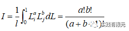

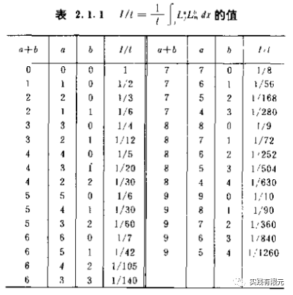

在有了上述积分公式的工具后，这里再次给出系数矩阵的推导过程，其推导方式与一阶基函数的推导过程基本一致：

首先给出每个插值函数的梯度结果：  

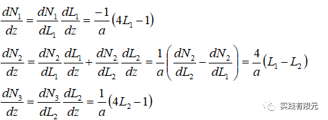

然后推导梯度乘以梯度的积分部分：

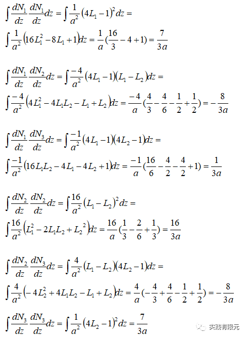

根据有限元矩阵具有对称性的原理，则可以得到最终的梯度乘以梯度的系数矩阵，其中a表示单元边的长度：  

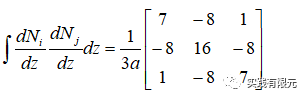

同理，有限元离散方程的第二项，基函数乘以基函数的系数矩阵推导：

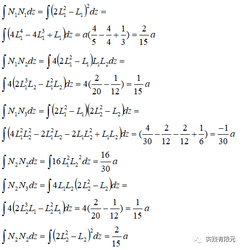

得到第二项的系数矩阵为：  

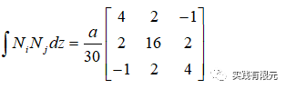

**5.组装全局系数矩阵**  

针对上述三个单元网格的剖分为例，节点总个数为7个，因此最终组合成7\*7的系数矩阵：  

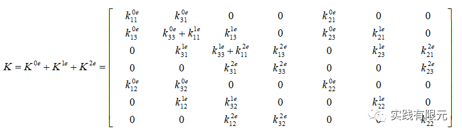

与一阶线性基函数类似，在起始点添加第一类边界条件、在终点添加第二类边界Kf=0

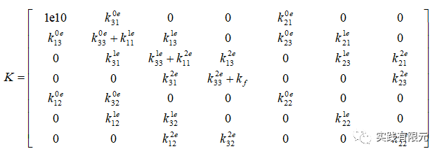

对应的右端项为：

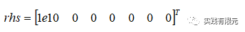

在实际操作中，三等分求解区域后，单元的边长a=2.0944，组装后得到的K具体系数矩阵为：  

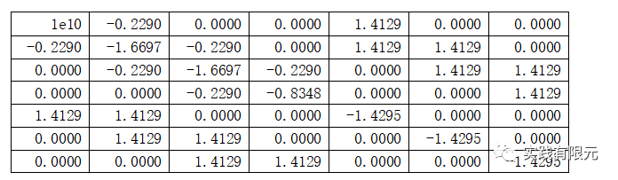

**6.计算结果与对比**  

三个单元网格7个节点的计算结果为：  

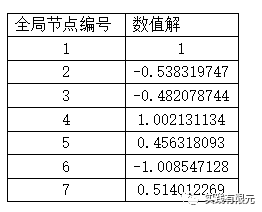

将计算结果插值到每个单元的中心点，以此与1阶基函数对比计算精度，对比的效果更加的明显，其中二阶基函数的插值公式为：  

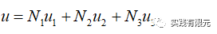

3个网格单元，二阶基函数与一阶基函数对比精度：  

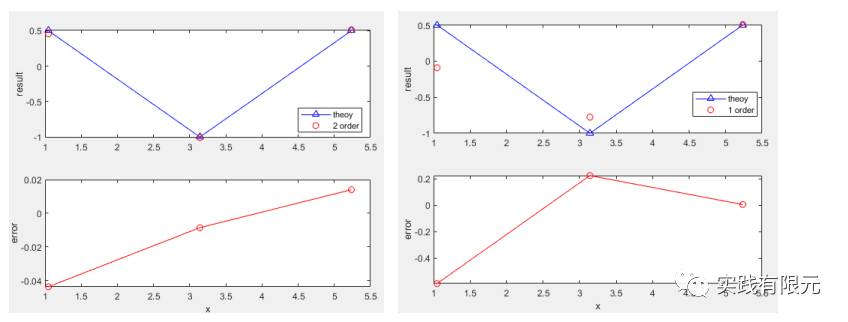

10个网格单元，二阶基函数与一阶基函数对比精度：

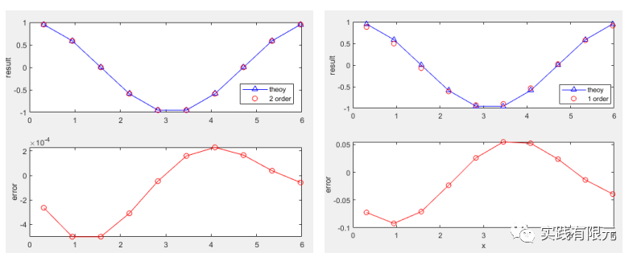

50个网格单元，二阶基函数与一阶基函数对比精度：

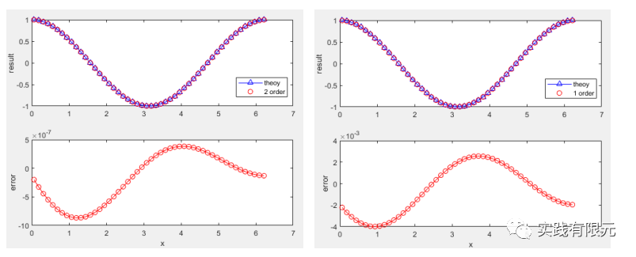

**7.总结**  

    1.高阶（二阶）插值型基函数有限元的流程基本上与低阶有限元一致，区别仅在于插值基函数；  

     2.同等网格下，二阶有限元的计算精度至少是低阶有限元精度的十倍以上。

     3.值得注意的点：I 局部编号与全局编号的必须严格一一映射；II 边界条件必须添加到对应的网格边界点上；