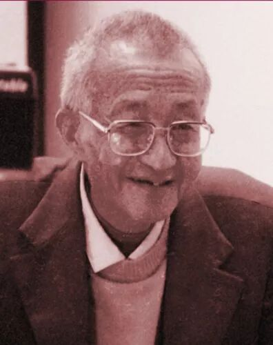
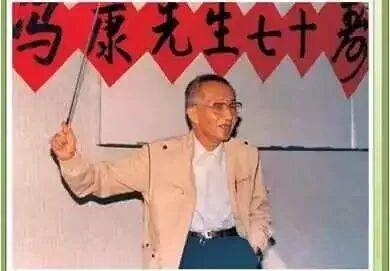
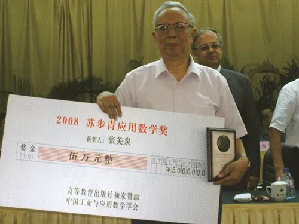
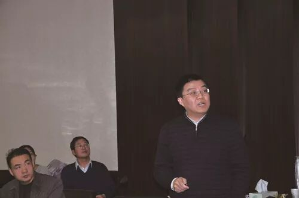
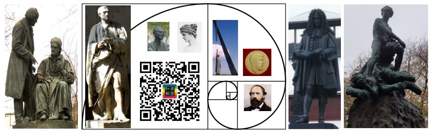

# 一脉相承共谱计算数学华章 | 冯康、张关泉、陈志明侧记

> 原文地址: [https://mp.weixin.qq.com/s/Atv\_p5QXh1qFJv52i2gG4w](https://mp.weixin.qq.com/s/Atv_p5QXh1qFJv52i2gG4w)

科学工程计算已应用于现代社会的各个领域，数值计算成为继理论分析、科学实验之后的第三种科学研究语言。

通过数值模拟手段掌握事物发展的规律，利用数学和计算机解决科学工程问题，研究这些方法和理论的学科就叫做计算数学。

冯康（1920~1993），中国科学院院士。

**开创先河**

在中国，提及数学大家，很多人首先想到的便是华罗庚与陈景润。然而对于数学界来说，还有一个人的名字可与前两者相提并论。

他就是冯康。

法国著名科学家，后来出任法国科学院院长的J.-L. Lions曾对冯康及其团队关于有限元方法的重大发现有如此评价：“有限元方法意义重大，中国学者在对外隔绝的环境下独立创始了有限元方法，在世界上属于最早之列。今天这一贡献已为全人类所共享。”

出生于江苏无锡的冯康，小学、中学时代都是在苏州度过的。

1939年2月，冯康成功考取福建邵武协和学院数理系，但他始终觉得学院教学水平无法满足自己的需求。于是，当年9月，冯康以高考状元的身份考入国立中央大学电机系。

到大三、大四的时候，冯康就几乎已经将物理系和电机系的主要课程读完，但热爱读书又对学术新动向有着敏锐嗅觉的他，迅速地捕捉到数学的新动向，于是他的兴趣也随之发生转变，更倾向于抽象的纯粹数学。

1946年，冯康经人推荐担任清华大学物理系助教。随后，冯康转入清华大学数学系担任助教。由此，他开始正式走上了一条深入钻研数学之路。

纵向来看，1957年以前，冯康主要从事基础数学研究，在拓扑群和广义函数论方面取得了卓越的成就。

1957年，根据国家12年科学发展规划，中国要填补电子计算机研制与应用领域的空白，于是，冯康临危受命，由中国科学院数学研究所调往新成立的计算技术研究所，参加主持我国计算技术与计算数学的开创工作，其后为中科院及全国范围内计算数学队伍的组建、培养及发展做出了多方面的重大贡献。

冯康70寿辰

在上世纪50年代末60年代初，冯康在解决大型水坝计算问题的集体研究实践基础上，独立于西方创造了一整套解微分方程问题的系统化、现代化的计算方法，当时命名为基于变分原理的差分方法，即现在国际通称的有限元方法。

70年代，在间断有限元理论方面，冯康建立了间断函数类的庞加莱型不等式，并在此基础上建立了间断有限元函数空间的嵌入理论，这在国际上是非常先进的。

此外，冯康还将椭圆方程的经典理论推广到具有不同维数的组合流形，即由不同维数子流形组成的几何结构，在国际上为首创，为组合弹性结构理论提供了严密的数学基础，解决了有限元法对于组合结构的收敛性问题。

与此同时，冯康对传统的将椭圆方程归化为边界积分方程的弗雷德霍姆理论作了重要发展，提出自然归化的概念作为边界归化的标准方法，形成了自然边界元方法，它能和有限元法自然耦合而统于一体，实质上成为后来兴起的适合于并行计算的区域分解法的先驱。

张关泉（1937~2012），曾任中科院数学与系统科学研究院研究员，博士生导师。

**传承创新**

当时，在冯康组建的中国科学院计算技术研究所里，可谓风云际会，人才辈出，甚至可以说，几乎延揽了当时国内计算数学方面的全部优秀人才。

在这个团队中，就有后来享誉世界计算数学界的张关泉。

1956年，由于数学、物理方面的出众成绩，张关泉被国家选送到前苏联留学。在基辅大学学习一年后，转入国立莫斯科大学数学力学系学习计算数学。1961年6月，他以全优的成绩获颁特殊优等生数学学士学位证书。

1965年11月至1967年6月，张关泉再次被国家选派到法国巴黎大学理学院的Poincare研究所进修应用数学。

在那个相对封闭的年代，两度被选派出国学习，足以证明张关泉的优秀与杰出。

加入中国科学院计算技术研究所第三研究室后，张关泉主攻计算流体等的初边值问题计算方法，被公认为科研方面的佼佼者。

1964年，张关泉发表了能量守恒的自动偏心计算格式，这是国际上最早的迎风格式之一；他系统地研究了不适定初值问题的性质，构造了有关的差分格式，并证明了不适定问题收敛性的等价定理。

1965年，他发表了“三线定理”等论文，在理论上论证了这类问题计算的可能性，这一成果被国内同行广为引用。

上世纪80年代初，冯康倡导计算数学与工业界相结合，并且建议关注反问题的研究及其在能源方面的应用。

1983年，张关泉受命组建“地球物理勘探问题计算方法研究组”，转向从事 “数学物理方程反问题”这一全新领域的研究。

他于1985年前后系统地构造了“大倾角差分偏移算法”，由此方法所编写的软件自上世纪80年代起就在石油天然气总公司地球物理勘探研究院等多家石油、地矿单位的处理系统中运行。

在短时间内，张关泉从勘探地球物理的外行变为内行，并且很快进入科研的最前沿，成为中国地震资料偏移技术研究方面的重要代表人物，在叠后偏移、叠前偏移、倾角校正、纵横波场分离、吸收边界条件等多项技术方面均有独到贡献。

陈志明，1965 年生，中科院数学与系统科学研究院计算数学与科学工程计算研究所所长、研究员、博士生导师。

**不断深化**

在中国的计算数学领域，既有老一辈传奇人物的开山贡献，也离不开中青年一代的砥柱作用。

身为国家973项目首席科学家的陈志明，现任中国目前唯一的数学类国家级重点实验室——科学与工程计算国家重点实验室主任。计算数学正是他一直坚持的事业。

自适应有限元方法的思想最早出现在1978年，自适应有限元的创始人Babuska完成了这一方法的基本理论。

但那时，自适应有限元方法被用来解决一些比较简单的数学模型问题，而陈志明的工作就是用它来解决比较复杂和困难的工程问题。

不过，从简单问题到复杂的工程问题，这个方法要经历和解决的困难却无法轻描淡写。

自适应有限元方法以经典的有限元方法为基础，以后验误差估计和自适应网格改进技术为核心，通过自适应分析，自动调整算法以改进求解过程。

从方法论角度来说，人们已经得到结论，自适应是用有限元方法解微分方程的最优离散方法。在微分方程求解的有限元道路上，自适应已经是数学上能找到的“极限”方法了。

在实际生产实践中，很多工程问题的解决都要用到微分方程，但用计算机求解微分方程需要进行大量计算。

有时候，为了把误差控制在足够小的范围内，需要进行上亿次的运算，这对一般计算机来说非常吃力。因为有时即便进行上百亿次运算，也无法把误差控制在理想范围之内。

“为了减少运算次数、控制误差范围，我们需要更好的求解方法。”陈志明就提供了这样的解决方案。他在椭圆障碍问题、超导数学模型、电磁散射计算中开展了有限元后验误差估计和自适应方法的研究，被国际同行认为“非常重要和有用”。

“用有限元方法解微分方程有三步：设计网格、在网格上将微分方程离散、解代数方程。其中，设计网格是最关键也是最困难的一步。”他表示，所谓设计网格，就是把计算区域划分为有限个互不重叠的单元。陈志明说，人们往往根据经验来划分网格，有时需要反复尝试多次才能找到比较合适的划分方法，而尝试过程也需要进行大量运算。

“现在，用自适应方法解微分方程，设计网格的工作可以交给计算机自动完成，不再需要人们手工设置和尝试，这样节省了大量工作和时间。”陈志明说。

