# 三棱柱矢量有限元实现

> 原文地址: [https://mp.weixin.qq.com/s/WKnCl5SSHzrqOex0\_PqLQw](https://mp.weixin.qq.com/s/WKnCl5SSHzrqOex0_PqLQw)

**简述**

本篇介绍三棱柱矢量有限元实现过程，难度较大，期间遇到了bug，花费了接近两周的时间搞定。

三棱柱的优点在实现节点有限元过程中也说过，本身由四面体和三角形组合而成，因此也具备二者特性，在一个方向上是结构化网格，另外两个方向是非结构三角形网格。这特性对于一些特殊问题（例如极薄模型）非常有优势，能够避开四面体网格质量极差，甚至无法剖分的情况。

废话不多说，边值问题还是以电场矢量波动方程为例，具体的有限元推导这里不再介绍，详细参考：[电场矢量波动方程的三维有限元实现](http://mp.weixin.qq.com/s?__biz=MzkwNzUxOTM2NA==&amp;mid=2247484407&amp;idx=1&amp;sn=7d4552a3bef4471c0f6e202d684047ae&amp;chksm=c0d6b71cf7a13e0af43f853105dca9dfaf33f89aae01fa3648c15ac23de1a1aa9c24cc079e6d&scene=21#wechat_redirect)

**1.三棱柱矢量基函数**

三棱柱网格单元如下，其包括6个顶点，9条边，假设三角形面所在平面为XY,则三棱柱的柱状朝向是Z方向。

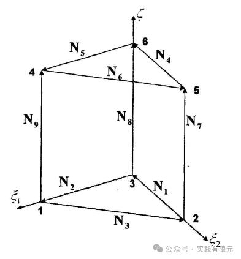

不难发现，三棱柱的矢量基函数是由三角形基函数与线单元基函数组合而成，因此首先给出二者插值基函数表达式与梯度：    

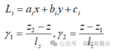

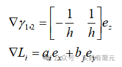

由此，给出三棱柱矢量基函数表达式：

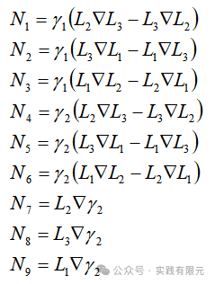

根据以上规律，给出各个基函数对应的节点编号顺序如下：

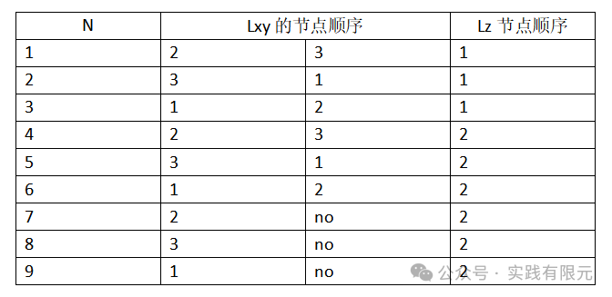

从表达式不难看出，XY方向的三角形矢量基函数和Z方向线单元基函数组合而成。同时需要注意，根据单独插值基函数的梯度表达式发现其均具有方向，因此可以得到三棱柱三个方向的插值基函数：

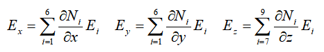    

可以发现，Ez的方向插值基函数仅使用了N7~N9，因为N1~N6的基函数不具有Z分量。

**2.单元系数矩阵的推导**

根据矢量波动方程的有限元方程：

首先考虑第一项积分，根据三棱柱矢量基函数规律，可以把系数矩阵分为9块亚矩阵：

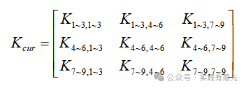

已知，二维三角形基函数的旋度结果为：

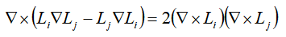

首先推导三棱柱基函数N1~N3求旋度：

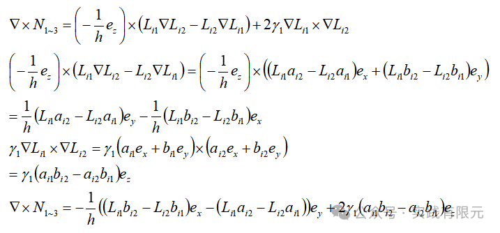

根据N1~N3和N4~N6的相似度，观察可知二者相差一个负号：

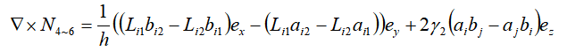

继续推导N7~N9的旋度公式：    

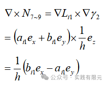

得到各个部分单独的旋度结果后，进而继续推导其乘积：

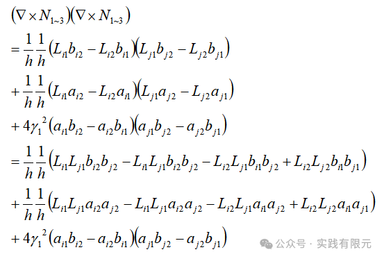

为了简化，这里可以令常数项为：

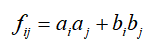

因此，简化curN13curN13推导结果为：

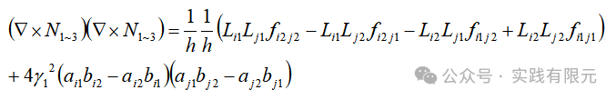

观察不难发现，curN46curN46的结果与curN13curN13相差仅仅是Z方向，因此可以直接得到：

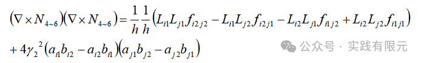

继续推导curN79curN79的结果，比较容易得到：    

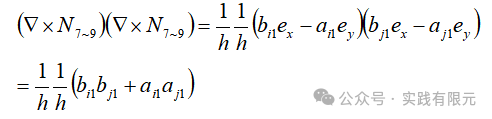

非对角线结果也同样可以得到：

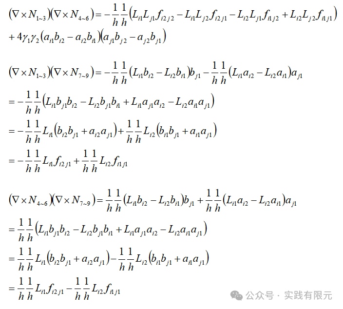

继续推导Knn部分，相对就简单很多：

由此，剩下就是把对应部分根据下面基本部分的积分结果积分即可：    

例如，对curN13curN13的积分表达式为：

将XY面的三角形基函数积分和Z轴的线单元分开积分，根据LiLj中i.j的不同取值，得到具体结果。这里不再扩大篇幅推导得到具体的系数值，因为给出了上述通式后对于编程实现会更加的容易。

**3.系数矩阵组装**

这里组装与常见的矢量有限元的注意点是一致的：

a.确保棱边方向唯一性

每个棱边具有唯一方向，因此在组装过程中，务必确保唯一性，三棱柱的棱边方向不同于六面体几乎已知的，因此采取四面体的方法，将节点小到节点大作为棱边正方向。

b.棱边编号的获取

获取棱边编号与每个三棱柱映射关系，这也是一个难点，由于没有现成的剖分三棱柱的软件，因此只能自己实现，这里给出最简单的三棱柱，以供参考，对于numx\*numy\*numz=2\*1\*1的网格，三棱柱网格共计有4个：    

12个节点坐标信息：

24条棱边与节点编号映射关系：   

三棱柱单元到节点编号映射关系：

三棱柱单元到棱边编号映射关系：

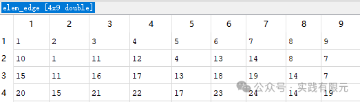

c.第一类边界条件的加载

这里的棱边不再仅仅是固定的三个轴向方向，因此第一类边界的加载需要乘以该方向的方向向量，具体做法参考四面体的做法：[三维矢量有限元实现过程-电场矢量波动方程](http://mp.weixin.qq.com/s?__biz=MzkwNzUxOTM2NA==&amp;mid=2247484851&amp;idx=1&amp;sn=c6d899b716270aae4affa3926b24cc27&amp;chksm=c0d6b158f7a1384efb83af0078ceba4d45a359c710e0b5392197431c02c22ef5db7d3c6f470c&token=957889117&lang=zh_CN&scene=21#wechat_redirect)

**4.结果展示**

测试模型大小10\*10\*20m，各个方向网格大小为10\*10\*20,共计4000个三棱柱，9140个棱边。网格如下：

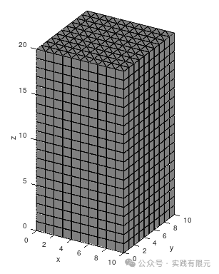

可视化结果的插值公式，将结果插值到三棱柱的中心点上，然会将两个同在六面体的三棱柱的结果取平均作为六面体的结果，如此能更好实现三维可视化结果。三棱柱中心点插值公式如下：

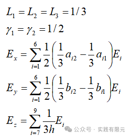

需要注意：上述没有考虑棱边的方向性问题，因此具体实施的时候还需要乘积单元上棱边对应的正负系数。    

**a.频率为1e4Hz,电导率为1欧姆米，与解析解对比**

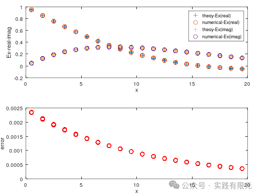

误差低于1%，并且可以发现，该结果与六面体的矢量有限元结果误差是一致的。三维可视化结果，仅展示Ex方向结果：

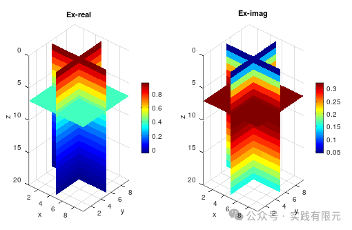    

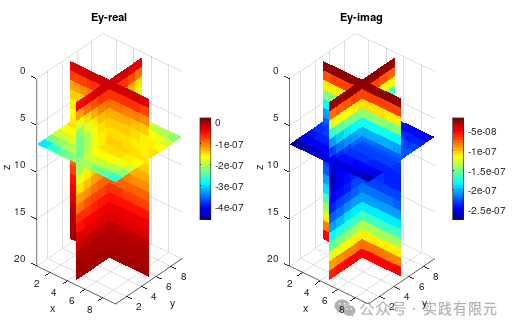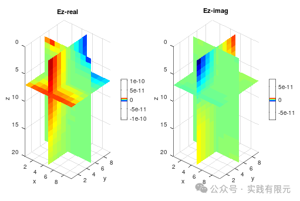

与预期一致，当电场传播方向为Z方向，振动方向为X方向时，仅有Ex存在，而在YZ方向的电场基本上等于零。

**b.频率为1e4Hz,电阻率为1欧姆米。中间存在一个立方体的区域电阻率为0.001欧姆米。其三维可视化结果如下：**    

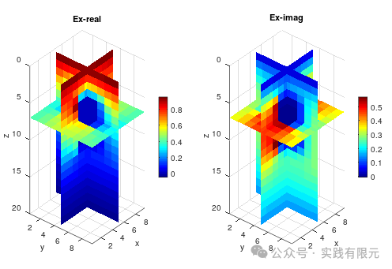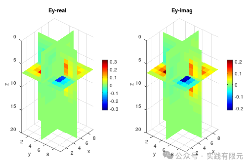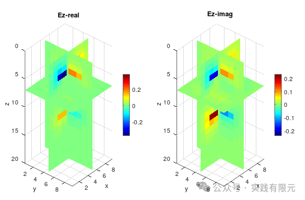    

可见，在材料不一致的区域，电场的异常反应还是非常明显，并且在Ex的振动方向，在X的方向碰到分界面出现了明显的突变情况，也是符合预期的。其他两个方向也分布有电场响应，这是由于电场的在分界面的散射导致的，同样，在各自方向的分界面上出现了明显电场突变情况。

**5.总结**

a.所有矢量有限元的关键，必须确保棱边方向具有唯一性；

b.可以对比之前的三维四面体与三维六面体结果，可以发现虽然三棱柱具有一定非结构网格的特征，但是其精度可以达到与六面体网格几乎一样的精度，当然，这可能也是由于网格比较均匀的缘故。

c.期间遇到的一个bug,虽然单元系数矩阵中编程的时候存在小错误，但是却不体现在结果上，只有对各个方向均实验电场发射之后，才发现问题所在，这一点需要特别注意，一个方向发射不一定正确，只有所有方向发射均为错误才能保证系数矩阵完全正确。

d.三棱柱的网格剖分知之甚少，对了解的能实现三棱柱网格剖分的软件几乎没有，因此在实现过程中三棱柱的网格剖分成为一个难点，当然本次实现是将均匀六面体网格一分为二实现的。