# 三维三棱柱单元有限元实现-泊松方程

> 原文地址: [https://mp.weixin.qq.com/s/wXkBIF08wieizeulQpQxdA](https://mp.weixin.qq.com/s/wXkBIF08wieizeulQpQxdA)

**简述**

本文介绍一种网格单元：三棱柱单元，并通过简单的泊松方程来实现其有限元流程。

这种单元特殊性在于在两个方向上是非结构，而剩下方向是结构化的，这导致对于一些特殊场景，比如某个方向变化远没有其他两个方向复杂的时候，使用三棱柱单元剖分能在保证几何形态的同时有效的降低网格量。

同样，possion方程的微分问题与有限元方程这里不再赘述，详细参考：[泊松方程三维结构化有限元实现初探](http://mp.weixin.qq.com/s?__biz=MzkwNzUxOTM2NA==&amp;mid=2247484317&amp;idx=1&amp;sn=0994f0defe3d8e191eda70a4a355c67a&amp;chksm=c0d6b776f7a13e60dab1dec71969db6c551352966abf83f78d979173a6cc69029b732b1a609f&token=1903589081&lang=zh_CN&scene=21#wechat_redirect)

**1.三棱柱基函数推导**

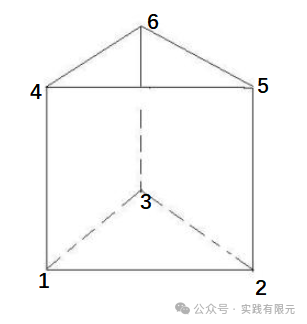

分析上述三棱柱示意图的组成形式，由XY平面的上下两个三角形和Z方向的三条线连接组合而成，因此考虑三棱柱基函数也可以由三角形基函数和线单元基函数组合而成。

已知XY平面的三角形基函数（参考：[同轴线求电容，初探泊松方程的二维非结构化有限元](http://mp.weixin.qq.com/s?__biz=MzkwNzUxOTM2NA==&amp;mid=2247483980&amp;idx=1&amp;sn=9803c31966314d8fbd90cede9faa1b60&amp;chksm=c0d6b6a7f7a13fb19c485e758759ae83a99bc808c940178bd52bdedc32b5884c98969d8d4e6e&token=1903589081&lang=zh_CN&scene=21#wechat_redirect)）与Z方向的线单元（参考：[最简单的一维有限元问题：求解cos函数分布](http://mp.weixin.qq.com/s?__biz=MzkwNzUxOTM2NA==&amp;mid=2247483689&amp;idx=1&amp;sn=238051a214893aec197bde3511363463&amp;chksm=c0d6b5c2f7a13cd49795a90d7a3509ff6e6a5fbd744fe1f1721af17a4cb8e93827383ddc9d60&token=1903589081&lang=zh_CN&scene=21#wechat_redirect)）：

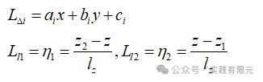

组合二者，得到三棱柱的6个节点基函数：

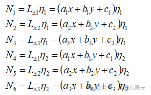

所以，三棱柱内任意位置的插值公式表示为：

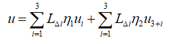

根据三角形基函数规律与线单元基函数规律，不难得出，当p点落在任意一节点的时候，对应节点的基函数等于1，其他基函数等于0。三棱柱内任意点在z方向移动时，符合线单元的线性变化规律，在x,y轴变化的时候，符合面积坐标规律，说明三棱柱组合而成的形函数符合要求

继续推导得出三棱柱基函数的梯度表达式：

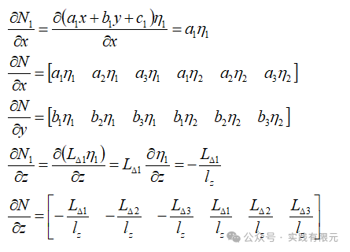

**2.系数矩阵推导**  

针对三维泊松方程梯度项的有限元方程：

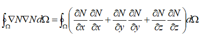

首先考虑x方向的梯度项乘积积分的推导：

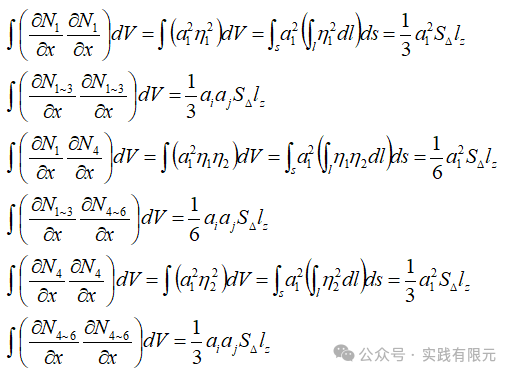

  

组合成系数矩阵为：

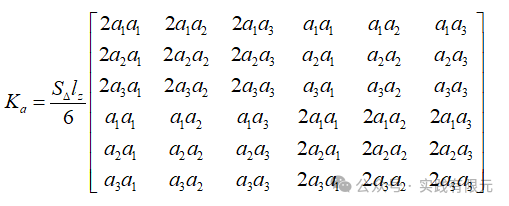

上述积分中线单元部分的积分可以使用一维线单元积分公式：

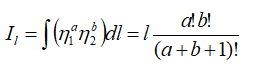

针对第一项对y的偏导，可以直接将对x的偏导的系数结果中的a系数改成b系数即可。对于第三项对z偏导的推导：

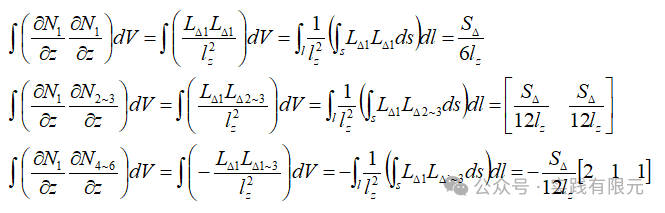

上述积分中的二维积分推导可以使用二维三角形积分公式：

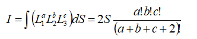

其他项可以类比得出，最终得到关于z方向上的系数矩阵：

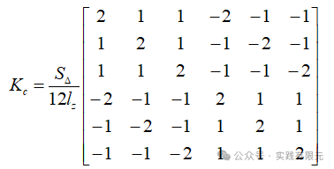

由此，得到偏导数整体的单元系数矩阵：  

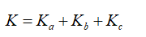

针对泊松方程的右端项的有限元单元系数向量的推导：  

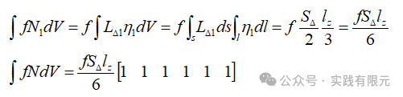

  

**3.总体系数矩阵组装**  

对于三棱柱的网格生成软件，这里没有特别调研，本次使用的三棱柱网格是自己生成的相对结构化的网格。如下图，对于一个2\*2\*1的三棱柱网格：

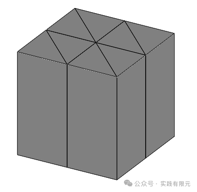

节点共计18个，全局节点编号如下：

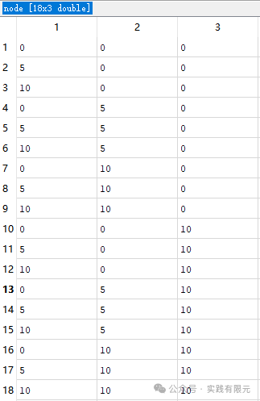

三棱柱单元共计8个，与全局节点编号：  

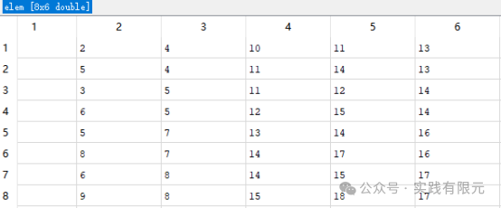

通过上述单元与节点的全局关系，即可在获得每个单元的6\*6单元系数矩阵后，将这些单元系数矩阵一一组装累加起来，从而得到全局18\*18系数矩阵与全局18\*1向量的右端项。边界条件依旧采用第一类边界条件，边界上u=0，对六个边界面上的节点均乘以大数处理。

其组合方式与四面体、六面体网格的有限元组装方式一致，具体组装结果这里不再显示。

  

**4.结果显示**

设置网格20\*20\*10,共计8000个三棱柱网格：

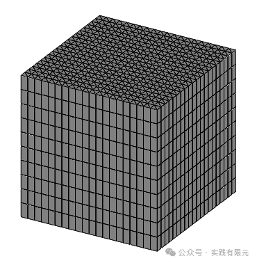

求解的possion切片图显示：

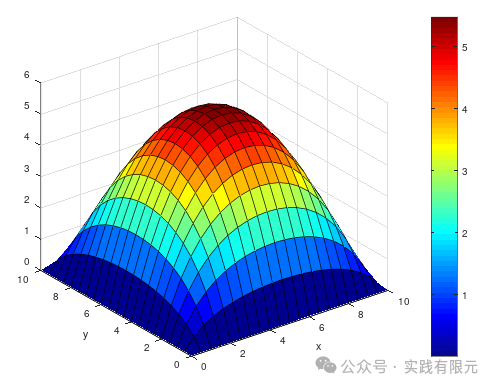

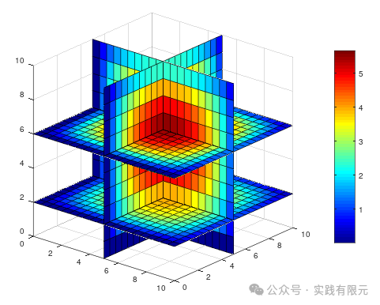

不难看出，求解结果与之前的四面体、六面体网格的结果是一致，说明整个三棱柱的基函数、系数矩阵推导过程都是正确性。  

  

**5.结论**  

1.三棱柱单元的有限元实现过程的重点还是三棱柱基函数的确定与系数矩阵的推导，其他流程与一般的有限元流程一致。  

2.如三棱柱网格剖分图显示，三棱柱网格的优势在于某个平面上是非结构化的三角形网格，这使得在这个平面上可以要求模型为复杂模型；而在另一个方向上是结构化网格，可以模拟一些相对于平面尺寸极薄、极厚的模型，并且不会生成如四面体网格那样畸形的差网格。