# 三维四面体一、二、三阶叠层有限元实现与精度对比-高斯积分

> 原文地址: [https://mp.weixin.qq.com/s/hOKKSTtcBFISLN6csQOPJA](https://mp.weixin.qq.com/s/hOKKSTtcBFISLN6csQOPJA)

**简述**

相比于插值基函数有限元，叠层基函数的公式相对更加简单，缺点是实现过程中如果出现问题，很难查找具体原因。

本文以霍姆霍兹方程为边值问题，在使用高斯积分的基础上，分别实现基于叠层基函数的一阶、二阶、三阶有限元。

过程中一阶、二阶很快成功实现，但是三阶却达不到对应的精度，其结果仅仅比二阶稍微好一点，明显存在问题，但是却无法找到问题所在。

所涉及的文章有以下几篇，相关内容也不再赘述。

[三维四面体三阶有限元实现-泊松方程](http://mp.weixin.qq.com/s?__biz=MzkwNzUxOTM2NA==&mid=2247486022&idx=1&sn=4648777d2ed6a65cc39d1397933220e1&scene=21#wechat_redirect)

[泊松方程-三维四面体插值基函数有限元实现-高斯积分](http://mp.weixin.qq.com/s?__biz=MzkwNzUxOTM2NA==&mid=2247485986&idx=1&sn=5af48b761e8f03a283ab32cff6b83cfa&scene=21#wechat_redirect)

[三维高阶叠层与插值有限元细节对比-霍姆霍兹方程](http://mp.weixin.qq.com/s?__biz=MzkwNzUxOTM2NA==&mid=2247484625&idx=1&sn=39e0ccf8427523d5b300e2ba2fb3cfce&scene=21#wechat_redirect)

[泊松方程三维二阶叠层有限元实现-四面体](http://mp.weixin.qq.com/s?__biz=MzkwNzUxOTM2NA==&mid=2247484540&idx=1&sn=c728e340368a3e243fa51690e0d6247e&token=1799938921&lang=zh_CN&scene=21#wechat_redirect)

**1.边值问题**

这里简单给出边值问题，霍姆霍兹方程表达式：

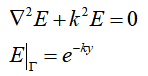

**2.四面体基函数表达式**

使用面积坐标获得线性基函数及其梯度表达式：

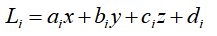

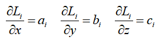    

一阶基函数表达式及其梯度：

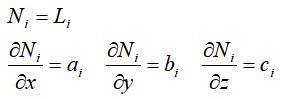

二阶叠层基函数（包括一阶部分的N1~4）及其梯度：

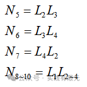

其对应的梯度为：

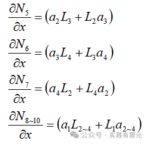

三阶基函数（包括二阶部分内容不再展示）及其对应的梯度：

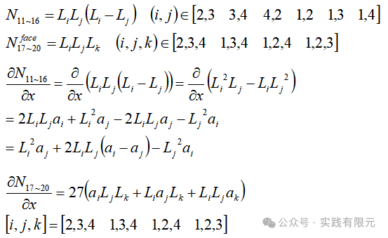

**3.高斯积分、系数矩阵组装、边界条件加载**

I.高斯积分方式与对应的积分权重系数表格参考：[三维四面体三阶有限元实现-泊松方程](http://mp.weixin.qq.com/s?__biz=MzkwNzUxOTM2NA==&mid=2247486022&idx=1&sn=4648777d2ed6a65cc39d1397933220e1&scene=21#wechat_redirect)。

II.系数矩阵组装需要全局映射关系与局部映射关系一一对应。 

III.叠层基函数的边界条件加载参考：[泊松方程三维二阶叠层有限元实现-四面体](http://mp.weixin.qq.com/s?__biz=MzkwNzUxOTM2NA==&mid=2247484540&idx=1&sn=c728e340368a3e243fa51690e0d6247e&token=1799938921&lang=zh_CN&scene=21#wechat_redirect)。

**4.结果展示**

**一阶结果与理论解析解对比：**

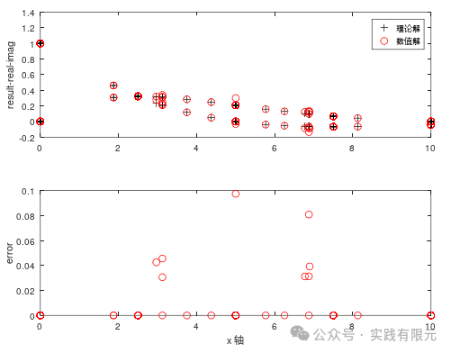

**二阶结果与理论解析解对比：**    

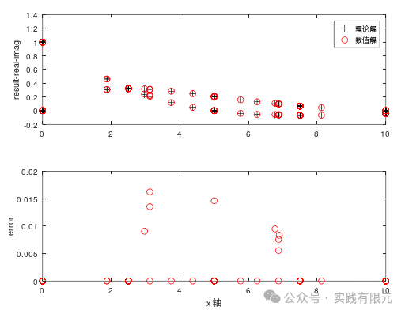

**三阶结果与理论解析解对比：**

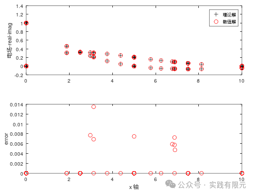

三阶的可视化结果:

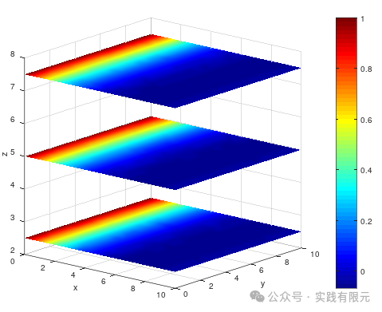

叠层基函数与插值基函数不同阶数精度对比统计：

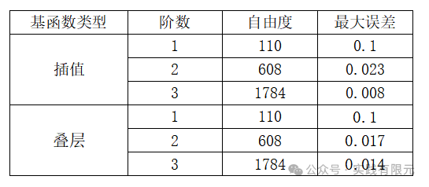

粗略看上述的结论，一阶、二阶、三阶的精度均是正确的，但是详细看会发现，三阶叠层基函数的精度并没有提高多少，这里基本上可以明确是存在问题的，因为三阶叠层精度与对应的插值基函数的三阶精度不在一个量级上，但是在经过大量查找问题后，发现现有知识理解确实找不到其中问题所在,暂时无法解决。

**总结**

在实现叠层基函数过程中，二阶稍微简单、但是三阶涉及到棱边顺序相对更加困难，因为相对于插值基函数而言，叠层基函数的高阶更加的难以实现。

这里分析三阶叠层有限元存在问题的地方大概率是局部映射关系与全局映射关系的问题，但是以我理解又没有错误，早在之前二维的高阶叠层基函数中也遇到过类似的问题，也是如此结果，看样子确实不得其中要义。

对此问题有理解、想法的小伙伴们也欢迎留言讨论。