# 三维四面体三阶有限元实现-泊松方程

> 原文地址: [https://mp.weixin.qq.com/s/u6l\_vFZucZkaKpFPpFEJrg](https://mp.weixin.qq.com/s/u6l_vFZucZkaKpFPpFEJrg)

**简述**

在上篇文章中，基于高斯积分原理，快速实现了泊松方程与霍姆霍兹方程三维四面体一阶、二阶有限元求解，本文将继续实现三阶插值基函数的有限元流程。

泊松方程与霍姆霍兹方程两种边值问题，请参考上篇文章：

[泊松方程-三维四面体插值基函数有限元实现-高斯积分](http://mp.weixin.qq.com/s?__biz=MzkwNzUxOTM2NA==&mid=2247485986&idx=1&sn=5af48b761e8f03a283ab32cff6b83cfa&scene=21#wechat_redirect)

**1.三阶基函数推导**

已知面积坐标得到的线性积函数表达式：

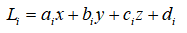

其中，对应方向的梯度有：

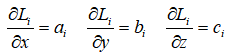

四面体任意阶插值基函数的通式为：

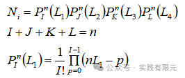

当n=3的时候，共计20个节点，如下图所示，4个顶点，12个棱边点，4个面点：

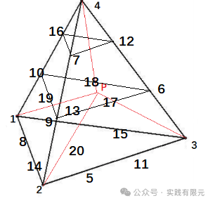    

将n带入通式，可以求解得到与四面体对应的三阶插值基函数，这里展示其中两个基函数的带入方式：

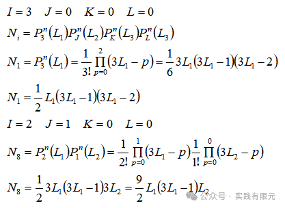

如此依次类推，得到共计20个基函数表达式：

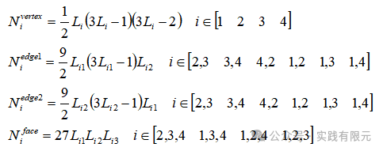

其中，Vertex表示四面体四个顶点、edge1edge2表示六条棱边上两个三分点、face表示面中心点，对应的基函数梯度可以表示为：

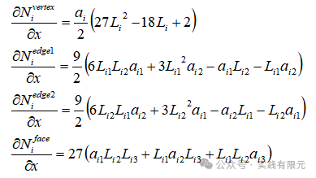

**2.高斯积分**

高斯积分形式与文章[泊松方程-三维四面体插值基函数有限元实现-高斯积分](http://mp.weixin.qq.com/s?__biz=MzkwNzUxOTM2NA==&mid=2247485986&idx=1&sn=5af48b761e8f03a283ab32cff6b83cfa&scene=21#wechat_redirect)完全一致：

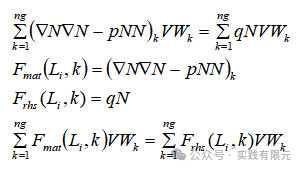

其中，Fmat，Frhs可以通过高斯积分点获得，V是四面体的体积，对于三阶四面体网格的高斯积分点位置对应的面积坐标权重值与积分权重值如下：

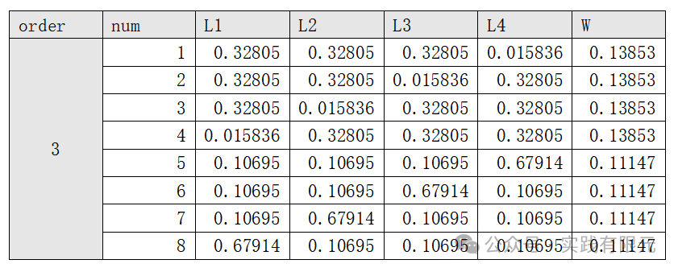

整个过程与一阶、二阶完全一致，格式流程没有半点变化。  

**3.系数矩阵组装与边界条件加载**

整个三阶有限元的实现过程，关键点是基函数及其梯度的推导。而难点则是四面体网格的全局节点排序与局部节点排序的一致性。

首先需要得到棱边的唯一编号与面的唯一编号，其中节点编号与面编号都仅仅对应一个自由度，不足为虑，而每条棱边对应两个自由度，并且这两个自由度是存在顺序关系的，因此这里需要特别注意确保局部棱边的两个自由度与全局的棱边自由度对应一致。    

边界条件的加载与以前文章介绍的方法一致，这里需要注意的是在边界面上，需要对边界的顶点、棱边点、面点均赋值对应的边界条件。

**4.结果展示**

由于三阶有限元会导致自由度急剧增加，因此这里剖分了一个网格量小的模型对结果进行验证。

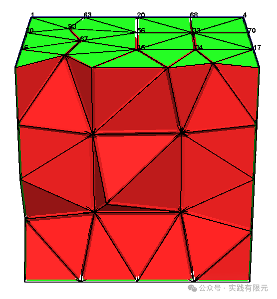

**a.泊松方程三阶**    

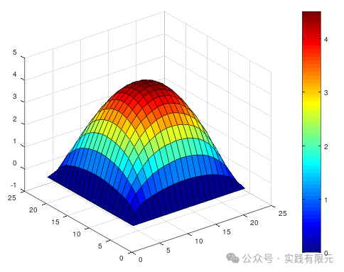

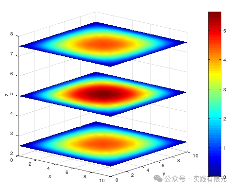

**b.霍姆霍兹方程模拟电场衰减过程：一阶、二阶、三阶与理论解析解对四面体顶点精度：**    

**_I.一阶精度：_**

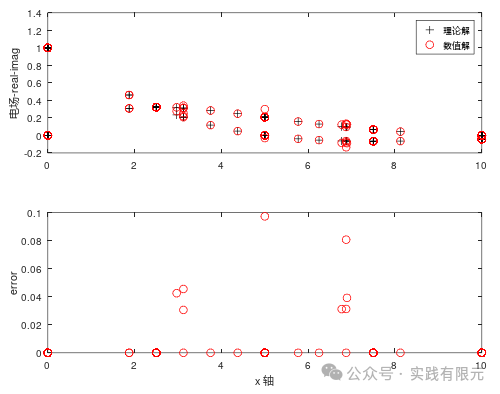

**_II.二阶精度：_**

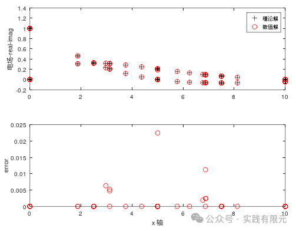

**_III.三阶精度：_**

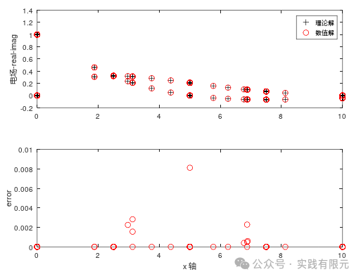

粗略统计不同阶数的最大误差如下表：  

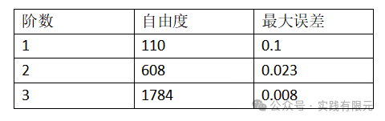

可见，随着精度增加，最大误差在逐渐减小，但是可以发现精度收敛并不是太明显，这是由于实际网格过少导致的。即使如此，高阶的精度的确也确实比低阶的精度要高。

下面是三阶可视化结果（分布表示未知数的实部虚部）：    

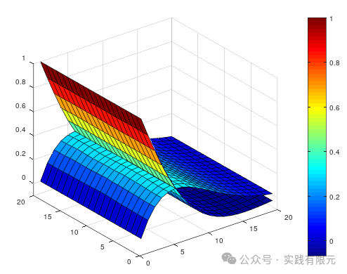

**最后**

本次实现了三维四面体网格的三阶插值基函数有限元算法。其中有两点关键点：1.插值基函数的获取与有效的利用高斯积分原理获得单元系数矩阵；2.局部的顶点、棱边点、面点需要和全局节点一一对应。