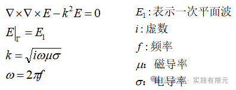
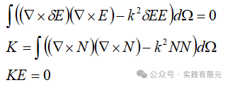
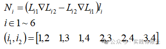
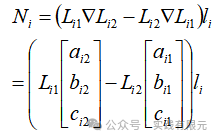
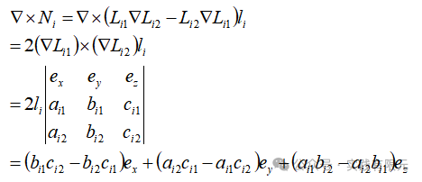
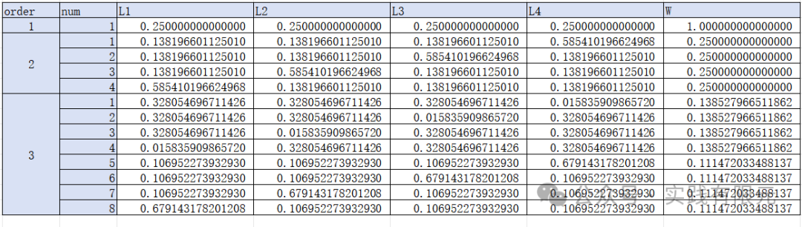
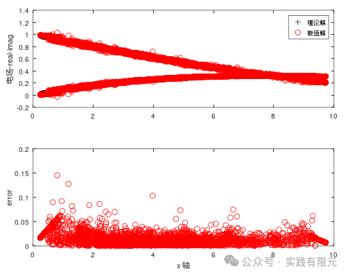
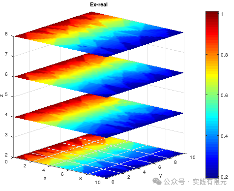
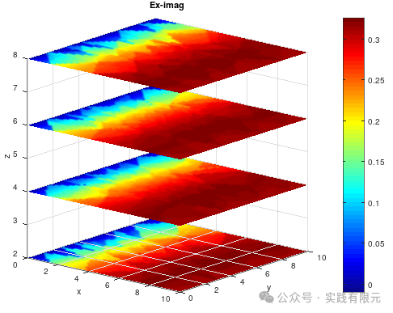
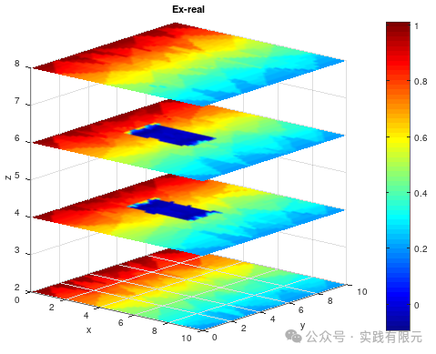

# 三维四面体矢量有限元实现-霍姆霍兹方程-高斯积分

> 原文地址: [https://mp.weixin.qq.com/s/XMNpv6ELNinowlU6-23Kdw](https://mp.weixin.qq.com/s/XMNpv6ELNinowlU6-23Kdw)

**简介**

相比于节点有限元而言，矢量有限元无疑是更加难以实现的。两个难点，其一要求知道全局棱边变化、面编号，这相对于一般的仅包含节点编号的常规网格剖分软件而言，是难点之一；其次优于其采用具有方向性质的矢量基函数，这也使得难度增加。

在之前，采用直接推导单元系数矩阵方式的四面体矢量有限元已经实现，本文使用高斯积分的方法，避免推导复杂的单元系数矩阵，为后续实现高阶矢量有限元打下基础。

本文采用边值问题为描述电场衰减的霍姆霍兹矢量方程，其有限元推导等流程可以参考下列文章，本文重点介绍使用高斯积分实现单元系数矩阵求解的过程，并将结果与之前结果做对比验证。

[文章A:三维矢量有限元实现过程-电场矢量波动方程](http://mp.weixin.qq.com/s?__biz=MzkwNzUxOTM2NA==&mid=2247484851&idx=1&sn=c6d899b716270aae4affa3926b24cc27&scene=21#wechat_redirect)

[文章B:电场矢量波动方程的三维有限元实现](http://mp.weixin.qq.com/s?__biz=MzkwNzUxOTM2NA==&mid=2247484407&idx=1&sn=7d4552a3bef4471c0f6e202d684047ae&scene=21#wechat_redirect)

**1.边值问题与有限元方程**

边值问题为：

推导可以得到有限元方程：

    

详细推导过程请参考：[文章B](http://mp.weixin.qq.com/s?__biz=MzkwNzUxOTM2NA==&mid=2247484407&idx=1&sn=7d4552a3bef4471c0f6e202d684047ae&scene=21#wechat_redirect)。  

**2.四面体棱边基函数**

根据四面体网格，首先得到线性插值基函数：

根据下面四面体图形的棱边编号，可以得到对应的单元四面体棱边与节点的映射关系：

因此，棱边基函数的具体表达式可以描述为：    

可以直观的通过基函数发现，其矢量基函数是棱边两个节点之间相减的关系，因此相减的顺序不同，结果也就相差一个符号，因此在全局棱边中，得确保棱边的方向一致，例如棱边编号从小到大，或者从大到小。

将棱边基函数写成通式表达式有：

将式子中梯度项展开，得到：

对于有限元方程中的旋度项，很容易推导得到基函数旋度项的通式：

由此，有关基函数的推导介绍。   

**3.高斯积分**

对上述有限元方程进行高斯积分的展开方式与节点有限元一致，没有任何区别，详细可以参考：[文章A](http://mp.weixin.qq.com/s?__biz=MzkwNzUxOTM2NA==&mid=2247484851&idx=1&sn=c6d899b716270aae4affa3926b24cc27&scene=21#wechat_redirect)，这里给出高精度的高斯积分点与权重值。

**4.四面体网格、系数矩阵组装与边界条件加载**

这部分内容也和[文章A](http://mp.weixin.qq.com/s?__biz=MzkwNzUxOTM2NA==&mid=2247484851&idx=1&sn=c6d899b716270aae4affa3926b24cc27&scene=21#wechat_redirect)方式完全一致，这里不再赘述。

**5.结果展示**

为了和文章XX的结果进行对比，采用同样的网格模型与节点数目：研究区域大小10m\*10m\*10m,频率10000Hz,电导率1欧姆米。网格为4314个四面体，872个节点，5485条棱边，所以5485个未知数。

**a.介质为均匀介质时，求解的数值解与理论解对比：**   

可见，结果与文章A的有限元结果完全一致，也证明了本次实现的间接使用高斯积分求解单元系数矩阵是成功的。其三维可视化的插值结果，也是一致的：

    

可以从可视化结果看到，由于网格原因，其电场可视化结果也容易出现“块状”的分布，这也是低阶矢量有限元的问题，由于在法向方向完全没有约束，导致分界面上泾渭分明。

**b.当介质不均匀时，存在低电阻率情况，电场Ex的分布如下：**   

可见，模型中间介质材料不一致的区域，电场得到了很好的表现。

**总结**

与[文章A](http://mp.weixin.qq.com/s?__biz=MzkwNzUxOTM2NA==&mid=2247484851&idx=1&sn=c6d899b716270aae4affa3926b24cc27&scene=21#wechat_redirect)相比，仅仅是单元系数矩阵的求解方式不同，[文章A](http://mp.weixin.qq.com/s?__biz=MzkwNzUxOTM2NA==&mid=2247484851&idx=1&sn=c6d899b716270aae4affa3926b24cc27&scene=21#wechat_redirect)是直接推导公式求解，本文是使用高斯积分求解，因此只要矢量基函数及其梯度推导正确，高斯积分的展开没问题，那么很快就能在原有基础上得到使用高斯积分求解方式的矢量有限元结果。

可以发现这种方法确实要方便很多，这也为后续实现二阶矢量基函数奠定基础。