# 三维曲面四面体有限元实现-泊松方程


> 原文地址: [https://mp.weixin.qq.com/s/lXcCPBWARDbZkoIjpiK6KA](https://mp.weixin.qq.com/s/lXcCPBWARDbZkoIjpiK6KA)

简述

继上次实现了二维曲面有限元之后，本文继续探讨三维四面体曲面有限元的实现技术。

与二维曲面有限元一样，其关键技术两点，1是曲面四面体网格的划分，这里使用gmesh实现，直接剖分成二阶四面体网格；2是曲面四面体到参考直边四面体的映射关系。

1、边值问题

本案例以单元球体为例，使用泊松方程为微分方程，采用以下边值问题：

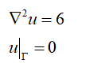

该方程存在解析解：

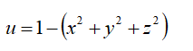

其有限元离散问题为：

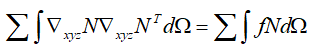

2、gmesh网格剖分

直接让AI生成了一个gmesh输入几何geo文件，模型为一个球形。

```
SetFactory("OpenCASCADE");
```

生成结果如下，同样仔细观测可以发现，在表面的棱边并不是直线，其棱边中点并不在棱边上，而是在契合曲面的位置。

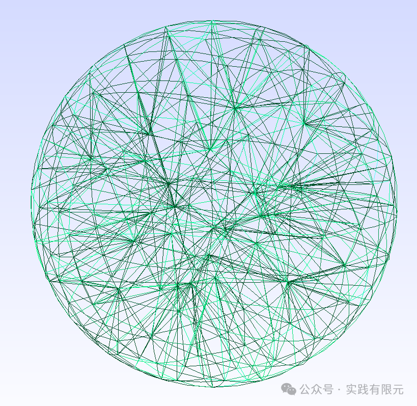

进一步观察gmsh文件，其每个四面体均有10个点组成，即四个顶点+六个棱边点。相比之前的直边四面体仅需要四个顶点描述，二阶四面体（曲面四面体）因为其六个棱边点不一定在棱边中点，因此需要10个点描述。

3、曲边四面体到直边四面体

上述描述了二阶四面体由10个点组成，从等参单元的角度考虑，有限元应该也使用二阶基函数，如此才能恰好使用二阶四面体的特征。

由于是曲边四面体，那么传统的直接在原四面体上使用体积坐标获取基函数的方式不再可行，因此使用坐标转换公式将任意曲边四面体映射到参考四面体进行处理。而参考四面体即可选择最简单的直边四面体。如下：   

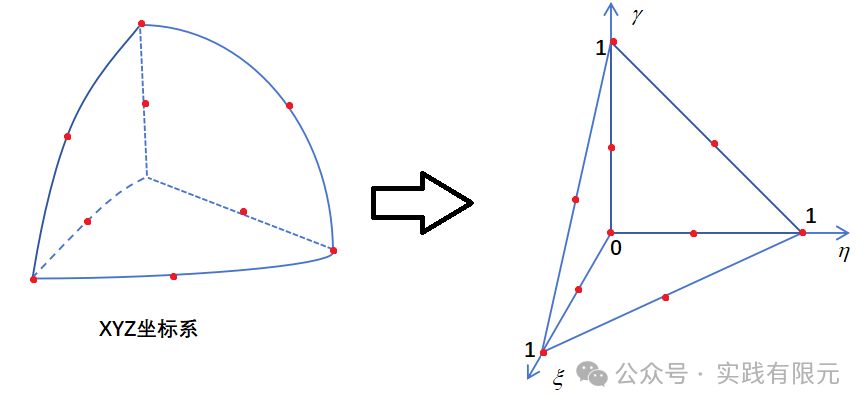

对于处理参考坐标系的二阶基函数，相对而言就很容易获得其对应的线性基函数与二阶形函数。参考坐标系的线性基函数可以表示为：

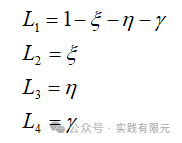

插值型二阶基函数表示为：

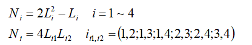

然后推导任意曲面四面体到参考四面体的雅可比矩阵，已知对于两个坐标系之间，满足：

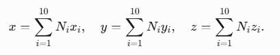

雅可比矩阵可以写成：

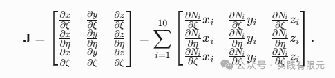

雅可比矩阵的每个元素为：

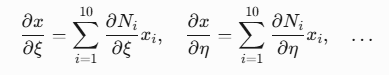

例如，计算其中一个N5 的梯度：   

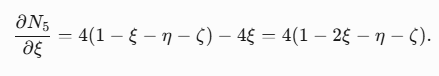

可见，雅可比矩阵是与10个节点均关联，因此其原曲面四面体的二阶曲面点性质在雅可比矩阵中得到体现。这不同于直边四面体的雅可比矩阵只需要关联4个顶点。

其次从N5不难分析得到，与直边四面体雅可比矩阵在单元内是常数矩阵，而二阶四面体的雅可比矩阵与参考坐标值的选取相关。

同样，对于基函数梯度，可以推导：

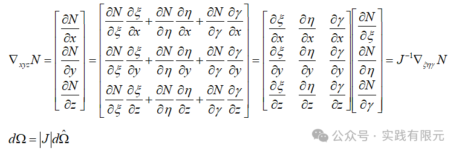

4、矩阵组装

根据上述推导，不难更加详细的有限元离散方程的单元积分等式：

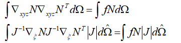

对该积分等式带入高斯积分公式，可以求解得到对应的积分结果。

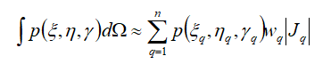

其中，高斯积分点与权重为：    

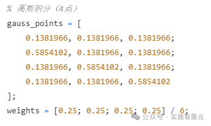

具体组装过程与常规有限元一般无二，这里不再赘述。

5、测试结果

下图是在单位球模型下，泊松方程的理论解和数值解的对比。数值与理论解结果基本上是一模一样的，说明曲面有限流程是正确的。

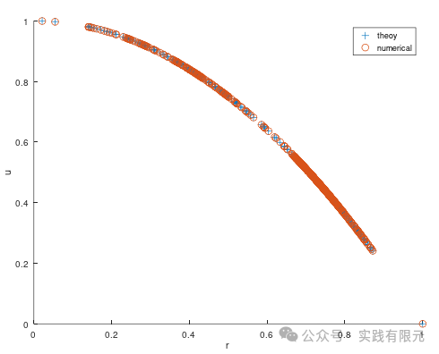

其三维散点图也可以大致看出，在球心位置的数值最大，在边界上等于0。    

  

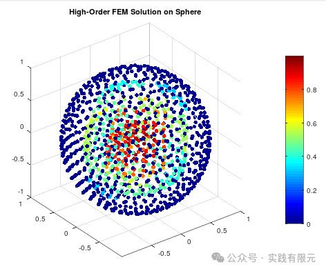

最后

1.曲面有限元的与直边有限元的流程基本上一致，区别仅在于雅可比矩阵的求解，直边雅可比矩阵只需要4个顶点进行求解，曲面有限元会加入曲面信息的棱边点。而这一点也恰好是曲面的体现。

2.整个过程可以发现，基函数与四面体网格阶数是一致，这也称之为等参单元。并且细心可以发现，二阶基函数使用的是插值基函数而不是叠层基函数，因为从雅可比矩阵出发，如果采用叠层基函数，在高阶项部分，曲面棱边中点坐标不能够通过叠层基函数获得，此时雅可比矩阵无法通过叠层基函数获取。因此对于曲面有限元而言，是否能使用叠层基函数还有待进一步讨论。

3.对于曲面有限元的高阶四面体网格单元，如果要体现其四面体高阶网格性质，对应的基函数也需要采用对应的高阶插值基函数。  

  

* * *

博主长期深入实践电磁学领域的有限元技术，感兴趣的朋友可以添加博主公众号，欢迎共同探讨与有限元相关的技术知识。