# 三维矢量有限元实现-六面体网格

> 原文地址: [https://mp.weixin.qq.com/s/HFNy4LsiMX9eLBN71Ee-0A](https://mp.weixin.qq.com/s/HFNy4LsiMX9eLBN71Ee-0A)

**简述**  

本文以矢量波动方程描述的电场在介质中衰减规律为边值问题，介绍六面体网格的矢量基函数、系数矩阵推导。矢量波动方程的有限元推导这里不再介绍，详细参考：[电场矢量波动方程的三维有限元实现](http://mp.weixin.qq.com/s?__biz=MzkwNzUxOTM2NA==&amp;mid=2247484407&amp;idx=1&amp;sn=7d4552a3bef4471c0f6e202d684047ae&amp;chksm=c0d6b71cf7a13e0af43f853105dca9dfaf33f89aae01fa3648c15ac23de1a1aa9c24cc079e6d&scene=21#wechat_redirect)

**1.六面体网格基函数**

六面体的棱边有12条，xyz方向各四条，因此棱边基函数也有十二条，分为xyz三个方向，可以得到基函数的插值公式为：

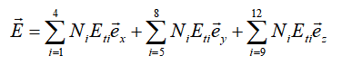

首先给出六面体单元的棱边编号的规律，如下图：

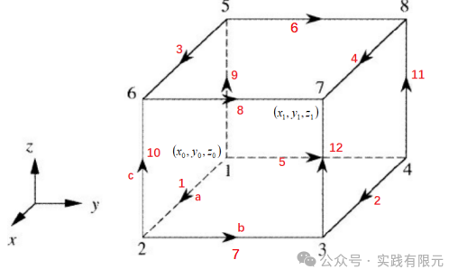

根据二维棱边基函数的经验，参考[二维矢量有限元（结构化网格）实现流程](http://mp.weixin.qq.com/s?__biz=MzkwNzUxOTM2NA==&amp;mid=2247484278&amp;idx=1&amp;sn=56ace32800dd67c48b748828c85dfed9&amp;chksm=c0d6b79df7a13e8b51fb6e28de703edbe850cc279787648c212237f4c0d71149a5e3f360af20&token=1989832334&lang=zh_CN&scene=21#wechat_redirect)，三维的基函数同样由一维基函数组装得到，已知三个方向的一维线性基函数为:    

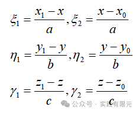

以此来组装三维棱边基函数。仔细观察，针对Nx方向的棱边1，2，3，4，它在x方向是不会有变化的，因此可以断定Nx中是没有x方向的一维基函数，然后可以发现这四条边的插值规律，可以由zy方向的一维基函数组合表示获得，由此类推，可以得到棱边基函数：

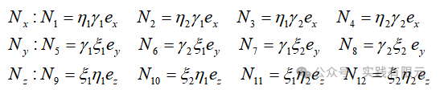

可以发现，与节点基函数最大的不同，在于这十二个基函数都具有方向，Nx，Ny，Nz分别代表了XYZ三方向上各自棱边的插值基函数。并且验证发现，其顺序也是和上述图形中的棱边顺序一致，这很重要，不同的顺序得到的棱边基函数表达式结果也是不一样的。并且不难推导得到：

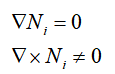

梯度为零，而旋度不为零。继续推导各基函数的偏导数，以备后续使用：

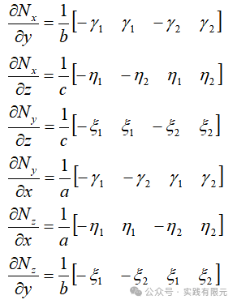    

**2.单元系数矩阵推导**

根据三维矢量波动方程的有限元方程：

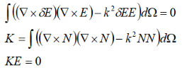

针对第一项旋度乘积的积分项，得出其是由九个部分组成：

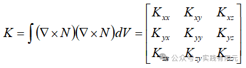

其中，根据单元系数矩阵的对称性，只需要求解对角线矩阵和上三角矩阵即可，首先推导单个基函数旋度表达式：

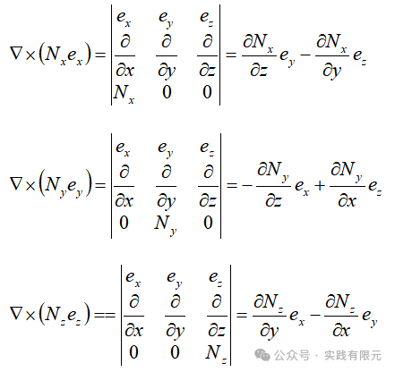

然后对上述式子进一步推导旋度的乘积，得到：    

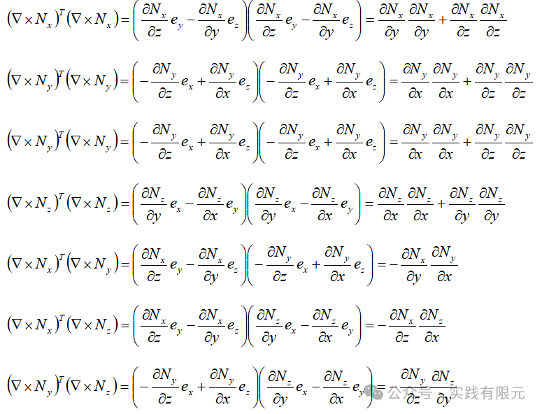

由此，整理得到表达式：

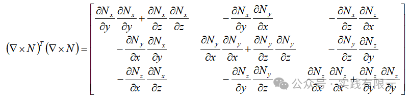

对每一项进行积分，结合基函数的偏导数结果，可以快速求得：

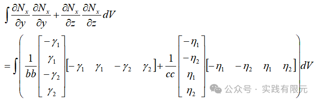  

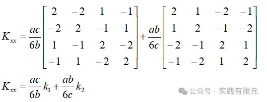 

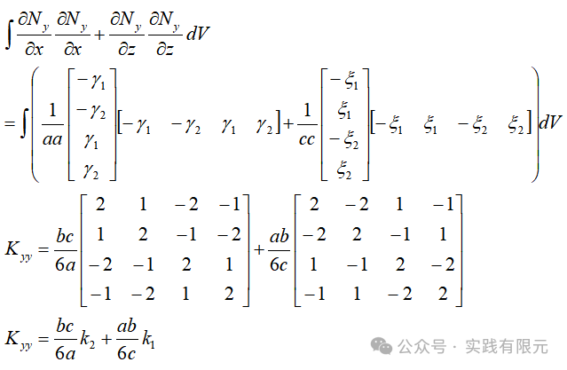

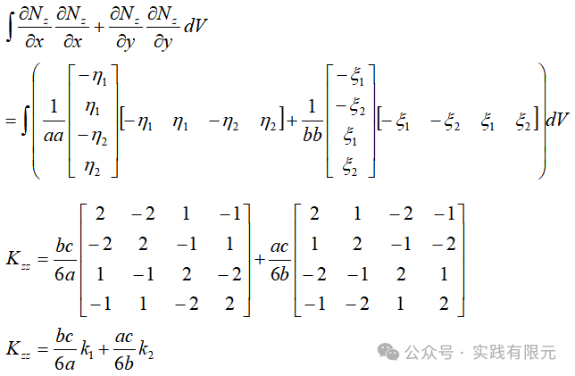

非对角线矩阵：

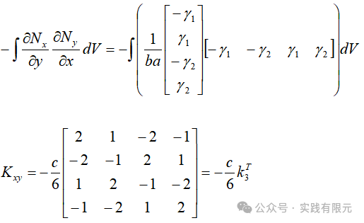

         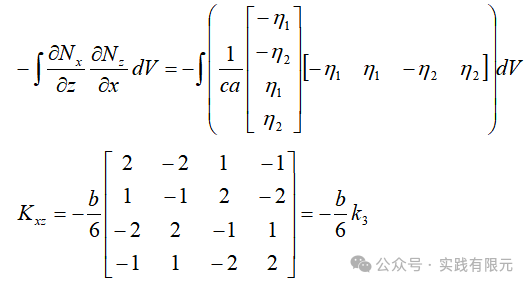

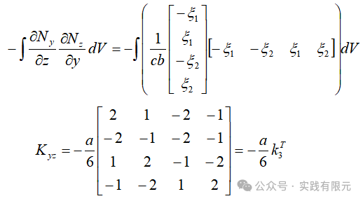

所以，K的旋度部分的系数矩阵可以表示成3个4\*4系数矩阵k1、k2、k3的组合;  

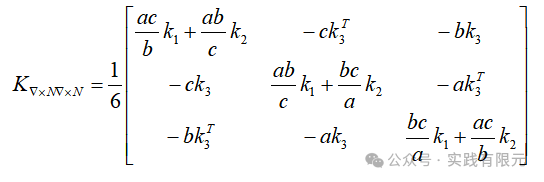

继续推导系数矩阵的第二项，由于：    

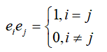

不难发现：

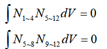

因此，非对角线为零，只剩下对角线元素：

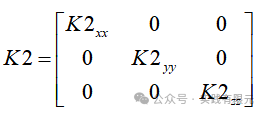

很容易推导：

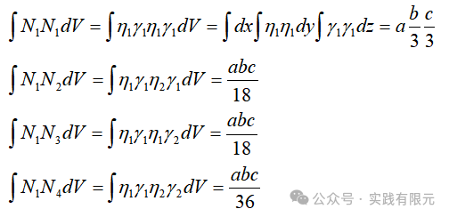

从而可以得到：

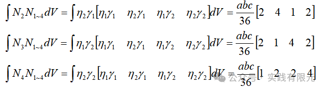

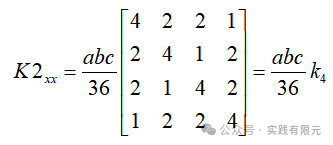

观察Kyy,Kzz,两者具有与Kxx一样的规律，因此，系数矩阵为一样的。      

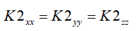  

因此，归集有限元第二项结果为：

          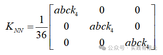

  

**3.系数矩阵组装与边界条件加载**

系数矩阵组装与一般的有限元组装一样，关键在于获得单元与棱边的映射关系，这里需要自己写算法获得该映射关系与棱边总数。最简单的方法就是先标记X再标记Y最后考虑Z，标记的过程要保持与单元六面体的顺序一致即可。这里给出1\*3\*2共计6个单元的映射关系以供参考：

x方向的棱边数，共计12个：

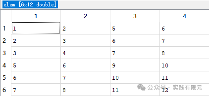

y方向的棱边数，共计18个：   

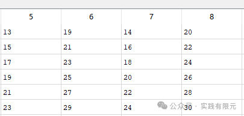

z方向的棱边数，共计16个：

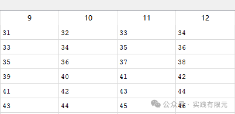

同样仅考虑第一类边界条件加载，需要在棱边上赋值，如果考虑电场传播方向z方向，振动方程x方向的时候，则直接对边界上x方向的棱边赋值乘以大数即可。因为本身x方向的棱边方向与电场振动方向就是一致的，相比于四面体网格而言，要容易实现一些。

4.结果

测试模型大小10\*10\*20m，各个方向网格大小为10\*10\*20,共计2000个六面体，7040个棱边。

**a.频率为1e4Hz,电导率为1欧姆米**

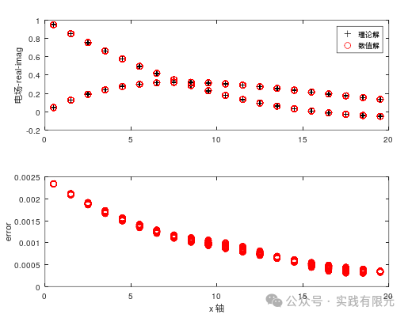

数值结果与理论基本上能达到一致，误差还好，在1%以下。三维切片结果显示：

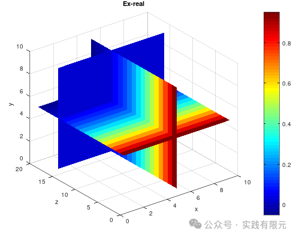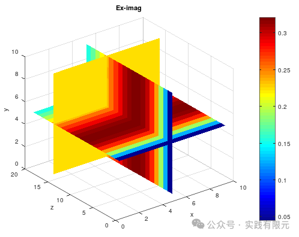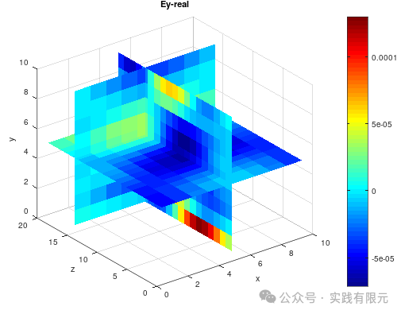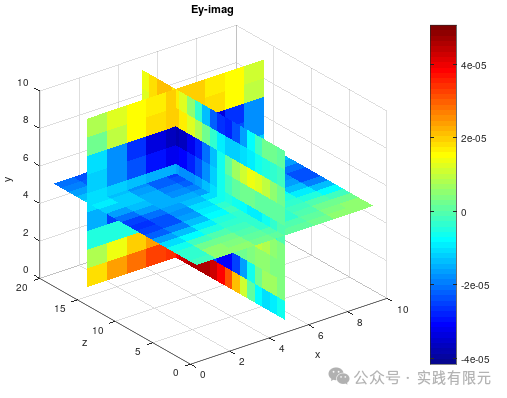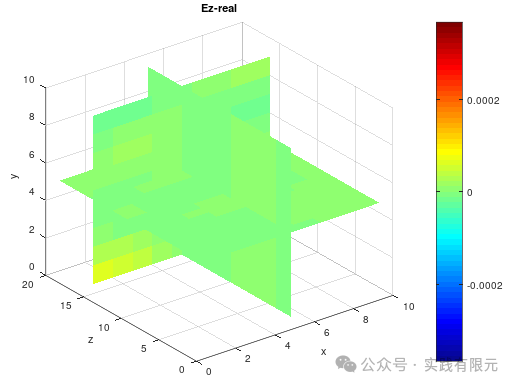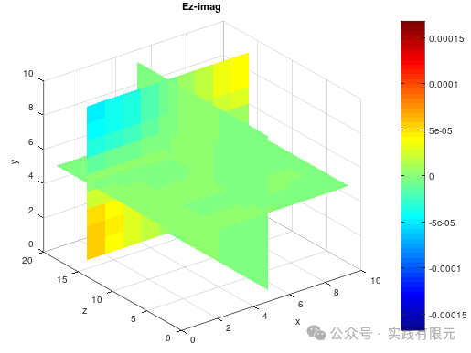    

从三维切片结果显示，基本上与理论一致，在均匀介质中，Ex方向的电场顺利传过模型，并没有发射反射等现象，因此Ey,Ez几乎是没有电场的，有的仅仅是数值带来的误差。

**b.频率为1e4Hz,电阻率为1欧姆米。中间存在一个立方体的区域电阻率为0.001欧姆米。**

       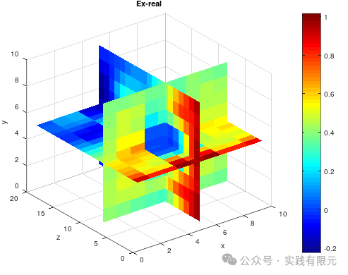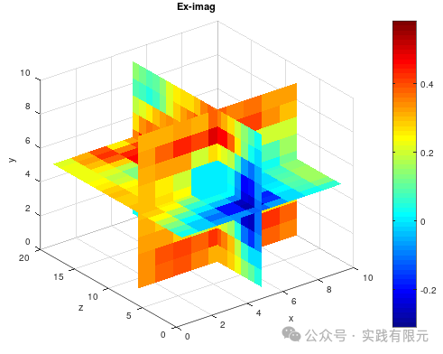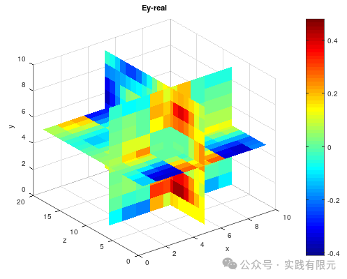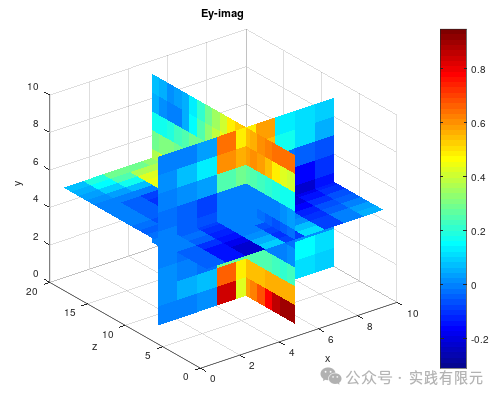

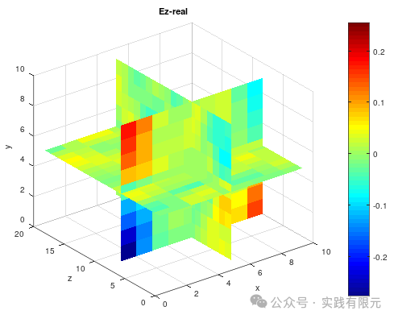

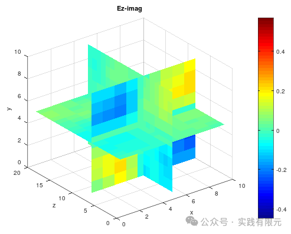

可以发现，各个方向均有明显的反应，其中以入射波Ex方向的变化最大，并且能明显观察到分界面位置的突变。

**5.总结**

a.结构化网格的矢量有限元实现起来相对要比非结构网格容易，但是其中依旧是要注意局部棱边顺序与全局棱边顺序的一致。

b.从上述结果中看出，依旧存在很大误差，这是由于网格量不足的原因导致的，在实际物理模型中，还需要对网格进行渐变处理，避免边界上的反射，或者使用吸收边界、解二次长的方法进行处理。