# 三维矢量有限元实现过程-电场矢量波动方程

> 原文地址: [https://mp.weixin.qq.com/s/AdwW-2\_unBTvE3vWMgBo\_Q](https://mp.weixin.qq.com/s/AdwW-2_unBTvE3vWMgBo_Q)

**简述**

针对三维电场矢量波动方程，在前面有介绍过一篇文章，使用节点有限元来实现，推导过程也是相当的复杂。并且在文章最后说明了节点有限元由于其节点基函数自然满足未知数连续性的条件，因此在电场遇到介质分界面的时候，无法模拟电场法向不连续的物理现象，从而出现伪解。

因此，本文介绍三维矢量（棱边）有限元，该方法的能够完全避开节点有限元的存在的问题，因为棱边有限元自然约束条件是未知数的切向连续，而对未知数的法向并没有约束，恰好满足电场在介质分界面的传播规律。

当然由于未知数之间的关系仅剩下切向分量维持，因此棱边有限元的系数矩阵质量相比于节点有限元而言更差，因此使用迭代法求解往往需要很长的时间收敛，甚至无法收敛，而使用直接求解的方法效果要好一些。

**1.边值问题与有限元方程**

对于电场矢量波动方程的边值问题的描述与有限元问题在文章：[电场矢量波动方程的三维有限元实现](http://mp.weixin.qq.com/s?__biz=MzkwNzUxOTM2NA==&amp;mid=2247484407&amp;idx=1&amp;sn=7d4552a3bef4471c0f6e202d684047ae&amp;chksm=c0d6b71cf7a13e0af43f853105dca9dfaf33f89aae01fa3648c15ac23de1a1aa9c24cc079e6d&scene=21#wechat_redirect)中有详细介绍，这里不再赘述，给出有限元方程：

边界条件使用第一类边界条件加载。

**2.四面体棱边基函数**

根据四面体网格，已知通过体积坐标得到的线性插值基函数:（具体推导参考：[三维非结构化有限元实现-possion方程](http://mp.weixin.qq.com/s?__biz=MzkwNzUxOTM2NA==&amp;mid=2247484341&amp;idx=1&amp;sn=8f2dfbcd864b11b1a9209e65701b1307&amp;chksm=c0d6b75ef7a13e480ba93f26fb40f5e443eb8e0c0dbad1518ac4606f8f60f46520818e2eaa23&scene=21#wechat_redirect)）

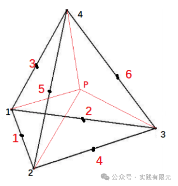  

根据上述四面体棱边规定的顺序，有棱边编号对应的局部节点编号顺序：

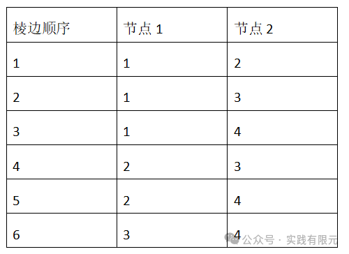

由此可以得到棱边基函数表达式;    

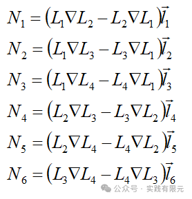

可见六条棱边，各自对应一个基函数，每个棱边基函数由其两个顶点的节点基函数组合而成，并乘以该棱边的长度，同时该棱边是具有方向性的，约定棱边顺序为全局顶点编号小到全局顶点编号大为正。

例如一号棱边的局部顶点编号1、2，如果对应的全局编号为129、100此时该棱边长度标记为负数；如果对应的全局编号为100、129，则此时该棱边长度标记为正数。

进一步研究棱边基函数，对N1分别取梯度与旋度算子，可以得到：

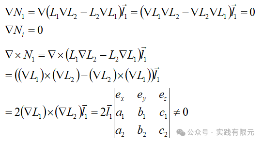      

可见，N1求梯度结果为零，求旋度结果不为零。证实了棱边基函数仅对切向方向有约束，而对于法向方向无约束。

对比三维节点有限元的基函数，不管是取梯度（泊松方程）还是取旋度（电场波动方程）其结果均不为零，说明节点有限元对切向、法向方向均有约束作用。

继续推导旋度的结果，可以得到任意棱边形函数的旋度表达式：

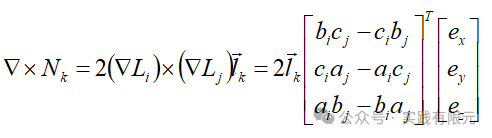

可以通过旋度发现，与之前的节点形函数不同，棱边形函数是具有两个方向的，方向1是棱边节点顺序的方向，方向2是表示坐标轴上的xyz矢量的方向，所以称之为矢量基函数，矢量有限元。此时由于基函数表示了三个矢量方向，所以求解的未知数则是一个无方向的数，表示棱边切向量。    

**3.单元系数矩阵推导**

对于矢量波动方程的有限元方程，主要系数矩阵就是K矩阵，如下：

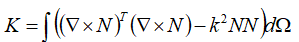

积分项分成两项，第一项是基函数旋度的乘积，第二项是基函数的乘积，对第一项进行推导，首先推导k11的积分：

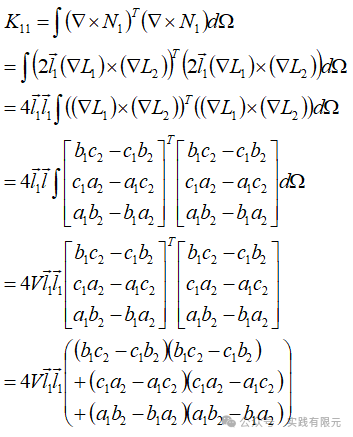    

可见，推导后得到的是一个系数，xyz的方向性在内积的过程中消失，继续推导：

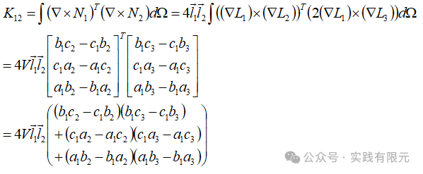

可以观察其中规律，进而可以快速得到其他部分的积分结果：    

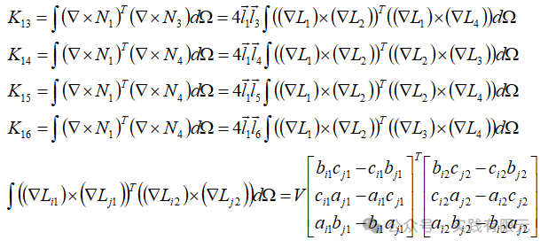

上述式子的积分通式是非常重要的，只要通过形函数得到关于线性基函数的表达式，如上述式子的左端项，根据下标关系，即可得知右端项的具体积分结果，这对于编程实现是非常的方便。

对于K矩阵的右端项，同样的推导方式：

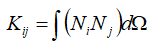

对于线性基函数Li的梯度可以表示为：

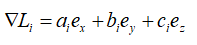

因此，推导可得：

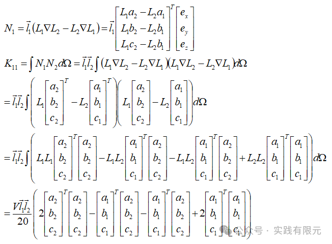

观察上述推导规律，N\*N的每一项都可以表示为类似的形式，区别仅在于基函数的下标，因此令：    

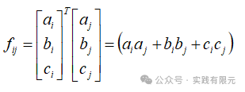

则，K11可以表示为：

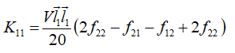

验证推导，K12可以表示为：

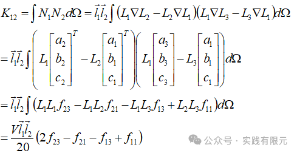

注意，对于li\*lj的棱边长度的乘积，其下标与Kij的下标是一致，下面就不再将这部分反复写入，继续推导系数部分：    

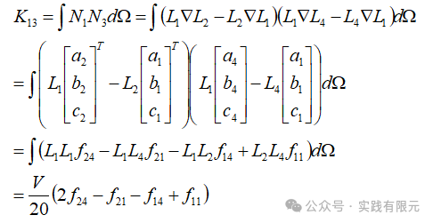

进一步熟悉，观察规律可以简化成如此：

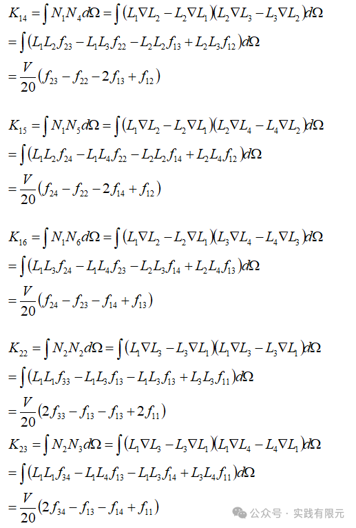

继续简化推导，得出规律，法向LiLj的系数项相同为2，不相同为1；fij的下标等于梯度LiLj的下标组合即可。    

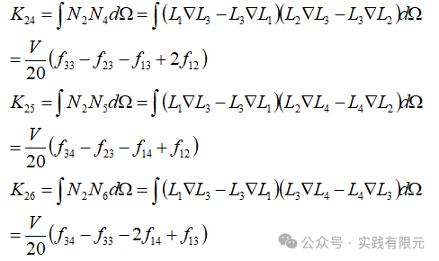  

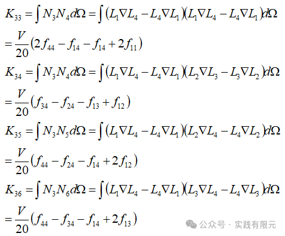    

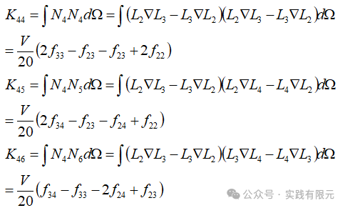

最后，总结规律可以得到：      

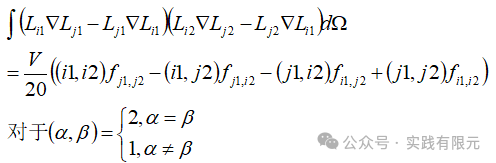

该通式也是同样的重要，在编程实现过程中是非常有帮助的。

如此对单元系数矩阵推导完成，最终得到6\*6的单元系数矩阵，一一对应四面体的六条棱边。

**4.四面体网格、系数矩阵组装与边界条件加载**

对于四面体网格，同样需要注意的是四面体单元的局部棱边顺序。根据前面给出的棱边顺序与节点关系，对tetgen原有的棱边顺序进行修改，如下图：

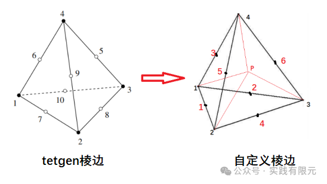

系数矩阵组装过程中与传统有限元一样，如果在组装每个单元系数矩阵过程中统一了棱边方向，即可直接按照单元棱边编号和全局棱边编号的关系一一映射组装即可。    

第一类边界条件加载则与之前有很大区别，已知第一类边界条件为：

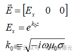

上述的边界条件信息表示的是在节点上的电场三分量，表示为电场传播方向为z方向，振动方向仅在x方向。由于棱边有限元的未知数是表示棱边上的电场切向分标量，因此这里也需要把矢量的电场值投影到棱边上，具体做法如下，首先得到棱边的单位方向向量：

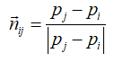

其中i,j表示棱边的两个节点，这两个节点的顺序必须与之前定义的棱边顺序一致。因此，矢量电场在棱边上的投影切向电场为：

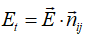

这里可以取棱边中点位置电场作为被投影的电场矢量场。在得到棱边的切向电场值后，再使用乘以大数的方法，将六个外表面的棱边均赋予第一类边界条件。

**5.结果展示**

研究区域大小10m\*10m\*10m,频率10000Hz,电导率1欧姆米。网格为4314个四面体，872个节点，5485条棱边，所以5485个未知数。

在获得棱边切向场结果后，根据插值公式，获得四面体中心点的电场结果：  

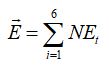

**a.当介质为均匀介质时，插值获得四面体中心点的电场，该位置的理论解与数值解对比：**

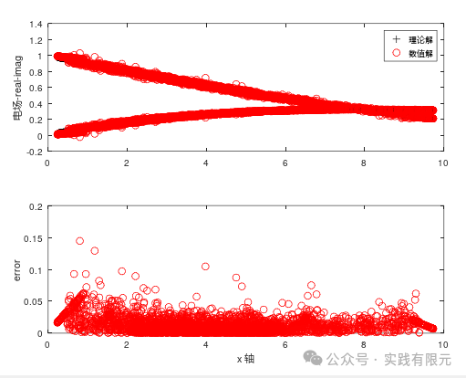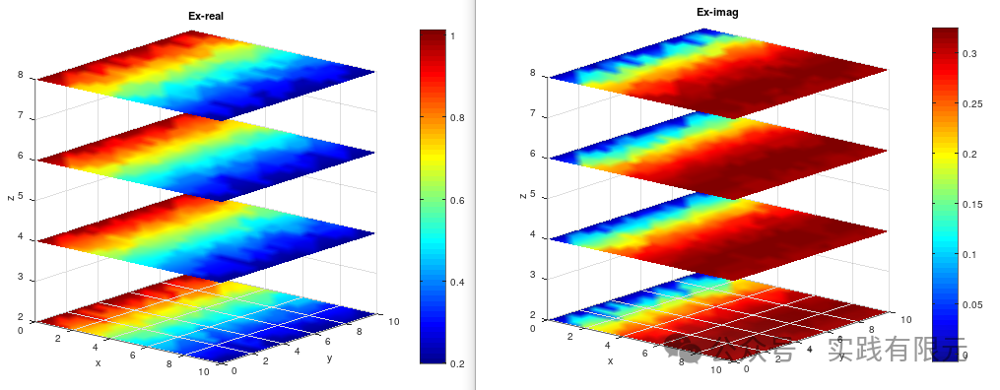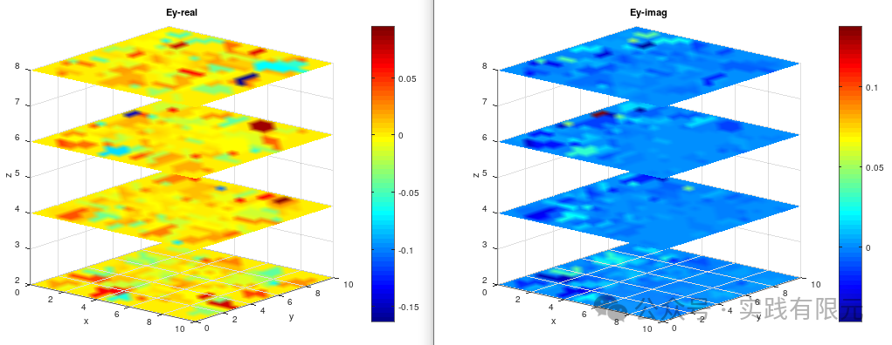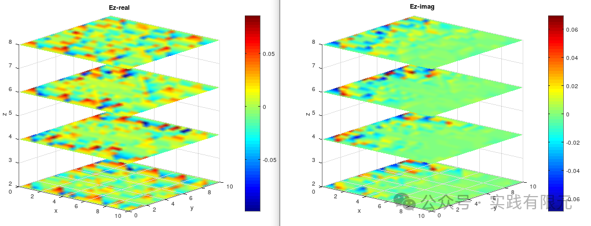

可见，相比于节点有限元，误差较大，原因1是由于棱边与棱边之间的关联较差，导致结果也较差；原因2是由于插值过程中有精度损失。

**b.将网格图中，研究区域中心位置的电阻率设置为0.05欧姆米。**

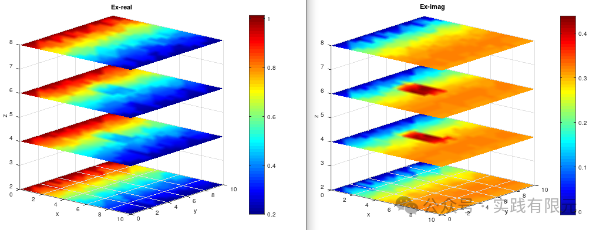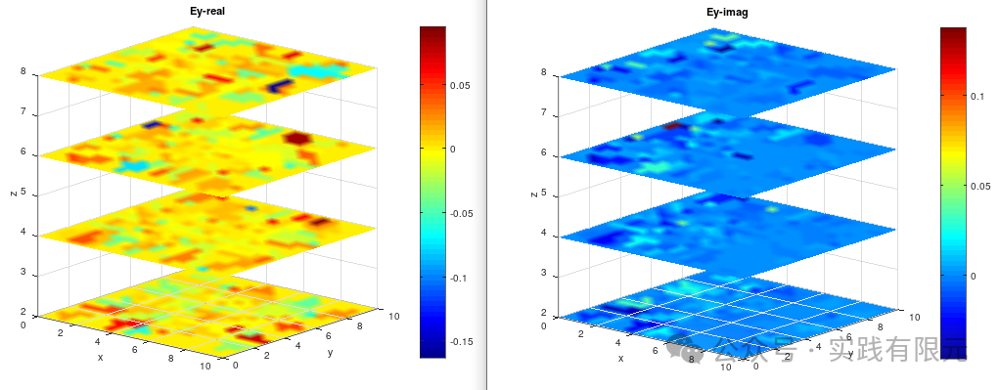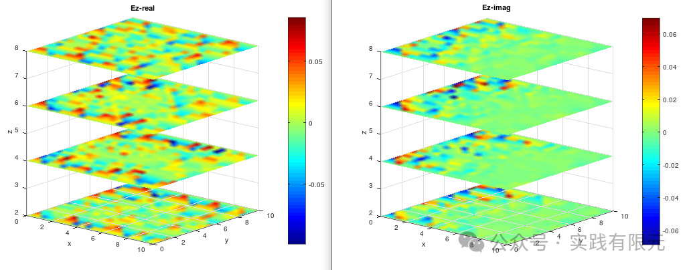

可以发现，即使模型中间存在电导率不同的区域，处理在一次场本身的传播方向上有明显的体现，在Y、Z方向上几乎看不到反应，完全被误差掩盖。因此考虑细化网格与加强电导率的差异来测试。

**c.网格细化，四面体7063个，棱边9350个的，并把电阻率为0.001的时候，如图所示：**

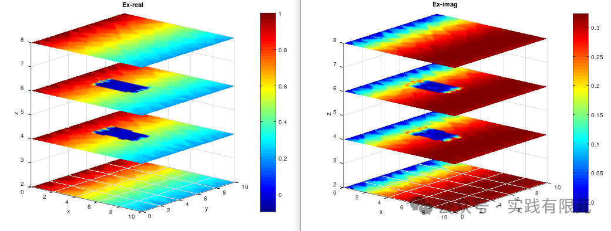

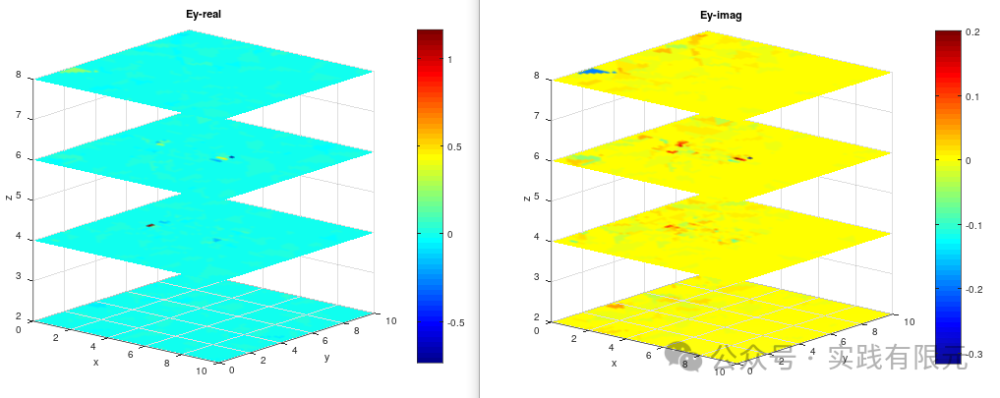    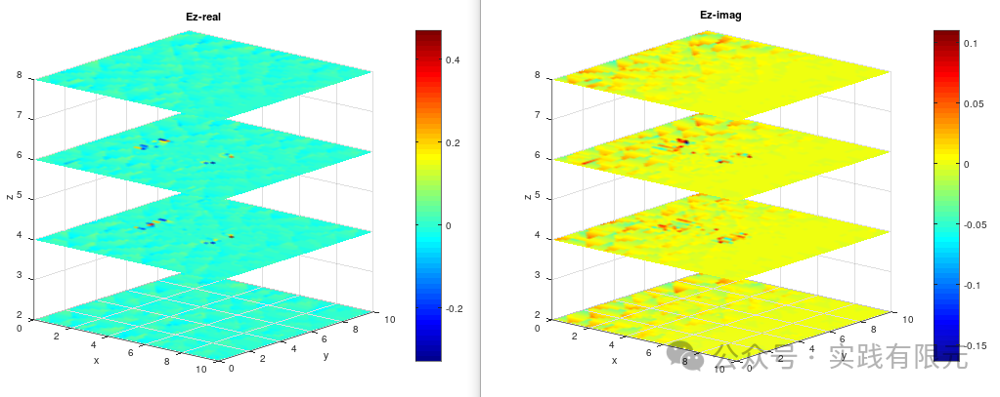

可见，当网格细化，电导率继续降低的时候，在Z,Y方向的误差就无法完全掩盖电场规律，图中能明显看到Y、Z实部的异常，虚部异常也隐约可见。

**6.总结**

a.局部棱边方向到全局棱边方向一定要保证一致。每个单元六条棱边，每个棱边在全局有唯一确定的方向。

b.第一类边界条件加载的时候，也要注意确保棱边方向的唯一性。

c.相比于节点有限元，棱边有限元除了基函数完全不一致之外，最需要注意的就是棱边方向的统一，在一切有使用到棱边的位置都需要对棱边方向统一。

d.结果显示，棱边有限元想要得到精度足够高的结果是比较困难的，不断的加密网格是一个直接的方法，但是随着网格足够多，对于内存开销也是一个挑战；另一个办法则是使用高阶棱边有限元，能够有效的提高精度，但是实现难度则是成倍增加。

e.在实际物理问题中，往往不需要每个区域都有足够高的精度，只需要特点区域的精度足够高即可，这时候就可以针对感兴趣的区域进行网格加密，即使用自适应技术迭代求得最优网格，如此也能获得想要的精度同时也保证计算效率、内存开销得到保证。