# 三维高阶叠层与插值有限元细节对比-霍姆霍兹方程

> 原文地址: [https://mp.weixin.qq.com/s/j251berpKimwdkK\_xF0YAA](https://mp.weixin.qq.com/s/j251berpKimwdkK_xF0YAA)

**简述**

前面分别介绍了二阶插值有限元与二阶叠层有限元的泊松方程的实现过程，本文将再从结果上对比二者的区别，直观的对比各自精度。其次，使用微分方程：霍姆霍兹方程，意在给出新的单元系数矩阵。

**1.边值问题**

霍姆霍兹方程如下，物理含义是平面波Ex=1从z=0处入射均匀空间，模拟研究区域的电磁衰减规律。更详细内容请参考：[二阶叠层基函数：二维电磁衰减数值模拟](http://mp.weixin.qq.com/s?__biz=MzkwNzUxOTM2NA==&amp;mid=2247484069&amp;idx=1&amp;sn=a52d10043b20af30f935ecbfd9413712&amp;chksm=c0d6b64ef7a13f5854c7b426fab0658cfd0d239518c5e8f636b05e1c73f251c4b7c4d776b14a&token=1507515881&lang=zh_CN&scene=21#wechat_redirect)。

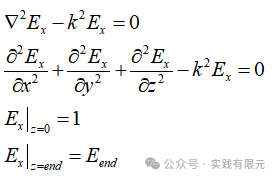

该问题的有限元问题也很容易得到：

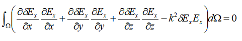

将上式带入基函数，可以得到：

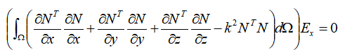

可以发现，与泊松方程不同点在于不仅包括拉普拉斯项，还有NN的第二项，因此，本文将依次给出第二项的插值基函数的系数矩阵与叠层基函数的系数矩阵。

**2.系数矩阵**

对于积分项中的偏导数的系数推导不再演示，详细请参考文章：[泊松方程三维二阶叠层有限元实现-四面体](http://mp.weixin.qq.com/s?__biz=MzkwNzUxOTM2NA==&amp;mid=2247484540&amp;idx=1&amp;sn=c728e340368a3e243fa51690e0d6247e&amp;chksm=c0d6b097f7a1398105b36af1dd8f4e75339186aa47064ff9e08969c90d90312804f77852db58&scene=21#wechat_redirect)、[泊松方程三维二阶插值有限元实现-四面体](http://mp.weixin.qq.com/s?__biz=MzkwNzUxOTM2NA==&amp;mid=2247484461&amp;idx=1&amp;sn=4b73fc6550e363ede16cfe85971213c1&amp;chksm=c0d6b0c6f7a139d0ba1067397f409782c3db61ecfc928cf74a9a6ac6c84bc0bf1cfec7621491&scene=21#wechat_redirect)，本文主要推导第二项：

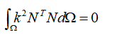    

已知插值基函数与叠层基函数为：

因此同样把10\*10的系数矩阵分成4个亚矩阵：

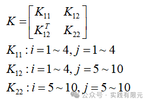

**a.对于插值基函数的系数矩阵**

首先求解K11:

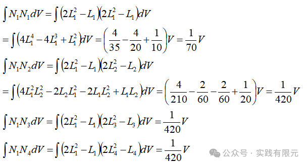

观察发现有明显的规律，因此其他类比系数项可得;

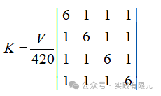

继续求解K12系数矩阵:    

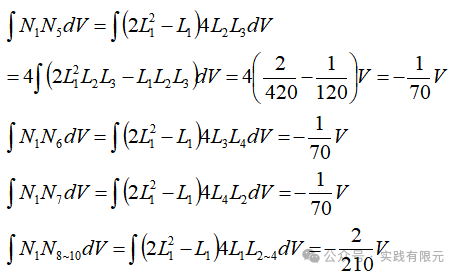

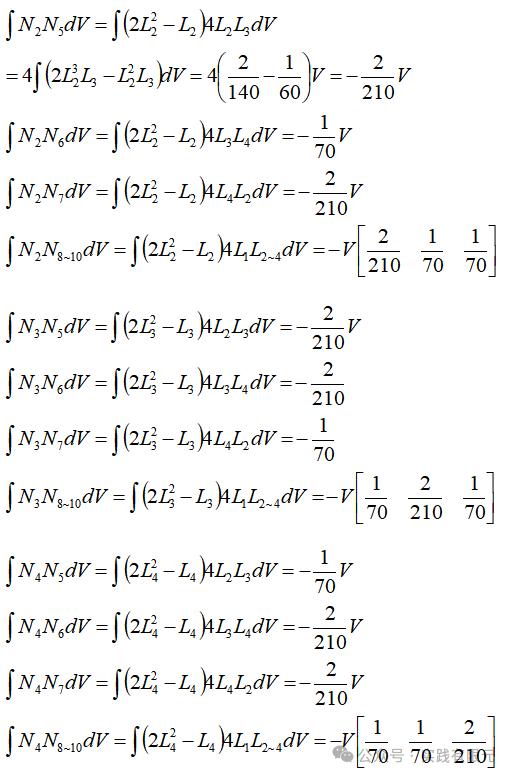

因此，统计K12系数矩阵为：    

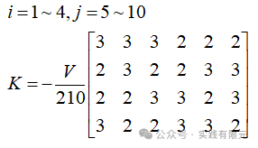

继续求解K22:

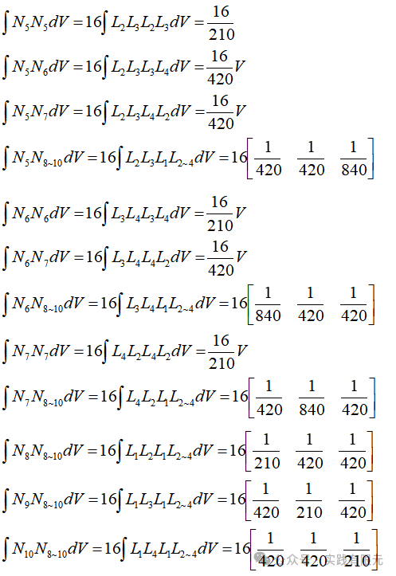

因此，得到K22:    

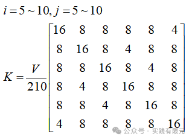

将所有亚矩阵组合起来，得到基于插值基函数得到的10\*10的单元系数矩阵如下：  

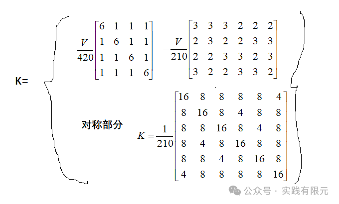

**b.对于叠层基函数的系数矩阵**

对于K11求解很容易获得  

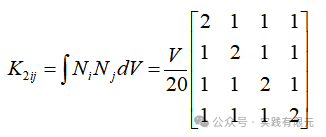

对于K12：    

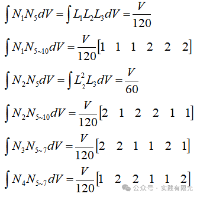

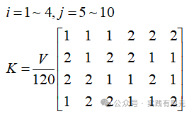

对于K22，我们发现其叠层基函数N5~N10与插值基函数的对应项只相差4倍，因此可以直接延用插值基函数的结果：

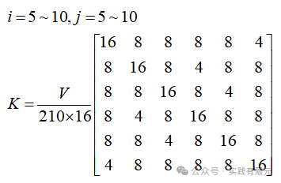

因此，组合所有亚矩阵，叠层基函数10\*10的系数矩阵为：    

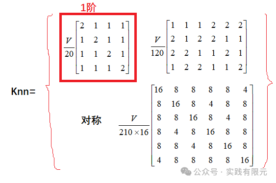

对比二者基函数，虽然有很多类似的地方，但是系数矩阵相差甚大。可以发现二阶叠层基函数的K11亚矩阵就是1阶基函数的系数矩阵，而插值基函数则完全不同，这与我们之前讨论一致。

对于系数矩阵组装过程这里不再赘述，二阶插值基函数可参考：[泊松方程三维二阶插值有限元实现-四面体](http://mp.weixin.qq.com/s?__biz=MzkwNzUxOTM2NA==&amp;mid=2247484461&amp;idx=1&amp;sn=4b73fc6550e363ede16cfe85971213c1&amp;chksm=c0d6b0c6f7a139d0ba1067397f409782c3db61ecfc928cf74a9a6ac6c84bc0bf1cfec7621491&scene=21#wechat_redirect)，二阶叠层基函数可参考：[泊松方程三维二阶叠层有限元实现-四面体](http://mp.weixin.qq.com/s?__biz=MzkwNzUxOTM2NA==&amp;mid=2247484540&amp;idx=1&amp;sn=c728e340368a3e243fa51690e0d6247e&amp;chksm=c0d6b097f7a1398105b36af1dd8f4e75339186aa47064ff9e08969c90d90312804f77852db58&token=1507515881&lang=zh_CN&scene=21#wechat_redirect)。

**3.结果对比**  

使用tetgen剖分得到的网格信息：网格量2234，四面体顶点数目：953，顶点数目+棱边中点数共计3847：

**a.首先看一阶对比数值结果对比理论解结果**    

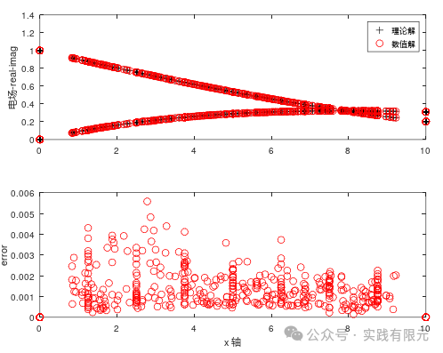

**b.二阶插值基函数对比理论解结果（网格顶点+棱边中点）**

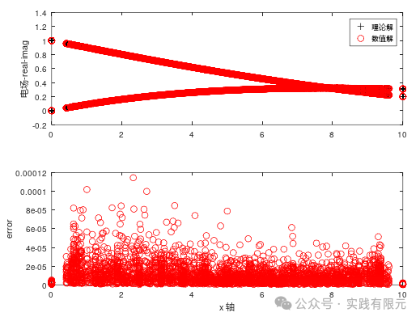

**c.二阶叠层基函数对比理论解结果：（网格顶点）**   

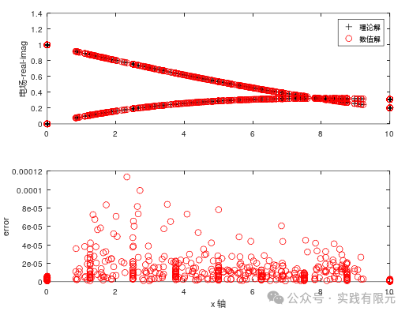

可见，相比一阶最大0.006的误差，二阶插值和二阶叠层最大误差均只有0.00012，精度提高了50倍，高阶基函数结果在精度上得到很大程度提升。我们再具体对比二阶插值与二阶叠层的结果：

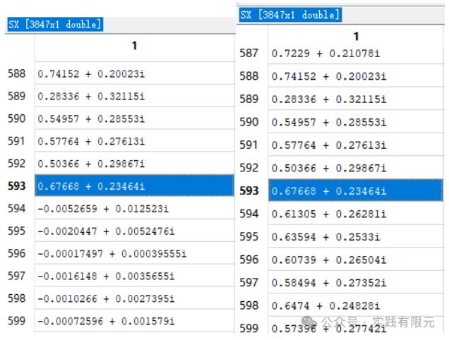

二者结果在593（四面体顶点数）之前一致，之后完全不同。再次验证了插值基函数的基函数落在具体的四面体中点上，而叠层基函数的高阶部分基函数仅仅用棱边表示，从而导致二者的高阶部分完全不一样的求解结果。    

我们继续对比二者593个四面体顶点数据的绝对误差，如下图：

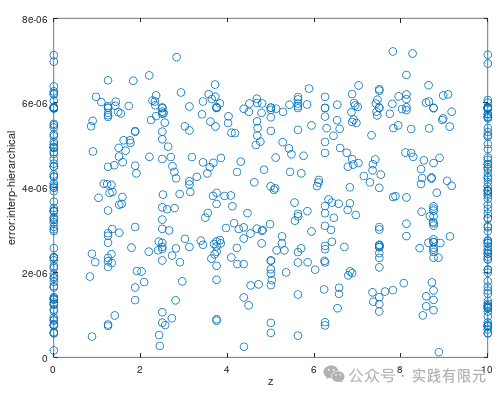

发现叠层和插值基函数在二阶结果是几乎一致，误差低至8e-6。说明虽然二者的基函数不同，系数矩阵也不相同，但是得到的精度几乎是一致。同样二者得到三维可视化结果几乎也是一样的。

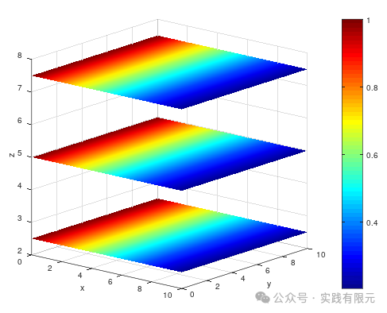

**4.总结**

1.二阶插值基函数与二阶叠层基函数虽然类似，但是本质不同，二阶插值基函数的10个基函数都能在四面体上找到具体的点；而叠层基函数的高阶部分仅仅用棱边表示编号，并不具体体现在四面体某个点上。

2.两种基函数的结果在同等阶数下具有几乎一致的精度。

3.经验显示：二阶叠层基函数更容易出现错误，如果某个高阶系数某个系数出现错误，结果并不会完全错误，只不过精度会降至1阶精度，甚至略高于1阶，这很具有迷惑性。

例如，将系数矩阵knn12(4,6)=2 错误的写成knn12(4,5)=2，所得错误结果如下：    

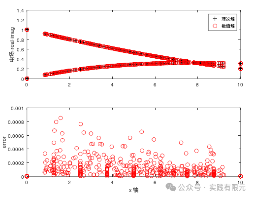

发现，错误的结果与一阶结果相比，精度依然提升了6倍左右，但是与完全正确的二阶结果对比，精度远远没有达到，如果不知道完全正确的结果，这里就很容易被迷惑为系数矩阵不再有错。

所以对比插值基函数与叠层基函数结果能一定程度上检查叠层基函数是否完全正确。