# 三角形高阶基函数通式的两种获取方法

> 原文地址: [https://mp.weixin.qq.com/s/F97NRhbSoCrFpip0-WgB4g](https://mp.weixin.qq.com/s/F97NRhbSoCrFpip0-WgB4g)

**简述**

相比于结构化网格的基函数任意高阶通式而言，非结构网格的通式相对难度较大。经过较长时间的研究与推导验证，本文介绍两种获取二维三角形网格基函数高阶通式的方法。

方法1：通过复杂理论获得，根据所需要不同阶数，直接获得基函数表达式,参考《The finite element method in electromagnetics》

方法2：通过有限元插值基函数基本原理，构建线性方程组求解对应项系数，从而获得基函数表达式。

下面详细介绍两种方法。

**方法1**

根据文献，三角形高阶基函数通式表达式可以写成：

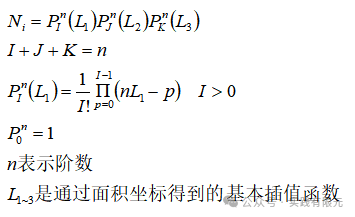

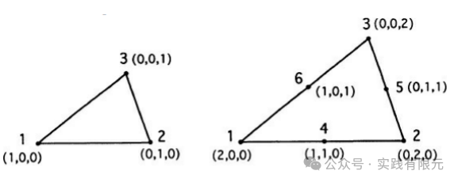

具体来使用这个通式，**_首先得到1阶基函数表达式：_**

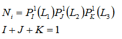

满足上述等式的I,J,K,有：

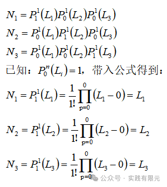

**_推导2阶插值基函数的公式_**，根据通式可以得到：

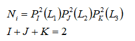

根据IJK的组合规律，可以得到以下六种排列方式：

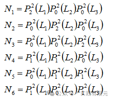

进一步推导：    

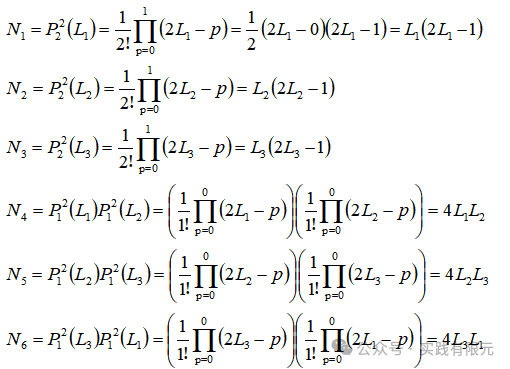

可以发现，前三个基函数表示三角形顶点位置，后三个基函表示三条棱边重点位置。

_**推导3阶基函数表达式：**_

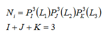

根据IJK的组合规律以及三角形的插值点，可以得到十种排列方式，首先是三个顶点位置：

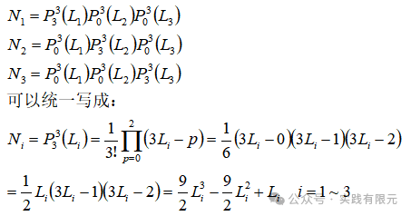

然后考虑2\*3=6个棱边点：    

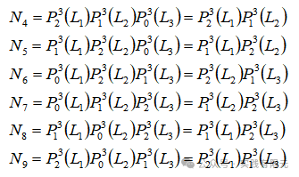

具体展开推导：

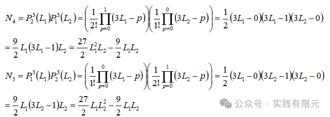

其他项类似得到：

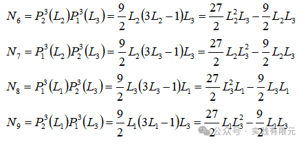

继续推导第十项：

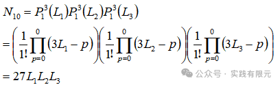

至此，三阶基函数推导完成。如果想要通过该公式继续得到更加高阶的维度，问题也不是太难，只不过要进行繁琐的推导，不过使用编程的方法可以避免手动推导，快速得到基函数表达式。    

但是根据上述推导不难发现，通式是不同项的乘积，这导致继续推导基函数的梯度会非常困难，例如对三阶的N9进行梯度求解，必须化成最简式子才能很好的获得。但是想要获取基函数梯度的通式就比较麻烦了。

由于这个原因，研究出稍微复杂的三角形基函数通式以及基函数梯度的通式，即方法2。

**方法2：**

首先，根据方法1的一些规律，获得三个节点上的高阶基函数的组合是由对应的面积坐标Li组合而成，幂次最高为阶数，因此可以获得三个节点任意阶基函数通式表达式：

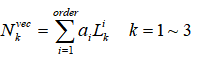

式子中的系数ai是待求系数，可以发现对于N阶而言，就有N项累加而成，因此有N个系数a，这是只需要选择N个节点坐标即可求解得到。一般选取对应Li所在的边上的N个节点。根据下列方式，组合线性方程组N\*N,求解得到系数a。

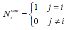

其次，考虑三条棱边上节点规律，均由棱边对应的两个插值系函数LiLj组合而成，因此幂次最高之和为阶数，同理可以获得基函数通式表达式：

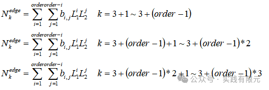

同样，根据系数项选择对应的节点，通过在带求点等于1，其他点为0的方式，组装系数方程，通过求解方程组得到对应系数b。

最后同理容易得到三角形内部点的通式：    

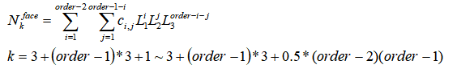

对于三角形内部点，有N个内部点，对应的基函数就有N项累加而成，因此仅需要带入内部点的位置关系，即可获得对应的系数c。

至此，可以发现三角形基函数通式的三个部分的基函数表达式均是L1L2L3的各项系数累加而成。因此可以很容易推导获得对应的梯度项：

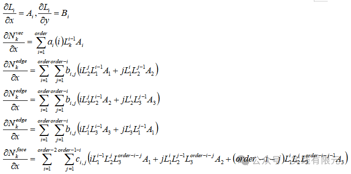

如此，第二种方法只要获得基函数中各项的系数，即可立刻得到对应的梯度解，这对于在有限元算法中实现任意阶是非常重要的。下面验证方法2的通式与方法1是否一致：

_**1阶基函数**_

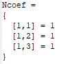

**_2阶基函数_**    

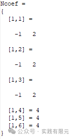

**_3阶基函数_**   

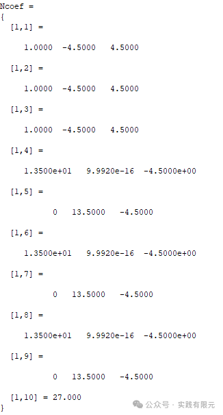

可以发现，前3阶的基函数与方法1的结果是一致的。根据方法2，我们还可以通过算法直接得出更加高阶的基函数，例如4阶基函数共计15个基函数。    

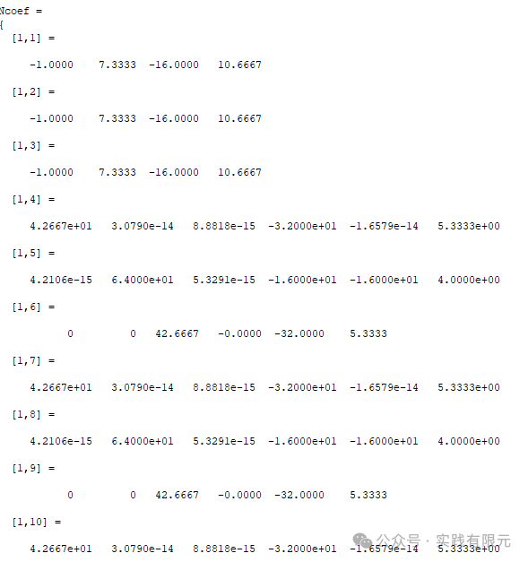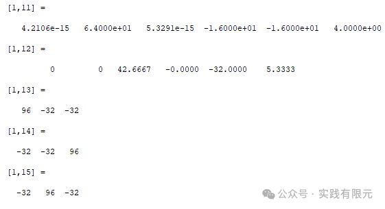    

验证其结果也是正确的。如此得到这些系数矩阵，对应的梯度项也随之可以获得。

**最后**

1.分享了三角形基函数高阶通式推导的两种方法：第一种方式是书上的方法，但是很难进一步获取基函数梯度的通式；因此推导出第二种方法，通过求解方程组得到基函数每项的系数，进而能获取基函数梯度的通式，这对于有限元编程实现是非常重要的。

2.在获取三角形基函数高阶通式后，想要实现三角形的任意高阶有限元还有几个突破点，第一点还是任意阶网格节点的获取；第二点是高斯积分的系数与权重。