# 二维三角形网格任意阶有限元实现

> 原文地址: [https://mp.weixin.qq.com/s/kwKuen26dFVMj5X64od6Hw](https://mp.weixin.qq.com/s/kwKuen26dFVMj5X64od6Hw)

_**简述**_

本文将介绍二维三角形网格任意高阶基函数的整个实现流程，通过一个简单的解析解为sin函数的边值问题，对比不同阶数的高阶与解析解的误差。

_**1.边值问题**_

讨论三角形的任意高阶网格，采用的边值问题使用文章《[二维有限元实现详细过程：三角形网格二阶插值基函数](http://mp.weixin.qq.com/s?__biz=MzkwNzUxOTM2NA==&mid=2247484038&idx=1&sn=b4bb6c74c18f0e8235a84580edba3c3d&token=1476599018&lang=zh_CN&scene=21#wechat_redirect)》所表示的边值问题。

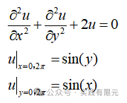

理论解为：

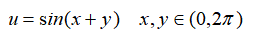

该问题的有限元推导也可以这篇文章，这里直接给出有限元方程

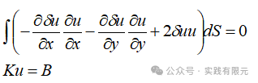

_**2.系数矩阵推导**_

对于三角形任意阶基函数的推导在前一篇文章《[三角形高阶基函数通式的两种获取方法](http://mp.weixin.qq.com/s?__biz=MzkwNzUxOTM2NA==&mid=2247485597&idx=1&sn=2de41c8fdf126fe21d171b90996f07d2&scene=21#wechat_redirect)》已经详细介绍，这里通过第二种方法进一步推导。下面给出基函数通式与基函数梯度的通式：    

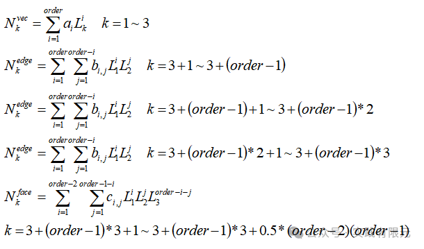

梯度表达式为：  

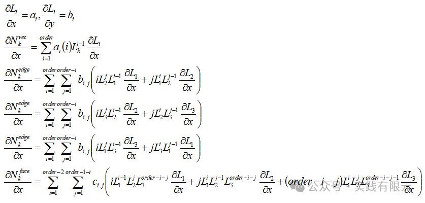

当已知上述的通解公式后，进一步推导有限元的系数矩阵方程,已知边值问题离散后的有限元方程：

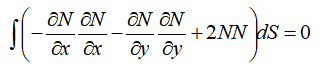

进一步推导，在每个单元上，将积分式子写成高斯积分形式，得到：    

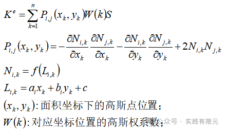

可见，对被积函数P的每一项均可以通过基函数和基函数的梯度获得，从而可获得单元的系数矩阵。

_**3.网格映射关系与高斯积分**_

获得单元系数矩阵后，按照有限元组装方式，将对应项系数累加即可。其中如何获得单元节点的局部变量与全局变量的映射关系，是一个重点问题。这里采用以下方式进行排列单元，首先排列三角形顶点编号，然后排列棱边节点编号，最后排列单元内部节点编号。

下面展示母单元的局部节点编号顺序如下，以四阶网格为例：

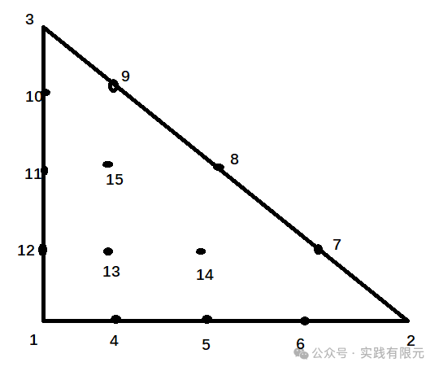

下面给出两个三角形单元网格下的不同阶数网格，对于四阶节点的全局坐标：    

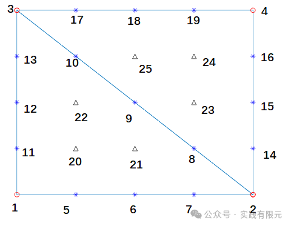

因此，映射关系可以得到：

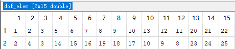

高斯积分的积分点与积分权重值这里直接查阅书籍获取，更多高阶的插值可以再网上查阅，或者通过高斯积分的原理通过编程实现，这部分不是本文的重点。

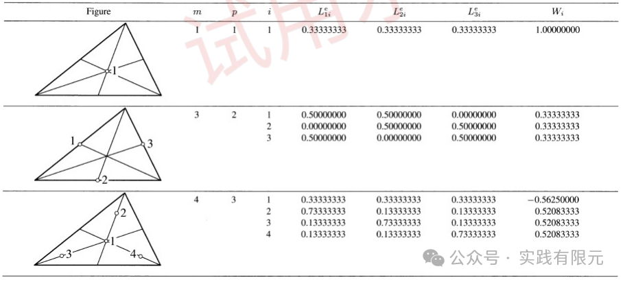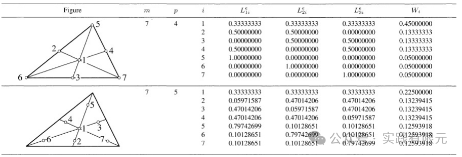    

准备好以上内容后，即可编程实现任意高阶的有限元。有限元的边界条件依旧采用简单的第一类边界条件的加载方法。

_**4.结果展示**_

模型区域为x = \[0 2\*pi\],y=\[0 2\*pi\]；基本网格采取8\*8的网格，共计128个三角形。

以下展示结果分别是1~4阶的网格节点关系、所有节点数值结果，三角形顶点的数值精度：

_**eg1 1阶基函数 ，共计81个节点未知数**_

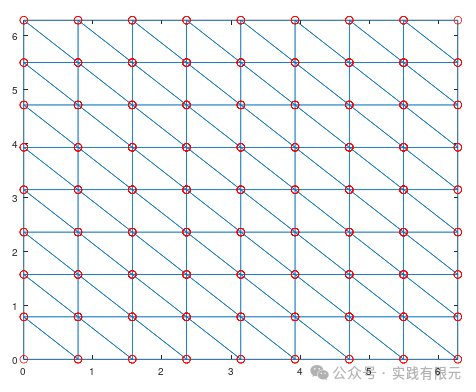    

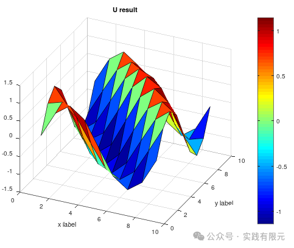

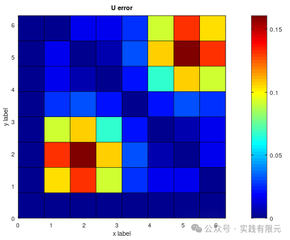

_**eg2 2阶基函数 共计289个节点未知数**_    

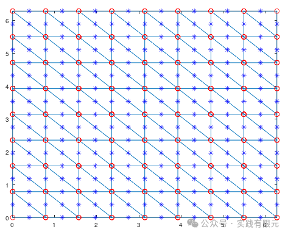

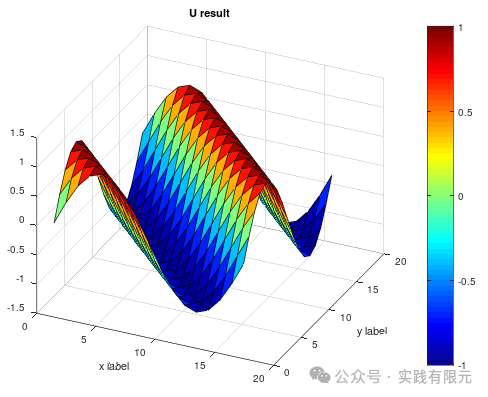    

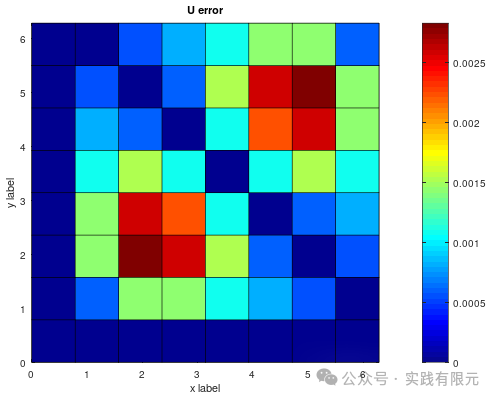

_**eg3 3阶基函数 共计625个节点未知数**_

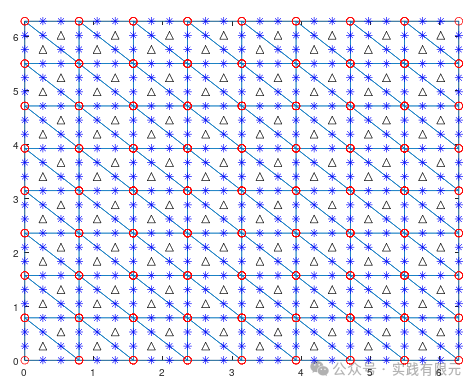    

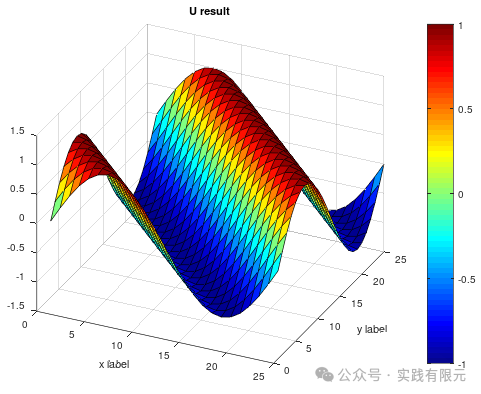

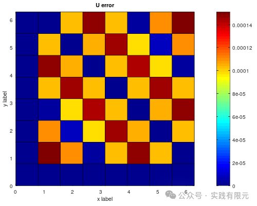

_**eg4 4阶基函数 共计1089个节点未知数**_    

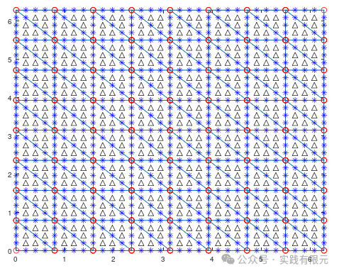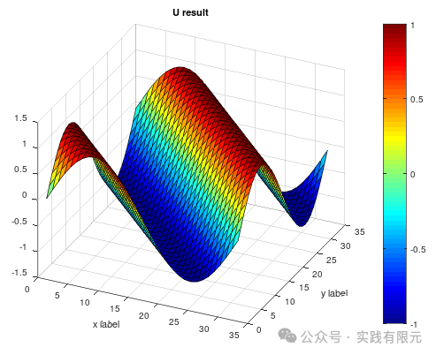    

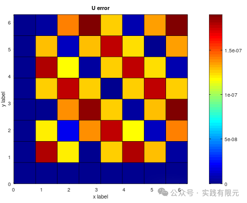

通过观察1~4阶的有限元结果，发现随着阶数的不断增加，精度也在成惊人的100倍的速度增加，从最开始是的1e-1,到1e-7次方的精度。

_**5.结论**_

1.在使用高斯积分求解单元系数矩阵的时候，对高斯阶数的选择非常重要，一般的选择阶数大于等于有限元的阶数。

2.如果采用乘以大数的方法加载边界条件，需要注意求解结果是否是正确收敛的；

3.三角形高阶的精度增加，竟然是每增加一阶，精度提高一百倍，这一点不知道是特例还是的确如此，需要更多的算例。不过这也再次说明了高阶结果的精度优势可能是简单的加密网格难以达到的。

4.相比于直接推导获得单元系数矩阵而言，三角形的高斯积分同样避免了这些复杂的推导过程，通过高斯积分即可获得单元系数矩阵，为实现任意阶基函数提供了必要基础。