# 二维力学问题有限元入门实现


> 原文地址: [https://mp.weixin.qq.com/s/dT7Uc7S-N0DKlCr\_boBZdQ](https://mp.weixin.qq.com/s/dT7Uc7S-N0DKlCr_boBZdQ)

简述

本文入门介绍二维力学的有限元数值模拟。二维弹性力学有限元分析的核心目标是求解物体在载荷作用下的位移、应变和应力分布。

通过建立平衡方程、几何方程和本构方程的关系，获得偏微分方程，进而可以进行有限元数值模拟分析。

1.力学理论与边值问题

平衡方程：描述物体内部应力与外力平衡

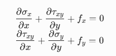

其中σx,σy为正应力，τxy为剪应力，fx,fy为体积力。

几何方程：联系位移与应变的关系

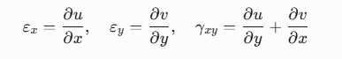

矩阵形式：

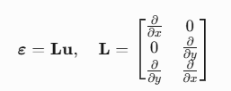

本构方程：平面应力问题的应力-应变关系

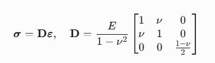

v表示为泊松比。

2.有限元推导

对于平衡方程，写成矩阵形式：

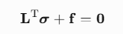

乘以虚位移并积分：

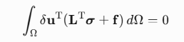

对第一项采用格林公式，将对σ的偏导数转化为对虚位移的偏导数，得到：

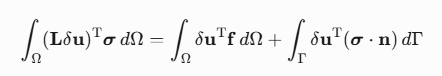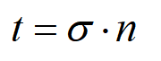

其中t为面力，Γ为边界。该方程可以体现能量守恒原理，然后带入本构关系和几何关系，最终得到虚功方程：

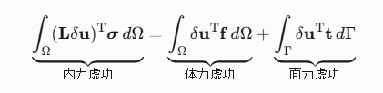

有限元离散，采用三角形网格离散研究区域，基本单元为三角形单元。首先将连续位移场用节点位移插值表示为：  

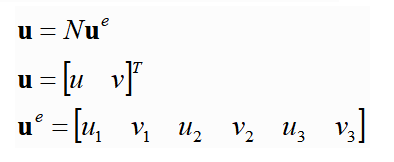

u,v分别表示x,y方向上的位移场。因此，N矩阵可以表示为：

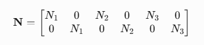

形函数N的表达式，可以通过面积坐标获得，详细可参考：[同轴线求电容，初探泊松方程的二维非结构化有限元](https://mp.weixin.qq.com/s?__biz=MzkwNzUxOTM2NA==&mid=2247483980&idx=1&sn=9803c31966314d8fbd90cede9faa1b60&scene=21#wechat_redirect)

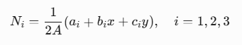

将插值场带入虚功方程，得到其离散形式：

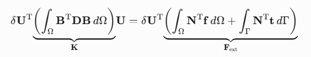

其中：D是本构方程，B矩阵为N插值基函数在微分算子L微分后的结果，微分算子为：

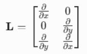

因此，可见B是基函数分布对x，y的偏导数的组合，对基函数的偏导数，具体形式为：

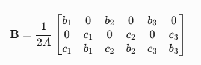

该矩阵称之为应变矩阵B，反映位移梯度与应变的关系，是单元刚度矩阵计算的核心。因此，有限元方程最终简写得到：

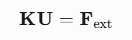

3.组装矩阵与边界条件

力学组装矩阵与常规有限元组装方法一致，各个单元按照全局映射关系逐个累加起来。

边界条件，对x=0采取固定边界(ui=0)，采用第一类边界条件的加载方式。对x=L右端加载拉力q。将拉力按照边界分段数目均匀分配在每条线段上，然后累加边界线段的矩阵。  

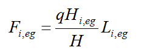

Hi棱边长度，H总长度，L为一维度的棱边上的基函数。

4.测试案例

测试案例参数：  

```
L = 2;          % 板长度(m)
```

1.当x=0位置仅固定u=0,不固定v时,计算结果如下：

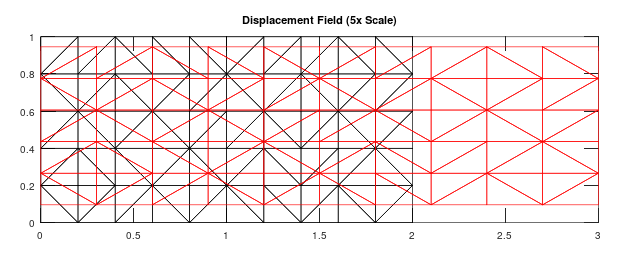

红色位移是扩大5倍的结果，可以看到基本上符合逻辑，y方向的位移没有约束，因此在x方向竖向位移是一致的，此时存在理论解，并且其应变、应力此时均为一个常数，本质上就是一维问题。

2.当x=0固定u=0,v=0，此时的计算结果：

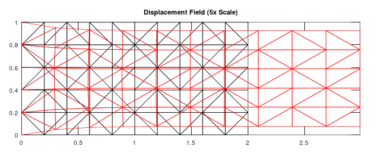

在x=0位置的位移场变化区域和之前有明显区别。竖向位移表现为为上下边缘向中心收缩。对应的应变场与应力场为：

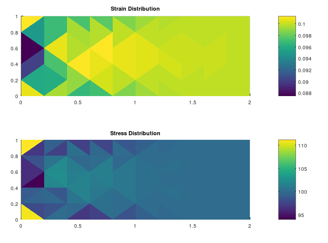

通过应变应力的场分布，数值的变化规律上基本上符合物理规律，更进一步需要优化局部加密网格，以获得精确值。

总结

本文完整推导了二维弹性力学有限元分析的流程，从控制方程到数值实现。模拟了矩形薄板在受拉载荷下的位移场、应变分布和应力分布。

与电磁有限元对比，力学的不同点主要在于其控制方程是由三个方程组成，其弱解形式的推导就看似比较复杂，这不同于电磁控制方程，大多数情况是一个控制方程。

测试案例使用AI实现，但是其中存在bug，反复修改并没有解决，最后只能自己下场，AI辅助才解决了问题。

* * *

博主长期深入实践电磁学领域的有限元技术，感兴趣的朋友可以添加博主公众号，欢迎共同探讨与有限元相关的技术知识。