# 二维各向异性有限元入门级实现


> 原文地址: [https://mp.weixin.qq.com/s/z7NzQVL1pEilXWeUrfQPsQ](https://mp.weixin.qq.com/s/z7NzQVL1pEilXWeUrfQPsQ)

简述

本文基于简单的拉普拉斯方程实现二维各向异性介质的有限元数值算法。

通过对二维同轴线的拉普拉斯方程求解电势，进而获得电容与商业软件的各向异性材料求解的电容进行对比，验证正确性。

1.边值问题

简单的同轴线模型：

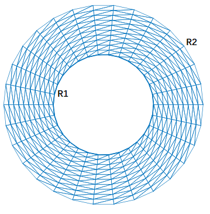

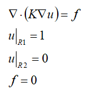

其中，K是二维各向异性的介电常数矩阵。

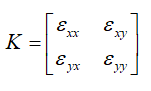

2.有限元问题推导

推导与传统有限元推导基本上一致，首先乘以试探函数在区域内积分：

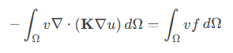

利用格林公式，转化二次导数：

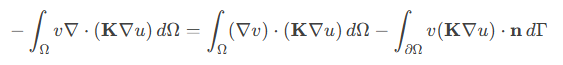

对于本问题，边界条件全部以第一类条件给出，因此边界积分项不用考虑。于是得到弱形式：

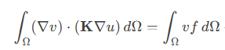

本文采用三角形剖分，一阶基函数作为基函数phi，因此，对上述等式离散得到：

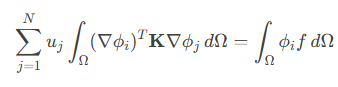

进一步细化，对于三角形基函数的表达式可以写成：

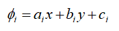

其导数，可以获得：

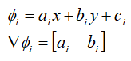

因此，对于每个单元，上述等式写成：

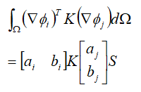

进一步展开，可以发现各向异性的关键之处：

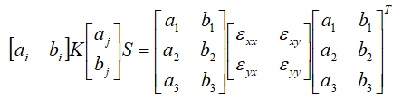

此时各向异性的各个参数分别体现在x方向梯度代表的a中与y方向梯度代表的b中。如此就将各向异性加入到有限元单元矩阵中。当K仅有主对角线，叫做主轴各向异性，当主对角线为一致时，退化为各向同性。

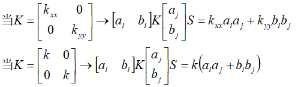

3.后处理

边界条件的加载、有限元组装与传统有限元组装方法一致，这里不再赘述，详细可参考文章：[同轴线求电容，初探泊松方程的二维非结构化有限元](https://mp.weixin.qq.com/s?__biz=MzkwNzUxOTM2NA==&mid=2247483980&idx=1&sn=9803c31966314d8fbd90cede9faa1b60&token=1963318729&lang=zh_CN&scene=21#wechat_redirect)

由于各向异性的拉普拉斯解没有理论解，因此很难直接对比电势，我们可以通过求解电容来与商软的电容对比正确性。

单位长度电容C定义为电荷Q与电压V的比值：

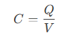

首先计算得到电场：

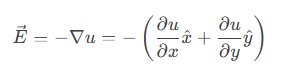

然后使用各向异性的本构关系，得到电位移矢量：

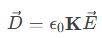

单位长度的电荷Q积分内半径，得到：

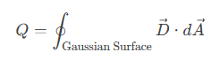

在数值数模中，电压V表示电势差，等于1：

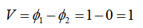

4.测试结果

```
% 参数设置
```

eg1:各项同性

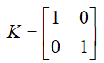

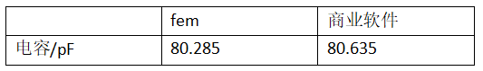

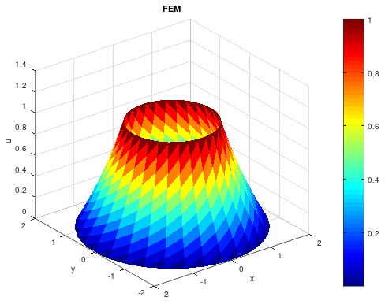

eg2:主轴各向异性

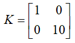

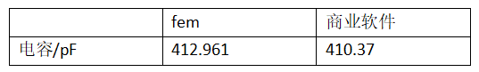

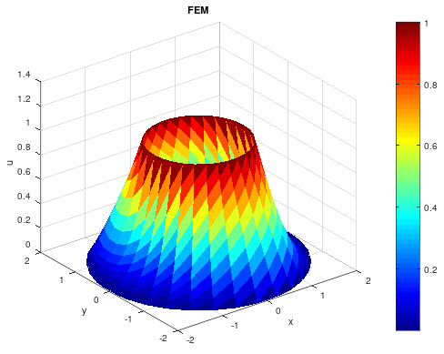

eg2:张量各向异性

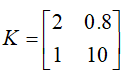

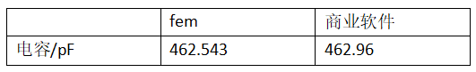

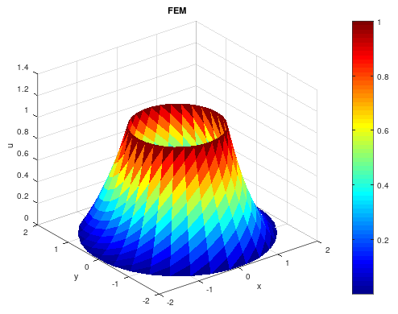

测试的三个不同的各向异性，结果均与商业软件的电容结果对应一致，说明各向异性的二维有限元实现时正确的。

观察各向异性的两个结果，由于主对角线介电常数差异较大，其三维可视化电势结果不再是完全轴对称的结果。

结束

对于有限元而言，各向异性材料的数值模拟实现并没有想象中那么困难，关键在于在单元矩阵中如何添加各向异性矩阵，本质上是在单元系数矩阵上乘以一个坐标维度的张量矩阵，作为在系数矩阵中体现各方向的材料不一致。