# 二维四面体任意高阶通式有限元实现-泊松方程

> 原文地址: [https://mp.weixin.qq.com/s/1jvFg0kf18TW\_SHArKRvPg](https://mp.weixin.qq.com/s/1jvFg0kf18TW_SHArKRvPg)

**简述**

上篇文章：[任意高阶通式有限元玩法-泊松方程](http://mp.weixin.qq.com/s?__biz=MzkwNzUxOTM2NA==&amp;mid=2247485281&amp;idx=1&amp;sn=655c6f441e4ba5be98c33334f7959982&amp;chksm=c0d6b38af7a13a9c59e5605ec16258fdf528fb21a68785298c984caf9d24d0a1916523699dac&scene=21#wechat_redirect)，详细介绍了一维任意高阶有限元的详细实现过程。本文就该技术继续前行，对于二维四面体网格而言，其基函数是通过一维基函数各个方向组合而成，因此实现了一维任意高阶有限元，对于二维四面体网格的任意高阶也就基本上没有技术盲区。

本文就根据一维的任意高阶基函数，实现二维四面体网格的任意阶。其中属于一维的任意高阶有限元介绍不再详细介绍，可参考：[任意高阶通式有限元玩法-泊松方程](http://mp.weixin.qq.com/s?__biz=MzkwNzUxOTM2NA==&amp;mid=2247485281&amp;idx=1&amp;sn=655c6f441e4ba5be98c33334f7959982&amp;chksm=c0d6b38af7a13a9c59e5605ec16258fdf528fb21a68785298c984caf9d24d0a1916523699dac&scene=21#wechat_redirect)

边值问题依旧沿用简单的泊松方程作为例子，这里也不再介绍，详细可参考：[泊松方程三维结构化有限元实现初探](http://mp.weixin.qq.com/s?__biz=MzkwNzUxOTM2NA==&amp;mid=2247484317&amp;idx=1&amp;sn=0994f0defe3d8e191eda70a4a355c67a&amp;chksm=c0d6b776f7a13e60dab1dec71969db6c551352966abf83f78d979173a6cc69029b732b1a609f&scene=21#wechat_redirect)

**1.四面体基函数**

已知X、Y方向一维基函数的基底可以表示为：

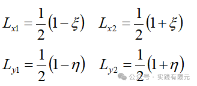

上述已经将线单元无量纲化，处理到\[-1,1\]区间，以便于使用高斯积分。处理方式如下：

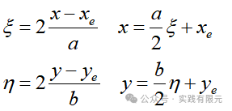

对应一维度的高阶基函数通式，这里给出X，Y方向的通式，详细推导参考：[任意高阶通式有限元玩法-泊松方程](http://mp.weixin.qq.com/s?__biz=MzkwNzUxOTM2NA==&amp;mid=2247485281&amp;idx=1&amp;sn=655c6f441e4ba5be98c33334f7959982&amp;chksm=c0d6b38af7a13a9c59e5605ec16258fdf528fb21a68785298c984caf9d24d0a1916523699dac&scene=21#wechat_redirect)

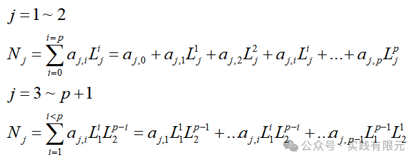    

对于四面体而言，我们已知的一阶基函数可以表示为：

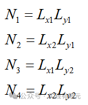

二阶基函数也很容易写出来，共计9个：

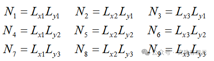

不难发现，一维度的基函数阶数与二维的基函数阶数是对应的，二维基函数个数是一维基函数的平方个，很容易写出其具体关系：

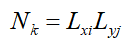

因此，发现一阶2\*2=4个基函数，二阶3\*3=9个基函数，三阶4\*4=16个基函数。如果使用原来推导出系数矩阵的方法，就会发现，二阶9个基函数需要得到9\*9系数矩阵还勉强可以接受，但是16\*16的系数矩阵着实让人生畏。

这更加体现了高斯积分的强大，给了我们一个不逐个计算系数矩阵的方法。继续推导，对于基函数通式的梯度求解可以写成：

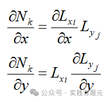

**2.系数矩阵的推导**

对于泊松方程，需要求解梯度乘积的积分，其对X偏导的通式一般为：

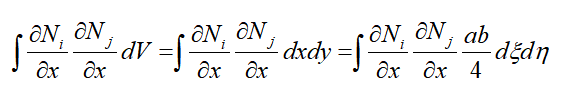    

将1小节中的基函数带入，进一步推导可以得到：

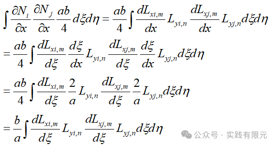

推导到这里就可以用高斯积分对其进行离散求解，最终可以写成：

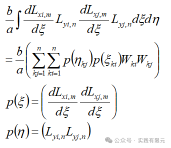

可见，高斯积分分别对X方向处理然后再对Y积分处理。对于Y方向的通式同样推导得到：

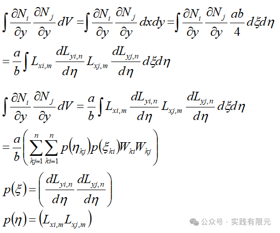

对右端项的推导相对更为简单：    

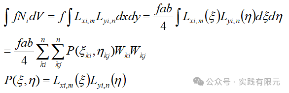

如此，泊松方程的左右端项通式的推导基本上完成，不需要在进一步推导。

**3.系数矩阵组装**

实现了任意阶基函数的通式后，还有一处难点就是网格单元到节点的映射关系。首先要确定单元四面体的局部坐标顺序，以此来确定全局单元节点的映射顺序。

根据2小节基函数通式，不难得出这种映射关系的顺序，如图所示：

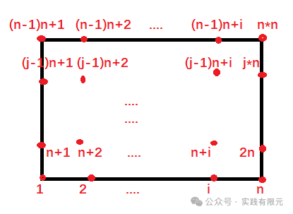

清楚单元与节点的局部映射顺序后，接下来就是实现单元到节点的具体映射关系，这里也没有什么技巧，实现即可，首先找到每个节点（四面体顶点与其他插值点）的坐标，然后根据四面体与这些节点的关系，一一得出对应关系。

这里需要仔细寻找节点与网格之间的拓扑关系，繁琐比较费时间。例如nx\*ny=2\*1的两个2阶四面体网格而言：

节点坐标信息如下：    

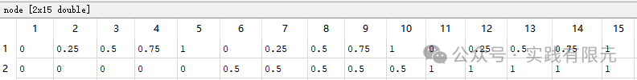

单元映射节点信息如下：

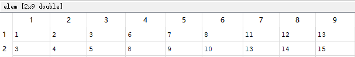

  

**4.结果展示**

泊松方程，研究区域为\[0,1;0,1\]，网格大小为nx\*ny=4\*3=12个四面体网格。

**a.1阶基函数结果 20个未知数**

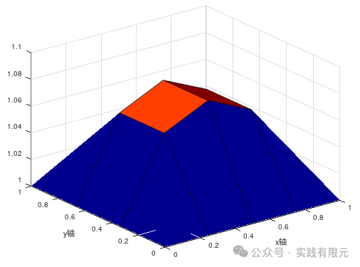

**b.3阶基函数结果：130个未知数**    

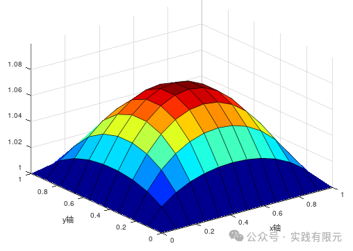

**c.6阶基函数结果 475个未知数**

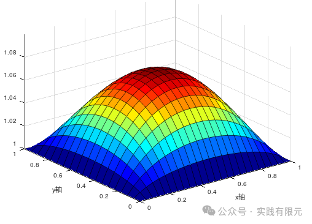

**d.10阶基函数结果 1271个未知数**

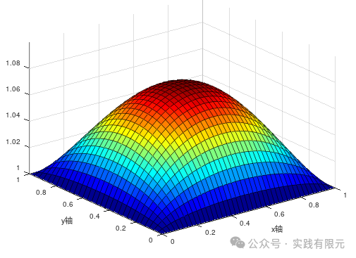

**总结**

1.通过一维的任意阶基函数拓展到实现二维四面体任意阶有限元的策略是可行的，并且实际证明实现难度也远比直接推导系数矩阵简单。

2.简单的实现了泊松方程的任意阶有限元案例，后续还可以继续探究这种任意高阶的在实际物理问题中的运用。

_Ps:如果对您有帮助，请点赞关注，在评论区与我讨论哦！_