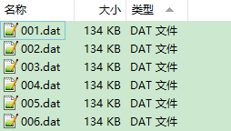
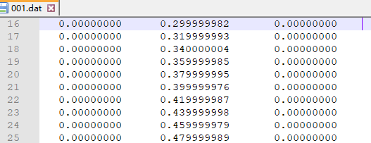
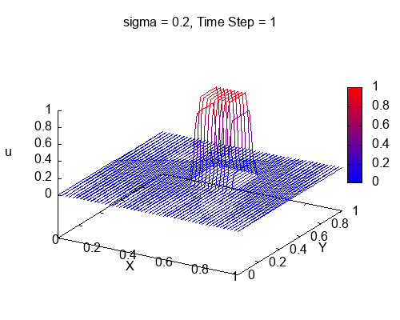
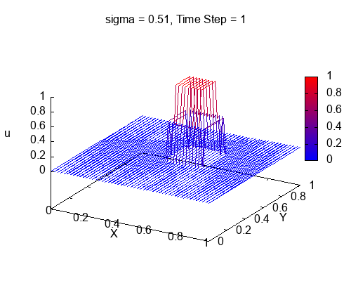

# 二维扩散方程的显式差分格式与迭代求解

> 原文地址: [https://mp.weixin.qq.com/s/G\_IMCa6Tgc6iQUuFfFZ0qQ](https://mp.weixin.qq.com/s/G_IMCa6Tgc6iQUuFfFZ0qQ)

点击上方「蓝字」关注我们

在科学计算领域，扩散方程作为描述物质在空间中随时间扩散过程的基本模型，其数值求解技术是研究者们长期关注的重点。继一维扩散方程的探索之后，今天我们进一步深入，一同探究二维扩散方程的显式差分格式及其迭代求解的奥秘，揭示这一数学工具在模拟复杂自然现象中的强大能力。

## 二维扩散方程

二维扩散方程可以表示为：

其中 表示随时间和空间变化的浓度或温度等物理量， 是扩散系数，体现了物质在介质中扩散的能力。此方程在环境科学、工程热力学、生物医学等领域有着广泛应用。

## 显式差分格式

显式差分法，是将连续的偏微分方程转化为离散的代数方程组的一种有效手段。在二维情况下，显式差分法同样将连续的偏微分方程转换为离散的代数方程组。设空间网格步长为 和 ，时间步长为 ，则在点 处的差分形式为：

这里， 表示在 方向第 个、 方向第 个节点的第 个时间步的浓度值。上述方程通过“向前”差分时间项，“中心”差分空间项，明确地展示了下一时刻节点值如何由当前时刻相邻节点的值决定，故称为“显式差分”。

## 迭代求解

拥有了差分方程，接下来便是通过迭代求解来求解动态变化的扩散过程。迭代始于初始条件 ，随着时间的推进，我们按照以下步骤更新每个节点的浓度值：

1.  **初始化**：设定初始浓度分布 。
    
2.  **迭代计算**：对于每一个时间步 ，根据上一时间步 的浓度分布，利用显式差分格式计算出所有空间节点 在当前时间步 的浓度 。
    
3.  **边界条件处理**：依据具体问题，合理设置边界节点的浓度值，以确保迭代过程的稳定性和准确性。
    
4.  **重复**：逐步增加时间步 直至达到预设的总模拟时间。
    

## 稳定性与收敛性的考量

值得注意的是，显式差分格式的稳定性和收敛性受到 和 、 的比值限制，即著名的Courant-Friedrichs-Lewy (CFL) 条件。

在二维情况下，定义**库朗数**（ Courant Number）

为了保证数值解的稳定性和收敛性，需确保 ，即 。

## 实例解析

设想一个正方形区域，边长 ，扩散系数 ，初始时刻满足：

扩散过程中，四周边界 恒保持为 。

### \# **Fortran实现**

利用Fortran语言，我们可以高效地实现该问题的数值解法。实现思路与一维情况类似，主要需要增加对 方向的差分处理。具体方法详见以下代码和注释：

`program diffusion     implicit none     ! 区域大小     real, parameter :: lx = 1.0, ly = 1.0     ! 扩散系数     real, parameter :: D = 0.3     ! Courant数,决定稳定性     real, parameter :: sigma = 0.2     ! real, parameter :: sigma = 0.51     ! 节点数和网格大小     integer, parameter :: nx = 51     integer, parameter :: ny = 51     real, parameter :: dx = lx / (nx - 1)     real, parameter :: dy = ly / (ny - 1)       ! 时间步长和步数     real :: dt     integer, parameter :: nt = 100        real, dimension(nx) :: x     real, dimension(ny) :: y     real, dimension(ny,nx) :: u, un     integer :: i,j, n          dt = sigma / D * min(dx,dy)**2          ! 计算网格点坐标     x = [(i*dx, i=0,nx-1)]     y = [(i*dy, i=0,ny-1)]     ! 定义初始条件     u = 0.0     ! 0.5 <= x or y <= 0.7时,u = 1.0     u(nint(0.5/dx):nint(0.7/dx),nint(0.5/dy):nint(0.7/dy)) = 1.0        ! 循环计算     do n = 1, nt       ! 复制当前解到un       un = u       ! 空间循环,计算u[i]       do i = 2, nx - 1         do j = 2, ny - 1                u(j,i) = un(j,i) &               + D * dt / dx**2 * (un(j,i+1) &               - 2*un(j,i) + un(j,i-1)) &               + D * dt / dy**2 * (un(j+1,i) &               - 2*un(j,i) + un(j-1,i))         end do       end do       ! 保存数据       call SaveData(x, y, u, n)     enddo      contains     ! 结果保存子程序     subroutine SaveData(x, y, u, n)       implicit none       real, dimension(:), intent(in) :: x, y       real, dimension(:,:), intent(in) :: u       integer, intent(in) :: n       integer :: i, j       character(len=3) :: xx, doc       ! 创建子目录,Windows系统       doc="res"       call system('if not exist '//doc//' md '//doc)       ! 存储结果到res/***.dat文件       write (xx(1:3),fmt = '(i3.3)') n       open(10,file = doc//'/'//xx//'.dat')       do i = 1, size(x)          do j = 1, size(y)             write(10,*) x(i), y(j), u(j,i)          end do       end do       close(10)     end subroutine SaveData   end program diffusion   `

编译和运行，在子目录`res`下得到了多个数据文件，分别命名为`001.dat`, `002.dat`, ..., `100.dat`

每个文件内部有 3 列数据，分别为网格节点坐标 (x,y) 和 u 的节点值。例如：

### \# **Gnuplot绘图**

我们使用 Gnuplot 来制作动图。在 Fortran 程序同一目录下，创建并运行以下`plt`脚本文件，就可以轻松得到 GIF 格式的动图文件。

`set terminal gif animate delay 5 size 500,400   set output 'motion.gif'   set xlabel "X"   set ylabel "Y"   set zlabel "u"   set xrange [0:1]   set yrange [0:1]   set zrange [0:1]   set xtics 0,0.2,1   set ytics 0,0.2,1   set ztics 0,0.2,1      #定义图例格式   set palette defined  ( 0 "blue", 1 "red" )   set cbrange [0:1]   #循环读取文件数据并作图   do for [i=1:100] {     filename = sprintf("res//%03d.dat", i)     set title sprintf("Time Step = %i",i)     splot filename with lines notitle palette   }   `

以上代码比较简单，这里就不多做解释了，Gnuplot 新手可参考我们以前的推文。

### \# **结果讨论**

程序中利用库朗数`sigma`(即 )进行时间步长控制，`sigma = 0.2` 和 `sigma = 0.51` 的计算结果分别如下图所示。

可见，扩散方程的显式差分法的稳定性是由无量纲的库朗数决定的。时间和空间差分间隔不能随便取。在具体数值计算中，我们需要调节好这个参数，从而在数值精度和计算效率上取一个平衡。

## 结语

通过对二维扩散方程显式差分格式及迭代求解的探讨，我们更全面地理解了其数值求解的精妙之处，以及在模拟复杂扩散现象中的应用潜力。在未来的科学计算旅途中，我们将继续运用数字的力量，解锁更多自然界的秘密。

  

往期推荐

[

一维扩散方程的显式差分格式与迭代求解

](http://mp.weixin.qq.com/s?__biz=Mzk0MzI0NDU2NQ==&mid=2247486297&idx=1&sn=d73dec93b4dacf0c885c5bf1a47b76d9&chksm=c3379f23f44016357bab6aa9f54b7f922288e0be178a420087bda231d67935d9761421423737&scene=21#wechat_redirect)

[

差分中的库朗数和计算稳定性

](http://mp.weixin.qq.com/s?__biz=Mzk0MzI0NDU2NQ==&mid=2247486310&idx=1&sn=29529196eb624f1796d4b0e1a206f3cb&chksm=c3379f1cf440160af19ee8a917509a79ea13d8d6460a543948658e1a53b828b77bca21d610eb&scene=21#wechat_redirect)

[

小试牛刀：使用Gnuplot轻松绘制动图

](http://mp.weixin.qq.com/s?__biz=Mzk0MzI0NDU2NQ==&mid=2247486276&idx=1&sn=c3bcacb63ebaa283ca9757cfd6ed0117&chksm=c3379f3ef44016286f60c6243a564c3bec9464a0d911435b8eb509fe4d2d2dbb60e390e3a2c0&scene=21#wechat_redirect)

  

## 推荐阅读

  

**FEtch 系统**是笔者团队开发的新一代有限元软件开发平台。只需按照有限元语言格式填写脚本文件，即可在线自动生成基于**现代 Fortran** 的有限元计算程序，从而大幅提高 CAE 软件的开发效率。欢迎私信交流。

有任何疑问或建议，欢迎加Q群 "**FEtch有限元开发系统(519166061)**" 留言讨论。我们长期开展 FEtch 系统的试用活动，感兴趣的朋友入群后可直接联系管理员，免费获取**许可证文件**。

**喜欢****作者******，请点********赞********和在看********

****