# 二维有限元实现详细过程：三角形网格二阶插值基函数

> 原文地址: [https://mp.weixin.qq.com/s/1T85TOA\_ygBWYWnWk4YZ3Q](https://mp.weixin.qq.com/s/1T85TOA_ygBWYWnWk4YZ3Q)

**简述**  

本文意在详细介绍二维三角形网格的二阶插值基函数的实现过程，通过对简单的边值问题的实现，对比了一阶三角形、结构化网格（四边形）的计算精度。同时给出二阶插值基函数对应的常见系数矩阵。

**1.边值问题**

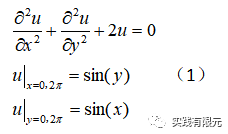

理论解：

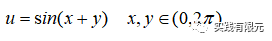

2.有限元方程  

具体推导参考：[介绍一个二维结构化有限元的常见边值问题](http://mp.weixin.qq.com/s?__biz=MzkwNzUxOTM2NA==&amp;mid=2247483948&amp;idx=1&amp;sn=04bda8d18694d2a7bc991c1fa2c9709e&amp;chksm=c0d6b6c7f7a13fd17afd6fdd8ad4019df09d927ccdf96d83b0175c1da29f0874cbe228a728be&token=1707671870&lang=zh_CN&scene=21#wechat_redirect)。  

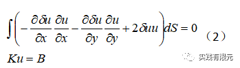

3.二阶三角形插值基函数推导  

首先根据体积坐标，得到三角形的线性插值基函数，这部分推导参考：[同轴线求电容，初探泊松方程的二维非结构化有限元](http://mp.weixin.qq.com/s?__biz=MzkwNzUxOTM2NA==&amp;mid=2247483980&amp;idx=1&amp;sn=9803c31966314d8fbd90cede9faa1b60&amp;chksm=c0d6b6a7f7a13fb19c485e758759ae83a99bc808c940178bd52bdedc32b5884c98969d8d4e6e&token=1707671870&lang=zh_CN&scene=21#wechat_redirect)，表示为：

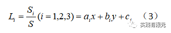

其中Si为三角形中任意一点与其他两个节点围成的面积，表示三角形面积。通过线性插值基函数的组合，获得二阶三角形的插值函数，其中不同编号顺序得到的基函数组合方式有所区别，例如以下两种编号的二阶三角形网格：

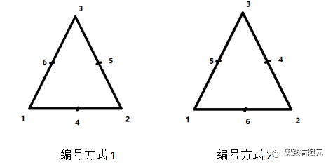

对应1、2编号方式的插值基函数：

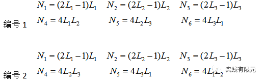

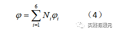

可见，不同的编号顺序得到的基函数结果是不一样的，这里需要特别注意这一点，如果基函数结果与编号顺序不统一，会导致计算结果错误。本文使用的是第一种三角形编号顺序。

将上述二阶三角形基函数带入有限元方程中，得到有限元离散结果为：

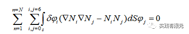

写成矩阵形式：

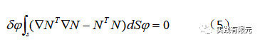

从（5）式中可以发现，求解过程不仅需要知道基函数，还需要知道基函数的梯度，因此对基函数进行梯度运算，得到：

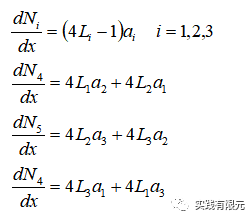

二阶插值基函数的梯度结果不再像一阶基函数梯度是一个系数,因此要得到具体的系数矩阵，就得使用积分公式计算或者查表获得，这里给出具体计算公式与常见结果的积分表：

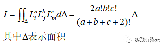

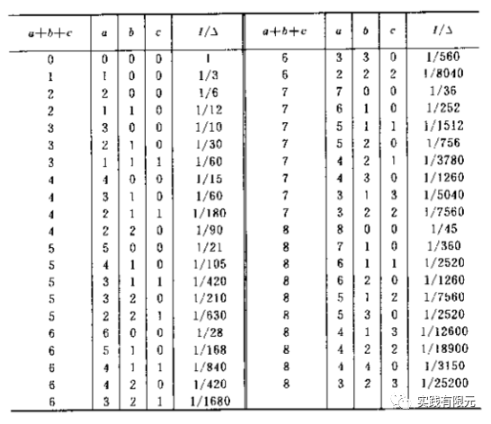

**4.单元系数矩阵推导**

下面给出（5）式中的每一项的系数矩阵推导过程，首先是梯度项的系数：

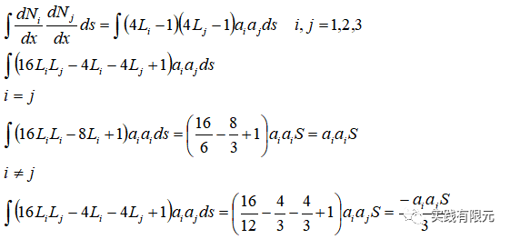

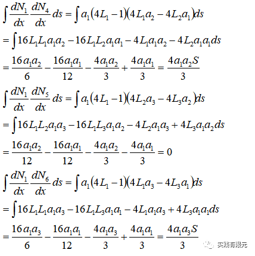

同理，可以推导：

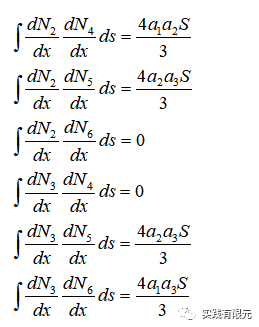

根据有限元系数矩阵对称型的特征，可以直接得到下面部分的结果：

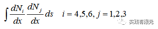

继续计算i=4,5,6;j=4,5,6部分的系数：

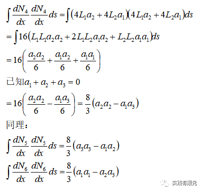

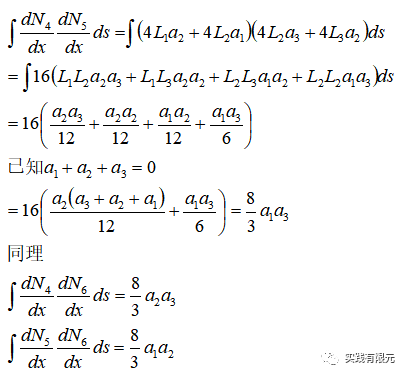

将上述整合成矩阵形式，得到（5）式中积分第一项的系数矩阵：

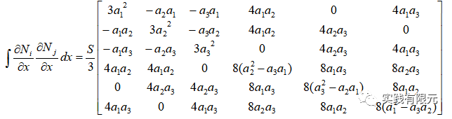

同理只需要把a系数换成b系数，得到dN/dy的系数矩阵。

然后继续推导N\*N的系数矩阵：

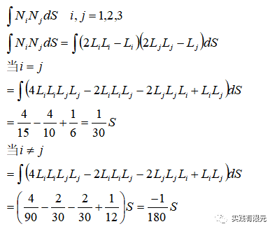

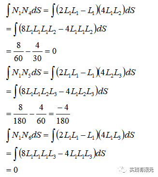

同理可以得到：

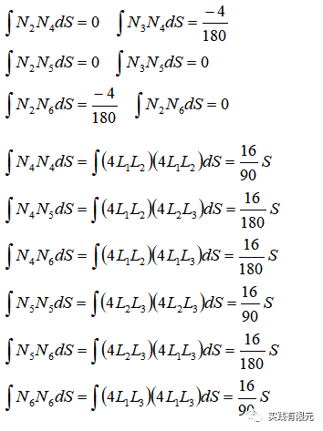

整合矩阵，得到：

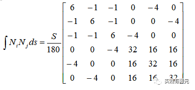

上述过程详细展示了有限元离散方程中的两个重要的单元系数矩阵推导过程。

**5.全局系数矩阵组装**

    在组装系数矩阵之前，需要知道局部编号到全局编号的映射关系，为了方便起见，这里展示2\*3网格剖分尺度的网格，如下三角形网格剖分与映射关系：

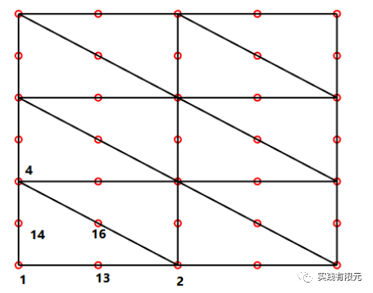

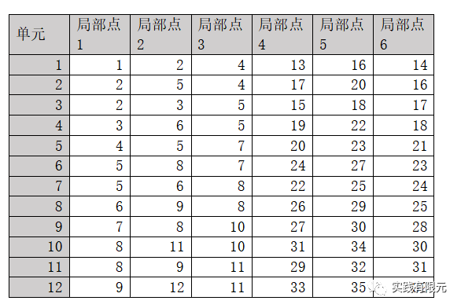

可见，2\*3网格的6个四边形变成了12个三角形；但是一阶的三角形的节点数与四边形网格是一样，二阶三角形则多至35个节点。

系数矩阵组装则根据上述对应关系，将每个单元的局部系数矩阵映射组装到35\*35的全局系数矩阵。矩阵过大，这里不再展开介绍。

对应的边界条件均为第一类边界条件，因此加载方式同样使用乘以大数的方法加载。

**6.计算结果展示与对比**

a.网格尺寸2\*3的结果对比：

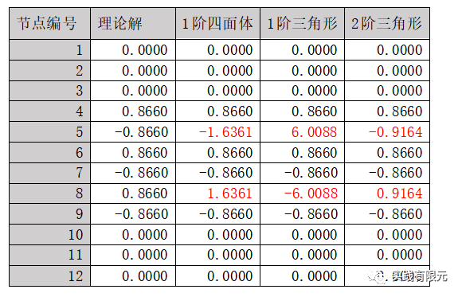

误差主要体现在5、8号点，二阶三角形的误差最小，一阶三角形的误差最大，四面体网格的误差居中。同等1阶情况下，四边形精度要好于三角形。

查看文献解释“四边形网格采用的基函数属于双线性插值函数”，我理解为三角形的基函数是纯粹的线性基函数，而四边形网格的基函数是由一维线性基函数的乘积组成，组成后就成了双线性插值，精度就更高一些。在公式中具体体现为：三角形线性基函数的梯度就等于对应方向的常系数，而四边形对应方向的梯度不是常系数。

b.网格尺寸为20\*20的网格：

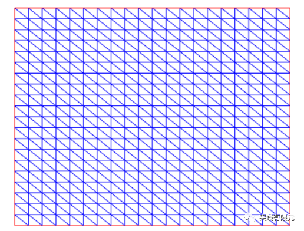

一阶三角形网格计算结果：

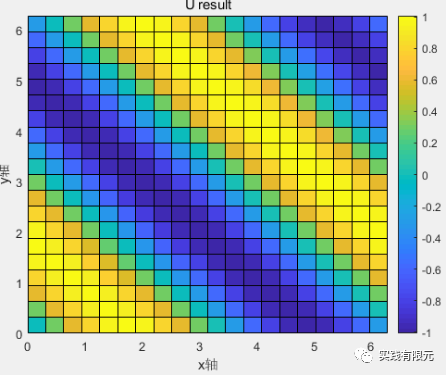

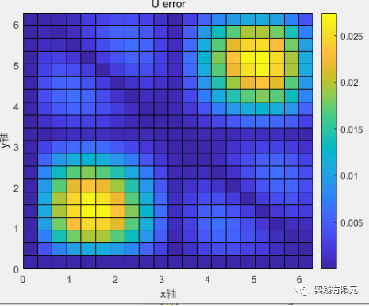

二阶插值三角形网格计算结果：

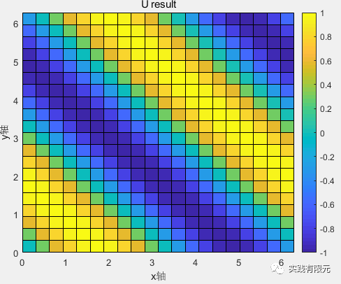

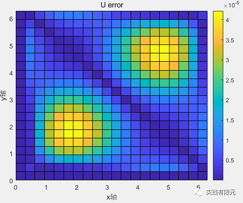

对比结果，20\*20网格的1阶三角形网格的精度范围与1阶四面体的精度范围是一致。二阶三角形精度远高于一阶，误差低至5e-5次方。

虽然二阶精度远远高于一阶，但是未知数增加到1861个，系数矩阵则是1861\*1861，相对于一阶矩阵的441个增加了4倍多，计算量也增加非常明显。  

**7.总结**

a.三角形的二阶插值基函数的复杂度明显高于一阶基函数，尤为体现在单元系数矩阵的推导过程中；其次由于未知数落在了三角形的边中心点，因此还需要写算法得知全局三角形边的编号，也是一个比较麻烦的问题。  

b.同等网格下二阶的计算精度明显是高于低阶的，这也符合有限元的基本规律；值得关注的是，双线性四边形的精度明显是高于线性插值的三角形基函数，这点对于我们选择三角形、四面体作为基本剖分单元的时候值得参考。