# 二维有限元混合网格的详细实现过程

> 原文地址: [https://mp.weixin.qq.com/s/FScKItL6HhXADiyoSZt5Wg](https://mp.weixin.qq.com/s/FScKItL6HhXADiyoSZt5Wg)

**简述**  

在二维有限元问题上，该公众号已经介绍了大量案例，从网格的角度上介绍了四边形网格的结构化有限元和三角形网格的非结构化有限元。

非结构化有限元的优势在于三角形网格形函数简单，可以很好的模拟任意形状物理模型的边界；缺点是低阶精度不足，必须耗费大量网格或者高阶基函数来提高精度。

结构化有限元的优势在相同阶数上精度要优于三角形网格，同时所需要的网格也远少于三角形；缺点则是无法精确模拟复杂物理模型，对于复杂边界只能通过不断细化网格来契合模型。

通过简单分析，二者各有优缺点，因此如果能将两种网格混合使用，或许就能够实现各自优点，避免各自缺点。本次文章介绍二维四边形网格和三角形网格的混合有限元实现过程，详细分析实现过程与精度对比分析。

**1.边值问题**   

    依旧使用二维电场在介质中衰减的物理模拟，具体边值问题参考：[二阶叠层基函数：二维电磁衰减数值模拟](https://mp.weixin.qq.com/s?__biz=MzkwNzUxOTM2NA==&mid=2247484069&idx=1&sn=a52d10043b20af30f935ecbfd9413712&chksm=c0d6b64ef7a13f5854c7b426fab0658cfd0d239518c5e8f636b05e1c73f251c4b7c4d776b14a&scene=21#wechat_redirect)[，这里给出最终的有限元推导公式](https://mp.weixin.qq.com/s?__biz=MzkwNzUxOTM2NA==&mid=2247484069&idx=1&sn=a52d10043b20af30f935ecbfd9413712&chksm=c0d6b64ef7a13f5854c7b426fab0658cfd0d239518c5e8f636b05e1c73f251c4b7c4d776b14a&scene=21#wechat_redirect)[：](https://mp.weixin.qq.com/s?__biz=MzkwNzUxOTM2NA==&mid=2247484069&idx=1&sn=a52d10043b20af30f935ecbfd9413712&chksm=c0d6b64ef7a13f5854c7b426fab0658cfd0d239518c5e8f636b05e1c73f251c4b7c4d776b14a&scene=21#wechat_redirect)

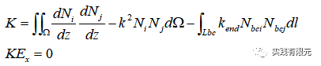

具体研究区域与物理参数如下：

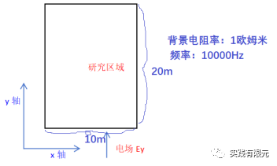

**2.基函数与单元系数矩阵**  

既然想要实现混合网格有限元，则必须给出三角形单元和四面体单元的基函数的单元刚度矩阵。只考虑线性插值的情况下有：

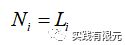

**三角形基函数**，三角形基函数使用面积坐标推导得出，具体推导参考：[二阶叠层基函数：二维电磁衰减数值模拟](https://mp.weixin.qq.com/s?__biz=MzkwNzUxOTM2NA==&mid=2247484069&idx=1&sn=a52d10043b20af30f935ecbfd9413712&chksm=c0d6b64ef7a13f5854c7b426fab0658cfd0d239518c5e8f636b05e1c73f251c4b7c4d776b14a&scene=21#wechat_redirect)

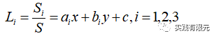

单元系数矩阵:

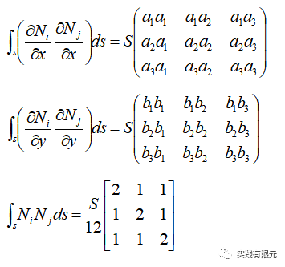

**四边形基函数**由一维线单元的基函数组合而成，具体推导参考：[介绍一个二维结构化有限元的常见边值问题](https://mp.weixin.qq.com/s?__biz=MzkwNzUxOTM2NA==&mid=2247483948&idx=1&sn=04bda8d18694d2a7bc991c1fa2c9709e&chksm=c0d6b6c7f7a13fd17afd6fdd8ad4019df09d927ccdf96d83b0175c1da29f0874cbe228a728be&token=1949017827&lang=zh_CN&scene=21#wechat_redirect)

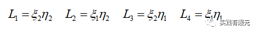

单元系数矩阵：

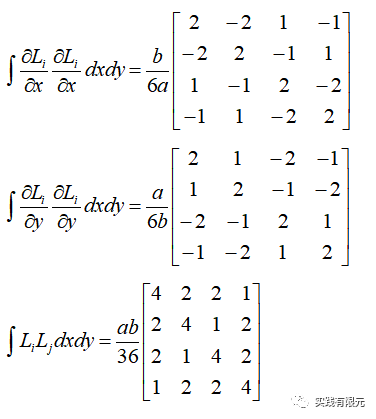

**3.系数矩阵组装**  

以最简单的网格剖分为示例，分析求解过程中每个步骤的实现过程。网格示意图如下，两个三角形网格，一个四边形网格。

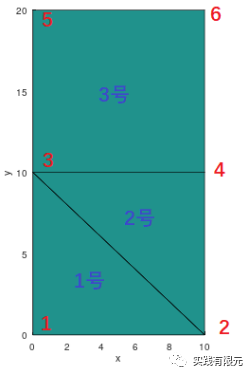

因此，可以得到对应的全局与局部单元编号表格。

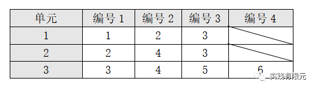

按照上述列表，对有限元离散方程进行组装得到全局系数矩阵如下：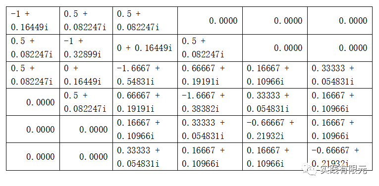

**4.边界条件**  

添加边界条件，在y=0的边界上依旧强加第一类边界，使用乘以大数的方法实现。在y=20的边界上为第三类边界，分析发现，不管是三角形网格还是四边形网格，最后落在y=20的边上，都是1维线单元，因此处理方式不存在差异。

因此，参考一维二阶叠层有限元的基函数，可以得到一维线性基函数的单元系数矩阵维：

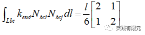

将上述边界条件，加载到对应的全局系数矩阵的位置，得到最终的系数矩阵与右端项，最终的全局系数矩阵：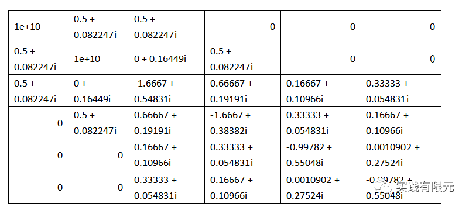

右端项：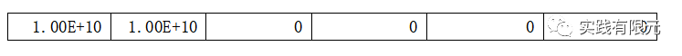

求解上述线性方程组，即可得到求解结果。

5.结果精度对比  

对于上述的最简单模型进行对比，分别使用理论解对比纯三角形网格、纯四边形网格、混合网格的精度结果。

**a.纯三角形网格计算结果**

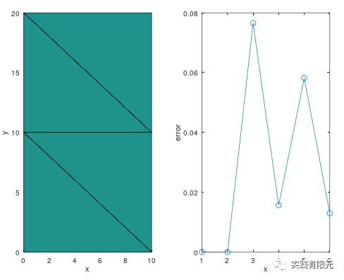

**b.纯四边形计算结果**

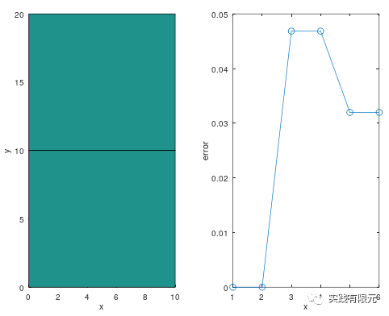

**c.混合网格计算结果**

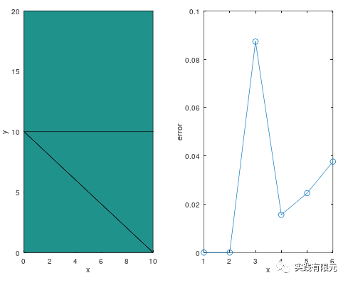

可以看出，纯三角形网格的最大误差0.8高于纯四边形0.45;而混合网格的精度最大误差在0.8左右，混合网格在网格分界面上的精度要略高于纯三角形的最大误差。将网格尺寸继续加密，得到相对精确的结果，混合网格计算结果如下：

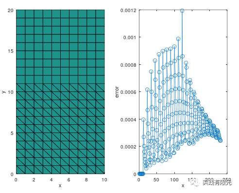

电场实部虚部可视化结果如下：

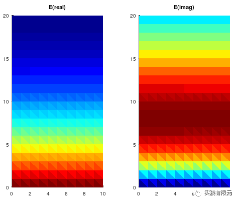

**6.复杂模型测试**  

对于非规则模型而言，纯粹使用四边形网格就很难模拟模型的边界，例如下列模型：

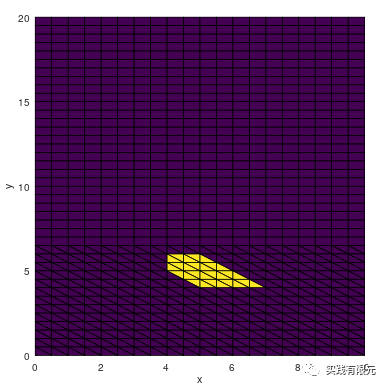

在斜边上，只有通过三角形网格才可以做到完全的拟合模型边界。因此，粗略对下半区域使用三角形网格，而对上半区域使用四边形网格，求得结果：

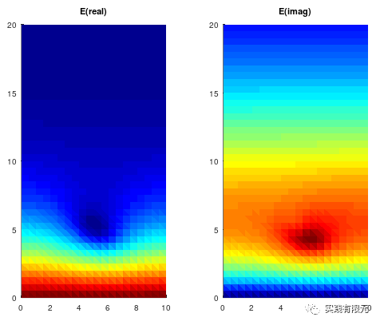

**总结**

1.本文简单介绍了混合网格的有限元实现过程，对于这种方法的性能优势的具体体现还有待在更加复杂的模型中测试。

    2.混合网格的有限元实现是可行的，初步总结规律即为复杂模型附近使用能完全拟合边界的三角形网格，在其他区域采用四面体网格。