# 二维矢量有限元的详细实现过程

> 原文地址: [https://mp.weixin.qq.com/s/7vKBW4HCuIKejJ4PQJk4HA](https://mp.weixin.qq.com/s/7vKBW4HCuIKejJ4PQJk4HA)

**简述**

在电磁领域中，电场的传播规律有这么个特征：在介质分界面传播不连续，详细的说则是切向连续，法线不连续。这一特征导致传统的节点有限元无法处理，因为节点有限元必然是满足求解场的连续性。

在文章中[二阶叠层基函数：二维电磁衰减数值模拟](https://mp.weixin.qq.com/s?__biz=MzkwNzUxOTM2NA==&mid=2247484069&idx=1&sn=a52d10043b20af30f935ecbfd9413712&chksm=c0d6b64ef7a13f5854c7b426fab0658cfd0d239518c5e8f636b05e1c73f251c4b7c4d776b14a&token=217668337&lang=zh_CN&scene=21#wechat_redirect)提及到：矢量有限元是一种有效的解决方法，它将未知数落在棱边上，保证棱边的切向连续，并不考虑棱边的法向分量，这就完全满足电场的传播规律。本文就二维电磁衰减作为边值问题，详细分析二维矢量有限元的详细实现过程。

**1.边值问题**

边值问题考虑在Z方向是不变的，变化只存在x,y方向。假设电场传播方向是y方向，则二维电场传播方程：

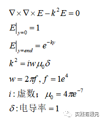

**2.变分问题**

使用矢量有限元，求解的值为每个棱边上的切向场，因此：

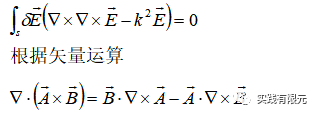

将上述双旋度项带入其中，得到：

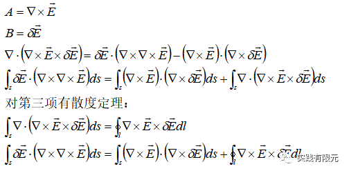

对于当前边值问题，边界考虑成第一类边界条件，因此环路积分项不考虑，因此，变分问题为以下形式，离散则得到有限元问题：

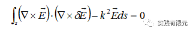

**3.矢量基函数**

单元矩阵还是考虑三角形，首先获得最基本的形函数面积坐标：

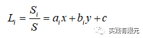

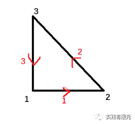

根据上图顺序构造棱边基函数：

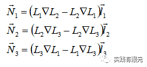

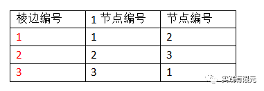

不难看出，棱边基函数是由面积坐标函数与面积坐标的梯度组合而成，而面积坐标的梯度是一个矢量，因此棱边基函数也是一个矢量。其次基函数乘以棱边长度l是具有方向的，这个方向是指：全局区域中棱边只存在一个方向。这对于局部矩阵组装全局矩阵尤为重要。

在进一步解释棱边基函数的意思，假设上述图中为直角三角形，点p落在12边上，则面积坐标可以表示为：

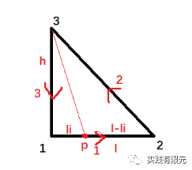

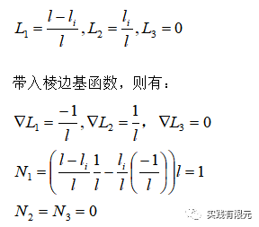

因此p点在棱边12上的任意一点，其结果都是一样，因此进一步证实一条棱边仅表示一个值。其他两条棱边也可以同样的方式推导证明。

因此，想要得到任意一点的电场值，通过电场的插值公式可以获得：

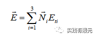

经过上述分析，不难得到：

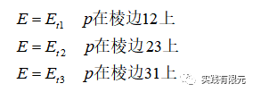

在文章开头解释矢量有限元的求解过程是不考虑电场法向分量的，这里进一步从基函数的角度来解释，要分析数值解的法向分量，对基函数进行梯度，得到：

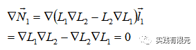

发现基函数的梯度等于0，其他两个基函数也可以通过推导，也就是说棱边基函数项中没有考虑棱边的梯度项，因此未知数法向是否连续就不会考虑。而对于切向方向，对基函数求旋度自然不等于0：

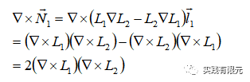

因此，使用棱边基函数的有限元分析才能符合电场的变化规律。如果使用节点有限元强行分析电场在分界面不连续的模型，则会出现伪解的情况。

**4.单元系数矩阵推导**

确定了棱边基函数后，继续推导得到每个单元系数矩阵，对于有限元方程的第一项推导如下：

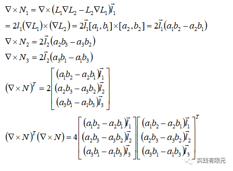

第二项推导：

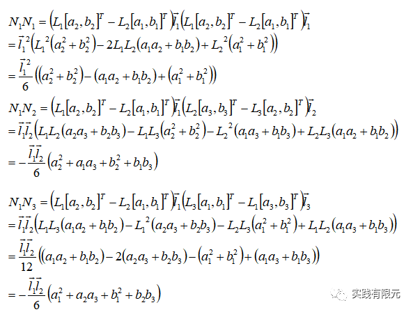

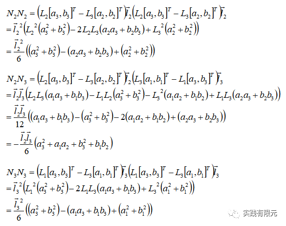

得到第二项的系数矩阵：

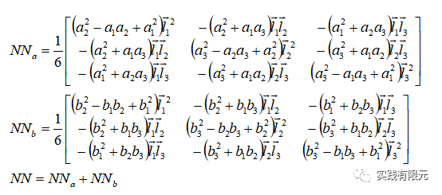

最终积分得到一个单元类的系数矩阵：

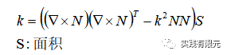

**5.系数矩阵组装**

以最简单模型为例子，研究区域仅包含两个三角形网格，棱边编号与节点编号如图所示：

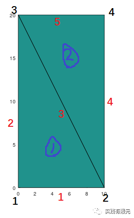

单元的节点编号与单元的棱边编号，根据局部逆时针顺序获得：              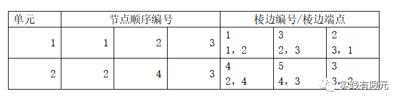

全局棱边编号如下，为了保证棱边只有一个方向，规定：棱边的两个端点，从小到大为正方向：

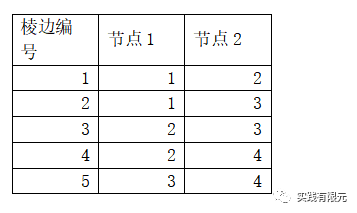

由此，可以发现单元1、2号中的棱边编号顺序存在从大到小，为了保证所有单元棱边在组合的过程中只存在一个方向，将正方向乘以1，与正方向相反乘以-1，以保证方向一致。

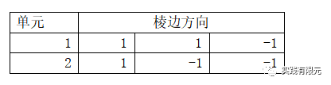

在确定上述局部与全局的关系后，然后再开始组装。下面给出每个单元的系数矩阵与组装后的系数矩阵。

单元1的系数矩阵：

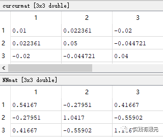

单元2的系数矩阵：

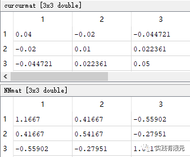

组装成全局的系数矩阵：

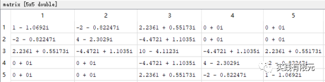

**6.边界条件加载**

该模型中，只使用了第一类边界条件，假设电场从y方向入射，振动方向为x。不同于节点有限元加载第一类边界，棱边有限元需要把边界条件加载在棱边上。采取的方法是把棱边中点的电场值E投影到棱边切向方向Et上。

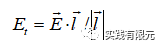

棱边方向同样遵循从小到大的原则。

如此，可以发现在x=0,end的位置，棱边方向是y方向，与电场振动方向垂直，因此电场切向始终为零。在y=0,end的位置，棱边方向与y方向平行，存在Et。加载方式同样以大数的方法。

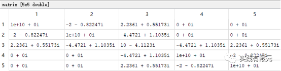

四个外边界棱边加载后的系数矩阵如上所示，右端项为：

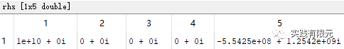

**7.求解结果**

**a.仅有两个三角形网格的棱边未知数结果：**

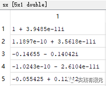

插值获得的单元中心点电场结果：

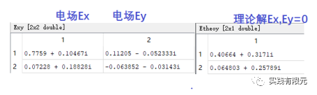

误差很大，并且电场Ey也存在，这是由于棱边有限元误差导致的。

**b.网格采用20\*40的网格，单元中心点电场结果如下：**

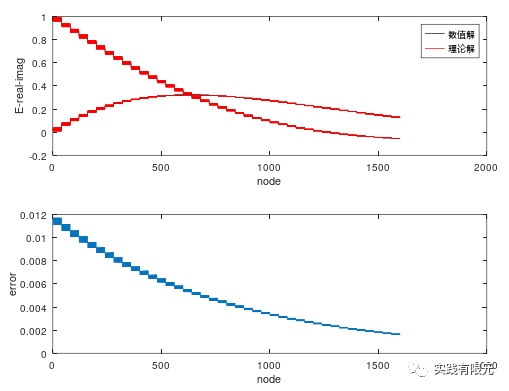

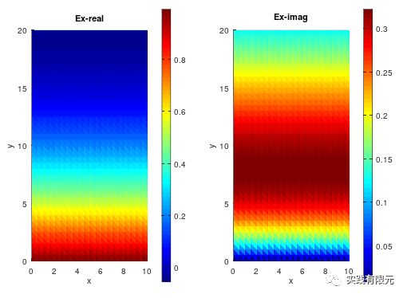

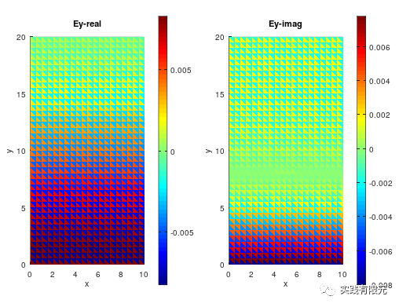

    可以发现虽然Ex的电场场规律基本上与理论解一致，但是误差也是比较大，并且Ey的误差也很明显，这似乎是矢量有限元本身的误差，无法消除。  

**c.研究区域内存在不同的介质材料。中间区域电导率为10**

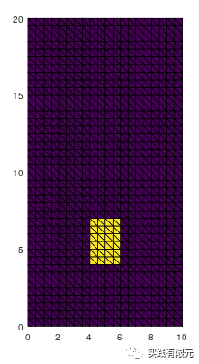

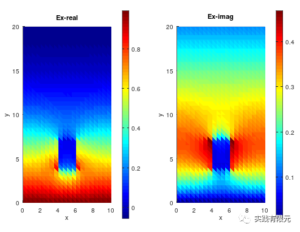

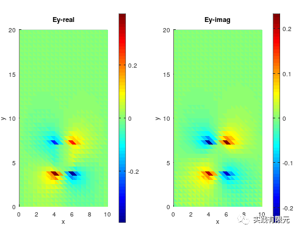

从Ex可以发现，电场在x方向分界面上明显的不连续，出现了突变的情况，与真实电场的传播规律是一致的。并且Ey也存在响应，不再仅仅是误差。这些都是节点有限元无法模拟的。

**总结**  

矢量有限元的流程基本上和节点有限元一致，其中的关键点主要有：

    1.棱边信息的获取；

    2.矢量基函数的推导；

    3.局部系数到全局系数的映射关系，一定要注意棱边方向统一；

    4.第一类边界加载，未知数值投影到棱边上。