# 二维矢量有限元（结构化网格）实现流程

> 原文地址: [https://mp.weixin.qq.com/s/QbNnt2OVncIA5Bed6mTa2Q](https://mp.weixin.qq.com/s/QbNnt2OVncIA5Bed6mTa2Q)

**简述**  

在之前的文章，详细介绍了二维矢量有限元的实现过程，使用的是非结构化的三角形网格，在前一篇文章展示了一个几乎是结构化网格的实例后，发现结构化网格的矢量有限元也非常重要，因此本文采用相同的物理问题，具体**详细介绍结构化（四边形）矢量有限元的实现过程**。

物理规律的边值问题与对应的有限元问题不再介绍，可参考：[二维矢量有限元的详细实现过程](http://mp.weixin.qq.com/s?__biz=MzkwNzUxOTM2NA==&amp;mid=2247484232&amp;idx=1&amp;sn=af1a7c52d138249b44f0a7b68cb8b45c&amp;chksm=c0d6b7a3f7a13eb57ba43f42a180beb609e1d9e5928fa89828ca94912339bcaf36ff2a0eff40&scene=21#wechat_redirect)，这里给出最终需要离散的有限元问题：

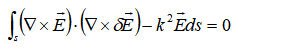

**1.四面体矢量基函数**

不同于三角形矢量基函数的构造方法，结构化网格的四面体四条棱边本身就能完美体现电场的X和Y方向，因此很容易通过拉格朗日插值公式构造矢量基函数。  

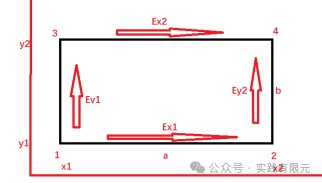

假设电场X、Y方向均以坐标轴的方向为正方向，如图所示，对于棱边上的Ex，Ey，通过拉格朗日插值公式，不难得出四面体网格内任意一点的Ex,Ey的插值公式：

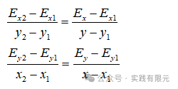

对上述公式进行推导简化：

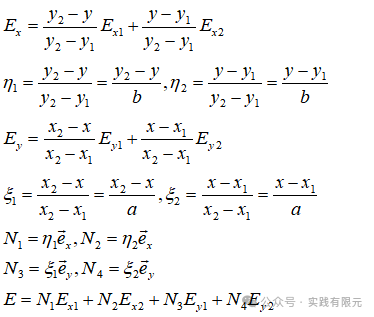

由此，得到四面体单元的插值基函数与插值公式。可以发现，基函数N的变化量与其方向是相互垂直的关系，是由简单的线性插值公式和与其垂直的方向组成。因此，根据梯度原理和旋度原理，很容易理解这四个基函数的梯度肯定为零，而旋度不为零。

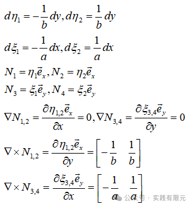

上述的基函数特征正是矢量有限元的特征：弱解仅要求棱边的切向方向连续，而对法向方向不进行约束。这恰好满足电场的连续性规律：介质层分界面梯度方向不连续而切向方向连续。

**1.单元系数矩阵推导**

确定棱边基函数后，将该基函数带入有限元方程，可以得到旋度项：

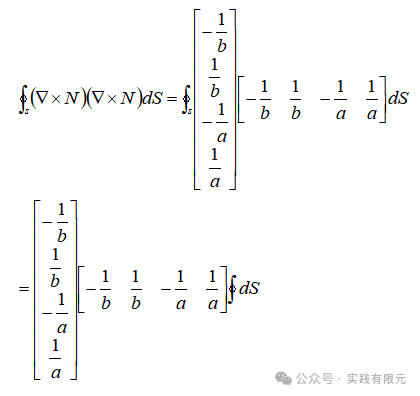

四面体的面积等于长乘以高ab，写成方阵得到：

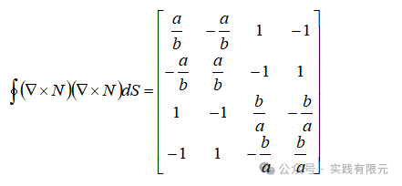

对于有限元方程的第二项积分，需要注意，矢量基函数具有方向性，有：

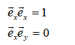

N1,N2表示X方向，N3,N4表示Y方向，因此这二者之间的乘以是等于零的，由此可以得到积分矩阵：

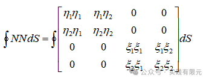

对上述矩阵的积分求解，与一维有限元基函数的推导方式一致的，具体可以参考[最简单的一维有限元问题：求解cos函数分布](http://mp.weixin.qq.com/s?__biz=MzkwNzUxOTM2NA==&amp;mid=2247483689&amp;idx=1&amp;sn=238051a214893aec197bde3511363463&amp;chksm=c0d6b5c2f7a13cd49795a90d7a3509ff6e6a5fbd744fe1f1721af17a4cb8e93827383ddc9d60&token=14565575&lang=zh_CN&scene=21#wechat_redirect)，这里直接给出推导结果：

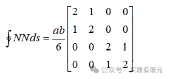

**3.系数矩阵组装**

为了详细的说明整个组装过程，这里以最简单的两个四边形网格为例，展示其中的网格单元的各个关系。

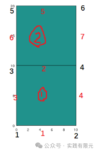

上述图中，黑色编号表示节点编号，红色表示棱边编号，圈红表示单元，因此可以得到每个单元与棱边与节点的关系。

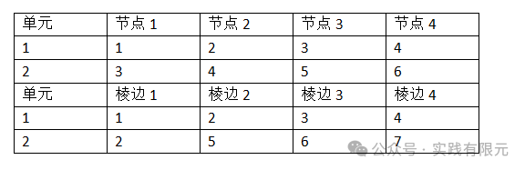

其中单元与节点编号顺序是逆时针方向；单元与棱边编号是先长后宽，并以XY轴正方向作为棱边正方向，得到棱边编号：

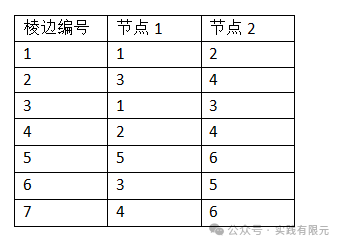

在明确了单元-棱边-节点的关系后，就开始对每个单元系数矩阵进行组装，这里的物理模型参数：研究区域X=10米;Y=20米；频率10000Hz；电阻率为1欧姆米。

    得到的单元1、2的系数矩阵是相同的，如下：

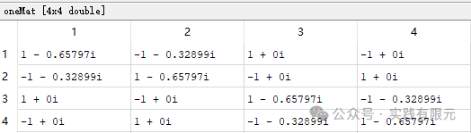

组装以后：

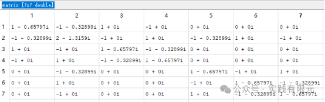

添加第一类边界条件后，最终有：

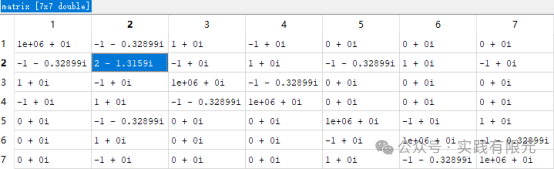

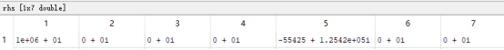

可以发现，系数矩阵matrix的对角线只有第二行没乘以大数处理过，其他均处理过，观察模型的网格剖分，的确仅第二行是内边界，其他七个边全部是外边界，而这些边界中，只有棱边1、5是沿着X方向的，所以体现在rhs中，只有1、5排有数值，其他边界为零。体现了在边界上电场仅沿着X方向传播。

**4 求解结果**

**a.仅有两个四边形网格的棱边未知数结果：**

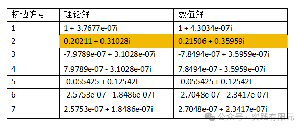

不难发现，误差仅存在于2号棱边的解，这是由于其他棱边均是棱边，强加了第一类边界条件的原因。就数值上2号棱边的解基本上大体是一致的，误差还是非常大。

**b.细化网格20\*40，均匀介质，对比理论解**

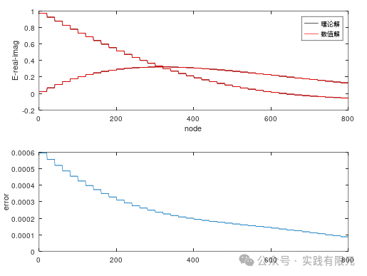

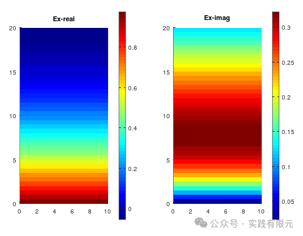

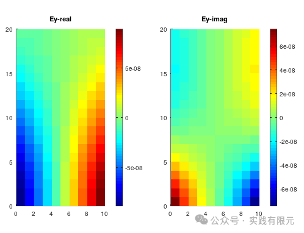

该结果的精度要明显高于三角形的矢量有限元，对比参考：[二维矢量有限元的详细实现过程](http://mp.weixin.qq.com/s?__biz=MzkwNzUxOTM2NA==&amp;mid=2247484232&amp;idx=1&amp;sn=af1a7c52d138249b44f0a7b68cb8b45c&amp;chksm=c0d6b7a3f7a13eb57ba43f42a180beb609e1d9e5928fa89828ca94912339bcaf36ff2a0eff40&token=14565575&lang=zh_CN&scene=21#wechat_redirect)

**c.研究区域内存在不同介质材料，中间区域的电导率为10欧姆米**

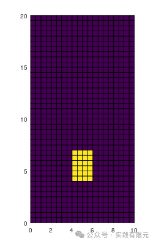

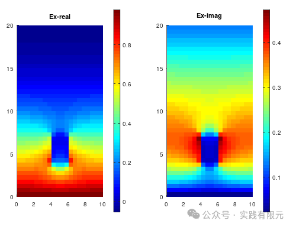

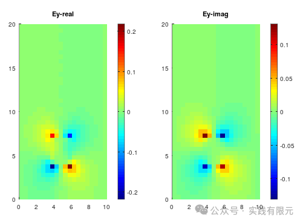

对比三角形的结果，结果基本上可以吻合一致。对比参考：[二维矢量有限元的详细实现过程](http://mp.weixin.qq.com/s?__biz=MzkwNzUxOTM2NA==&amp;mid=2247484232&amp;idx=1&amp;sn=af1a7c52d138249b44f0a7b68cb8b45c&amp;chksm=c0d6b7a3f7a13eb57ba43f42a180beb609e1d9e5928fa89828ca94912339bcaf36ff2a0eff40&token=14565575&lang=zh_CN&scene=21#wechat_redirect)

**D 实际模型，具体参数结果参考：[使用二维矢量有限元展示一个实际例子](http://mp.weixin.qq.com/s?__biz=MzkwNzUxOTM2NA==&amp;mid=2247484245&amp;idx=1&amp;sn=466e474f2f9c0200b4806017c8843bc2&amp;chksm=c0d6b7bef7a13ea8527914e221745e628ca13f595acde9ab584712392a79ee3b43d85fbcc060&token=14565575&lang=zh_CN&scene=21#wechat_redirect)**

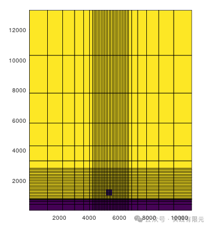

中间区域为低阻10欧姆米，视电阻率结果：

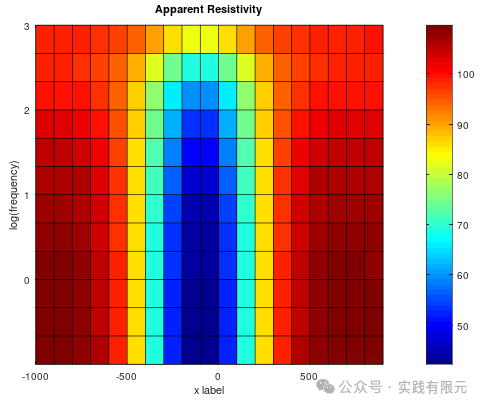

中间区域为高阻1000欧姆米，视电阻率结果：

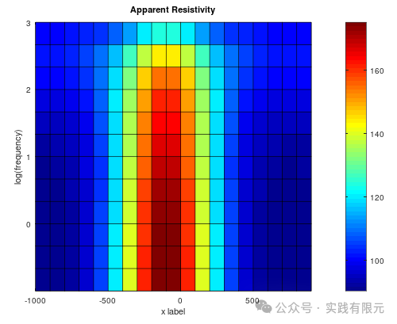

结果与三角形基函数矢量有限元的结果一致。但是计算时间要比三角形矢量基函数慢很多。  

**总结**

1.从整个流程来看，四边形棱边基函数相对于三角形而言，更加容易理解与实现；

2.使用相同的网格，结构化矢量有限元计算精度要高于三角形棱边基函数结果，但是三角形基函数的耗时要远远低于四边形棱边基函数有限元。