# 二维网格的刚度矩阵缩聚再讨论

> 原文地址: [https://mp.weixin.qq.com/s/WPqB5igKjF6m4J-5MIeugA](https://mp.weixin.qq.com/s/WPqB5igKjF6m4J-5MIeugA)

_简述_

在之前介绍过一篇关于刚度矩阵缩聚的文章《[单元刚度矩阵的缩聚](http://mp.weixin.qq.com/s?__biz=MzkwNzUxOTM2NA==&mid=2247485355&idx=1&sn=cce7a1889f43bebd7ed4db236ee4471e&scene=21#wechat_redirect)》，最近在做二维三角形网格的高阶有限元，忍不住想要试一试缩聚这种方法对于二维高阶有限元的效果。

下面就对二维插值型的三阶、四阶有限元的系数矩阵进行缩聚方面的再次讨论。

边值问题采取二维电场在均匀介质中的衰减规律，求解的是霍姆霍兹方程，具体有限元推导可参考《[二阶叠层基函数：二维电磁衰减数值模拟](http://mp.weixin.qq.com/s?__biz=MzkwNzUxOTM2NA==&mid=2247484069&idx=1&sn=a52d10043b20af30f935ecbfd9413712&token=1929660715&lang=zh_CN&scene=21#wechat_redirect)》。

在最后的思考中，感觉缩聚的方法大有可为，值得进一步深入学习研究。

_系数矩阵缩聚原理_

缩聚的基本原理比较简单，这里不再介绍，主要是对系数矩阵的处理，具体参考：《[单元刚度矩阵的缩聚](http://mp.weixin.qq.com/s?__biz=MzkwNzUxOTM2NA==&mid=2247485355&idx=1&sn=cce7a1889f43bebd7ed4db236ee4471e&scene=21#wechat_redirect)》，下面给出具体的表达式：

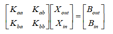

推导结果：

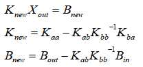

可以发现，式子中对于所需要缩聚的矩阵Kbb需要求逆，然而对于复杂的大规模系数矩阵，求逆并不是一件容易的事情，只有对于足够简单的系数矩阵，对于Kbb的求逆才能够很好实现，从而实现总体刚度矩阵维度降低的效果，否则可能会得不偿失。

在对高阶有限元的系数矩阵观察中发现，顶点相关位置、棱边相关位置、单元内部点相关位置中，只有单元内部点所涉及的矩阵最为简单，对此部分进行缩聚也是可行的。

一个技巧：根据上述分析，要想容易提取节点内部点的系数矩阵，在实现网格节点排序的时候，可以先排列顶点，然后棱边点，最后再排列单元内部点。

_系数矩阵缩聚测试_

**Eg1.三阶有限元测试**

对于8个三角形的网格，三阶基函数的网格节点如图所示，每个单元内仅存在一个节点。

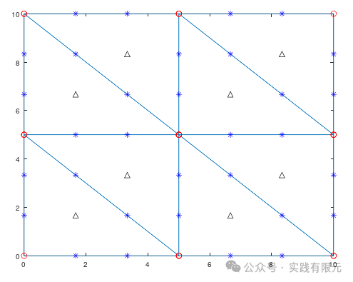

下图是3阶基函数的系数矩阵非零元素分布图，系数矩阵由9个部分组成，分布是顶点、棱边点、内点三个部分以及相互关联的部分组成。    

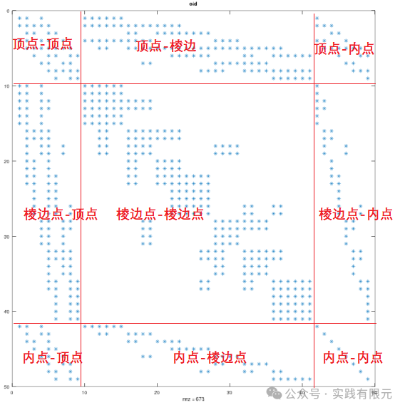

可以发现，顶点、棱边点部分的非零元素分布关联性很强；而单元内点部分的系数矩阵（内点-内点）则是一个仅有主对角线元素的矩阵，求逆非常的容易。因此对这部分的求逆是非常简单的，接下来也仅对（内点-内点）部分的位置进行缩聚处理。

下图是对（内点-内点）部分进行缩聚后，得到的新的系数矩阵如下：  

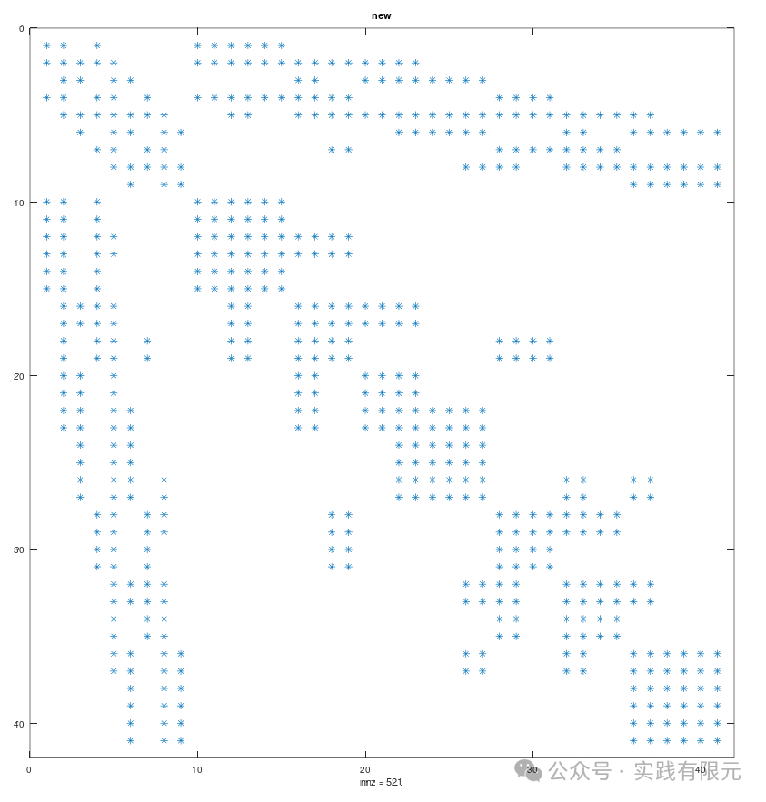

可见，对于8个三角形网格而言，三阶基函数有8个内点，处理后方程维度从49减小到41。并且统计缩聚后的非零元素与同等部分的原矩阵的非零元素个数与位置均是一致的。

使用缩聚后的系数矩阵，求解结果与原始矩阵求解结果进行精度对比，结果如下，精度完全是一致的。    

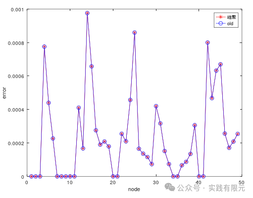

求解的电场实部虚部结果如下：

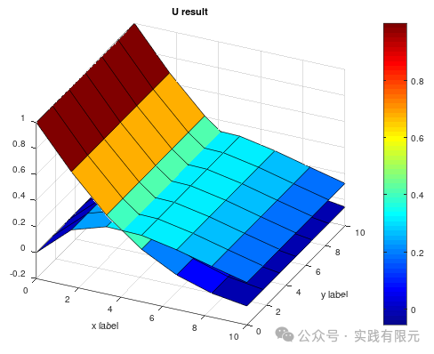

**Eg2:对于四阶有限元而言，每个网格内有3个内点**

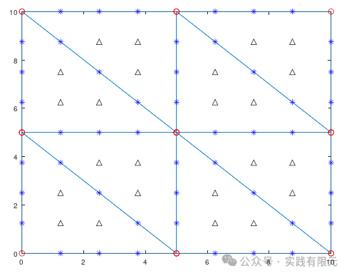

下图是非零元素的分布情况，仔细观察，可以发现对应的单元内点-内点部分，也就是右下角位置的矩阵，其是由8个3\*3的非零元素小矩阵组成，均匀的放置在对角线位置。这部分就对应8个网格单元中的三个内点信息。    

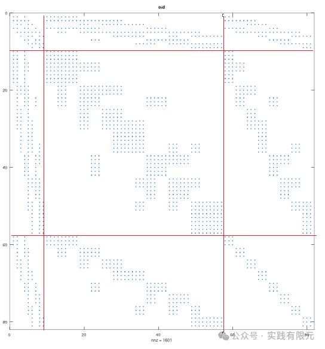

缩聚后的系数矩阵如下：    

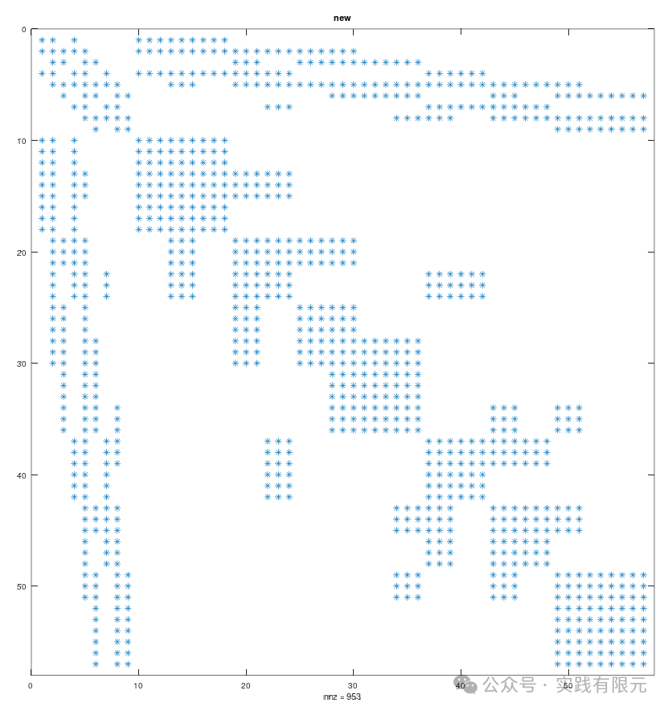

该网格共计8个，所以四阶有限元有24个内点，处理后方程维度从81减小到57，同样二者对比的精度完全是一致的。

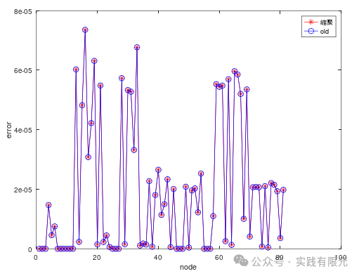

数值结果如下：

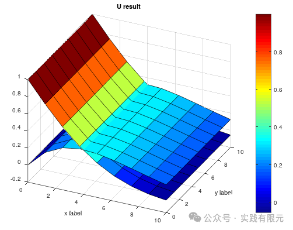

**Eg3.测试10\*10的网格**

将网格量扩大，如此得到的系数矩阵中可以进行缩聚的维度就变得比较大，下面显示了10\*10\*2共计200个三角形网格单元的四阶基函数节点分布。    

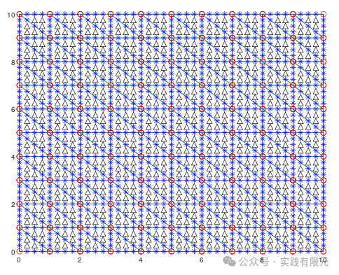

缩聚前的非零元素分布如下图所示，呈现一种有规则的排列。    

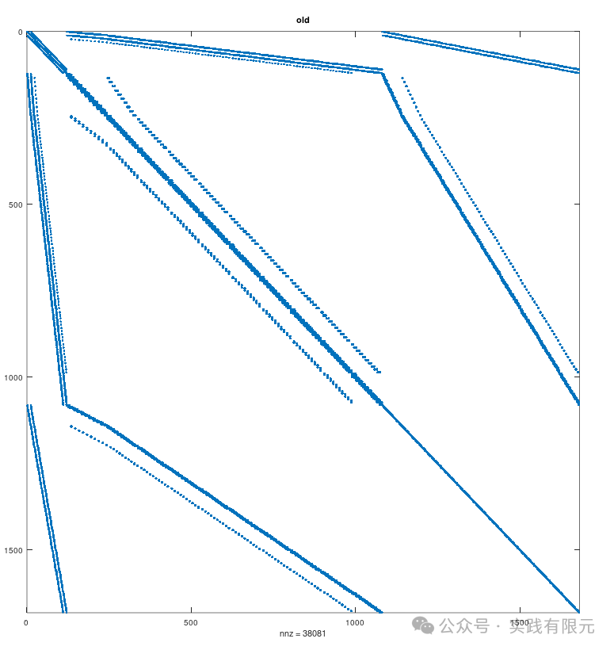

缩聚后的结果如下：

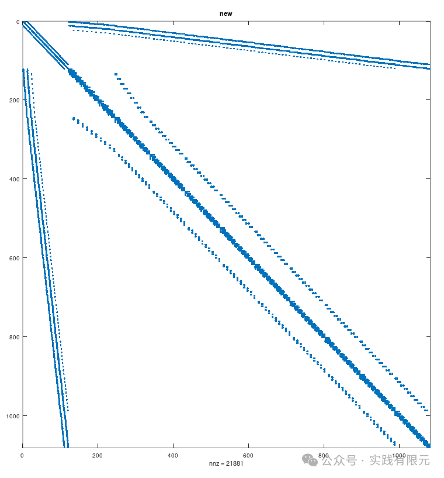

缩聚之前的未知数量是1681,缩聚后的矩阵维度在1081。可见网格越多其缩聚体现的效果越明显。精度对比图如下，二者求解得到的精度一致。  

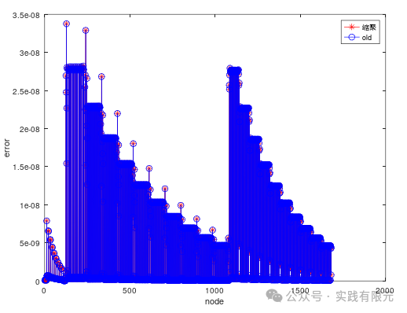

电场衰减的实部虚部的数值结果如下：

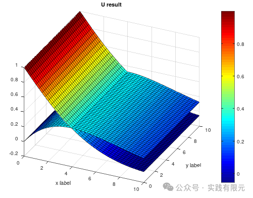

_最后_ 

1.该算例测试显示，系数矩阵采取缩聚后，对数值精度没有影响。

2.缩聚的对象依旧是高阶单元内部的节点，因为这部分节点所对应的系数矩阵所关联节点仅包含本单元，这使得在缩聚过程中需要求逆的矩阵变得非常容易。

3.对于小规模的系数矩阵缩聚的效果不明显，对于网格量规模越大的网格而言，缩聚的效果就非常明显。就二维三角形的三阶有限元而言，缩聚能减少的系数矩阵维度就等于单元网格个数。这似乎对于二维四边形网格而言效果更加的明显。

4.从缩聚前后的系数矩阵非零元素分布规律来看，缩聚前后其顶点与棱边点相关的非零元素位置并没有发生改变，仅是数值变化了。那么是否存在一种方法可以直接通过顶点和棱边获得缩聚后的系数矩阵。

5.从单元的角度来看，缩聚即是将单元内部点的信息处理到顶点以及棱边点的过程，那么是否可以在单元系数矩阵的形成过程中就完成缩聚的过程，如果这一方案可行，进一步是否可以推导对应的高阶不含有内部点的基函数。

6.缩聚的过程中，最麻烦的就是需要对缩聚的矩阵进行求逆，而单元矩阵的逆非常容易获得，那么是否可以通过递推的方式，逐次进行递归缩聚，最后再逐次回代得到求解结果。