# 二阶有限元实例精度分析:同轴线电容对比Q2D

> 原文地址: [https://mp.weixin.qq.com/s/IYWrs6WYBvSTO2wTvKHs\_A](https://mp.weixin.qq.com/s/IYWrs6WYBvSTO2wTvKHs_A)

**_简述_**

在上篇文章中，微带线电容始终和Q2D存在较大差异，本文继续研究二者的区别，使用具有理论解的同轴线模型，测试在网格一致情况下自主有限元与Q2D结果的差异。

最后总结了一些测试后的结果。

**_同轴线模型_**

同轴线模型的理论解：

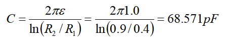

Q2d模型与网格如下，网格共计748个单元：

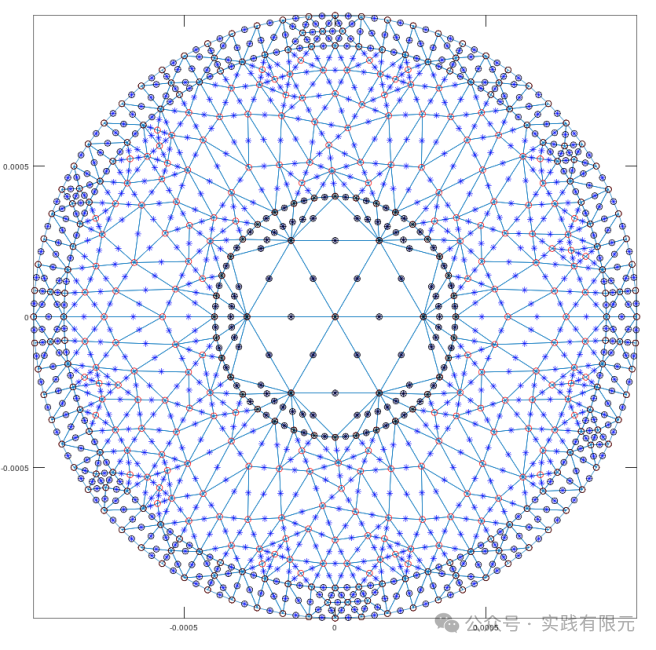

电势u的对比结果显示，二者的误差已经控制在4e-8次方以下。这一步说明有限元求解的电势在同网格、同二阶的情况下是一致的。    

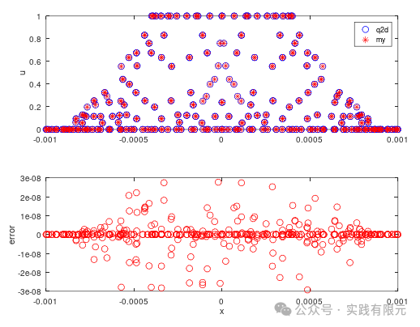

对三角形内采取不同数量的点进行积分求解电容，测试选择被积分点与 积分结果如下：

np

被积分点位置

1        

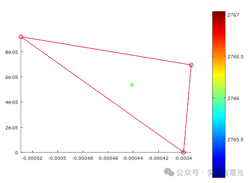

4

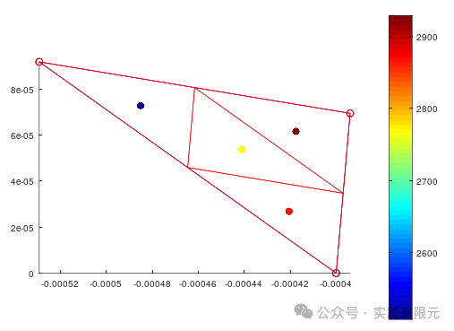

9        

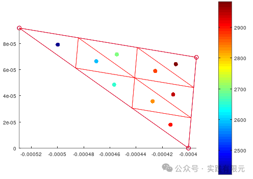

16

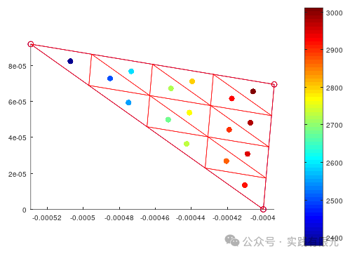

64        

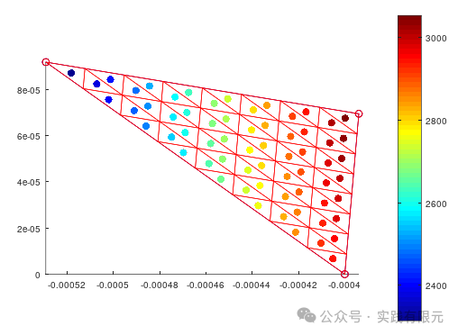

256

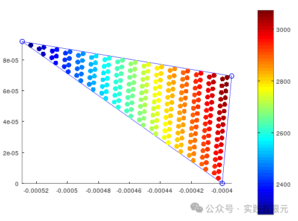

二阶高斯积分点        

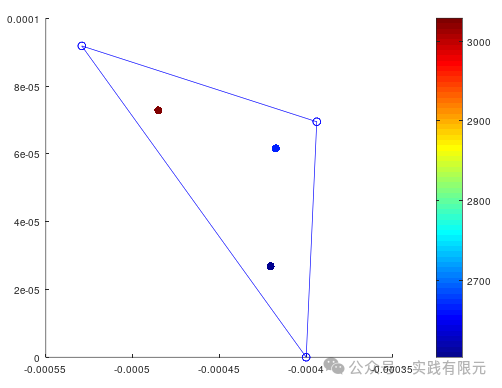

测试得到的电容结果：

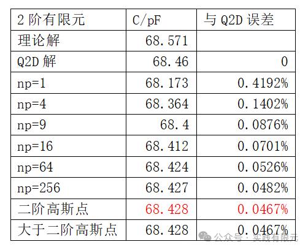

可以发现，随着均匀分布的积分点数逐渐增多，精度也在逐渐提高，并且逐渐收敛于高斯积分点处的精度，在同阶高斯积分点处进行后处理积分，所能得到的精度是最好的，此时，即使继续使用更高阶的高斯积分点也无法继续提高精度。

**_带状线模型_**

对上篇文章的模型进行优化后，同样可以得到的对比结果与结论：

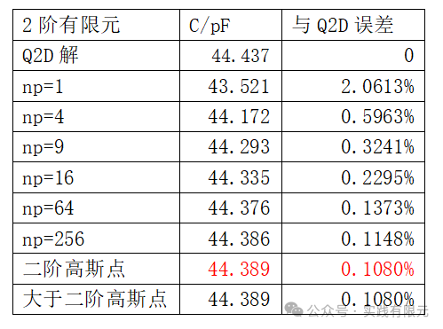

可以发现，虽然数值依然和Q2D存在一定差异，但是在二阶高斯点处的积分结果差异已经在千分之一。

**_结论_**

1\. 使用高阶有限元，对应的后处理过程中，尽量使用同样具有高精度的点进行数值处理，否则会造成精度浪费，导致结果精度不够。

2.虽然进行了深入的分析，即使在保证有限元解精度完全一致的情况下，电容结果依然与Q2D存在差异，好在这种差异是微小的。其中可能存在某些不了解的信息。