# 二阶矢量有限元实现-四面体网格

> 原文地址: [https://mp.weixin.qq.com/s/RMT5tjDeWLvNbMhIavQFeA](https://mp.weixin.qq.com/s/RMT5tjDeWLvNbMhIavQFeA)

**简介**  

作者认为有限元最复杂的部分就是高阶矢量有限元的实现。其棱边、面、体之间的关系与高阶基函数交织在一起，再加上棱边、面均具有方向的特性，导致实现起来比较困难。

本次以霍姆霍兹方程出发，在之前一阶矢量有限元的基础上，实现了二阶矢量有限元。依旧采用边值问题为描述电场衰减的霍姆霍兹矢量方程，其有限元推导等流程可以参考：[三维四面体矢量有限元实现-霍姆霍兹方程-高斯积分](http://mp.weixin.qq.com/s?__biz=MzkwNzUxOTM2NA==&mid=2247486093&idx=1&sn=d88538adf559b946eedee462f6575015&scene=21#wechat_redirect)，这里不再赘述。

**1.高阶基函数**

根据四面体网格，首先得到线性插值基函数：

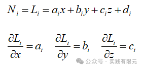

一阶基函数：

直接给出，具体参考文章[三维四面体矢量有限元实现-霍姆霍兹方程-高斯积分](http://mp.weixin.qq.com/s?__biz=MzkwNzUxOTM2NA==&mid=2247486093&idx=1&sn=d88538adf559b946eedee462f6575015&scene=21#wechat_redirect)。

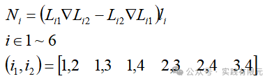

将式子中梯度项展开，得到：   

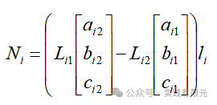

基函数旋度项的通式：

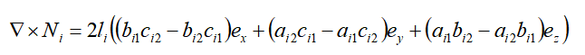

二阶基函数推导：

在一阶基础上，所有的20个基函数与棱边、面的关系如下：

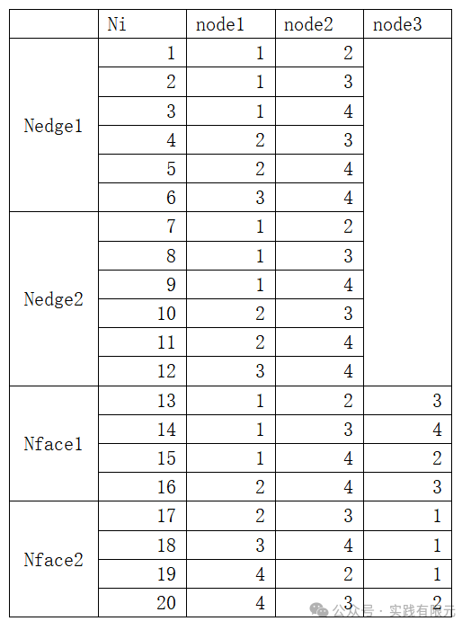

对应的具体二阶基函数表达式如下：    

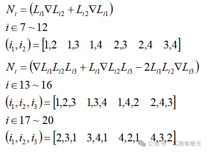

可以发现，其本质上是二阶倒数的全基函数与三阶倒数的旋度项基函数组合而成。对基函数的旋度与展开式可以获得：

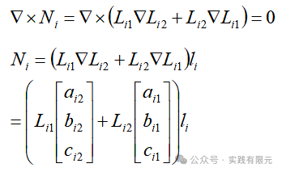

面的展开式：

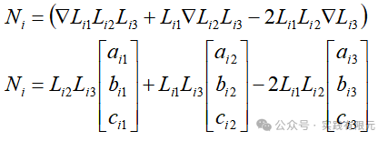

面的旋度推导，首先以线性基函数为基准，推导得到：

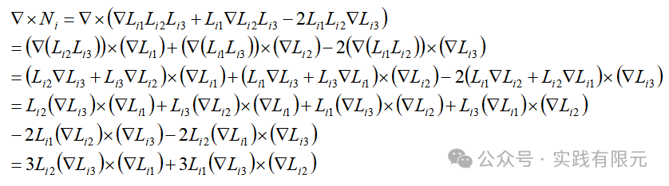

然后对线性基函数的梯度展开，进一步推导得到：   

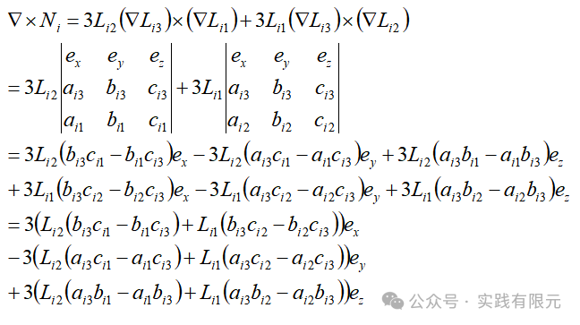

到这里，公式推导完成，无论是矢量基函数的旋度与矢量基函数本身而言，其均为形成的矩阵20\*3，两两相乘后，通过高斯积分，最终得到20\*20的系数矩阵矩阵。

**2.四面体网格、系数矩阵组装与边界条件加载**

四面体网格，不同于之前，因为基函数包含了面的信息，因此必须获得所有棱边和所有面的信息，并且唯一确定其标记，这就需要对四面体网格进行几何网格信息的提取。

在组装系数矩阵的过程中，必须确保系数矩阵的每一项为全局映射关系，如此才能进行各个单元的累加。其中Nedge1部分与一阶一样，必须保证棱边方向唯一；Nedge2无需考虑，只需要与Nedge1一致即可；

而Nface1、Nface2均需要考虑，因为面的三个节点编号顺序不一致，会导致同一个面在不同单元结果是不一样，不满足唯一性，因此需要确定面方向的唯一。最简单的方式就是Nface1顺序定义为全局面的顶点编号从大到小排列，Nface2的编号按照Nface1的排列错一位。如上述表格。

第一类边界条件的高阶矢量基函数加载与高阶节点有限元的加载方式一致，对于一阶部分，在边界棱边与边界面上强加已知数值，在边界棱边与面的二阶部分强加零元素。

**3.结果展示**

模型依旧为：研究区域大小10m\*10m\*10m,频率10000Hz,电导率1欧姆米。

由于采用二阶有限元，因此未知数会成倍增加，因此对网格粗化，共计289个四面体网格，110个顶点，498个棱边，678个面。

**a.一阶矢量有限元求解的数值解与理论解对比：**

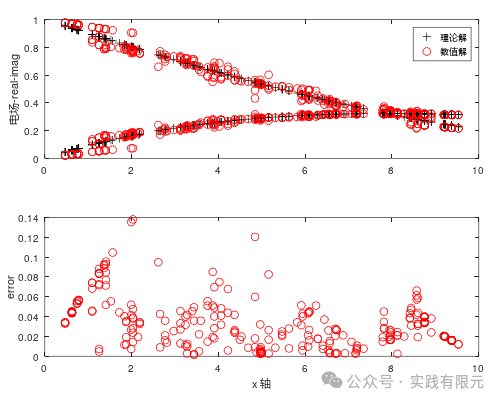

三维可视化结果：

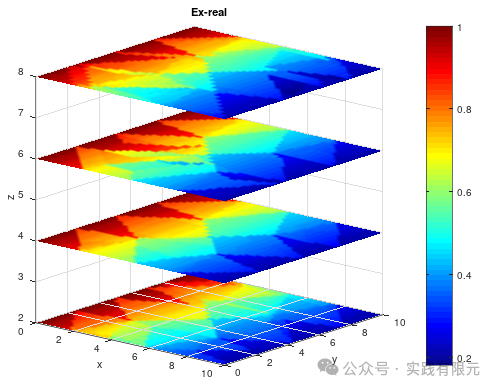

数值可视化结果出现“块状”的分布，也是低阶矢量有限元的体现，在梯度方向完全没有约束的情况下导致的。

**b.二阶矢量有限元求解的数值解与理论解对比：**

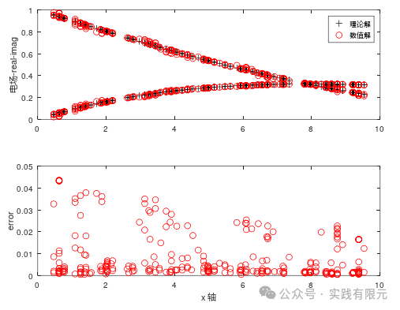

直观可以看出，精度相比于一阶而言，得到了明显改善。可视化结果如下：

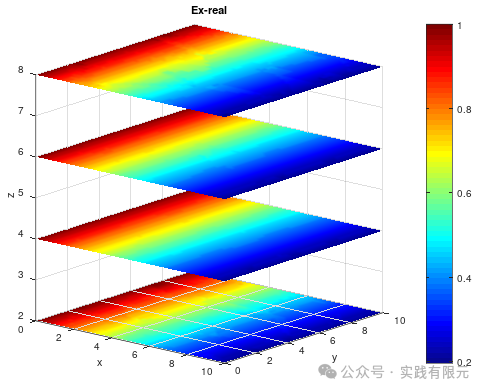

可视化结果更加的明显，其一阶中出现的分块情况不再体现。主要原因是由于二阶基函数保留的一阶的梯度约束项，当然本身也有二阶精度高于一阶的原因。    

在详细分别对比一阶、二阶与文章XX的结果精度进行对比结果如下：

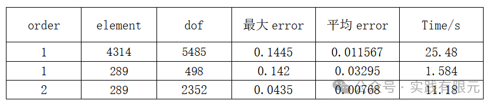

对比发现，2阶用更少的自由度得到了更好的精度。同样的网格下，精度提升在5倍左右，计算时间慢10倍。但是在1阶使用超5000的自由度下也无法达到2阶2300的自由度的精度。因此，二阶的精度效果还是非常具体的。

**总结**

本文介绍了二阶矢量有限元的实现过程与一些技术细节，并对比了相同网格下不同阶数的求解精度的对比。

在使用高斯积分求解系数矩阵的情况下，二阶矢量有限元的难点不再是20\*20的单元系数矩阵，而是棱边、面、节点的全局映射关系与矢量基函数的一一对应，稍微出错即全盘皆输。其次则是网格的处理，如何高效的获取全局棱边编号、面的编号以及他们与单元的关系，这也是实现高阶有限元的难点之一。