# 介绍一个二维结构化有限元的常见边值问题

> 原文地址: [https://mp.weixin.qq.com/s/rr65eG-OpshGqwkWz4lC9A](https://mp.weixin.qq.com/s/rr65eG-OpshGqwkWz4lC9A)

**简述**  

    介绍复杂的二阶结构化有限元问题，意在给出二维结构化四边形有限元常见的系数矩阵。这里以求解sin(x+y)函数分布为例。

**1.边值问题**

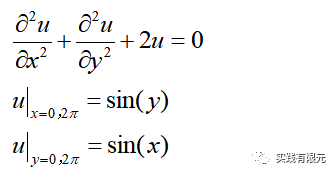

    该问题的理论解与研究区域为：

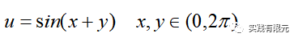

    一般常见问题的微分方程可能是二阶导数方式不同例如梯度、旋度等；存在一阶导数、右端项不为零、各项系数不同等来表示不同的物理意义；边界条件可能是第二类、第三类边界条件。

    具体问题还是得具体分析，但是大体上思路以及推导方式是一致的。

**2.有限元推导**  

    对微分方程乘以试探函数，并在研究区域内积分，得到如下公式：  

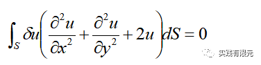

    与以往的推导一样，同样采用分部积分得到：  

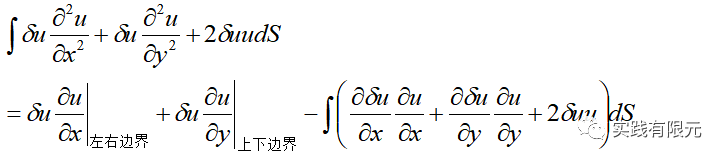

    根据给出的边界条件，全部为第一类边界条件，在后续强加第一类边界条件后会覆盖掉上梯度的边界项，因此不需要考虑上述边界条件的影响，直接得到有限元方程：

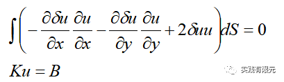

**3.四边形基函数**  

       采用四边形结构化的线性基函数，具体表达式：  

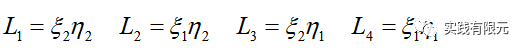

       展开式如下：

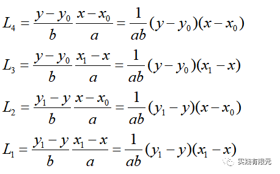

对应的单元内任意点的插值公式为：

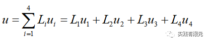

 详细的推导过程参考：[最简单的二维结构化有限元问题：求解拉普拉斯方程](http://mp.weixin.qq.com/s?__biz=MzkwNzUxOTM2NA==&amp;mid=2247483928&amp;idx=1&amp;sn=05e3ce02b78d231fd8da3f06e2ddc0e1&amp;chksm=c0d6b6f3f7a13fe5e27ef7e246c1fe6c9dabeaeeca1605f4dd38678a4e6473c3388057c899e7&scene=21#wechat_redirect)

**4.单元系数矩阵**

这里直接给出三个部分的系数矩阵，具体的推导方式可以参考文章：[最简单的二维结构化有限元问题：求解拉普拉斯方程](http://mp.weixin.qq.com/s?__biz=MzkwNzUxOTM2NA==&amp;mid=2247483928&amp;idx=1&amp;sn=05e3ce02b78d231fd8da3f06e2ddc0e1&amp;chksm=c0d6b6f3f7a13fe5e27ef7e246c1fe6c9dabeaeeca1605f4dd38678a4e6473c3388057c899e7&scene=21#wechat_redirect)，其中都有详细的介绍。

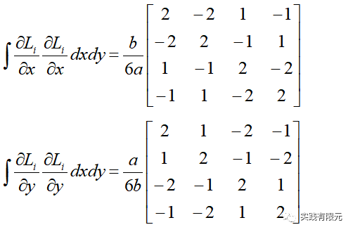

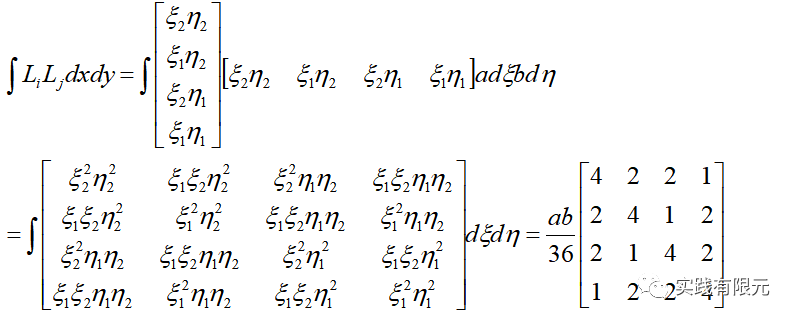

**5.系数矩阵组装**  

    系数矩阵的组装过程与文章：[最简单的二维结构化有限元问题：求解拉普拉斯方程](http://mp.weixin.qq.com/s?__biz=MzkwNzUxOTM2NA==&amp;mid=2247483928&amp;idx=1&amp;sn=05e3ce02b78d231fd8da3f06e2ddc0e1&amp;chksm=c0d6b6f3f7a13fe5e27ef7e246c1fe6c9dabeaeeca1605f4dd38678a4e6473c3388057c899e7&scene=21#wechat_redirect)几乎一致，这里不再赘述。  

    其中四个边均为第一类边界条件，加载的方式同样采用乘以大数的方法。具体实现方式如下：假设有0，1，2，3四个点，对1号点在(x=0,y)位置，2号点在(x,y=0)位置，则乘以大数的方法如下：

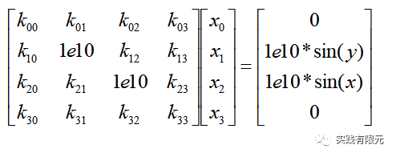

**6.计算结果**  

    将x,y属于（0，2pi）的区域划分为20\*20个网格的计算结果与误差：  

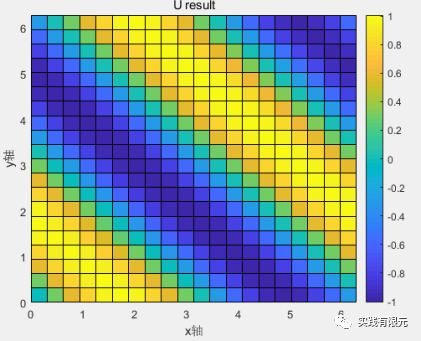

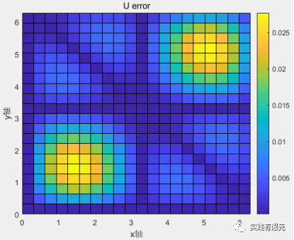

将研究区域划分为100\*100个网格时的结果：

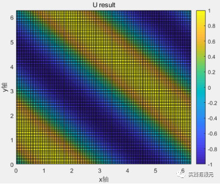

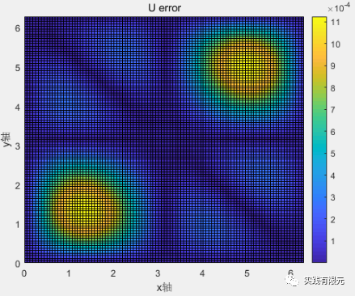

7.总结  

    a.实现二维结构化有限元例子，计算流程与文章：[最简单的二维结构化有限元问题：求解拉普拉斯方程](http://mp.weixin.qq.com/s?__biz=MzkwNzUxOTM2NA==&amp;mid=2247483928&amp;idx=1&amp;sn=05e3ce02b78d231fd8da3f06e2ddc0e1&amp;chksm=c0d6b6f3f7a13fe5e27ef7e246c1fe6c9dabeaeeca1605f4dd38678a4e6473c3388057c899e7&scene=21#wechat_redirect)几乎一致，区别在于单元系数矩阵与边界条件的加载，这两点也是所有有限元问题求解的关键所在。

    b.matlab在求解20\*20网格量的时候效率依旧非常高，但是在求解100\*100的时候效率就变得非常慢，因为有1万个单元，1万多个节点，需要生成1万\*1万的矩阵，因此在内存占用和计算效率上用matlab直接求解线性方程组的方法效果都比较差。采用稀疏存储与高效的线性求解器是可以很好的改善这些问题。

    c.与一维有限元的误差分析一样的结果，网格越多，计算的精度也就越高，网格20\*20的误差在0.025左右，网格100\*100的误差低至1e-3。但是看查看误差分布可以得知，并不是所有的地方都需要密集的网格，所以各方面最优角度考虑，自适应有限元技术同样可以二维的问题，不同点在于网格加密策略与实现的过程要复杂于一维网格。