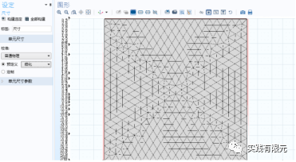
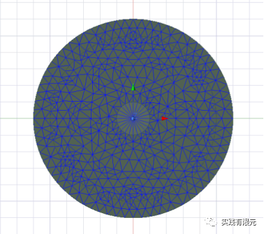
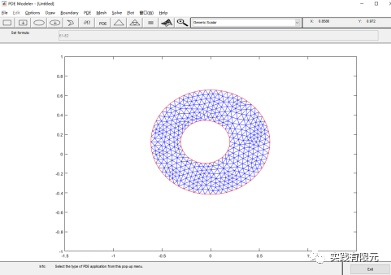
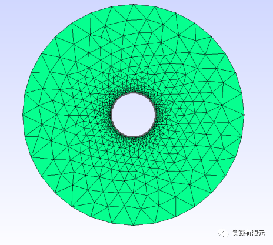
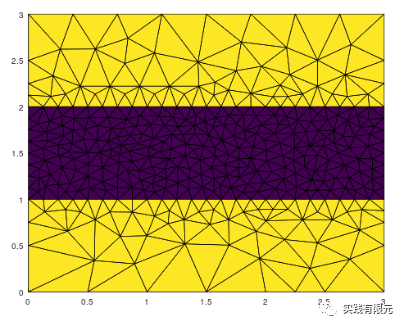
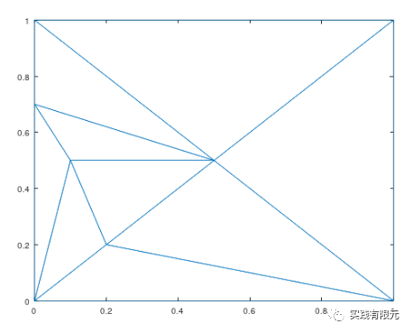

# 介绍几款二维网格剖分工具：三角形网格

> 原文地址: [https://mp.weixin.qq.com/s/P1sbkIE2lFydsMBYNEWZaA](https://mp.weixin.qq.com/s/P1sbkIE2lFydsMBYNEWZaA)

简述

本文列出作者用过的二维三角形网格剖分工具，以供参考。  

1.  comsol（商业软件）
    
    Comsol作为多物理仿真的通用软件，二维网格剖分的功能也是多姿多样，提供给用户各种可选择的接口实现二维网格划分。
    
    
    
    网格结果可以输出各种格式，如果要自行解析文件还是比较麻烦，一般可以通过其他软件辅助，二次处理后生成容易解析的网格格式。  
    
2.  Ansys-q2d（商业软件）
    
    q2d是集成于Ansys中的一款专业二维仿真软件，主要针对电磁相关的二维界面参数求解。专业性很强，网格划分质量不需要用户关注，自行使用自适应算法获得合乎仿真模型精度的网格。其生成的网格在业界是几乎是公认的最优网格。
    
    
    
    网格结果同样可以输出，解析格式不是太困难，但是其中仅包含网格，不含有边界、材料属性等信息。
    
3.  matlab-pdetool（商业软件）
    
    matlab是一款强大的数学商业软件，几乎搞科研算法的都有使用到，即使近些年被M国禁用。它里面也具有二维网格剖分功能，在命令行敲pdetool则可以弹出简单的二维网格剖分界面，可以进行简单的bool运算等建模功能。
    
      
    
    
    
      
    
    生成的网格可以保存为matlab脚本格式，很好读取其中的网格数据；
    
4.  Gmesh（开源代码）
    
    Gmesh的网格剖分可以说非常的完善，自成体系，拥有自己的界面，也提供了非常友好的接口，可以实现各种网格剖分、局部加密等功能。
    
    
    
    网格输出文件为msh格式，包含了建模的所有几何信息、材料信息、边界信息等。因此解析该格式相对不太容易。  
    
5.  Triangle（开源代码）
    
    很完善的一套开源二维三角形网格剖分工具，用户可以通过命令的形式实现各种网格剖分，例如下图中区域划分，分区域加密等等。唯一的缺点是代码只支持X86,不支持X64,这一点需要特别注意。
    
      
    
    
    
    网格输出可供用户选择，支持单元、节点、棱边、邻单元等多种信息输出，也支持一些常用的格式输出。  
    
6.  CDT（开源代码）
    

相对于较为完善的tiangle,CDT则显得不是那么友善，似乎是专门给程序员使用，没有外部直接调用命令的方式，只能自己写接口实现输入参数和输出网格。不过适用于对网格的二次开发使用，例如其中不具备对单元属性的标记，不具备局部细化功能，似乎全局细化功能也不具备。

网格信息的输出只用用户自己输出，并且只含有单元、节点信息。