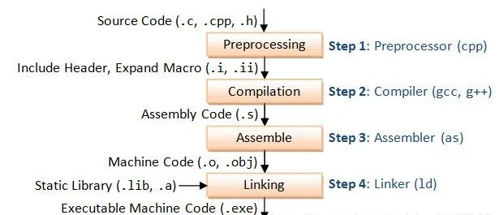
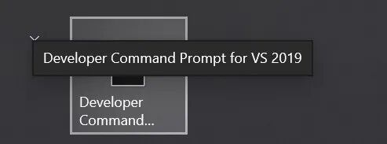
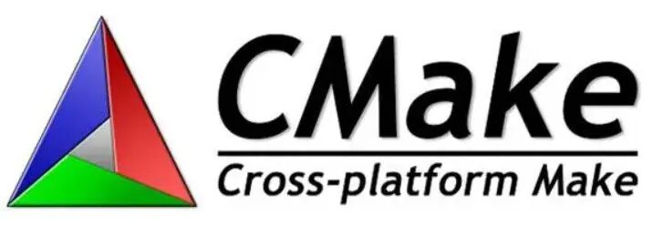
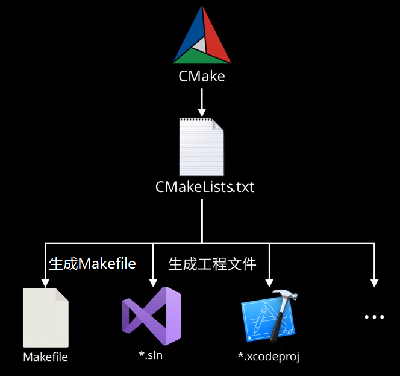
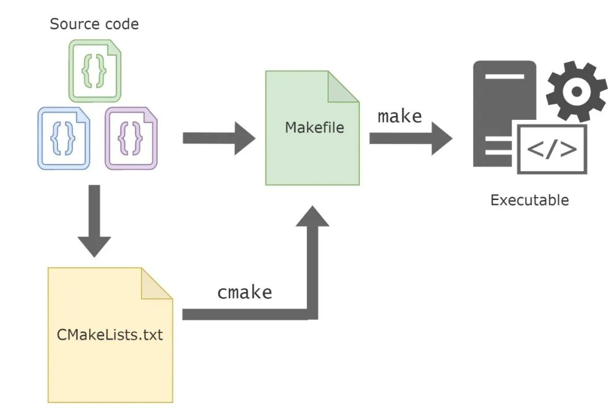

# 从 Make 到 CMake：构建工具的演进与选择指南

> 原文地址: [https://mp.weixin.qq.com/s/X3KrtO8jpCEyKKUyAAZ7AA](https://mp.weixin.qq.com/s/X3KrtO8jpCEyKKUyAAZ7AA)

在软件开发的世界里，我们常常听到“编译”、“链接”、“构建”这些术语。对于初学者而言，可能以为写完代码后直接点击“运行”就万事大吉了。但事实上，在大型项目中，成百上千个源文件、复杂的依赖关系、跨平台兼容性等问题，使得手动编译几乎不可能完成。于是，**构建工具**应运而生——它们就像厨房里的厨师长，协调各种食材（源代码）、火候（编译选项）和步骤（依赖顺序），最终端出一道可执行程序的大餐。

本文将带你走进构建工具的世界，重点介绍 **Make / Makefile、CMake 和 NMake** 这几类主流工具，解释它们的原理、适用场景以及彼此之间的关系，帮助你理解为何现代 C/C++、Fortran 项目离不开它们。

## 一、Make 与 Makefile：自动化构建的起点

### 1.1 什么是 Make？

`make` 是一个诞生于 20 世纪 70 年代的 Unix 构建工具，由贝尔实验室的 Stuart Feldman 开发。它的核心思想非常朴素：**只重新编译那些真正需要更新的部分**。

想象一下，你有一个包含 100 个 `.c` 文件的项目。每次修改一个文件后，如果都重新编译全部 100 个文件，效率极低。而 `make` 通过检查文件的时间戳（即“谁更新得更晚”），智能判断哪些目标（如 `.o` 文件或最终的可执行文件）需要重新生成。

### 1.2 Makefile：构建规则的说明书

`make` 本身只是一个执行引擎，真正的“菜谱”写在 **Makefile** 中。Makefile 是一个纯文本文件，定义了：

-   **目标（Target）**：要生成的文件，比如 `main`（可执行程序）。
    
-   **依赖（Prerequisites）**：生成该目标所需的文件，比如 `main.o utils.o`。
    
-   **命令（Recipe）**：如何从依赖生成目标，比如 `gcc -o main main.o utils.o`。
    

一个简单的 Makefile 示例：

`CC = gcc   CFLAGS = -Wall -g      hello: main.o utils.o   $(CC) -o hello main.o utils.o      main.o: main.c utils.h   $(CC)$(CFLAGS) -c main.c      utils.o: utils.c utils.h   $(CC)$(CFLAGS) -c utils.c      clean:    rm -f *.o hello   `

当你在终端输入 `make`，它会自动查找当前目录下的 `Makefile`，并根据依赖关系执行相应命令。若 `main.c` 被修改，`make` 会重新编译 `main.o`，再链接生成 `main`；但如果只是 `README.md` 改了，`make` 则什么也不做。

### 1.3 Make 的优势与局限

**优势**：

-   轻量、高效，原生支持 Unix/Linux 系统。
    
-   规则清晰，适合小型到中型项目。
    
-   社区生态成熟，大量开源项目仍使用 Make。
    

**局限**：

-   语法较为晦涩，缩进必须用 Tab（不能用空格！），新手容易踩坑。
    
-   **不具备跨平台能力**：Makefile 通常针对特定编译器（如 GCC）和操作系统编写，在 Windows 上无法直接运行。
    
-   缺乏高级抽象，大型项目维护困难。
    

## 二、NMake：Windows 下的“Make 克隆”

### 2.1 NMake 的定位

`NMake`（全称 Microsoft Program Maintenance Utility）是微软为 Visual Studio 工具链提供的构建工具，功能上对标 Unix 的 `make`，但运行环境为 Windows，并使用 Microsoft C/C++ 编译器（cl.exe）。

### 2.2 NMake 与 Makefile 的差异

虽然 NMake 也使用类似 Makefile 的脚本（通常命名为 `Makefile` 或 `*.mak`），但其语法和行为存在显著差异：

-   **命令解释器不同**：NMake 使用 Windows 的 `cmd.exe`，而非 Unix shell，因此命令如 `rm` 需替换为 `del`，路径分隔符为反斜杠 `\`；
    
-   **变量引用方式不同**：Make 使用 `$(VAR)`，NMake 使用 `$(VAR)` 或 `%VAR%`；
    
-   **内置规则不同**：NMake 针对 MSVC 编译器优化，例如默认知道如何从 `.c` 生成 `.obj`。
    

一个简单的 NMake 文件示例：

`CC=cl   CFLAGS=/W3 /Zi      hello.exe: main.obj utils.obj       $(CC) main.obj utils.obj /Fe:hello.exe      main.obj: main.c utils.h       $(CC)$(CFLAGS) /c main.c      utils.obj: utils.c utils.h       $(CC)$(CFLAGS) /c utils.c      clean:       del *.obj hello.exe   `

### 2.3 使用场景

NMake 主要用于：

-   在 Visual Studio 工具链（如 MSVC 编译器）环境下进行命令行构建。
    
-   维护一些历史遗留的 Windows C/C++ 项目。
    
-   配合 Windows SDK 或旧版 Visual C++ 进行自动化编译。
    

### 2.4 问题与挑战

虽然 NMake 解决了 Windows 下“没有 make”的问题，但它并未解决 **跨平台一致性** 的根本痛点。一个为 NMake 编写的 Makefile 几乎无法在 Linux 上运行，反之亦然。开发者不得不为不同平台维护两套甚至多套构建脚本，效率低下且容易出错。

## 三、CMake：跨平台构建的“元工具”

### 3.1 为什么需要 CMake？

随着开源软件全球化和跨平台需求激增，开发者迫切需要一种**一次编写、到处生成**的构建方案。于是，**CMake**（Cross-platform Make）应运而生。

CMake 本身**不是构建工具**，而是一个 **构建系统生成器（Build System Generator）**。它的核心思想是：

> **用一套统一的配置文件（CMakeLists.txt），为不同平台生成对应的原生构建文件**。

比如：

-   在 Linux 上，CMake 可生成 Makefile，供 `make` 使用；
    
-   在 Windows 上，可生成 Visual Studio 项目文件（`.sln`/`.vcxproj`）或 NMake 脚本；
    
-   在 macOS 上，可生成 Xcode 项目。
    

这样，开发者只需维护一份 `CMakeLists.txt`，即可在任意支持 CMake 的平台上构建项目。

### 3.2 CMake 的工作流程

1.  编写 `CMakeLists.txt`，描述项目结构、源文件、依赖、编译选项等；
    
2.  运行 `cmake` 命令，指定目标构建系统（如 `-G "Unix Makefiles"` 或 `-G "Visual Studio 17 2022"`）；
    
3.  CMake 生成对应平台的构建文件（如 Makefile 或 `.sln`）；
    
4.  调用本地构建工具（如 `make` 或 `msbuild`）完成实际编译。
    

### 3.3 CMakeLists.txt 示例

CMake 使用 CMakeLists.txt 来描述项目结构。以下是一个简单示例：

`cmake_minimum_required(VERSION 3.10)   project(MyApp)      set(CMAKE_CXX_STANDARD 17)      add_executable(hello main.cpp utils.cpp)      target_include_directories(hello PRIVATE .)   `

这段代码在 Linux 上运行 `cmake . && make` 可生成可执行文件，在 Windows 上运行 `cmake -G "Visual Studio 17 2022" .` 则生成 `.sln` 解决方案，双击即可在 Visual Studio 中打开并构建。

### 3.4 CMake 的强大之处

-   **跨平台支持**：官方支持 Windows、Linux、macOS、iOS、Android 等。
    
-   **依赖管理**：可通过 `find_package()` 自动查找系统库（如 OpenCV、Boost）。
    
-   **模块化设计**：支持子目录、函数、宏，适合大型项目组织。
    
-   **IDE 友好**：可生成 VS、Xcode、CLion 等 IDE 原生项目，提升开发体验。
    
-   **社区生态强大**：几乎所有现代 C++ 开源项目（如 OpenCV、PCL、TensorRT）都采用 CMake。
    

### 3.5 CMake 的学习曲线

尽管 CMake 语法比 Makefile 更友好，但其概念体系（如 target、generator expressions、policy）对新手仍有一定门槛。不过，一旦掌握，其带来的开发效率提升是巨大的。

## 四、对比总结：如何选择？

工具

类型

跨平台

易用性

适用场景

Make

构建工具

否

中等

Linux/Unix 小型项目

NMake

构建工具

仅 Windows

低

Windows 旧项目、MSVC 环境

CMake

构建系统生成器

是

较高

现代 C/C++ 跨平台项目（推荐）

**建议**：

-   如果你在开发一个仅限 Linux 的小工具，Make 足够简洁高效。
    
-   如果你维护一个古老的 Windows C 项目，可能不得不使用 NMake。
    
-   **但如果你在启动一个新项目，尤其是希望支持多平台、多人协作、持续集成（CI），请毫不犹豫地选择 CMake**。
    

值得注意的是，CMake 并非取代 Make，而是“站在 Make 的肩膀上”。在 Unix 系统中，CMake 默认生成的仍是 Makefile，再由 `make` 执行构建。因此，理解 Make 的原理，有助于更好地调试 CMake 项目。

## 五、结语：构建工具的本质是“减少重复劳动”

从 Make 到 CMake，构建工具的演进史，本质上是软件工程对**自动化、标准化、可移植性**不断追求的缩影。Make 解决了“重复编译”的问题，CMake 则进一步解决了“重复配置”的问题。

理解这些工具，不仅能让你写出更专业的代码，更能让你在团队协作和开源贡献中游刃有余。毕竟，一个连构建都搞不定的项目，再精妙的算法也难以落地。

所以，下次当你看到项目根目录下的 `CMakeLists.txt` 或 `Makefile` 时，不妨多看一眼——那不仅是构建脚本，更是项目工程化的第一道防线。

> **附：快速上手建议**
> 
> -   学习 Make：尝试写一个包含多个源文件的小项目 Makefile。
>     
> -   学习 CMake：安装 CMake，用 `cmake -S . -B build && cmake --build build` 构建你的第一个项目。
>     
> -   查阅官方文档：https://cmake.org/documentation/
>     

构建之路，始于一行 Makefile，成于一套 CMake 体系。愿你在代码之外，也精通“造轮子”的艺术。

##   

## 推荐阅读

  

  

  

‍

  

  

  

**闲鱼小店已上新，欢迎新老粉丝关注和咨询**

**喜欢****作者******，请点********赞********和在看********

****