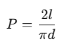
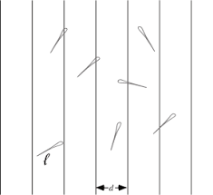
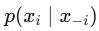
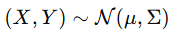
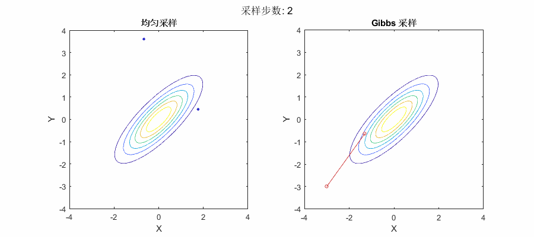
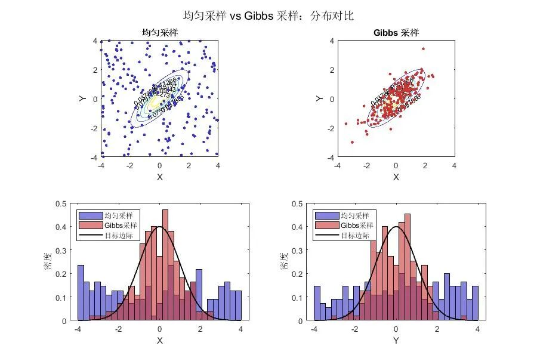

# 从布丰投针到吉布斯采样：在高维世界里“扔针”有多难？


> 原文地址: [https://mp.weixin.qq.com/s/aaS6eGS6VOR-cnsZEjGNEA](https://mp.weixin.qq.com/s/aaS6eGS6VOR-cnsZEjGNEA)

> 数学不只是算式和定理，它更像是一段段故事——从 18 世纪法国的台球厅，到现代人工智能实验室，数学家的“投针游戏”一直在变，只是针越来越难投了。

一个古老的数学游戏：布丰投针问题

18 世纪的法国数学家布丰（Georges-Louis Leclerc, Comte de Buffon）提出了一个有趣的概率问题：

> 在一个地板上画有等距平行线（间距为 𝑑）的房间里，随手往地上扔一根长度为 𝑙（𝑙≤𝑑）的针，问：针与地板线相交的概率是多少？

答案很优雅：



布丰甚至用这个方法**实验测 π**：不停地扔针，统计交线比例，反推 π。当年，这只是一个二维几何概率问题，地板就是采样空间，针的位置和方向就是随机变量。



* * *

如果是高维的投针呢？

想象一下，如果你的地板不是二维平面，而是一个高维空间：

-   每根“针”不再只是一个角度 + 位置，而可能有几十、几百个自由度。
    
-   你需要在这样一个高维“房间”里随机投针，统计落到某种特定区域（高概率区域）的比例。
    

问题来了：**维数灾难（Curse of Dimensionality）**。  
在高维空间中：

-   绝大部分体积都集中在边界附近【[每日一题：高维的几何直觉](https://mp.weixin.qq.com/s?__biz=MzkyNjcwMDY4NA==&mid=2247484431&idx=1&sn=049c4702ecb41e86a43b99deb421300a&scene=21#wechat_redirect)】
    
-   高概率区域的体积比例呈指数级缩小
    
-   直接随机撒点（蒙特卡洛）几乎不可能碰到目标区域
    

就像用传统方法在 100 维房间里扔针，大多数针永远落不到你想要的地方。

* * *

蒙特卡洛到马尔可夫链蒙特卡洛（MCMC）

为了在复杂分布中采样，数学家想到了：

1.  **不要盲目撒点**，而是让点一步步走到高概率区域。
    
2.  这个点的移动要满足马尔可夫性（下一步只依赖当前状态）。
    
3.  长期运行后，点出现的位置分布就是目标分布。
    

这就是 **马尔可夫链蒙特卡洛（MCMC）** 的基本思想。

Metropolis–Hastings 算法是经典方法，但有时接受率低、步子迈不出去。

* * *

吉布斯采样：条件分布的妙用

如果目标分布的每个**条件分布**：



都能容易采样，那么我们可以：

-   固定其他变量，只更新一个变量（像在多维地板上只动一个方向的针）
    
-   依次更新所有维度
    
-   这样做**接受率永远是 1**，因为每次都是精确从条件分布采样
    

这就是 **Gibbs Sampling（吉布斯采样）**。

它就像高维投针的“坐标分解法”：

-   先调整针在 x 方向的位置
    
-   再调整针在 y 方向的位置
    
-   然后 z 方向…
    
-   一轮下来，针就更有可能落在高概率区域了
    
      
    

* * *

一个二维例子

假设我们要从一个二维高斯分布采样：



它的条件分布仍是高斯，可以直接采样。

吉布斯采样就会产生一种“交替走格子”的路径：

-   固定 Y，更新 X
    
-   固定 X，更新 Y
    
-   不断循环，样本云最终铺满高概率的椭圆区域
    

这比在二维平面上到处乱扔点高效得多。

今天，吉布斯采样已经被用在：

-   贝叶斯统计的后验推断
    
-   隐马尔可夫模型
    
-   图像恢复与去噪
    
-   自然语言处理的主题模型（如 LDA）
    
      
    

成为AI工程师的采样利器。

* * *

仿真模拟

如下图，分别模拟了在整个 \[−4,4\]×\[−4,4\]的正方形区域内，目标分布是一个**二维高斯分布**（中心在原点，椭圆形等高线）的采样过程，对比了均匀采样和Gibbs采样。最后一行两个直方图分别为X和Y坐标的边际直方图。

均匀采样很多点落在了高斯分布几乎为零的低概率区域，在统计计算里，这代表**浪费**：这些点对估计高斯分布的性质贡献很小，但占用了采样预算。

Gibbs采样点集中分布在椭圆形的高概率区域（对应高斯分布的密集部分），这是因为 Gibbs 采样通过条件分布一步步“走”在高密度区域里，很少进入低密度区域。轨迹去掉后，可以更清晰地看到它的**稳态分布**几乎完全贴合目标分布的形状。不过，你可能注意到点的位置**有相关性**：相邻点之间的距离和方向不是完全独立的，这就是马尔科夫链采样的典型特征——会有**自相关**。

> 如果目标分布只在某个小区域有概率质量，用均匀撒点非常低效，而像 Gibbs 采样这样的 MCMC 方法，可以高效聚焦在重要区域，但代价是样本之间不完全独立。





```
%% 动态对比：均匀采样 vs Gibbs 采样 (生成 GIF)
```

* * *

**关注公众号【漫步数理控制】，探索更多应用数学的奥秘与前沿进展！**