# 任意高阶通式有限元玩法-泊松方程

> 原文地址: [https://mp.weixin.qq.com/s/8uP9a872O0AdXgdzP0geog](https://mp.weixin.qq.com/s/8uP9a872O0AdXgdzP0geog)

**简述**

在上篇文章中实现了高斯积分取代求解系数矩阵的过程，那么这篇文章高能来了，既然可以不用求系数矩阵，是否存在基函数到系数矩阵整个流程的通式，直接实现任意阶有限元！

答案是肯定的！

高斯积分的有限元框架实现后发现，只需要再实现N阶基函数的通式即可。这就是高斯积分带给我们的惊喜！

本文依旧以一维泊松方程为例，实现任意阶有限元。一维有限元流程这里不再推导，这里重点给出任意阶基函数的通式推导。

**1.一维线单元基函数通式**

首先，确定任意高阶形函数的基底为线性基函数：

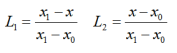

并且根据高斯积分需求，将线性基函数投影到\[-1,1\]的区间，如下：

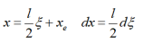

如此，线性基函数可以表示为：

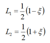 

已知，线性基函数满足:

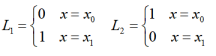 

接下来就推导并求解具体的形函数的过程。首先考虑1阶，已知两个形函数是线性基函数基底组成，并且为1阶，由此有：

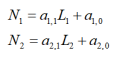

N1,N2是满足插值形函数的基本要求：

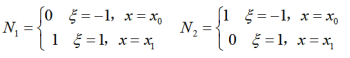

因此，带入求解，得到：

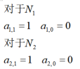

所以，1阶基函数为：

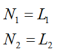

针对2阶形函数，插值点在中心点，形函数有3个，阶数为2，因此有：

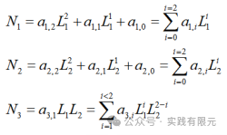

此时，形函数满足条件：

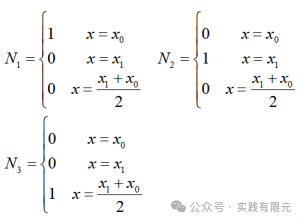

分别带入，可以求解得到：

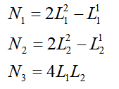

继续对于三阶形函数的表达式为：

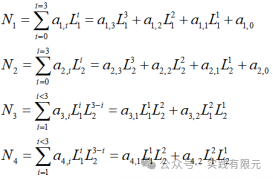

对于四阶形函数的表达式为：

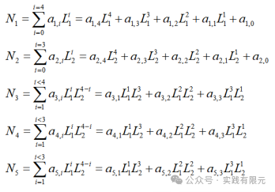

由此，可以推导得到N阶形函数的表达式为：

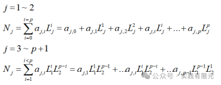

得到形函数后，进而对其求梯度：

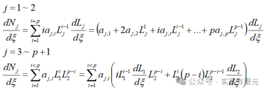

求解系数，带入节点信息求解即可：

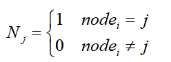

对于头尾两个节点，带入所有点坐标；对于中间节点，仅需要带入内部插值点坐标求解即可。

如此，只需要组装好矩阵，求解方程交给计算机实现，即可实现任意阶的形函数求解，进而通过高斯积分方法，得到自动得到任意阶单元系数矩阵，从而实现任意阶有限元。

在实现过程中，还需要处理的地方是节点信息随着阶数增加的增加，因此单元到节点的映射关系也需要随着阶数的增加而改变。在一维有限元中，实现起来也比较容易。

**2结果展示**

测试三个算例，分别验证了泊松方程的任意高阶实现、霍姆霍兹方程的任意高阶实现与霍姆霍兹方程的高阶精度与同等未知数下的一阶精度对比。

**Eg1：泊松方程，研究区域\[0,10\],网格剖分为5个单元**

给出了线性基函数L1,L2在单元节点的取值与形函数通式中求解得到的各个系数。

**_a.2阶结果 11个未知数_**

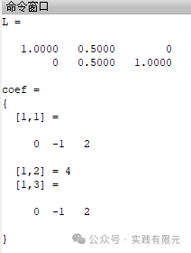

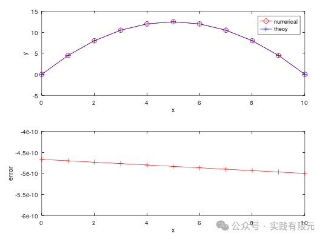

_**b.4阶结果 21个未知数**_

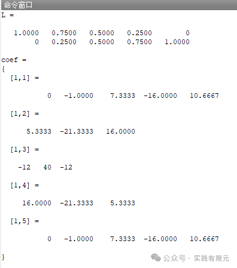

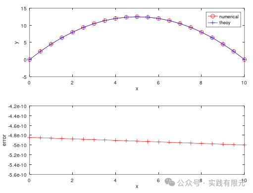

**_c.6阶结果 31个未知数_**

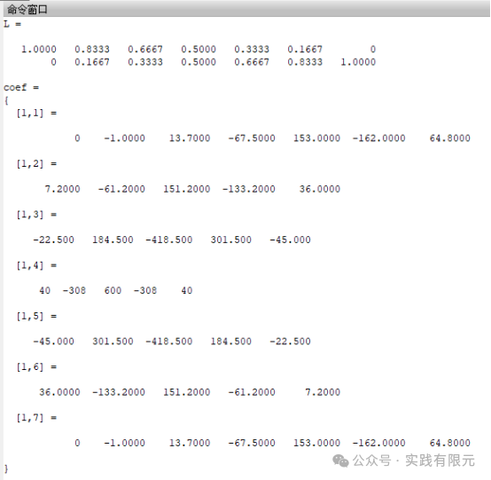

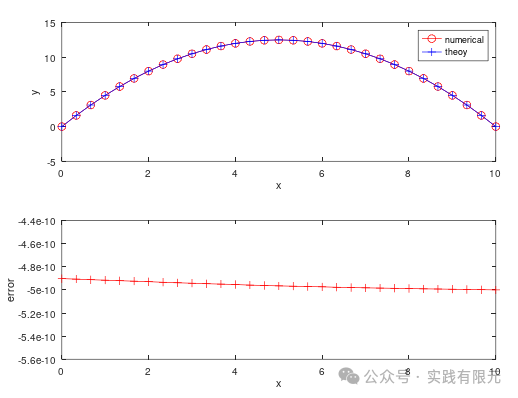

_**d.9阶结果 46个未知数**_

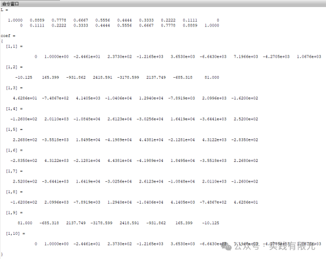

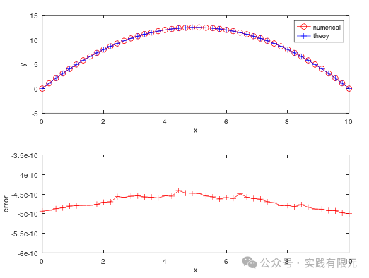

可见结果均正确，精度均是非常高的，这也是由于泊松方程太过于简单的原因。下面测试电场衰减的例子，精度误差就有非常明显的感觉。

**Eg2:电场衰减模型,研究区域5个波长，网格剖分为10个网格**

**_a.2阶结果_**

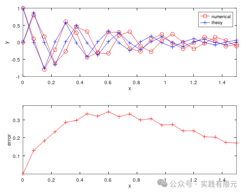

_**b.5阶结果**_

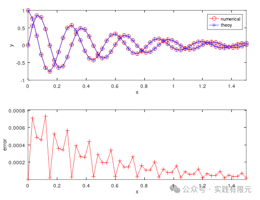

**_c.8阶结果_**

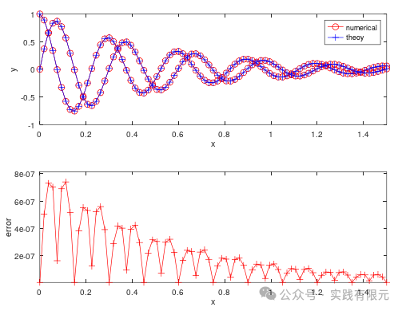

_**d.12阶结果**_

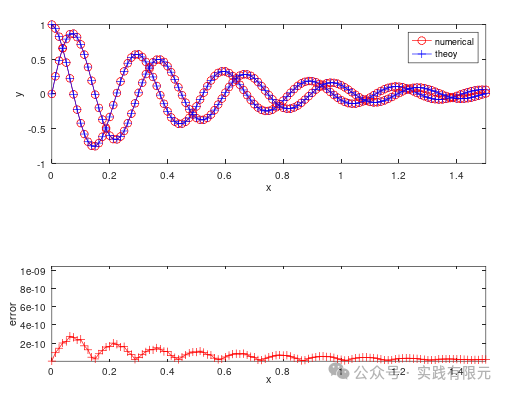

观察可得，随着阶数增加，误差从最开始0.1量级降到最后1e-10次方量级。

**Eg3:电场衰减模型,研究区域5个波长，测试相同101个未知数下，不同阶数之间的精度对比**

**_a.1阶基函数，100个单元_**

 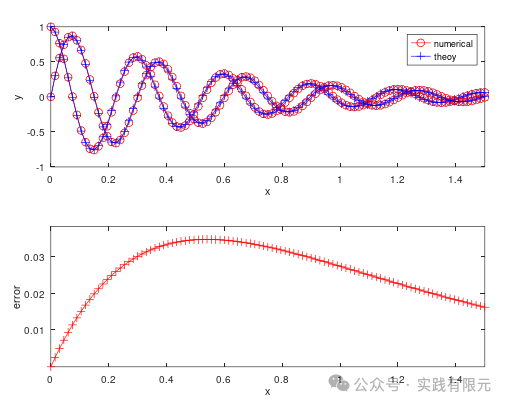

_**b.2阶基函数，50个网格**_

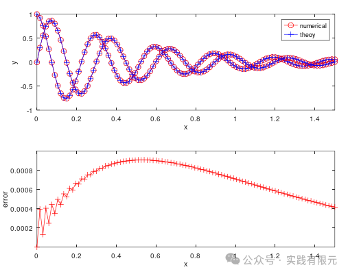

_**c.5阶基函数20个网格**_

 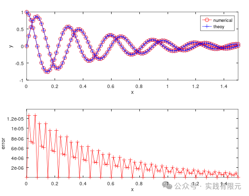

_**d.10阶基函数，10个网格**_

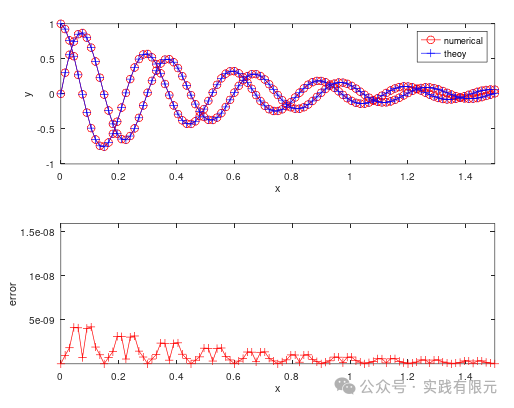

可见，虽然未知数一致，但是阶数越高精度越高，可见单纯的增加网格，达到阶数增加而达到的精度。

**总结**

1.实现了任意阶的一维有限元算法，重点在于使用高斯积分避开求解系数矩阵与推导任意阶基函数的通式；

2.很容易想到，对于结构化有限元而言，一维有限元的任意阶有限元实现后，二维四面体、三维六面体的任意阶有限元实现的技术也基本上迎刃而解。后期将会逐一实现介绍。

3.虽然从未知数角度看，高阶有限元等价于多网格1阶有限元，但是从精度上看，高阶有限元精度远远高于同等未知数下1阶多网格有限元。这也说明了高阶有限元的必要性，尤其在复杂边值问题上，高阶的精度是低阶无法实现的。